# 《UnityShadow》

# 目录

# 学习Shader所需的数学基础

==（前5节比较简单，而且是纯数学知识，与Unity无关，我就不做笔记了（只保存彩图）。第6节开始继续做笔记）==

## 背景：农场游戏

图4.1 我们的农场游戏。我们的主角妞妞是一头长得最壮、好奇心很强的奶牛

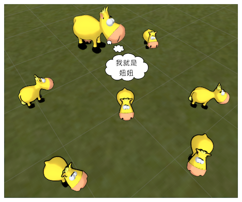

## 笛卡尔坐标系

图4.2 传说，笛卡尔坐标系来源于笛卡尔对天花板上一只苍蝇的运动轨迹的观察。笛卡尔发现，可以使用苍蝇距不同墙面的距离来描述它的当前位置

### 二维笛卡尔坐标系

图4.3 一个二维笛卡尔坐标系 

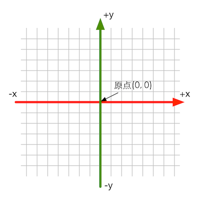

图4.4 在屏幕映射时，OpenGL和DirectX使用了不同方向的二维笛卡尔坐标系 

图4.4 在屏幕映射时，OpenGL和DirectX使用了不同方向的二维笛卡尔坐标系 

### 三维笛卡尔坐标系

图4.6 一个三维笛卡尔坐标系 

### 左手坐标系和右手坐标系

==个人补充：各类三维软件的坐标系（排列组合四种都齐了）==

| 软件                       | 向上轴 | 向内轴 | 坐标系 |
| -------------------------- | ------ | ------ | ------ |
| 3dsMax                     | Z      |        | 右手   |
| Blender                    | Z      |        | 右手   |
| Maya                       | Y      |        | 右手   |
| Houdini                    | Y      |        | 右手   |
| C4D                        | Y      |        | 左手   |
| Unity3D 模型空间和世界空间 | Y      |        | 左手   |
| Unity3D 观察空间           | Y      |        | 右手   |
| UE4                        | Z      |        | 左手   |
| Qt屏幕坐标                 | -Y     | Z      |        |
| js z-index                 |        | -Z     |        |

图4.7 左手坐标系 ，图4.8 右手坐标系 

图4.9 用左手法则和右手法则来判断旋转正方向

图4.10 为了移动到新的位置，妞妞需要首先向某个方向平移1个单位，再向另一个方向平移4个单位，最后再向一个方向旋转60° 

图4.11 左图和右图分别表示了在左手坐标系和右手坐标系中描述妞妞这次运动的结果，得到的数学描述是不同的 

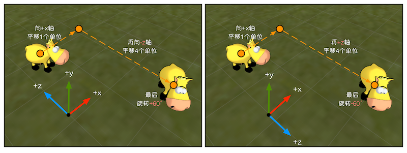

### Unity使用的坐标系

图4.12 在模型空间和世界空间中，Unity使用的是左手坐标系。图中，球的坐标轴显示了它在模型空间中的3个坐标轴（红色为x轴，绿色是y轴，蓝色是z轴）

图4.13 在Unity中，观察空间使用的是右手坐标系，摄像机的前向是z轴的负方向，
z轴越小，物体的深度越大，离摄像机越远 

图4.14 摄像机的位置是（0, 1, -10），球体的位置是（0, 1, 0） 

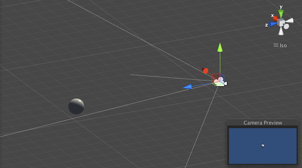

## 点和矢量

### 点和矢量的区别

图4.15 一个二维向量以及它的头和尾 

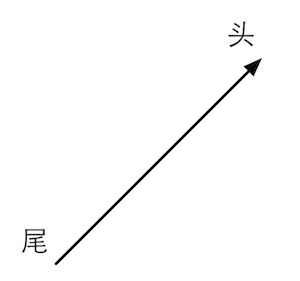

图4.16 点和矢量之间的关系 

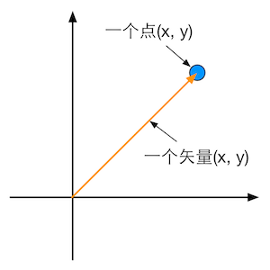

### 矢量运算

#### 矢量和标量乘法/除法

图4.17 二维矢量和一些标量的乘法和除法 

#### 矢量的加法和减法

图4.18 二维矢量的加法和减法 

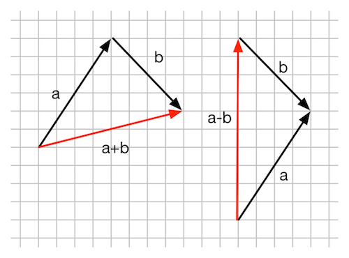

图4.19 使用矢量减法来计算从点a到点b的位移 

#### 矢量的模

图4.20 矢量的模 

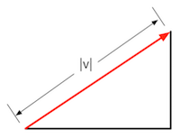

#### 单位矢量

图4.21 二维空间的单位矢量都会落在单位圆上

#### 矢量的点积

图4.22 矢量b在单位矢量a方向上的投影 

图4.23 点积的符号 

图4.24 两个单位矢量进行点积 

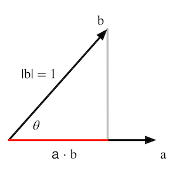

#### 矢量的叉乘

图4.25 三维矢量叉积的计算规律。不同颜色的线表示了计算结果矢量中对应颜色的分量的计算路径。以红色为例，即结果矢量的第一个分量，它是从第一个矢量的y分量出发乘以第二个矢量的z分量，再减去第一个矢量的z分量和第二矢量的y分量的乘积 

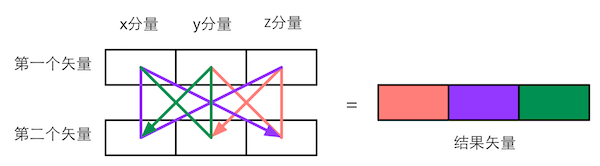

图4.26 使用矢量a和矢量b构建一个平行四边形 

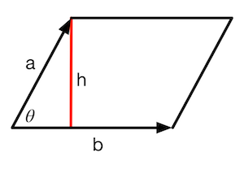

图4.26 使用矢量a和矢量b构建一个平行四边形 

图4.28 使用右手法则判断右手坐标系中a×b的方向 

#### 练习题

图4.29 三角形的三个顶点位于xy平面上，人眼位于z轴负方向，向z轴正方向观察 

## 矩阵

### 矩阵的定义

### 和矢量联系起来

### 矩阵运算

图4.30 计算c23的过程 

### 特殊的矩阵

### 正交矩阵

## 矩阵的集合意义：变换

### 什么是变换

### 齐次坐标

### 分解基础变换矩阵

### 平移矩阵

### 缩放矩阵

### 旋转矩阵

### 复合矩阵

## 坐标空间

### 为什么要使用这么多不同的坐标空间

便于描述，不便于开发

### 坐标空间的变换

### 顶点的坐标空间变换过程

图4.31 场景中的妞妞（左图）和屏幕上的妞妞（右图）。妞妞想知道，自己的鼻子是如何被画到屏幕上的 

### (1) 模型空间

图4.32 在我们的农场游戏中，每个奶牛都有自己的模型坐标系。在模型坐标系中妞妞鼻子的位置是(0, 2, 4, 1) 

### (2) 世界空间

图4.33 Unity的Transform组件可以调节模型的位置.如果Transform有父节点，如图中的“Mesh”，那么Position将是在其父节点（这里是“Cow”）的模型空间中的位置；如果没有父节点，Position就是在世界空间中的位置 

图4.34 农场游戏中的世界空间。世界空间的原点被放置在农场的中心。左下角显示了妞妞在世界空间中所做的变换。我们想要把妞妞的鼻子从模型空间变换到世界空间中 

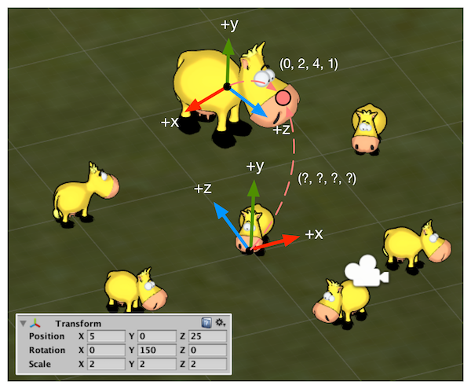

### (3) 观察空间

图4.35  农场游戏中摄像机的观察空间。观察空间的原点位于摄像机处。注意在观察空间中，摄像机的前向是z轴的负方向（图中只画出了z轴正方向），这是因为Unity在观察空间中使用了右手坐标系。左下角显示了摄像机在世界空间中所做的变换。我们想要把妞妞的鼻子从世界空间变换到观察空间中 

### (4) 裁剪空间

图4.36 透视投影（左图）和正交投影（右图）。左下角分别显示了当前摄像机的投影模式和相关属性 

图4.37 视锥体和裁剪平面。左图显示了透视投影的视锥体，右图显示了正交投影的视锥体

 

图4.38 透视摄像机的参数对透视投影视锥体的影响 

图4.39 在透视投影中，投影矩阵对顶点进行了缩放。图3.38中标注了4个关键点经过投影矩阵变换后的结果。从这些结果可以看出x、y、z和w分量的范围发生的变化 

图4.40 正交摄像机的参数对正交投影视锥体的影响 

图4.41 在正交投影中，投影矩阵对顶点进行了缩放。图中标注了4个关键点经过投影矩阵变换后的结果。从这些结果可以看出x、y、z和w分量范围发生的变化 

图4.42 农场游戏使用的摄像机参数和游戏画面的横纵比 

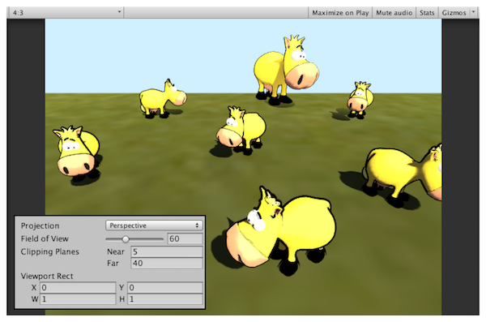

### (5) 屏幕空间

图4.43 经过齐次除法后，透视投影的裁剪空间会变换到一个立方体 

图4.44 经过齐次除法后，正交投影的裁剪空间会变换到一个立方体 

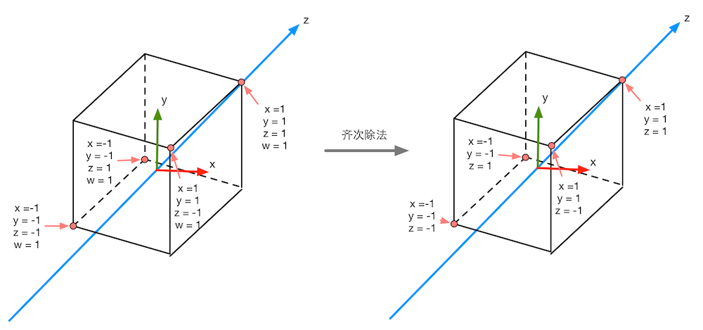

### 总结

图4.45 渲染流水线中顶点的空间变换过程 

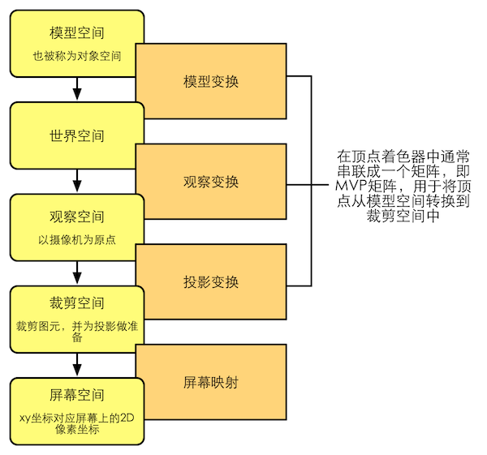

图4.46 Unity中各个坐标空间的旋向性 

## 法线变换

