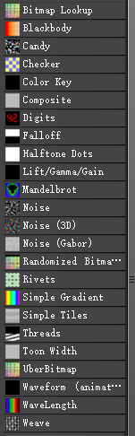
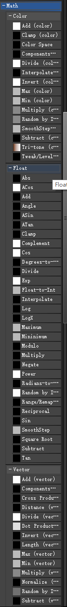
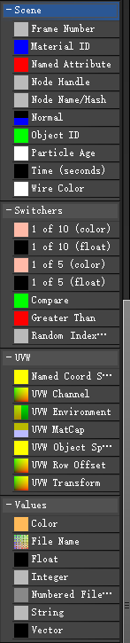

# OSL（Open Shading Language）开放性着色语言

## **VFM贴图相关_OSL**

噪波

噪波(3D)

噪波(Gabor)

## 向量运算

**颜色运算**

加法

颜色空间

最大值

最小值

随机？

**浮点型运算**

绝对值

ACos

ASin

ATan

Cos

Float转Int

Log

最大值

最小值

混合

## 其他

