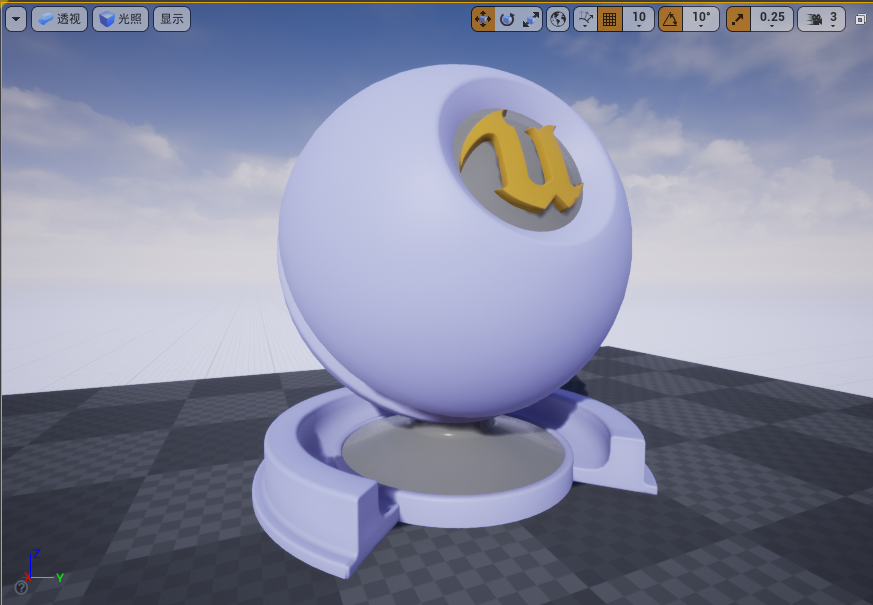
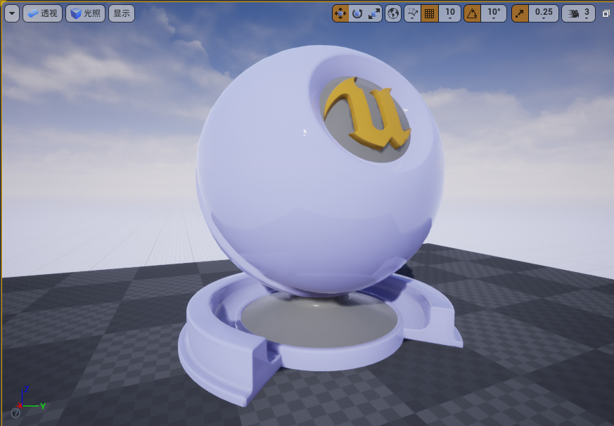
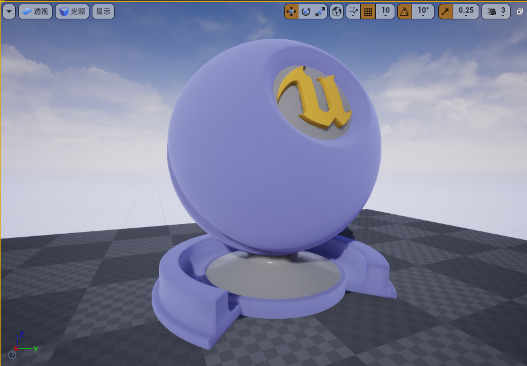
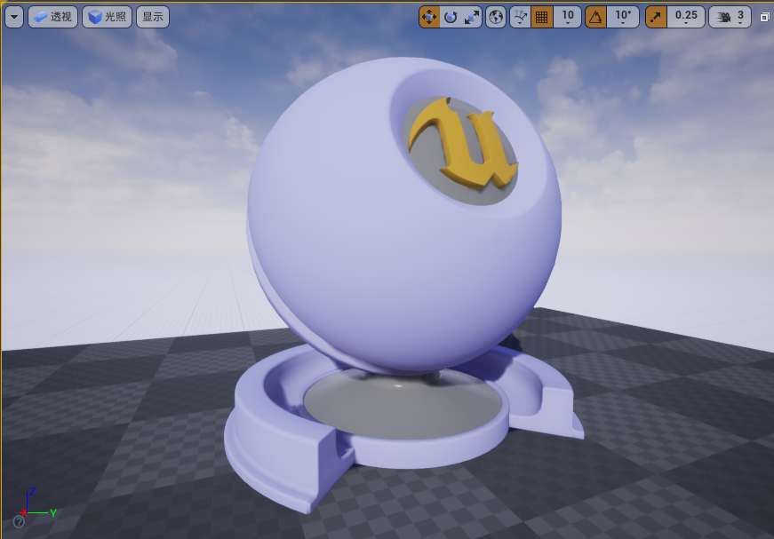
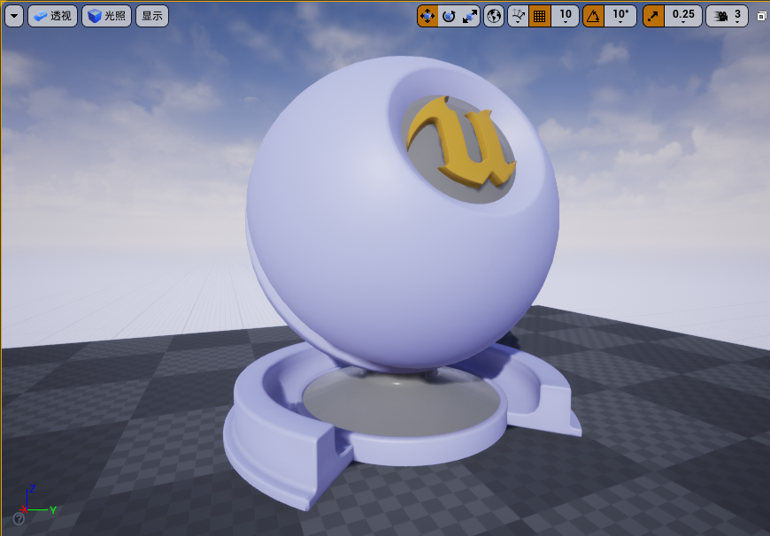
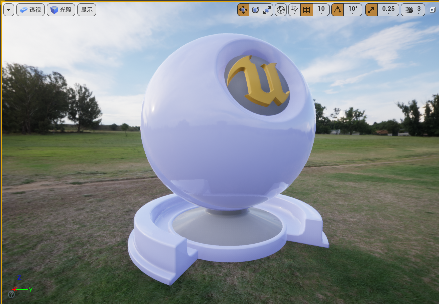
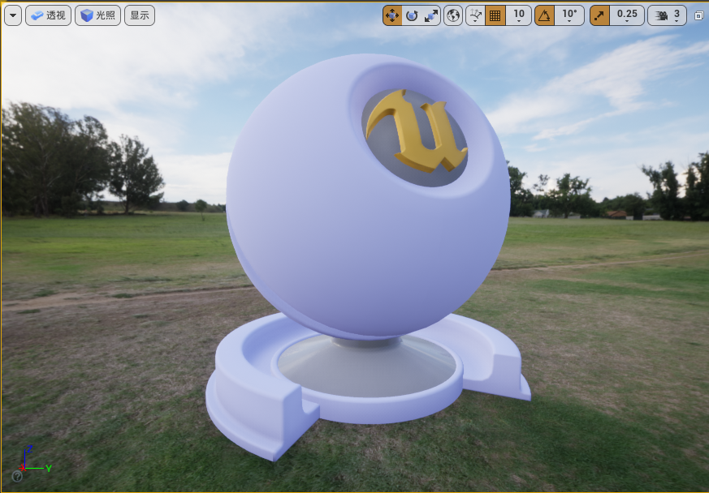
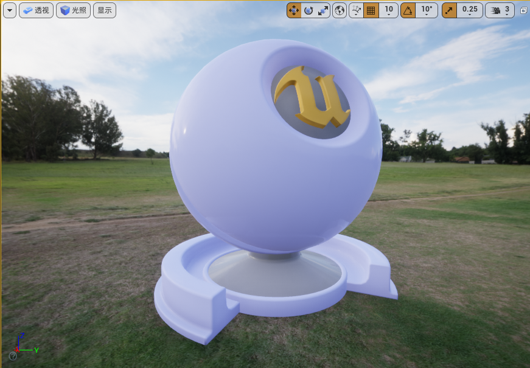
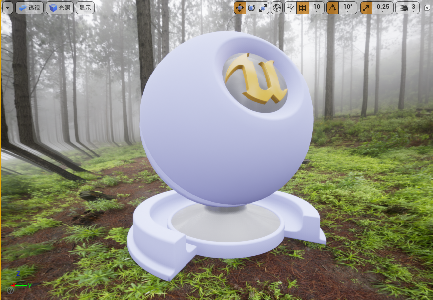

# UE4 Base

## 总结

### 总结1 - 一图流

### 总结2 - 各软件设置对应图

### 总结3 - 个人理论总结

**理论2**

**镜面反射**

图形学的“镜面反射”的意义：平面反射+不吸收光（金属度）

反射分为漫反射和平面反射，VRay的反射和光泽度两个参数、和UE/BL的高光度和粗糙度调的就是平面反射

金属度参数调的就是物体吸收光的能力，金属度拉满后物体完全不吸收光，这也是金属的特性

**平面反射**

平面反射由两个因素影响：VRay的反射和光泽度两个参数、和UE/BL的高光度和粗糙度

反射度对高光度，光泽度对粗糙度

区别：光泽度/粗糙度控制表面模糊，反射度/高光度控制高光区的高光亮度

图形学的角度来说就是前者控制微平面原理中粗糙的程度、后者就是控制光的反射比率

## 设置

TextMaterial

【基础颜色】-

【金属度】反射率、IOR、材质性等因素

【高光度】非金属的高光量

【粗糙度】0镜面，1漫反射，磨砂感（VRay的反射模糊）

【自发光颜色】-

【不透明度】-

【不透明蒙版】-

【法线】-

【世界场景位置偏移】操控顶点，置换

【世界场景位移】操控细分的点

【曲面细分乘数】

【】

【】

【】

【环境光遮挡】

【折射】

【像素深度偏移】

【着色模型】

## 图

### 序列：金属度、高光度、粗糙度

|  |  |
| ------------------------------------------------------------ | ------------------------------------------------------------ |
|  |  |

|  |                                                              |
| ------------------------------------------------------------ | ------------------------------------------------------------ |
|  |  |

### 粗糙、不粗糙、半粗糙(0.2)

|  |  |
| ------------------------------------------------------------ | ------------------------------------------------------------ |
|  |  |
|  |  |

### 低高光度的影响（主要影响低粗糙度的非金属），使高光区更小

001无作用、101无作用、000、100无作用，[反射模糊]

|  |  |
| ------------------------------------------------------------ | ------------------------------------------------------------ |
|  |  |

### 实验：高光度与粗糙度，结论：反射与光泽度共同决定反射效果

01、11、00、10

|  |  |
| ------------------------------------------------------------ | ------------------------------------------------------------ |
|  |  |

