# VRay Base

这是一个个人研究笔记，原创

## VRayMtl

### 基本类

#### 漫反射(150/127)、粗糙度

|  |  |
| ------------------------------------------------------------ | ------------------------------------------------------------ |
|  |  |

### 反射类

#### 反射类、金属类（亮光陶瓷、金属）

|  |  |
| ------------------------------------------------------------ | ------------------------------------------------------------ |
|  |  |
|  | 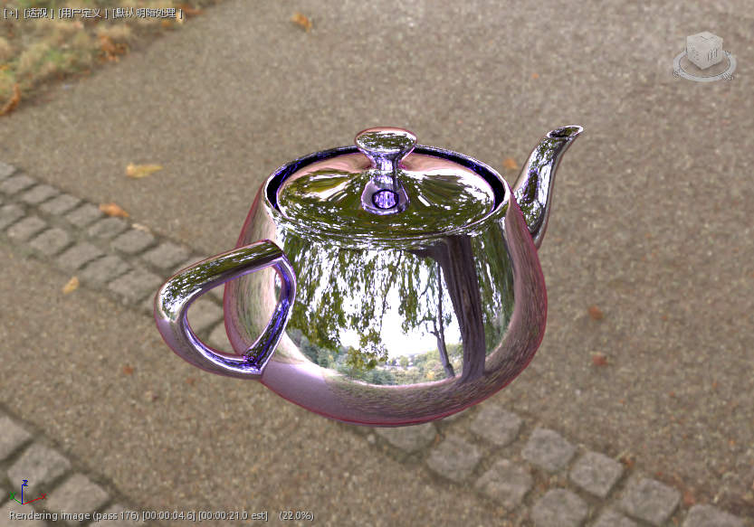 |

#### 低光泽度影响（哑光陶瓷、哑光金属）

| 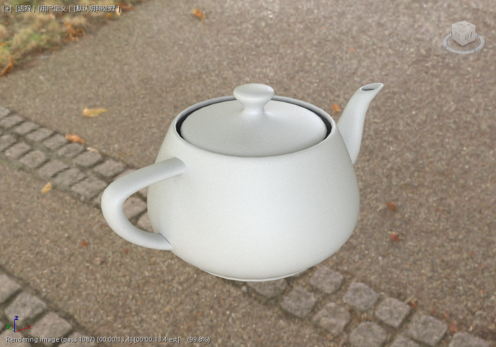 |  |
| ------------------------------------------------------------ | ------------------------------------------------------------ |
|  |  |
| 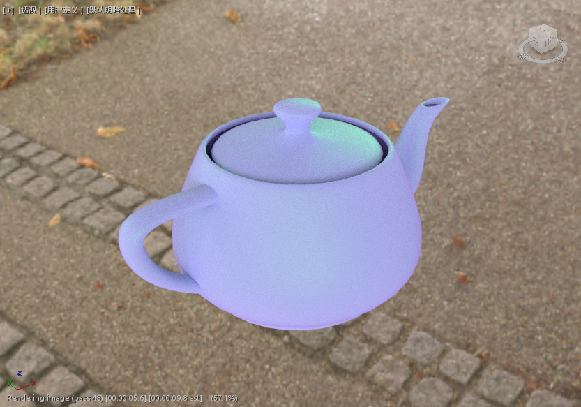 | 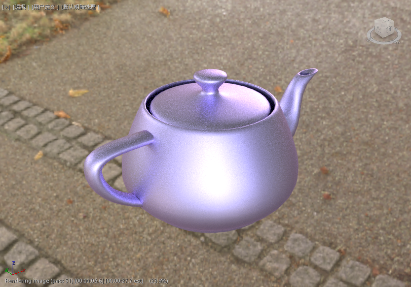 |

#### 关闭菲涅尔+12低反射（反射与第一类效果类似，金属效果依然是反射溢出再限制、得到错误结果）

|  |  |
| ------------------------------------------------------------ | ------------------------------------------------------------ |
|  | 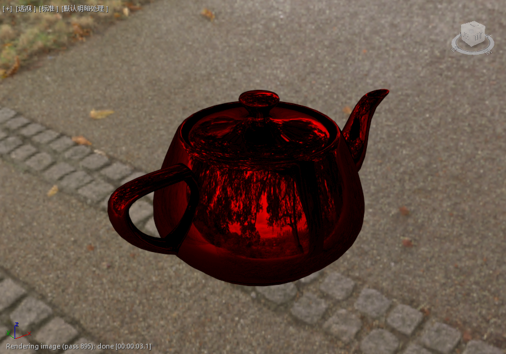 |
|  |  |

#### ~~关闭菲涅尔影响~~

|  | 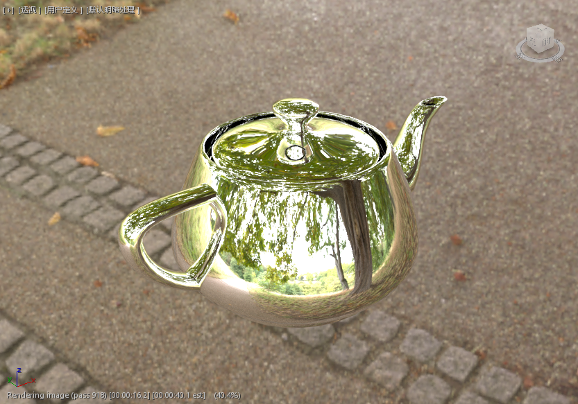 |
| ------------------------------------------------------------ | ------------------------------------------------------------ |
|  |  |
|  |  |

#### ~~无反射金属（一般边缘反射最强处应该白光，无反射时边缘“反射了黑光”，得到错误结果）~~

#### 菲涅尔反射率（默认1.6且被锁不可调节）

（待测）

#### 实验：反射与光泽度，结论：反射与光泽度共同决定反射效果

00，10，01，11

| 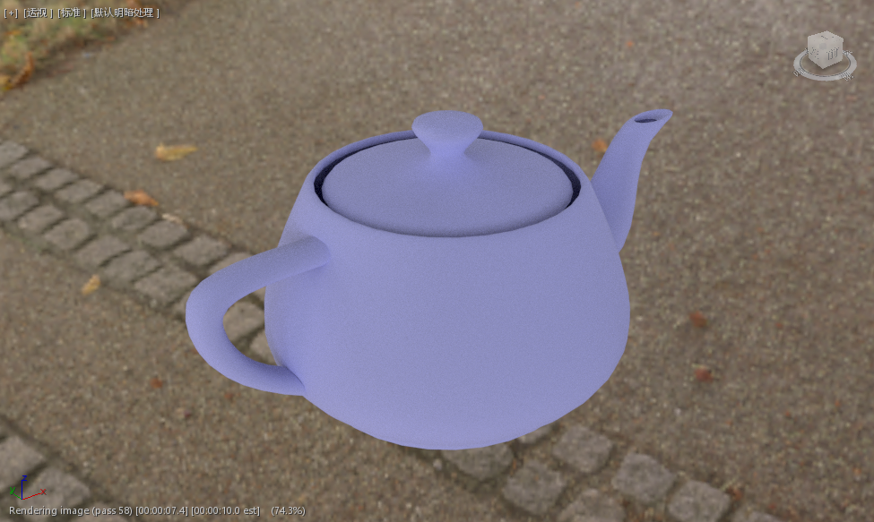 |  |
| ------------------------------------------------------------ | ------------------------------------------------------------ |
| 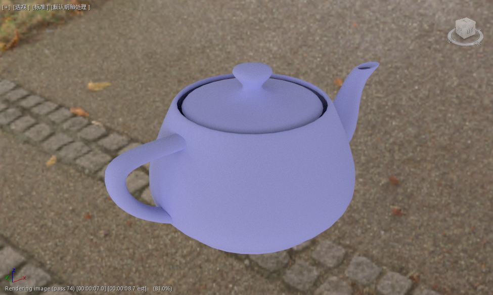 |  |

### 小结：分析 & 理论

#### 反射过程假设 —— 先吸收后反射原则

吸收：吸收的大部分【非固有色光】、反射小部分【固有色光】

反射：吸收光达到【某个阈值】后，吸收【反射色光】的能力下降到比吸收【固有色光】的能力还弱，【反射色光】被大幅反射

这里我定义这个【阈值】为【强光/高光阈值】

#### 材质类型本质

【一般】吸收光、不反射光（阈值极大）

【反射】吸收光、反射光（阈值后）

【金属】不吸收光、反射光（阈值为0）

【不存在】不吸收光，不反射光

注1：上面的“不”是相对而言，非绝对意义上的。绝对吸收光是绝对黑体，绝对反射光是绝对镜面

注2：这里分析的是不透光材质、透明材质是不吸收光不反射光的

#### 结论体现 —— 反射与金属

吸收光和反射光共同作用，体现为：

【反射】本质：开启后把高光阈值从极大值变为较小值

弱光区反射的【固有色光】更多，体现为【固有色光】

强光区反射的【反射色光】更多，高光区体现为【反射色光】（实际上更类似于反射色与固有色的混合色）

【金属】本质：开启后把高光阈值变为近乎零

由于无吸收光，阈值为零，近乎全部区域体现为强光区，体现为【镜面反射】

菲涅尔效应影响的边缘区域反射强，体现为【反射光色】？？？？

自身反射区，则在镜面反射的基础上多次吸收【非固有色光】，不断放大了吸收程度，使其区域变为吸收光特性、又因是弱光，体现为【固有色】，而并未是由于其光强弱于阈值的原因，而且此处的光强未必最弱

#### 结论体现 —— 光泽度参数影响

旧版VRay3反射光泽度与高光光泽度的结合，也称为反射模糊

【光泽度影响】本质：不影响高光阈值，变弱高光区亮度

由于直接反射变为表面散射，所以强光区区域变大，强度变弱。阈值不变的情况下让强光区的亮度更难以达到阈值

#### 结论体现 —— 菲涅尔反射参数影响

【菲涅尔】本质：减弱反射、同时有菲涅尔反射效应

注1：关闭菲涅尔除了会关闭效果外还会大幅提高反射效果，不能直接关

注2：关闭菲涅尔和金属度赋予不能同时操作，有Bug

金属下：不能关菲涅尔，不讨论错误结果。在旧版VR3没有金属度参数时常关闭菲涅尔来模拟金属

反射下：边缘可以看到变化，有菲涅尔时边缘反射强、出现一条颜色边 

### 折射 —— 特别要注意的是：在法线反转区、反射变黑色、而折射会呈现特殊效果

#### 默认：折射拉满、光泽度1.0、IOR1.6

| 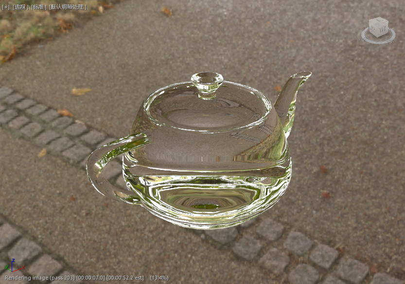 |  |
| ------------------------------------------------------------ | ------------------------------------------------------------ |
|                                                              |                                                              |

#### 光泽度(0.5-0.9)、IOR(1.01-0.75)、光泽度+IOR

一般常用：空气1.0，水1.33，玻璃1.5~1.6（注：勿作科学用途）。光泽度小了可看作折射模糊、有点像磨砂玻璃的感觉，影响渲染速率

| 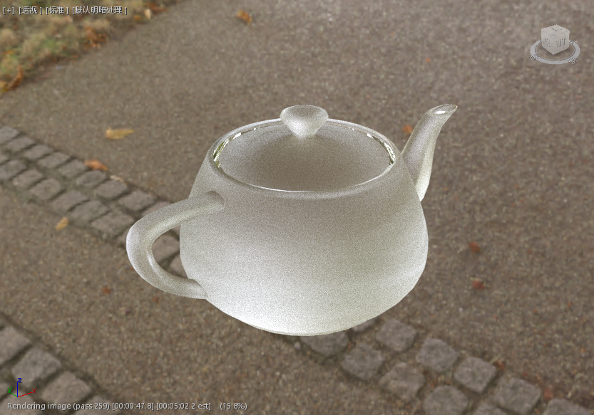 | 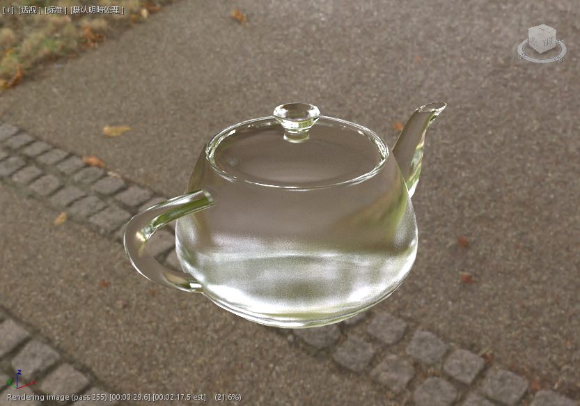 |
| ------------------------------------------------------------ | ------------------------------------------------------------ |
|  | 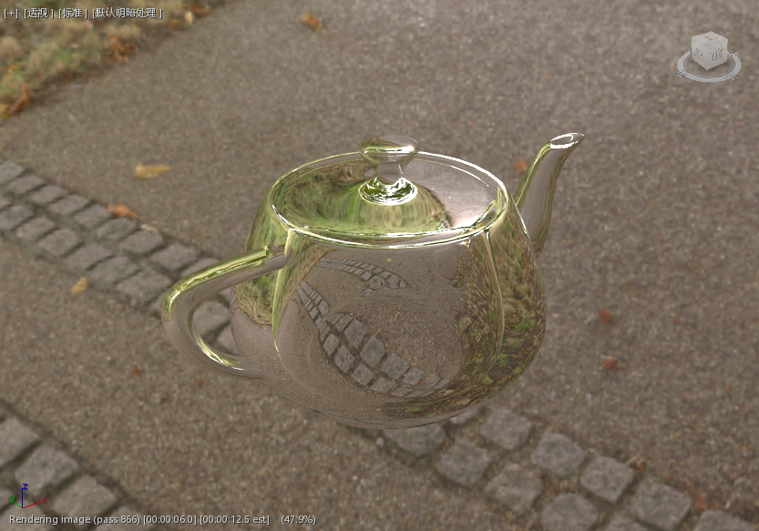 |
|  |  |

#### ---

|  |  |
| ------------------------------------------------------------ | ------------------------------------------------------------ |
|  | 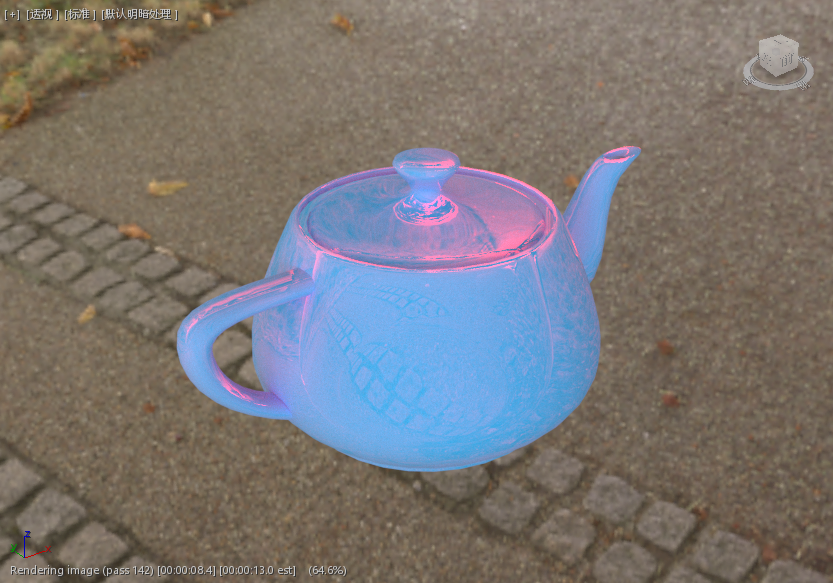 |

## 线扫描 —— Blinn-Phong

### 基本类

### 反射高光类

#### 高光(100)、光泽度影响(80)、柔化影响(1)、光泽度 + 柔化影响

|  |  |
| ------------------------------------------------------------ | ------------------------------------------------------------ |
|  | 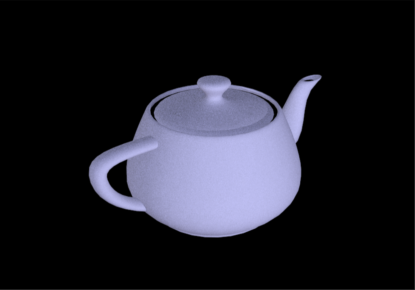 |
| 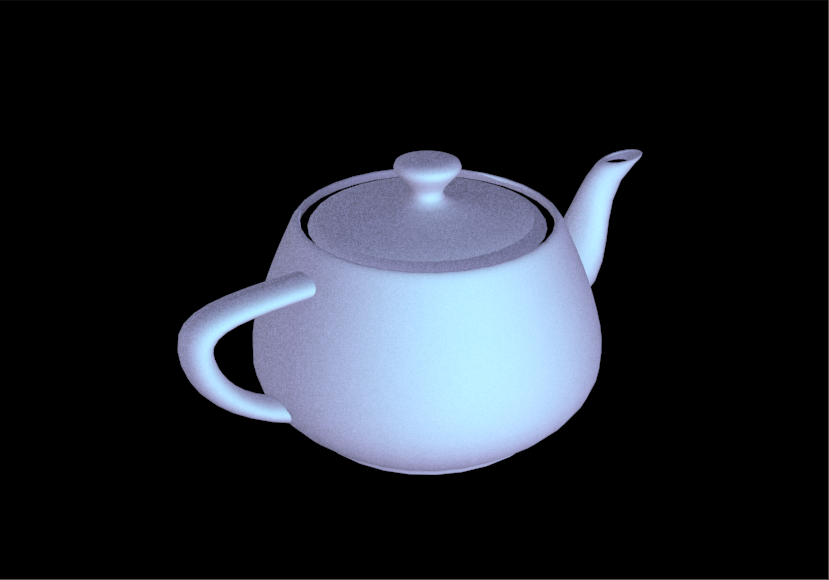 |  |
|  |  |

### 基本类 —— 这里要注意一下扫描线和VRay渲染的区别：对于法线反转VRay默认呈黑色，而扫描线呈背面消隐

### 反射高光类（Blinn-Phong）

#### 高光(100)、光泽度影响(80)、柔化影响(1)、光泽度 + 柔化影响

|  | 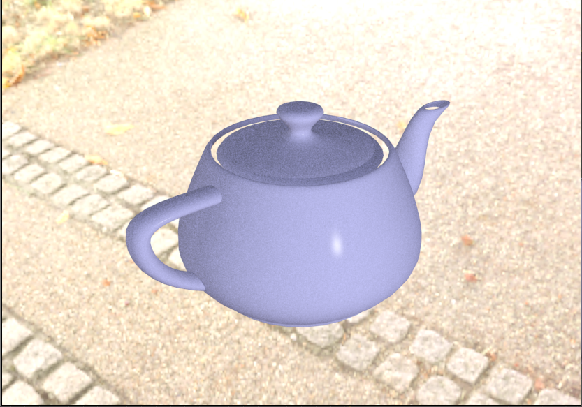 |
| ------------------------------------------------------------ | ------------------------------------------------------------ |
| 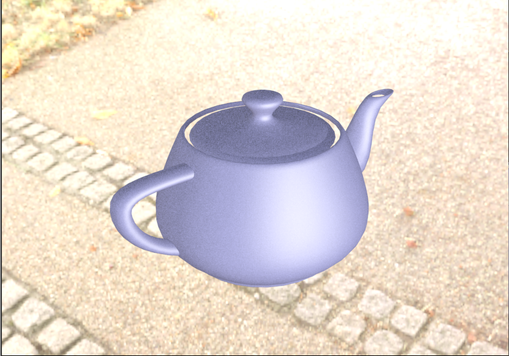 |  |
|  | 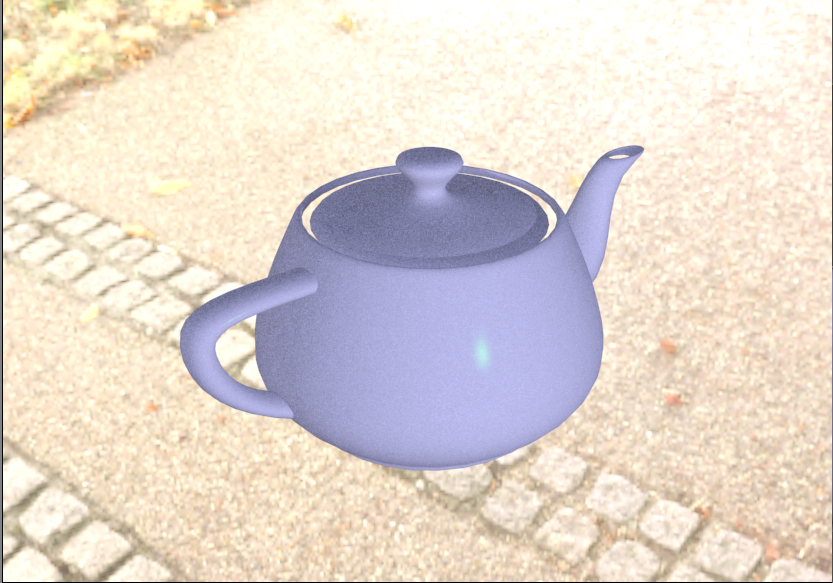 |
|  |  |

### 反射高光类（10%光线追踪）

#### 其他反射高光参数作用不变，起叠加效果

|  |  |
| ------------------------------------------------------------ | ------------------------------------------------------------ |
|  |  |

### 小结：分析 & 理论

【高光】

高光控制高光区的有无，相当于VRay的反射

【光泽度】

光泽度控制高光区的，相当于VRay的光泽度（扫描默认光泽度0.1，VRay光泽度默认1.0）

【柔化】

低光泽度时不起作用，可以推测柔化是对光泽度的处理

能柔化、弱化高光

