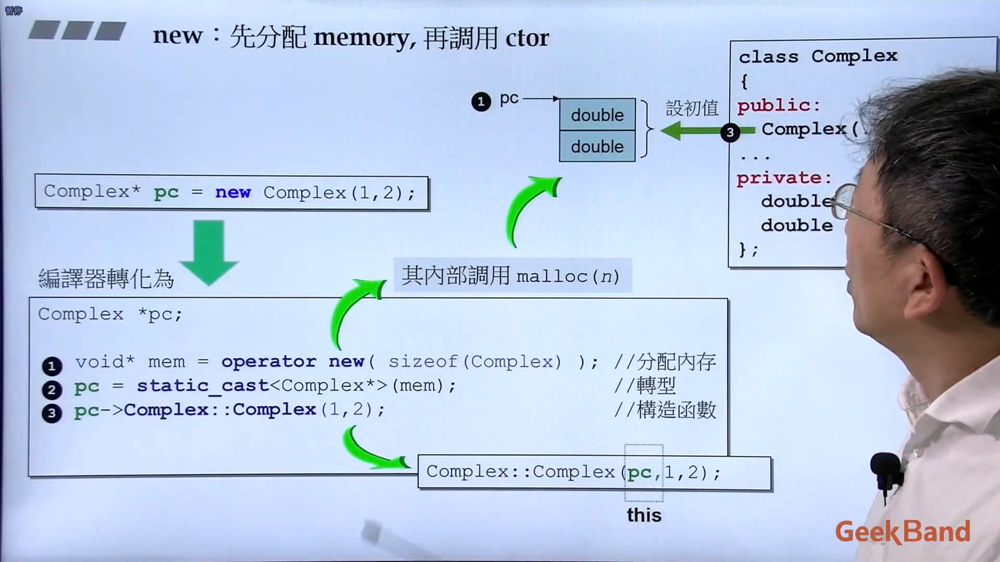
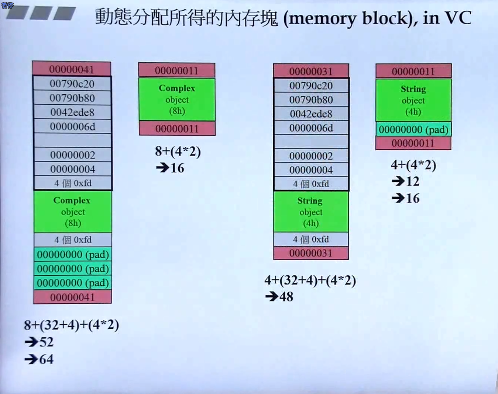
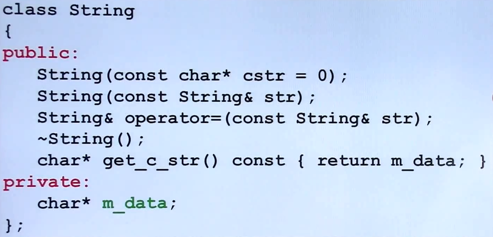
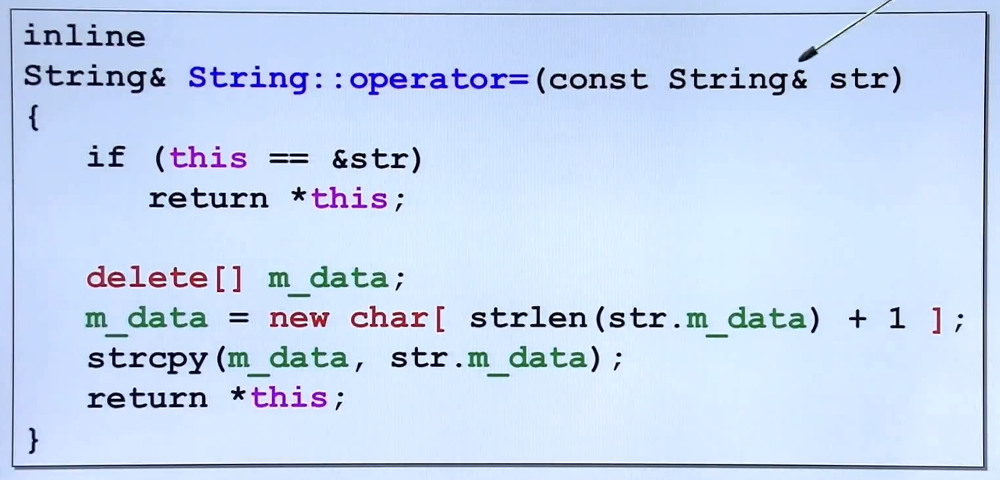
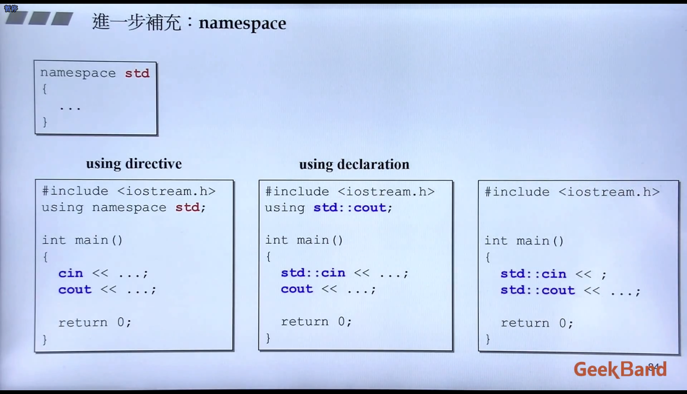

参考：侯捷 - 面向对象高级开发 系列视频

# 1.C++编程简介

## 书录

C++

-   C++ Primer
-   The C++ Programming Language

建议经验

-   Effective C++

标准库

-   The C++ Standard Library（标准库的学习）
-   STL源码解析（再深入的话，关于STL源码的）


# 2.头文件与类的声明


# 构造函数

构造函数的 initialization list，列表初始化


# 参数传递和返回值

单例模式

常量成员函数

```c++
double real() const {return re;}
xxx (const complex&);

```


```c++
d(complex* ths, const complex& r){
    this->re += r.re;
    this->im += r.im;
    return *ths;
}
```

值传递和引用传递

友元 —— “相同class的各个objects互为firends”


# 操作符重载与临时对象

未


# 复习Complex的实现过程

未


# 三大函数：拷贝构造，拷贝复制，析构

```c++
int main()
{
    String s1();
    String s2("hello");
    
    String s3(s1);	// 拷贝构造
    
    s3 = s2;		// 拷贝复制
}
```

如果类包含指针，**必须**要自己写拷贝构造，否则两个指针会指向同一个东西

三个特殊函数（[The Big Three](https://gcallah.github.io/OOP2/big3.html)，指 拷贝构造函数、赋值操作符、析构函数。另外，当您需要编写其中任何一个时，您很可能需要编写另外两个）

```c++
class String
{
public:
    String(const char* cstr = 0);
    String(const String& str);
    String& operator=(const String& str);
    ~String();
    char* get_c_str() const {return m_data;}
private:
    char* m_data;
}
```


ctor 和 dtor（构造函数和析构函数，constructor 和 destructor）

```c++
inline
string: : String (const char* cstr = 0)
{
	if (cstr) {
		m _data =new char [strlen (cstr)+1];strepy (m_data, cstr);
	}
	else {	//未指定初值
		m_data = new char[1];*m data = '\0' ;
	}
}

inline
string: :~String ()
{
	delete[] m_data;
}

// 
{
    String s1();
    String s2("Hello");
    
    String* p = new String("hello");
    delete p;
}

```


## class with pointer members 必须有 copy ctor 和 copy op=（析构也要吧）

还需要检测自我赋值，不然可能有bug（不只是为了效率）


# ==堆，栈与内存管理==

## 堆，栈

Stack，是存在与某作用域（scope）的一块内存空间（memory space）。例如当你调用函数，函数本身即会形成一个stack用来防止它所接受的参数，以及返回地址
在函数本体（fucntion body）内声明的任何变量，其所使用的内存块都取自上述stack


Heap，或谓system heap，是指由操作系统提供的一块global内存空间，程序可动态分配（dynamic allocaed）从某中获得若干区块（blocks）
（new 出来是heap）


## 生命周期

-   stack objects 的生命周期、也叫 auto object（离开大括号自动释放）
-   static local objects 的生命周期，直到整个程序结束
-   global objects 的生命周期，在整个程序结束后才结束，也可以把它视为一种static object，其作用域是整个程序


## 内存管理


## new/delete的底层原理




## 动态分配所得的内存块（VC）

左侧两个是复数，右侧两个是String。
左列是调试模式，调试模式分配的内存会大很多

-   红色的叫cookie（内容是16进制指示的大小：40就是64，10就是16，30就是48。而+1表示这个内存是给出去的）
-   深绿色的是填补（这里是填补成2的幂次方大小）
-   亮绿色是给对象实际的内存（例如这里的complex里的内容，其实就是两个double的大小=8h=8字节。h表示的是hex16进制的字节数）




## 动态分配所得的array


# 复习String类的实现过程







# 扩展补充：类模板，函数模板，及其他

补充：static

成员变量 `this->` 的省略，static没有this

调用static函数的两种方法：通过object或class name调用


cout


calss template，类模板


namespace，命名空间




