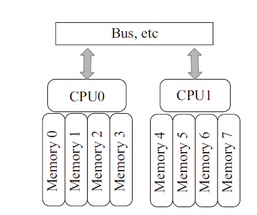
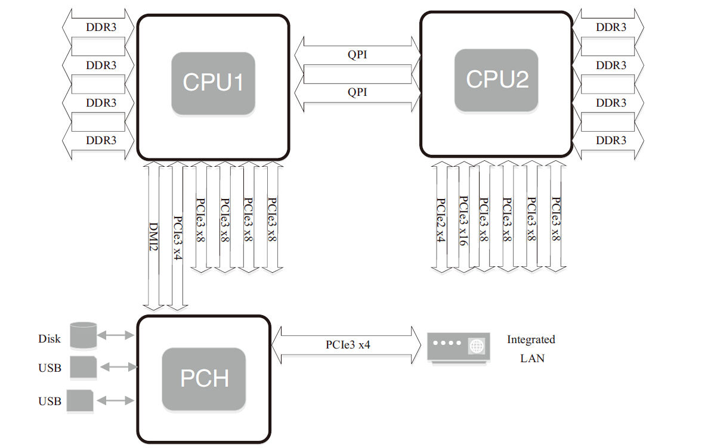

# NUMA系统 (未)

之前的章节已经简要介绍过NUMA系统，它是一种多处理器环境下设计的计算机内存结构。NUMA系统是从SMP（Symmetric Multiple Processing，对称多处理器）系统演化而来。

SMP系统最初是在20世纪90年代由Unisys、Convex Computer（后来的HP）、Honeywell、IBM等公司开发的一款商用系统，该系统被广泛应用于Unix类的操作系统，后来又扩展到Windows NT中，该系统有如下特点：

1. 所有的硬件资源都是共享的。即每个处理器都能访问到任何内存、外设等。
2. 所有的处理器都是平等的，没有主从关系。
3. 内存是统一结构、统一寻址的（UMA，Uniform Memory Architecture）。
4. 处理器和内存，处理器和处理器都通过一条总线连接起来。

其结构如图2-14所示：

SMP的问题也很明显，因为所有的处理器都通过一条总线连接起来，因此随着处理器的增加，系统总线成为了系统瓶颈，另外，处理器和内存之间的通信延迟也较大。为了克服以上的缺点，才应运而生了NUMA架构，如图2-15所示。

图2-14　SMP系统示意图


图2-15　NUMA系统示意图



NUMA 是起源于AMD Opteron的微架构，同时被英特尔Nehalem架构采用。在这个架构中，处理器和本地内存之间拥有更小的延迟和更大的带宽，而整个内存仍然可作为一个整体，任何处理器都能够访问，只不过跨处理器的内存访问的速度相对较慢一点。同时，每个处理器都可以拥有本地的总线，如PCIE、SATA、USB等。和内存一样，处理器访问本地的总线延迟低，吞吐率高；访问远程资源，则延迟高，并且要和其他处理器共享一条总线。图2-16是英特尔公司的至强E5服务器的架构示意图。

图2-16　至强E5服务器架构示意图



可以看到，该架构有两个处理器，处理器通过QPI总线相连。每个处理器都有本地的四个通道的内存系统，并且也有属于自己的PCIE总线系统。两个处理器有点不同的是，第一个处理器集成了南桥芯片，而第二个处理器只有本地的PCIE总线。

和SMP系统相比，NUMA系统访问本地内存的带宽更大，延迟更小，但是访问远程的内存成本相对就高多了。因此，我们要充分利用NUMA系统的这个特点，避免远程访问资源。

以下是DPDK在NUMA系统中的一些实例。

1. Per-core memory。一个处理器上有多个核（core），per-core memory是指每个核都有属于自己的内存，即对于经常访问的数据结构，每个核都有自己的备份。这样做一方面是为了本地内存的需要，另外一方面也是因为上文提到的Cache一致性的需要，避免多个核访问同一个Cache行。
2. 本地设备本地处理。即用本地的处理器、本地的内存来处理本地的设备上产生的数据。如果有一个PCI设备在node0上，就用node0上的核来处理该设备，处理该设备用到的数据结构和数据缓冲区都从node0上分配。以下是一个分配本地内存的例子：

```c
// 为队列结构分配内存
// allocate memory for the queue structure
q = rte_zmalloc_socket("fm10k", sizeof(*q),  RTE_CACHE_LINE_SIZE, socket_id);
```

该例试图分配一个结构体，通过传递socket_id，即node id获得本地内存，并且以Cache行对齐。


