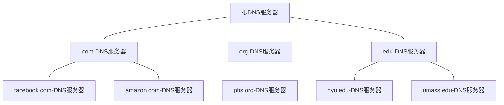

# 《计算机网络——自顶向下方法》

# 目录

[toc]

# 应用层

## 应用层协议原理

编写在多台端系统上运行的软件，不需要也无法编写在网络核心设备（路由器或链路层交换机）上运行的软件

### 网络应用程序体系结构

现代网络应用程序使用的两种主流体系：客户-服务器体系结构、对等（P2P）体系结构

> #### 客户-服务器体系结构

- 客户：客户之间不直接通信
- 服务器：服务器拥有固定的、周知的地址且总是打开的
- 数据中心：配置大量主机的数据中心能创建强大的虚拟服务器谷歌有分别全世界的30~50个数据中心，一个有数十万台服务器
- 应用程序：Web、FTP、Telent、电子邮件
- 数据中心的应用程序：搜索引擎、因特网商务、基于Web的电子邮件、社交网络

> #### 对等（P2P）体系结构

- 主机对（对等方）之间直接通信，有字扩展性
- 优点：不需要庞大的服务器基础设施和服务器带宽
- 缺点：未来P2P由于高度非集中式结构，面临安全性、性能和可靠性等挑战
- 应用：目前流行的、流量密集型应用都是P2P的：文件共享、对等方协助下载加速器、因特网电话和视频会议

### 进程通信

进行通信的实际上是进程而不是程序，两个端系统上的进程通过跨越计算机网络交换报文而相互通信

> #### 客户和服务器进程

客户和服务器进程定义：一对进程之间的通信会话场景中，发起通信的进程被标识为客户，在会话开始时等待联系的进程是服务器

> #### 进程和计算机网络之间的接口

接口：进程通过一个称为`套接字`的软件接口向网络发送报文和从网络接收报文（用门来类比）

套接字：应用程序和网络之间的应用程序编程接口。开发者可控制套接字在应用层端的一切而几乎不能控制运输端，运输端的仅限于：

- 选择运输协议
- 也许能设定运输层参数（最大缓存和最大报文长度等）

> #### 进程寻址

需要定义两种信息

1. 主机的地址

2. 在目的主机中指定接收进程（接收套接字）的标识符（目的地端口号）

    流行的应用已被分配好了特定端口号，详见[wiki_TCP/UDP端口列表](https://zh.wikipedia.org/wiki/TCP/UDP%E7%AB%AF%E5%8F%A3%E5%88%97%E8%A1%A8)

### 可供应用程序使用的运输服务

选择运输层协议看具体情况选择，四方面对应用程序服务要求进行分类（如下）

> #### 可靠数据传输

分组可能造成路由器缓存溢出、或者分组中某些比特损坏后被丢弃

- 不利于应用：电子邮件、文件传输、远程主机访问、Web文档传输、金融应用等
- 容忍丢失的应用：多媒体应用（如交谈式音频 / 视频）

> #### 吞吐量

不足以提供吞吐量时，应用程序或以较低码率编码、或放弃传送

- 带宽敏感应用（有吞吐要求的应用）：许多多媒体应用（某些程序可能采用自适应编码技术对数字语音或视频以带宽匹配的速率编码）
- 弹性应用（无要求，但越高越好）：电子邮件、文件传输、Web传送

> #### 定时

运输层协议能提供定时保证

- 利于：交互式实时应用程序
- 无拘束（但时延越低越好）：非实时应用

> #### 安全性

运输协议能加密，除机密外还提供其他安全性服务：数据完整性和端点鉴别

### 因特网提供的运输服务

因特网提供两个运输层协议：UDP、TCP

两者协议提供不同的服务集合，某些应用程序的服务要求：

| 应用                | 数据丢失     | 带宽                                               | 时间敏感      |
| ------------------- | ------------ | -------------------------------------------------- | ------------- |
| 文件传输            | 不能丢失     | 弹性                                               | 不            |
| 电子邮件            | 不能丢失     | 弹性                                               | 不            |
| Web文档             | 不能丢失     | 弹性（几kbps）                                     | 不            |
| 因特网电话/视频会议 | **容忍丢失** | **音频（几kbps~1Mbps）<br />视频（10kbps~5Mbps）** | **是，100ms** |
| 流式存储音频/视频   | **容忍丢失** | **同上**                                           | **是，几s**   |
| 交互性游戏          | **容忍丢失** | **几kbps~10kbps**                                  | **是，100ms** |
| 智能手机讯息        | 不能丢失     | 弹性                                               | **是**和不是  |

> #### TCP服务

TCP服务模型：

- 面向连接服务：握手，两个进程的套接字之间建立一个TCP连接，该链接是双全工的
- 可靠数据传输服务：没有字节丢失和冗余
- 拥塞控制机制：TCP会限制每个TCP连接，使互联网共享带宽

SSL（安全套接字层），是TCP安全的加强版本

- 能做TCP的一切，并提供安全服务
- 不是TCP、UDP同层次的第三种协议，而是TCP的加强（在应用层上实现的加强）

> #### UDP服务

UDP：不提供不必要服务的轻量级运输协议

- 无连接：没有握手过程
- 不可靠：不保证报文到达接收进程，到达的接收报文也可能是乱序到达的

> #### 因特网运输协议所不提供的服务

协议能让时间敏感应用满意，但事实上并不提供定时和带宽保证，由应用程序应对这种保证的缺乏

一些流行应用使用的运输协议：

| 应用         | 应用层协议       | 端口 | 支撑的运输协议                                               | 位置       |
| ------------ | ---------------- | ---- | ------------------------------------------------------------ | ---------- |
| 电子邮件     | SMTP             | 25   | TCP                                                          | 邮件服务器 |
| 邮件访问     | POP3             | 110  | TCP                                                          | 邮件服务器 |
| 域名系统     | DNS              | 53   | UDP                                                          | 域名系统   |
| 远程终端访问 | Telnet           |      | TCP                                                          |            |
| Web          | HTTP             | 80   | TCP                                                          | HTTP服务器 |
| 文件传输     | FTP              |      | TCP                                                          |            |
| 流式多媒体   | HTTP             |      | TCP                                                          |            |
| 因特网电话   | SIP、RTP或专用的 |      | UDP或TCP（许多防火墙阻挡UDP流量，一般设计为如果UDP通信失败就用TCP） |            |

### 应用层协议

定义了不同端系统应用程序进程如何互传报文

- 交换报文类型：如请求报文和相应报文
- 各种报文类型的语法：如报文个字段、以及这些字段是如何描述的
- 字段的语义：这些字段的信息含义
- 进程何时以及如何发送报文，对报文进行响应的规则

协议文档

- 有些应用层协议由RFC文档定义，处于公共域中
- 还有些协议是专用的，有意不为公共域使用，如Skype使用专用的应用层协议

### 本书涉及的网络应用

本章仅讨论因特网其中5种重要应用：

- Web
- 文件传输
- 电子邮件（SMTP等）
- 目录服务（DNS）
- 流式视频和P2P

## Web和HTTP

因特网原主要使用者为研究人员、学者和大学生

万维网（World Wide Web）引起公众注意，它将因特网从只是很多数据网之一的地位提升为仅有的一个数据网

Web的应用层协议是`超文本传输协议（HyperText Transfer Protocol，FTTP）`，它是Web的核心

### HTTP概况

Web应用相关

- 客户 - 服务器应用程序体系结构
- Web页面由对象组成，一个对象是一个可通过URL地址寻找的文件，URL地址由主机名和路径名组成

HTTP协议相关

- HTTP使用TCP作为其支撑运输协议
- HTTP协议是一个无状态协议，不保留关于客户的任何信息

### 非持续连接和持续连接

HTTP能使用非连续连接和连续连接（默认）

| 连接方式         | 描述                                                         | 往返时间（RTT） |
| ---------------- | ------------------------------------------------------------ | --------------- |
| 非连续连接       | 一系列请求/响应对经一个单独的TCP连接发送，每个TCP只传输一个请求报文和一个响应报文 | 一个对象2RTT    |
| 连续连接（默认） | 一系列请求/响应对经相同的TCP连接发送，如果一条连接经过一定时间间隔未被使用则自动关闭 |                 |

补充：

- TCP连接的三次握手：前两次占用一个RTT（Round-Trip Time），第三次握手发送HTTP请求报文，HTTP请求/响应使用另一个RTT
- 默认浏览器打开5~10个并行的TCP连接，同一服务器并发连接个数有限：Safire为4，Firefox和Chrome为6，Opera为10

### HTTP报文格式

#### HTTP请求报文

请求报文示例（报文使用ASCII文本书写）

```http
GET /somedir/page.html HTTP/1.1		# 【请求行】有三个字段：方法字段 URL字段 HTTP版本字段（方法字段：GET、POST、HEAD、PUT、DELETE）
Host: www.someschool.edu			# 【首部行】主机
Connection: close					# 【首部行】是否持续连接：不使用持续连接
User-agent: Mozilla/5.0				# 【首部行】用户代理：火狐
Accept-language: fr					# 【首部行】接收语言：法语
```

HTTP请求报文通用格式（4部分）

| 行     | 内容                                                         |
| ------ | ------------------------------------------------------------ |
| 请求行 | 方法`sp`URL`sp`版本`cr` `lf`                                 |
| 首部行 | 首部字段名：`sp`值`cr` `lf`<br />……<br />首部字段名：`sp`值`cr` `lf` |
| 空行   | `cr` `lf`                                                    |
| 实体体 | （GET方法时为空，POST才使用该实体体）                        |

补充：**“回车”（CR，Carriage Return）**和**“换行”（LF，Line Feed）**表示下一行

| 系统                  | 下一行的表示  | 下一行的表示     |
| --------------------- | ------------- | ---------------- |
| Dos / windows         | 回车符+换行符 | CR LF（即\r \n） |
| UNIX / Linux          | 换行符        | LF               |
| 苹果机（MAC OS 系统） | 回车符        | CR               |

#### HTTP响应报文

响应报文示例

```http
HTTP/1.1 200 OK									# 【初始状态行】
Connection: close								# 【首部行】是否持续连接：不使用持续连接
Date: Tue, 18 Aug 2015 15:44:04 GMT				# 【首部行】产生并发送该响应报文的日期和时间
Server: Apache/2.2.3 (CentOS)					# 【首部行】服务器：Apache Web服务器（类似于请求报文的User-agent）
Last-Modified: Tue, 18 Auf 2015 15:11:03 GMT	# 【首部行】对象创建或最后修改的日期和时间
Content-Length: 6821							# 【首部行】内容字节：被发送对象的字节数
Content-Type: text/html							# 【首部行】内容类型：html文本
												# 【空行】
(data data data data data ...)					# 【实体体】
```

HTTP响应报文通用格式（4部分）

| 行     | 内容                                                         |
| ------ | ------------------------------------------------------------ |
| 状态行 | 版本`sp`状态码`sp`短语`cr` `lf`                              |
| 首部行 | 首部字段名：`sp`值`cr` `lf`<br />……<br />首部字段名：`sp`值`cr` `lf` |
| 空行   | `cr` `lf`                                                    |
| 实体体 | （主要部分，包含请求对象本身）                               |

补充：常见状态码和短语

| 状态码 | 短语                       | 含义                                                         |
| ------ | -------------------------- | ------------------------------------------------------------ |
| 200    | OK                         | 请求成功，信息在返回的响应报文中                             |
| 301    | Moved Permanently          | 请求的对象已被永久转移了，新URL定义在响应报文的Location首部行中。客户软件将自动获取新的URL |
| 400    | Bad Request                | 通用差错代码，指示该请求不能被服务器理解                     |
| 404    | Not Found                  | 被请求的文档不在服务器                                       |
| 505    | HTTP Version Not Supported | 服务器不支持请求报文使用的HTTP协议版本                       |

### 用户与服务器的交互：cookie

cookie：HTTP服务器是无状态的，简化了服务器设计。若想识别用户则使用HTTP的cookie

cookie技术有4个组件

- HTTP响应报文中的一个cookie首部行
- HTTP请求报文中的一个cookie首部行
- 位于用户端系统 的一个由用户浏览器管理的cookie文件
- 位于Web站点    的一个后端数据库

cookie跟踪用户状态

```sequence
participant 用户端cookie文件
participant 客户主机
participant 服务器主机
participant 数据库

客户主机-服务器主机: 普通HTTP请求报文
服务器主机-数据库:服务器为用户创建ID 1678
服务器主机--客户主机:普通HTTP响应报文(set-cookie:1678)
客户主机-用户端cookie文件:写入amazon:1678
note right of 客户主机:第一次访问完毕

用户端cookie文件-客户主机:amazon:1678
客户主机-服务器主机: 普通HTTP请求报文(cookie:1678)
服务器主机-数据库:访问
数据库--服务器主机:
服务器主机-服务器主机:cookie特定动作
服务器主机--客户主机:普通HTTP响应报文
note right of 客户主机:第二次访问完毕
```

### Web缓存

Web缓存器（Web cache）也叫代理服务器（proxy server）。浏览器内置Web缓存，该点可以通过条件GET方法的特征来验证

Web缓存器使用:

1. 向Web缓存器建立TCP连接并发送HTTP请求
2. Web缓存器进行检查，若存储了该对象副本则响应
3. 若没有该对象，则向初始服务器建立TCP连接并发送HTTP请求
4. Web缓存器接收到请求后建立副本，并向客户端返回响应

Web缓存器优点:

- 大大减少对客户请求的响应时间
- 大大减少一个机构接入链路到因特网的通信量

内容分发网络（Content Distribution Networl，CDN）。CDN公司在因特网上安装了许多地理上分散的缓存器，因而使大量流量实现了本地化

### 条件GET方法

条件GET方法：HTTP协议的一种机制，允许缓存器证实它的对象是最新的。这解决了Web缓存的副作用

条件GET方法特征：请求报文使用GET方法，并且请求报文中包含一个`If-Modified-Since`首部行

## 因特网中的电子邮件

电子邮件的3个组成部分：

- 用户代理（user agent）
- 邮件服务器（mail server）
- 简单邮件传输协议（Simple Mail Transfer Protocol，SMTP），使用TCP可靠数据传输服务

### SMTP

SMTP一般不适用中间邮件服务器发送服务


客户和服务器之间交换报文文本：

```http
S: 200 hamburger.edu
C: HELO crepes.fr
S: 250 Hello crepes.fr, pleased to meet you
C: MAIL FROM:<alice@crepes.fr>
S: 250 alice@crepes.fr ... Sender ok
C: RCPT TO: <bob@hamburger.edu>
S: 250 bob@hamburger.edu ... Recipient ok
C: DATA
S: 354 Enter mail, end with "." on a line by itself
C: Do you like ketchup?
C: How about pickles?
C: .
S: 250 Message accepted for delivery
C: QUIT
S: 211 hamburger.edu closing connection
```

使用Telnet与一个SMTP服务器对话

```shell
telnet serverName 25
```

### 与HTTP的对比

| 比较项                         | HTTP                             | SMTP                                   |
| ------------------------------ | -------------------------------- | -------------------------------------- |
| 通信对象                       | Web服务器和Web客户之间           | 邮件服务器和邮件服务器之间             |
| TCP/UDP协议                    | TCP持续连接——拉协议              | TCP持续连接——推协议                    |
| 使用编码                       | 要求每个报文采用7比特ASCII码编码 | 不受该限制                             |
| 处理既包含文本又包含图形的文档 | 把所有报文对象放在一个报文中     | 把每个对象封装到它自己的HTTP响应报文中 |

### 邮件报文格式

报文首部

```http
From: alice@crepes.fr
To: bob@hamburger.edu
Subject: Searching for the meaning of life.
# 其他可选首部行
```

### 邮件访问协议

SMTP是`推协议`，Bob不能直接获得Bob邮件服务器上的邮件

- 旧时通过登录到服务器主机并运行该主机上一个邮件阅读程序
- 20世纪90年代早期至今，邮件访问客户-服务器体系结构，使用了一些流行的邮件访问协议：
    - 第三版的邮局协议（Post Office Protocol-Version 3，POP3）
    - 因特网邮件访问协议（Internet Mail Access Protocol，IMAP）
    - HTTP


> #### POP3


> #### IMAP


> #### 基于Web的电子邮件


## DNS：因特网的目录服务

### DNS提供的服务

域名系统（Domain Name System）是什么：

- 一个由分层的DNS服务器实现的分布式数据库
- 一个使得主机能够查询分布式数据库的应用层协议

DNS特点：

- DNS服务器通常是运行BIND（Berkeley Internet Name Domain）软件的UNIX机器，运行在UDP上、使用53号端口
- DNS通常由其他应用层协议（HTTP、SMTP、FTP）使用

DNS提供其他服务：

- 主机别名：可获取主机别名对应的规范主机名和IP地址
- 邮件服务器别名
- 负载分配：DNS数据库存储了站点所分布的多台服务器的IP地址集合

### DNS工作机理概述

DNS该黑盒子的本质：

简单设计是因特网上只有一个DNS服务器，但不妥：

- 单点故障
- 通信容量
- 远距离的集中式数据库
- 维护

所以DNS使用分布式设计

> #### 分布式、层次数据库

3类DNS服务器：

- 根服务器
- 顶级域（Top-Level Domain，TLD）DNS服务器
- 权威DNS服务器

DNS服务器层次结构



除了以上，还有一种本地DNS服务器

- 一般从请求主机到本地DNS服务器是递归查询，其余查询是迭代查询

> #### DNS缓存

和HTTP的Web缓存类似，能改善时延性能并减少因特网上传输的DNS报文数量

缓存的位置可以在某DNS服务器的本地存储器上

### DNS记录和报文

> #### DNS报文


> #### 在DNS数据库中插入记录


## P2P文件分发


## 视频流和内容分发网

### 因特网视频


### HTTP流和DASH

### 内容分发网

### 学习案例：Netflix、YouTube和“看看”

## 套接字编程：生成网络应用

### UDP套接字编程

### TCP套接字编程

