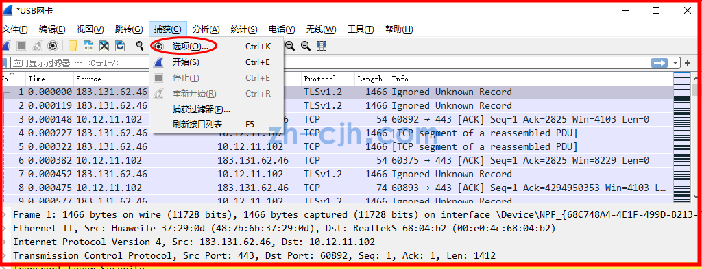
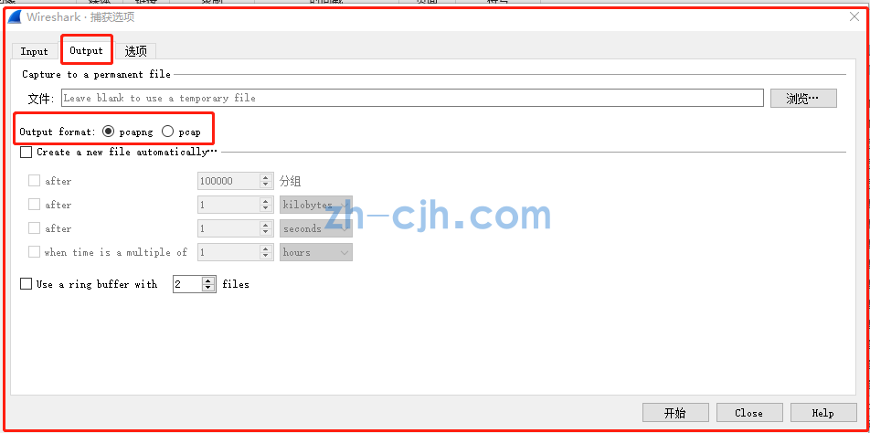

# 对比 pcap 和 pcapng

## Wireshark  pcapng和pcap的区别

参考：

- http://zh-cjh.com/wangluoanquan/2110.html
- https://juejin.cn/s/pcap%20vs%20pcapng%20format

都是网络数据包捕获和分析的文件格式，但有一些区别：

- PCap (Packet Capture，抓包格式)
  - 所属：是最早的网络数据包捕获格式，它是由tcpdump开发的
  - 泛用性：经过多年的发展和演化成为今天最通用、最流行的格式之一。几乎所有捕获工具都支持pcap格式。 虽然供应商多年来已经创建了新的格式，但大多数工具支持转换为pcap格式。
  - 简单及小：pcap文件格式非常简单，只包含捕获的网络数据包原始二进制数据和时间戳等基本信息，因此它的文件大小相对较小。pcap文件可以使用多种工具进行解析和分析，例如tcpdump、Wireshark等。
  - 选用：对于需要对海量数据进行快速分析和处理的情况下，pcap格式可能更为合适
- PCapNG (Packet Capture Next Generation，或 PCAP Next Generation Dump File Format，下一代抓包格式)
  - 所属：来源于IETF（互联网工程工作组）。是为了解决pcap的一些不足，并为未来创建一种灵活的格式
  - 超集关系：pcapng是pcap之后的新一代网络数据包捕获格式
  - 功能扩展：它在pcap的基础上增加了一些新的特性和功能。例如，它可以捕获多种数据类型，支持更多的元数据（如接口名称、注释、数据包时间戳精度等），还支持文件压缩和加密等功能。此外，pcapng格式还支持更多平台和操作系统，例如Windows、Linux、Mac等，而pcap格式则只能在基于Unix的系统中使用。
  - 选用：对于需要更多元数据和扩展功能的情况下，pcapng格式更加适合

## Wireshark 切换存储格式

