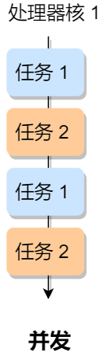

# 竞争与协作

## 竞争问题

### 为什么会有竞争

在单核 CPU 系统里，为了实现多个程序同时运行的假象，操作系统通常以时间片调度的方式，让每个进程执行每次执行一个时间片，时间片用完了，就切换下一个进程运行，由于这个时间片的时间很短，于是就造成了「并发」的现象。



另外，操作系统也为每个进程创建巨大、私有的虚拟内存的假象，这种地址空间的抽象让每个程序好像拥有自己的内存，而实际上操作系统在背后秘密地让多个地址空间「复用」物理内存或者磁盘。


如果一个程序只有一个执行流程，也代表它是单线程的。当然一个程序可以有多个执行流程，也就是所谓的多线程程序，线程是调度的基本单位，进程则是资源分配的基本单位。

所以，线程之间是可以共享进程的资源，比如代码段、堆空间、数据段、打开的文件等资源，但每个线程都有自己独立的栈空间。


### demo - 竞争bug

那么问题就来了，多个线程如果竞争共享资源，如果不采取有效的措施，则会造成共享数据的混乱。

我们做个小实验，创建两个线程，它们分别对共享变量 `i` 自增 `1` 执行 `10000` 次，如下代码（虽然说是 C++ 代码，但是没学过 C++ 的同学也是看到懂的）：

```cpp
#include <iostream> // std::cout
#include <thread>	// std::thread

int i = 0;			// 共享数据

// 线程函数:对共享变量i自增1，执行10000次
void test() {
    int num = 10000;
	for(int n=0;n< num; n++) {
		i=i+ 1;
    }
}

int main(void) {   
    // 创建线程
    std::cout << "Start all threads." << std::endl;
    std::thread thread testl(test);
    std::thread thread test2(test);
    
    // 等待线程执行完成
    thread testl.join();
    thread test2.join();
    std::cout <<"All threads joined." << std::endl;
    
    // 结果
    std::cout << "now i is "<< i << std::endl;	// 这里的取值范围是 [10000, 20000]，而非我们预想的20000
    return 0;
}
```

### demo bug原因

为了理解为什么会发生这种情况，我们必须了解编译器为更新计数器 `i` 变量生成的代码序列，也就是要了解汇编指令的执行顺序。

在这个例子中，我们只是想给 `i` 加上数字 1，那么它对应的汇编指令执行过程是这样的：


可以发现，只是单纯给 `i` 加上数字 1，在 CPU 运行的时候，实际上要执行 `3` 条指令。

1. 设想我们的线程 1 进入这个代码区域，它将 i 的值（假设此时是 50 ）从内存加载到它的寄存器中，然后它向寄存器加 1，此时在寄存器中的 i 值是 51。
2. 现在，一件不幸的事情发生了：**时钟中断发生**。因此，操作系统将当前正在运行的线程的状态保存到线程的线程控制块 TCB。
3. 现在更糟的事情发生了，线程 2 被调度运行，并进入同一段代码。它也执行了第一条指令，从内存获取 i 值并将其放入到寄存器中，此时内存中 i 的值仍为 50，因此线程 2  寄存器中的 i 值也是 50。假设线程 2 执行接下来的两条指令，将寄存器中的 i 值 + 1，然后将寄存器中的 i  值保存到内存中，于是此时全局变量 i 值是 51。
4. 最后，又发生一次上下文切换，线程 1 恢复执行。还记得它已经执行了两条汇编指令，现在准备执行最后一条指令。回忆一下， 线程 1 寄存器中的 i 值是51，因此，执行最后一条指令后，将值保存到内存，全局变量 i 的值再次被设置为 51。
5. 简单来说，增加 i （值为 50 ）的代码被运行两次，按理来说，最后的 i 值应该是 52，但是由于**不可控的调度**，导致最后 i 值却是 51。

针对上面线程 1 和线程 2 的执行过程，我画了一张流程图，会更明确一些：


## 【扩展】一些常见的原子与非原子操作

### 赋值常数 (1, 是)

（本篇扩展不在原转载内容，是后面补充的。参考：https://blog.csdn.net/JMW1407/article/details/108318960）

```c
int a = 1;
```

这种指令操作一般是原子的。因为对应着一条计算机指令，cpu将立即数1搬运到变量a的内存地址中即可

```c
int tmain(int argc, _TCHAR* argv[]) {
    // example 1:
    int a = 1;
    // a=1 汇编指令
    _asm {
    	mov dword ptr[a], 1
    }
    printf("%d\n", a);
    
    return 0;
}
```

### 变量自增自减 (3, 否)

不是，经典的 “内存不可见” 问题

```c
i++
```

i++分为三个阶段：在cpu执行时

1. 第一步，先将count所在内存的值加载到寄存器；
2. 第二步，将寄存器的值自增1;
3. 第三步，将寄存器中的值写回内存。

```c
int _tmain(int argc, TCHAR* argv[]) {
    // example 2:
    int a =0;
    // a++ 汇编指令
    _asm {
        mov eax, dword ptr[a]	//step 1
        inc eax					//step 2
        mov dword ptr[a], eax	//step 3
    }
    printf("%d\n",a);
    
    return 0;
}
```

### 赋值变量 (2, 否)

```c
int a = b;
```

C/C++语法上是一条语句，但现代CPU架构来看，数据不能直接从一块内存帮运到另一块内存，必须借助寄存器中断

```assembly
mov eax, dword ptr [b]
mov dword ptr [a], eax
```

### 常用原子操作：PV操作、测试并设置

## 概念

这里只讲概念，至于实现方法这节先不讲，在下一章节中

### 互斥概念、临界区概念

上面展示的情况称为 **竞争条件（*race condition*）**，当多线程相互竞争操作共享变量时，由于运气不好，即在执行过程中发生了上下文切换，我们得到了错误的结果，事实上，每次运行都可能得到不同的结果，因此输出的结果存在 **不确定性（*indeterminate*）**。

由于多线程执行操作共享变量的这段代码可能会导致竞争状态，因此我们将此段代码称为 **临界区（*critical section*），它是访问共享资源的代码片段，一定不能给多线程同时执行。**

我们希望这段代码是 **互斥（*mutualexclusion*）的，也就说保证一个线程在临界区执行时，其他线程应该被阻止进入临界区**，说白了，就是这段代码执行过程中，最多只能出现一个线程。


另外，说一下互斥也并不是只针对多线程。在多进程竞争共享资源的时候，也同样是可以使用互斥的方式来避免资源竞争造成的资源混乱。

### 同步概念

互斥解决了并发进程/线程对临界区的使用问题。这种基于临界区控制的交互作用是比较简单的，只要一个进程/线程进入了临界区，其他试图想进入临界区的进程/线程都会被阻塞着，直到第一个进程/线程离开了临界区。

我们都知道在多线程里，每个线程并不一定是顺序执行的，它们基本是以各自独立的、不可预知的速度向前推进，但有时候我们又希望多个线程能密切合作，以实现一个共同的任务。

例子，线程 1 是负责读入数据的，而线程 2 是负责处理数据的，这两个线程是相互合作、相互依赖的。线程 2 在没有收到线程 1  的唤醒通知时，就会一直阻塞等待，当线程 1 读完数据需要把数据传给线程 2 时，线程 1 会唤醒线程 2，并把数据交给线程 2 处理。

**所谓同步，就是并发进程/线程在一些关键点上可能需要互相等待与互通消息，这种相互制约的等待与互通信息称为进程/线程同步**。

举个生活的同步例子，你肚子饿了想要吃饭，你叫妈妈早点做菜，妈妈听到后就开始做菜，但是在妈妈没有做完饭之前，你必须阻塞等待，等妈妈做完饭后，自然会通知你，接着你吃饭的事情就可以进行了。


### 总结

注意，同步与互斥是两种不同的概念：

- 同步就好比：「操作 A 应在操作 B 之前执行」，「操作 C 必须在操作 A 和操作 B 都完成之后才能执行」等；
- 互斥就好比：「操作 A 和操作 B 不能在同一时刻执行」；


