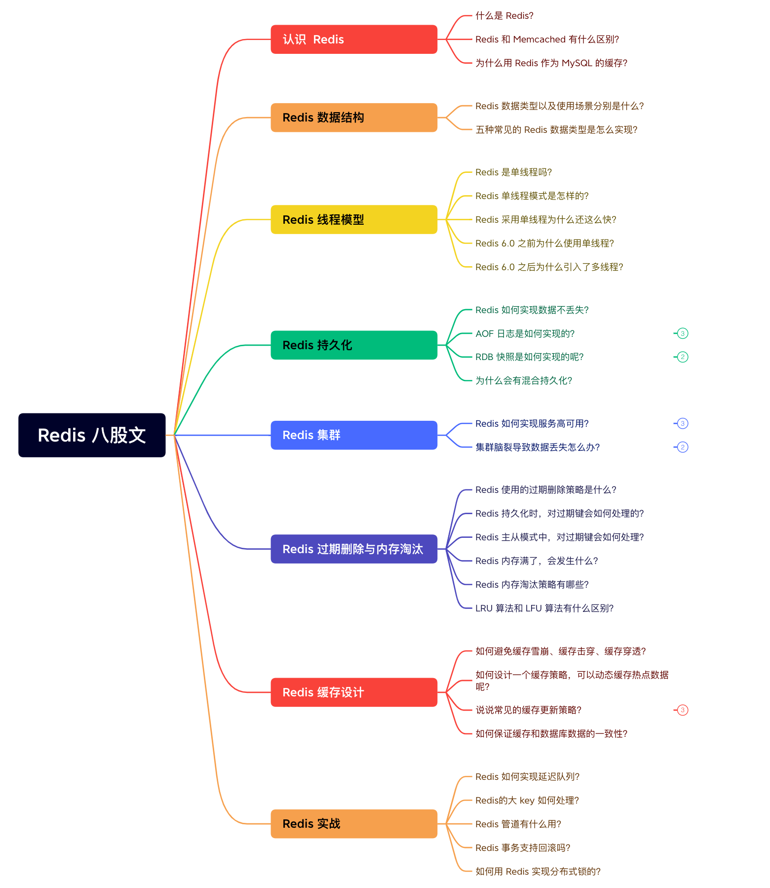

# Redis 常见面试题

不知不觉《图解 Redis》系列文章写了很多了，考虑到一些同学面试突击 Redis，所以我整理了 3 万字 + 40 张图的 Redis 八股文，共收集了 40 多个面试题。

发车！

## Redis 简介

### 简介

我们直接看 Redis 官方是怎么介绍自己的。

Redis 官方的介绍原版是英文的，我翻译成了中文后截图的，所以有些文字读起来会比较拗口，没关系，我会把里面比较重要的特性抽出来讲一下。

- 特点：
  - **基于内存**。对数据的读写操作都是在内存中完成，因此**读写速度非常快**
  - 对数据类型的操作都是**原子性**的，因为执行命令由**单线程**负责的，不存在并发竞争的问题
- 应用场景：
  - **缓存，消息队列、分布式锁等场景**
- 功能：
  - **提供了多种数据类型来支持不同的业务场景**。比如 String (字符串)、Hash (哈希)、 List (列表)、Set (集合)、Zset (有序集合)、Bitmaps (位图)、HyperLogLog (基数统计)、GEO (地理信息)、Stream (流)
  - 支持 **事务 、持久化、Lua 脚本、多种集群方案（主从复制模式、哨兵模式、切片机群模式）、发布/订阅模式，内存淘汰机制、过期删除机制** 等等

### 【比较】Redis 和 Memcached

很多人都说用 Redis 作为缓存，但是 Memcached 也是基于内存的数据库，为什么不选择它作为缓存呢？要解答这个问题，我们就要弄清楚 Redis 和 Memcached 的共同点和区别。

#### 共同点

1. 基于内存的数据库，一般都用来当做缓存使用
2. 有过期策略
3. 高性能

#### 区别

- 数据类型丰富度
  - Redis： 支持的数据类型更丰富（String、Hash、List、Set、ZSet）
  - Memcached： 只支持最简单的 key-value 数据类型

- 是否支持持久化
  - Redis： 支持数据的持久化，可以将内存中的数据保持在磁盘中，重启的时候可以再次加载进行使用
  - Memcached： 没有持久化功能，数据全部存在内存之中，Memcached 重启或者挂掉后，数据就没了

- 集群支持
  - Redis： 原生支持集群模式
  - Memcached： 没有原生的集群模式，需要依靠客户端来实现往集群中分片写入数据

- 额外的功能
  - Redis： 支持发布订阅模型、Lua 脚本、事务等功能
  - Memcached： 不支持

### 为什么用 Redis 作为 MySQL 的缓存？

主要是因为 **Redis 具备「高性能」和「高并发」两种特性**。

#### Redis 具备高性能

- 无Redis缓存的情况下：假如用户第一次访问 MySQL 中的某些数据，此时Redis缓存还没有资源。会从*硬盘*上读取的，这个过程会比较*慢*。
- 在Redis缓存的情况下：该用户访问的数据缓存在 Redis 中，下一次再访问这些数据的时候就可以直接从缓存中获取了。操作 Redis 缓存就是直接操作*内存*，所以速度相当*快*。

如果 MySQL 中的对应数据改变的之后，同步改变 Redis 缓存中相应的数据即可，不过这里会有 **Redis 和 MySQL 双写一致性** 的问题，后面我们会提到。

#### Redis 具备高并发

单台设备的 Redis 的 QPS（Query Per Second，每秒钟处理完请求的次数） 是 MySQL 的 10 倍

- Redis 单机的 QPS： 轻松破 10w
- MySQL 单机的 QPS： 很难破  1w

所以，直接访问 Redis 能够承受的请求是远远大于直接访问 MySQL 的，所以我们可以考虑把数据库中的部分数据转移到缓存中去，这样用户的一部分请求会直接到缓存这里而不用经过数据库。

---

剩余部分见本文件夹外的其他内容

## 参考资料

- 《Redis 设计与实现》
- 《Redis 实战》
- 《Redis 核心技术与实战》
- 《Redis 核心原理与实战 》

