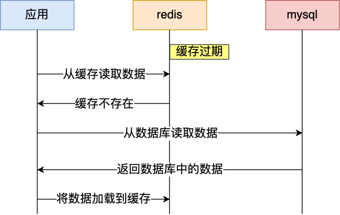
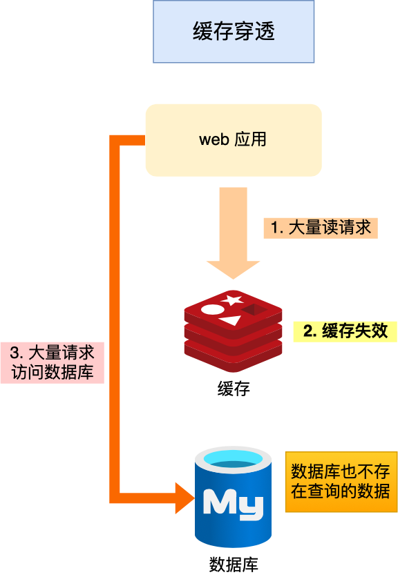

# Redis 缓存设计

## 如何避免缓存雪崩、缓存击穿、缓存穿透？

TIP

> 推荐阅读：[什么是缓存雪崩、击穿、穿透？](https://xiaolincoding.com/redis/cluster/cache_problem.html)

### 如何避免缓存雪崩？

先引 - 过期时间

> 通常我们为了保证缓存中的数据与数据库中的数据一致性，会给 Redis 里的数据设置过期时间，当缓存数据过期后，用户访问的数据如果不在缓存里，业务系统需要重新生成缓存，因此就会访问数据库，并将数据更新到 Redis 里，这样后续请求都可以直接命中缓存。
>
> 

什么是缓存雪崩？

> 那么，当*大量缓存数据在同一时间过期（失效）*时，如果此时有大量的用户请求，都无法在 Redis 中处理，于是全部请求都直接访问数据库，从而导致数据库的压力骤增，严重的会造成数据库宕机，从而形成一系列连锁反应，造成整个系统崩溃，这就是缓存雪崩的问题。
>

如何解决缓存雪崩？

> 可以采用两种方案解决：
>
> - **将缓存失效时间随机打散**： 我们可以在原有的失效时间基础上增加一个随机值（比如 1 到 10 分钟）这样每个缓存的过期时间都不重复了，也就降低了缓存集体失效的概率。
> - **设置缓存不过期**： 我们可以通过后台服务来更新缓存数据，从而避免因为缓存失效造成的缓存雪崩，也可以在一定程度上避免缓存并发问题。
>

### 如何避免缓存击穿？

什么是缓存击穿？

> 我们的业务通常会有几个数据会被频繁地访问，比如秒杀活动，这类被频地访问的数据被称为热点数据。
>
> 如果缓存中的*某个热点数据过期 (失效)*了，此时大量的请求访问了该热点数据，就无法从缓存中读取，直接访问数据库，数据库很容易就被高并发的请求冲垮，这就是缓存击穿的问题
>
> 

解决方案：

> 可以采取前面说到两种方案 (哈？这不是前面说的两种方案吧)：
>
> - **互斥锁方案**（Redis 中使用 setNX 方法设置一个状态位，表示这是一种锁定状态），保证同一时间只有一个业务线程请求缓存，未能获取互斥锁的请求，要么等待锁释放后重新读取缓存，要么就返回空值或者默认值。
> - **不给热点数据设置过期时间**：由后台异步更新缓存，或者在热点数据准备要过期前，提前通知后台线程更新缓存以及重新设置过期时间；
>

### 如何避免缓存穿透？

什么是缓存穿透？

> 当用户访问的数据，*既不在缓存中，也不在数据库中*，导致请求在访问缓存时，发现缓存缺失，再去访问数据库时，发现数据库中也没有要访问的数据，没办法构建缓存数据，来服务后续的请求。那么当有大量这样的请求到来时，数据库的压力骤增，这就是缓存穿透的问题。
>
> 
>

为什么会缓存穿透？

> 一般有这两种情况：
>
> - 业务*误操作*，缓存中的数据和数据库中的数据都被误删除了，所以导致缓存和数据库中都没有数据；
> - *黑客*恶意攻击，故意大量访问某些读取不存在数据的业务；
>

解决方案：

> 常见的方案有三种
>
> - **非法请求的限制**
>
>   当有大量恶意请求访问不存在的数据的时候，也会发生缓存穿透，因此在 API 入口处我们要判断求请求参数是否合理，请求参数是否含有非法值、请求字段是否存在，如果判断出是恶意请求就直接返回错误，避免进一步访问缓存和数据库。
>
> - **缓存中设置空值或者默认值**
>
>   当我们线上业务发现缓存穿透的现象时，可以针对查询的数据，在缓存中设置一个空值或者默认值，这样后续请求就可以从缓存中读取到空值或者默认值，返回给应用，而不会继续查询数据库。
>
> - **使用布隆过滤器快速判断数据是否存在，避免通过查询数据库来判断数据是否存在**
>
>   我们可以在写入数据库数据时，使用布隆过滤器做个标记，然后在用户请求到来时，业务线程确认缓存失效后，可以通过查询布隆过滤器快速判断数据是否存在，如果不存在，就不用通过查询数据库来判断数据是否存在，*即使发生了缓存穿透，大量请求只会查询 Redis 和布隆过滤器，而不会查询数据库*，保证了数据库能正常运行，Redis 自身也是支持布隆过滤器的。
>

### 总结、比较

缓存击穿 VS 缓存雪崩

> - 缓存雪崩：大量数据同时过期，导致大量请求 缓存miss
> - 缓存击穿：热点数据突然过期，导致大量请求 缓存miss
> - 缓存穿透：数据库的数据丢失，导致大量请求 缓存miss 且无法 数据库miss (即后续的相同请求同样缓存miss)
>
> 可以发现缓存击穿跟缓存雪崩*很相似*，你可以认为*缓存击穿是缓存雪崩的一个子集*
>
> 缓存穿透相比前两者的后果更严重。当发生缓存雪崩或击穿时，数据库中还是保存了应用要访问的数据，一旦缓存恢复相对应的数据，就可以减轻数据库的压力，而缓存穿透就不一样了，会持续miss

## 「热点数据的动态缓存」策略

热点数据的动态缓存：

如何设计一个缓存策略，可以动态缓存热点数据呢？

由于数据存储受限，系统并不是将所有数据都需要存放到缓存中的，而**只是将其中一部分热点数据缓存起来**，所以我们要设计一个热点数据动态缓存的策略。

场景：

以电商平台场景中的例子，现在要求只缓存用户经常访问的 Top 1000 的商品。具体细节如下：

1. 先通过缓存系统做一个*排序*队列（比如存放 1000 个商品），系统会根据商品的访问时间，更新队列信息，越是最近访问的商品排名越靠前；
2. 同时系统会*定期过滤*掉队列中排名最后的 200 个商品，然后再从数据库中*随机读取*出 200 个商品加入队列中；
3. 这样当请求每次到达的时候，会先从队列中获取商品 ID，如果命中，就根据 ID 再从另一个缓存数据结构中读取实际的商品信息，并返回。

思路：

热点数据动态缓存的策略总体思路：**通过数据最新访问时间来做排名，并过滤掉不常访问的数据，只留下经常访问的数据**。

策略：

在 Redis 中可以用 zadd 方法和 zrange 方法来完成排序队列和获取 200 个商品的操作。

## 「缓存更新」策略 (常见的3种)

### 提前总结

常见的缓存更新策略共有3种：

- ##### Cache Aside（旁路缓存）策略

  - 特点
    - 「应用程序」直接与「数据库」和「缓存」交互
  - 优点
    - **读多**场景适合，*性能好*。命中时读就是直接读内存缓存
  - 缺点
    - **写多**场景不适，*性能差、命中率低*。写入频繁时，缓存中的数据会被频繁地清理。并且这样会对缓存的命中率有一些影响
    - **一致性问题**：要额外小心，好在这方面有一些成熟的做法可以尽量避免
  - 真实应用
    - 是最常用的。实际开发中，Redis 和 MySQL 的更新策略用的是 Cache Aside，另外两种策略应用不了

- ##### Read/Write Through（读穿 / 写穿）策略

  - 特点
    - 「应用程序」与「缓存」交互，「缓存」与「数据库」交互（应用程序不再和数据库交互，相当于更新数据库的操作由缓存自己代理了）
  - 场景
    - 不能应用到Redis：Redis *没有提供从数据库中读写数据的功能* (Redis、Memcached等经常使用的分布式缓存组件都不提供)
    - 我们在使用*本地缓存*的时候可以考虑使用这种策略

- ##### Write Back（写回）策略

  - 特点

    - 同步更新缓存、异步更新数据库 (慢)

  - 优点、场景

    - **写多**场景适合，*性能好*。写操作只要更新缓存就能马上返回，不用等数据库的同步操作

  - 缺点

    - **一致性问题**：数据不是强一致性的，而且会有数据丢失的风险，因为缓存一般使用内存，而内存是非持久化的，所以一旦缓存机器掉电，就会造成原本缓存中的脏数据丢失。所以你会发现系统在掉电之后，之前写入的文件会有部分丢失，就是因为 Page Cache 还没有来得及刷盘造成的

  - 真实应用

    - 不能应用到Redis：Redis *没有提供异步更新数据库的功能*

    - 是计算机体系结构中的设计。比如 *CPU 的缓存*、操作系统中*文件系统的缓存*，都采用了 Write Back（写回）策略。

      比如：写文件的时候，实际上是写入到文件系统的缓存就返回了，并不会写磁盘

### (1) Cache Aside（旁路缓存）策略

Cache Aside（旁路缓存）策略是最常用的，也是，*应用程序直接与「数据库」、「缓存」交互*，并负责对缓存的维护。

该策略又可以细分为「读策略」和「写策略」：

- 写策略的步骤

  - 先更新数据库中的数据，再删除缓存中的数据

- 读策略的步骤

  - 如果读取的数据命中了缓存，则直接返回数据

  - 如果读取的数据没有命中缓存，则从数据库中读取数据，然后将数据写入到缓存，并且返回给用户

#### 小心数据不一致问题 (写策略必须先更新数据库再删除缓存)

必须先更新数据库再删除缓存

注意，写策略的步骤的顺序不能倒过来，即不能先删除缓存再更新数据库，原因是在「读+写」并发的时候，会出现缓存和数据库的数据不一致性的问题。

举个例子，假设某个用户的年龄是 20，请求 A 要更新用户年龄为 21，所以它会删除缓存中的内容。这时，另一个请求 B  要读取这个用户的年龄，它查询缓存发现未命中后，会从数据库中读取到年龄为 20，并且写入到缓存中，然后请求 A 继续更改数据库，将用户的年龄更新为 21。

最终，该用户年龄在缓存中是 20（旧值），在数据库中是 21（新值），缓存和数据库的数据不一致。

为什么「先更新数据库再删除缓存」不会有数据不一致的问题？

继续用「读 + 写」请求的并发的场景来分析。

假如某个用户数据在缓存中不存在，请求 A 读取数据时从数据库中查询到年龄为 20，在未写入缓存中时另一个请求 B 更新数据。它更新数据库中的年龄为 21，并且清空缓存。这时请求 A 把从数据库中读到的年龄为 20 的数据写入到缓存中。

最终，该用户年龄在缓存中是 20（旧值），在数据库中是 21（新值），缓存和数据库数据不一致。 从上面的理论上分析，先更新数据库，再删除缓存也是会出现数据不一致性的问题，**但是在实际中，这个问题出现的概率并不高**。

**因为缓存的写入通常要远远快于数据库的写入**（*快慢操作下，先干慢事再干快事在利于一致性*），所以在实际中很难出现请求 B 已经更新了数据库并且删除了缓存，请求 A 才更新完缓存的情况。而一旦请求 A 早于请求 B 删除缓存之前更新了缓存，那么接下来的请求就会因为缓存不命中而从数据库中重新读取数据，所以不会出现这种不一致的情况。

#### 优缺点、场景

Cache Aside（旁路缓存）策略

- 特点
  - 「应用程序」直接与「数据库」和「缓存」交互
- 优点
  - **读多**场景适合，*性能好*。命中时读就是直接读内存缓存
- 缺点
  - **写多**场景不适，*性能差、命中率低*。写入频繁时，缓存中的数据会被频繁地清理。并且这样会对缓存的命中率有一些影响
  - **一致性问题**：要额外小心，好在这方面有一些成熟的做法可以尽量避免
- 真实应用
  - 是最常用的。实际开发中，Redis 和 MySQL 的更新策略用的是 Cache Aside，另外两种策略应用不了

补充：如果业务对缓存命中率有严格的要求，那么可以考虑两种解决方案：

1. 一种做法是在*更新数据时也更新缓存*，只是在更新缓存前先加一个分布式锁，因为这样在同一时间只允许一个线程更新缓存，就不会产生并发问题了。当然这么做对于写入的性能会有一些影响
2. 另一种做法同样也是在更新数据时更新缓存，只是给缓存*加一个较短的过期时间*，这样即使出现缓存不一致的情况，缓存的数据也会很快过期，对业务的影响也是可以接受

### (2) Read/Write Through（读穿 / 写穿）策略

Read/Write Through（读穿 / 写穿）策略原则：应用程序只和缓存交互，不再和数据库交互，而是由缓存和数据库交互，相当于更新数据库的操作由缓存自己代理了

#### Read Through 策略

先查询缓存中数据是否存在，如果存在则直接返回，如果不存在，则由缓存组件负责从数据库查询数据，并将结果写入到缓存组件，最后缓存组件将数据返回给应用。

#### Write Through 策略

当有数据更新的时候，先查询要写入的数据在缓存中是否已经存在：

- 如果缓存中数据已经存在，则更新缓存中的数据，并且由缓存组件同步更新到数据库中，然后缓存组件告知应用程序更新完成。
- 如果缓存中数据不存在，直接更新数据库，然后返回；

下面是 Read Through/Write Through 策略的示意图：

#### 优缺点、场景

- 特点
  - 「应用程序」与「缓存」交互，「缓存」与「数据库」交互（应用程序不再和数据库交互，相当于更新数据库的操作由缓存自己代理了）
- 场景
  - 不能应用到Redis：Redis *没有提供从数据库中读写数据的功能* (Redis、Memcached等经常使用的分布式缓存组件都不提供)
  - 我们在使用*本地缓存*的时候可以考虑使用这种策略

Linc 吐槽：

> 话说这里的写策略是先写缓存再写数据库？但是按之前旁路缓存策略的经验来看，数据库操作慢而缓存操作快，并应该先进行慢操作再进行快操作，数据的一致性会更好吗？
>
> 还是说这里的线程模式不一样了？

### (3) Write Back（写回）策略

Write Back（写回）策略在更新数据的时候，只更新缓存，同时将缓存数据设置为脏的，然后立马返回，并不会更新数据库。对于数据库的更新，会通过批量异步更新的方式进行。

#### 优缺点、场景

- 特点

  - 同步更新缓存、异步更新数据库 (慢)

- 优点、场景

  - **写多**场景适合，*性能好*。写操作只要更新缓存就能马上返回，不用等数据库的同步操作

- 缺点

  - **一致性问题**：数据不是强一致性的，而且会有数据丢失的风险，因为缓存一般使用内存，而内存是非持久化的，所以一旦缓存机器掉电，就会造成原本缓存中的脏数据丢失。所以你会发现系统在掉电之后，之前写入的文件会有部分丢失，就是因为 Page Cache 还没有来得及刷盘造成的

- 真实应用

  - 不能应用到Redis：Redis *没有提供异步更新数据库的功能*

  - 是计算机体系结构中的设计。比如 *CPU 的缓存*、操作系统中*文件系统的缓存*，都采用了 Write Back（写回）策略。

    比如：写文件的时候，实际上是写入到文件系统的缓存就返回了，并不会写磁盘

这里顺便复习一下CPU缓存

这里贴一张 CPU 缓存与内存使用 Write Back 策略的流程图：

有没有觉得这个流程很熟悉？因为我在写 [CPU 缓存文章](https://xiaolincoding.com/os/1_hardware/cpu_mesi.html#写回) 的时候提到过。

## 保证缓存和数据库数据的一致性

TIP

> 推荐阅读：[数据库和缓存如何保证一致性？](https://xiaolincoding.com/redis/architecture/mysql_redis_consistency.html)

