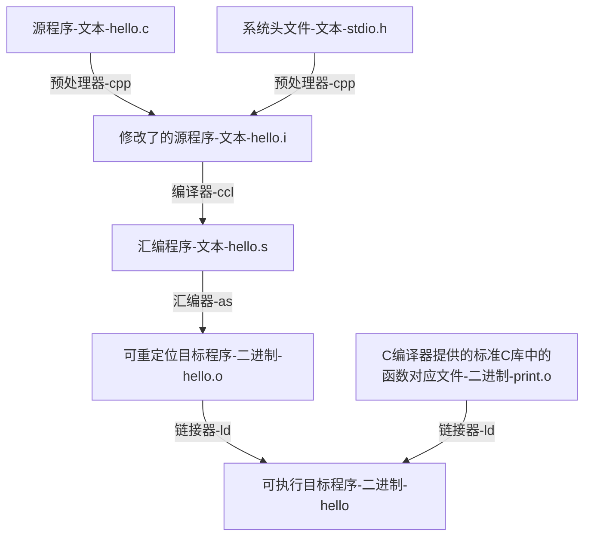

# 《深入了解计算机系统》

# 目录

[toc]

# 程序的机器级表示

详见汇编笔记

| 机器位数（字长、PC的大小） | 可以指向多少个内存地址 | 可以使用多大的随机访问存储器 | 补充                                      |
| -------------------------- | ---------------------- | ---------------------------- | ----------------------------------------- |
| 16位（2B）微处理器         | 2^16^                  | 64KB（2^16^B）               |                                           |
| 32位（4B）                 | 2^32^                  | 4GB（2^32^B）                |                                           |
| 64位（8B）                 | 2^64^                  | 16EB（2^64^B）（2000亿亿B）  | 比TB后面还有个PB拍字节，才到EB艾字节      |
| 现代的64位（6B）           | 2^48^                  | 256TB（2^48^B）              | 现在的64位：被限制前16位为0，只能用后48位 |

用十进制可能容易理解点：4位数能表示1万个数，8位数能表示1亿，16位数能表示1万亿个数，64位数能表示10^64^个数

> 旁注：IA32，为x86-64的32位前身

## 历史观点

Intel处理器的历史发展（影响机器级编程的特性）

| 处理器版本            | 年份 | 晶体管数量 | 补充                                       |
| --------------------- | ---- | ---------: | ------------------------------------------ |
| 8086                  | 1978 |       29 K | 第一代单芯片、16位微处理器之一             |
| 80286                 | 1982 |      134 K |                                            |
| i386                  | 1985 |      275 K | 将体系结构扩展到32位                       |
| i486                  | 1989 |      1.2 M |                                            |
| Pentium               | 1993 |      3.1 M |                                            |
| PentiumPro            | 1995 |      5.5 M | P6微体系结构，指令集增加一类“条件传送”指令 |
| Peitium/MMX           | 1997 |      4.5 M |                                            |
| Pentium II            | 1997 |        7 M | P6微体系结构的延伸                         |
| Pertium III           | 1999 |      8.2 M |                                            |
| Pertium 4             | 2000 |       42 M |                                            |
| Pertium 4E            | 2004 |      125 M | 增加超线程，且增加64位扩展（x86-64）       |
| Core 2                | 2006 |      291 M | 第一个多核微处理器，但不支持超线程         |
| Core i7，Nehalem      | 2008 |      781 M | 既支持超线程，也有多核                     |
| Core i7，Sandy Bridge | 2011 |     1.17 G |                                            |
| Core i7，Haswell      | 2013 |      1.4 G |                                            |

- 机器语言有很多特性只有从历史的观点来看才有意义（当时技术有限做了很多妥协）
- 且每个后继处理器设计都提供了向后兼容的特性

所以指令集有很多奇怪的东西

> 摩尔定律：18个月一翻

## 程序编码

Unix命令行编译C程序中的两个文件（p1.c和p2.c）

```shell
linux> gcc -Og -o p p1.c p2.c
# ggc：GCC C编译器，是Linux上默认的编译器
# -Og：使用生成符合原始C代码整体结构的机器代码优化等级，而不适用较高级别的优化，以便学习
```

再重复一下第一大章的内容：



### 机器级代码

机器级编程（像计算机系统那样）使用了多种抽象，其中两种尤为重要

1. 由`指令集体系结构或指令集架构（Instruction Set Architecture，ISA）`来定义机器级程序的格式和行为

    如：将程序行为描述成好像每条指令都是按顺序执行的

2. 机器级程序使用的内存地址是虚拟地址

区别

> - 汇编与二进制相比：拥有可读性更好的文本格式表示
> - 机器代码和C相比：
>     - 一些通常对C语言程序猿隐藏的处理器状态都是可见的，如：
>         - 程序计数器（PC，x86-64中用`%rip`表示）给出将要执行的下条指令在内存中的地址
>         - 整数寄存器文件
>         - 条件码寄存器
>         - 向量寄存器
>     - C语言提供声明的数据类型，机器语言不区分各种数，甚至不区分指针和整数

### 代码示例

> #### Linux编译器和反汇编器的使用

gcc和g++都可以编译C/C++，但教程上一般是gcc对C，gcc汇编，g++对C++，具体的这里不再深入

两者的用法几乎完全一致


| linux指令（`gcc`与`objdump`）    | 操作             | 生成文件                     | 文件补充                              |
| -------------------------------- | ---------------- | ---------------------------- | ------------------------------------- |
| `gcc -Og -S main.c`              | 仅编译           | 汇编文件`main.s`             | 可以文本方式打开阅读汇编代码          |
| `gcc -Og -S -masm=intel main.c`  | 仅编译           | 汇编文件`main.s`             | 还可以生成Intel格式的代码（没区别？） |
| `gcc -Og -c main.c`              | 编译+汇编        | 二进制文件`main.o`           | `sudo ./main.o`可运行该文件           |
| `gcc -Og -o prog main.c hello.c` | 编译+汇编+链接   | 二进制文件`prog`             | `sudo ./prog`可运行该文件             |
| `gcc main.c`                     | 编译+汇编+链接   | 二进制文件`a.out`            | `sudo ./a.out`可运行该文件            |
| ——————                           | ——————           | ——————                       | ——————                                |
| `g++ -S main.cpp`                | 仅编译           | 汇编文件`main.s`             | 可以文本方式打开阅读汇编代码          |
| `g++ -c main.cpp`                | 编译+汇编        | 二进制文件`main.o`           | `sudo ./main.o`可运行该文件           |
| `g++ -o [world] main.cpp`        | 编译+汇编+链接   | 二进制文件`main` (或`world`) | `sudo ./prog`可运行该文件             |
| `g++ main.cpp`                   | 编译+汇编+链接   | 二进制文件`a.out`            | `sudo ./a.out`可运行该文件            |
| ——————                           | ——————           | ——————                       | ——————                                |
| `objdump -d mstore.o`            | 反汇编二进制代码 | 不生成，在终端显示结果       |                                       |
| `objdump -d prog`                | 反汇编二进制代码 | 不生成，在终端显示结果       |                                       |

**表格补充：如进行链接，则必须要有一个main函数**

反编译器（disassembler）补充：反汇编特性：

- 指令长度：x86-64的从1-15个字节不等，常用指令和操作数较少的指令所需的字节数少（反之）

- 设计指令格式的方式：从某个给定位置开始可以唯一性解码（如：只有pushq %rbx是以字节值53开头的）
- 指令名：反汇编使用的指令命名规则和GCC生成的有细微差别（如：末尾的q）

> #### 实验代码

C语言代码`main.c`

```c
#include <stdio.h>
void multstore(long, long, long*);
int main() {
    long d;
    multstore(2, 3, &d);
    printf("2*3 --> %ld\n", d);
    return 0;
}
long mult2(long a, long b) {
    long s = a*b;
    return s;
}
```

C语言代码`mstore.c`

```c
long mult2(long, long); // 返回两数相乘的值，来自main.c文件的函数

void multstore(long x, long y, long *dest) { // 把前两参相乘的值给第三参，提供给main.c文件用
    long t = mult2(x, y);
    *dest = t;
}
```

> #### 汇编代码结果

`mstore.c`编译的汇编代码`mstore.s`（忽略以.开头的伪指令）

```assembly
# void multstore(long x, long y, long *dest)
# x in %rdi, y in %rsi, dest in %rdx
   
multstore:
	pushq	%rbx			# Save %rbx
	movq	%rdx, %rbx		# Copy dest to %rbx
	call	mult2			# Call mult2(x, y)
	movq	%rax, (%rbx)	# Store result at *dest
	popq	%rbx			# Restore %rbx
	ret						# Return (默认返回%rax，这里没有操作%rax，即返回0)

# 每个缩进行对应一条机器指令，一条机器指令只能执行一个非常基础的操作
```

`mstore.c`编译并汇编的机器代码`mstore.o`

```shell
# 14字节序列的16进制显示：
53 48 89 d3 e8 00 00 00 00 48 89 03 5b c3
```

`mstore.o`反汇编生成的类汇编代码`mstore.s`，略有不同应该是因为之前汇编器改进了一些程序，反编译应该原编译程序更精准

```assembly
# 右侧部分为注解

0000000000000000 <multstore>:
    0:	53						push	%rbx
    1:	48 89 d3				mov		%rdx,%rbx
    4:	e8 00 00 00 00			callq	9 <multstore+0x9>
    9:	48 89 03				mov		%rax,(%rbx)
    c:	5b						pop		%rbx
    d:	c3						retq
```

另一个C语言程序`main.c`

```c
#include <studio.h>

void multstore(long, long, long *); // 把前两参相乘的值给第三参，来自mstore.c文件

int main() { // 格式化输出2,3相乘的结果
    long d;
    multstore(2, 3, &d);
    printf("2 * 3 --> %1d\n", d);
    return 0;
}
long mult2(long a, long b) { // 返回两数相乘的值，提供给mstore.c文件用
    long s = a*b;
    return s;
}
```

`main.c`和`mstore.c`生成可执行文件`prop`再反汇编为类汇编代码`prop.s`（和`mstore.c`反汇编的代码几乎一样）

```assembly
0000000000400540 <multstore>:
	400540:		53					push	%rbx
	400541:		48 89 d3			mov		%rdx,%rbx
	400544:		e8 42 00 00 00		callq	40058b <mult2>
    400549:		48 89 03			mov		%rax,(%rbx)
	40054c:		5b					pop		%rbx
	40054d:		c3					retq
	40054e:		90					nop
	40054f:		90					nop
```

### 关于格式的注解

解释汇编代码：见前

旁注：可以在C程序中插入汇编代码，有两种方法：

- 编写完整函数到独立的汇编代码文件，再用汇编器和链接器合并起来
- GCC的内联汇编特性，在C中包含简短的汇编代码


