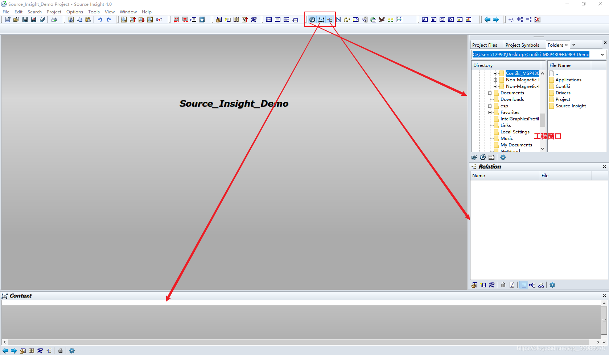

# Source Insign 4

参考：https://blog.csdn.net/qq_36986070/article/details/117170266

## Source Insign 4 简单教程

### 加载工程

1. 新建工程。弹窗1 输入工程名和保存工程的路径
2. 弹窗2 输入源码路径
3. 弹窗3 添加文件（需要注意，File Name框中显示的只是Source Insight所能支持的文件（.c .cpp .h等），对于ASM程序和其它文件将不会显示。我们可以通过取消勾选Show only known file types这一选项来选择显示其它类型的文件。）Add All以后，

### 主要操作视图

