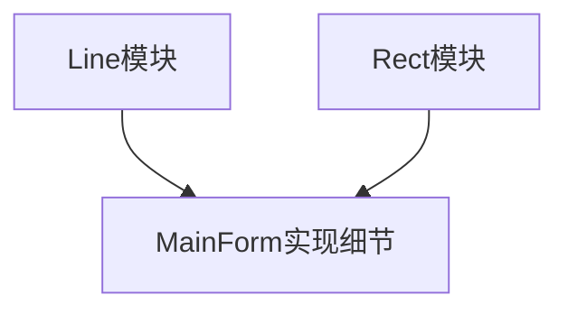
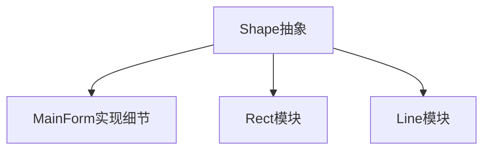

# 《C++设计模式》视频_李建忠

# 目录

# 面向对象设计原则

## 面向对象六大设计原则

”设计原则“ 比 “模式“ 更重要。模式可能会变、可能会被淘汰，模式依赖设计原则

### 依赖倒置原则（DIP）

- 高层模块（稳定）不应该依赖于低层模块（变化），二者都应该依赖于抽象（稳定）
- 抽象（稳定）不应该依赖于实现细节（变化），实现细节应该依赖于抽象（稳定）

举例（图意：上层是被依赖项，下层依赖上层）

- 分解写法（不符合）

- 抽象写法（符合）

### 开放封闭原则（OCP）（开闭原则）

有时简称 “开闭原则”

- 对扩展开放，对更改封闭
- 类模块应该是可扩展的，但是不可修改

### 单一职责原则（SRP）（迪米特法则 / 最少知道原则）

- 一个类应该仅有一个引起它变化的原因
- 变化的方向隐含着类的责任

有时也叫：迪米特法则 (最少知道原则) (Demeter Principle)

- 一个实体应当尽量少的与其它实体发生相互作用,使得功能模块相互独立

### 里氏代换原则（LSP）（Liskov代换原则 / 里斯科夫代换）

（*Liskov Substitution principle*）

- 子类必须能够替换它们的基类（IS-A）
- 继承表达类型抽象

不然就不要去继承基类，或者说两者不应该是继承关系而是组合关系，子类和父类必须是IS-A的关系

### 接口隔离原则（ISP）

- 不应该强迫客户程序依赖它们不用的方法
- 接口应该小而完备

有必要才public，不然就别public。因为一旦public后暴露出去被程序用了，产生了依赖关系，那该接口就需要一直保持稳定

### 合成复用原则（对象组合 大于 继承）

- 类继承通常为 “白箱复用”，对象组合通常为 ”黑箱复用“
- 继承在某种程度上破坏了封装性，子类父类耦合度高
- 而对象组合则只要求被组合的对象具有良好的接口，耦合度低

三大面向对象机制是封装、继承、多态，所以有的人觉得面向对象本质就应该要使用继承（我也是），但事实上继承容易被泛用
需要是IS-A才能用继承，更多情况下有的实现不应该用继承而应该去使用对象组合，而且耦合度会比继承更低

### 扩展 - 封装变化点

- 使用封装来创建对象之间的分界层，让设计者可以在分界层的一侧进行修改，而不会对另一侧产生不良影响，从而实现实现层次间的松耦合

传统面向对象底层思维来讲，封装是封装代码和数据。但从高层次来讲，封装是封装变化点

（该原则和接口隔离原则很像，一个违背了往往另一个就违背了）

### 扩展 - 面向接口编程，而不是面向实现编程

- 不将变量类型声明为某个特定的具体类，而是声明为某个接口
- 客户程序无需获知对象的具体类型，只需要知道对象所具有的接口
- 减少系统中各部分的依赖关系，从而实现 “高内聚、松耦合“ 的类型设计方案

（该原则和依赖倒置原则很像，一个违背了往往另一个就违背了）

## 个人总结六大设计原则

可以参考的点：找出每个原则的 “变化点” 和 “不变点” 在哪

- 变化点 与 不动点
  - 换库时，底层变化，高层不变：依赖倒置原则 (更准确的描述：高层模块依赖的是基模块的抽象接口而非基模块)
  - 改类时，扩展变化，修改不许：开放封闭原则
  - 受参时，扩展变化，修改不许：里氏替换原则
  - 写库时，实现变化，接口不变：接口隔离原则
- 减少变化点
  - 合成复用原则：组合替换继承，解耦度更高
  - 单一职责原则：单职责替换多职责，关系线更少，解耦度更高

## 将设计原则提升为设计经验

- 设计习语（Design Idioms）
  - Design Idioms描述与特定编程语言相关的低层模式，技巧，惯用法
- 设计模式（Design Patterns）
  - Design Patterns主要描述的是：类与相互通信的对象之间的组织关系，包括它们的角色、职责、协作方式等
- 架构模式（Architectural Patterns）
  - Architectural Patterns 描述系统中与基本结构组织关系密切的高层模式，包括子系统划分，职责，以及如何组织它们之间关系的规则

