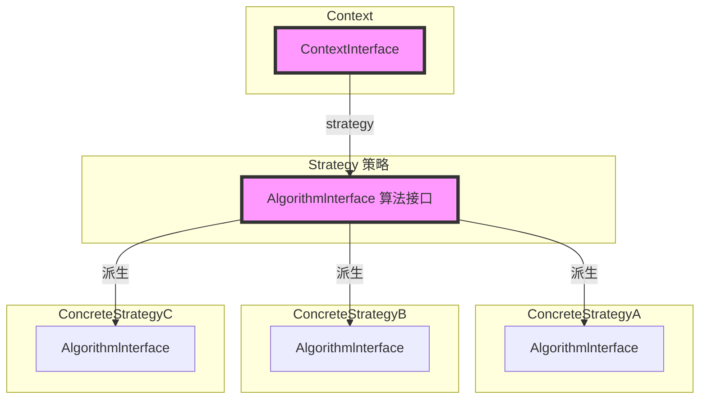

# 策略模式 Strategy

极简一句话：

- 策略模式：类A包含一个多态基类B指针（例如：订单业务类A包含一个国家税收多态类B指针）
- ~~装饰模式：多态基类A包含另一多态基类B指针（例如：**业务**多态类A包含一个**业务**多态类B指针）（策略模式Super版，桥接模式同祖先版）~~
- ~~桥接模式：多态基类A包含另一多态基类B指针（例如：**业务**多态类A包含一个**平台**多态类B指针）（策略模式Super版，装饰模式不同祖先版）~~

## 所属分类——“组件协作” 模式

[省略]

## 动机（Motivation）

### 简概

- 在软件构建过程中，某些对象使用的算法可能多种多样，经常改变，如果将这些算法都编码到对象中，将会使对象变得异常复杂；
  而且有时候支持不使用的算法也是一个性能负担。
- 如何在运行时根据需要透明地更改对象的算法？将算法与对象本身解耦，从而避免上述问题？

### 核心：if分支变成派生类分支

好处：if分支能随意增减和修改，而不影响基类对象

——

还有一种更加改进的方法：创建对象时传参枚举，对象再根据枚举创建对应的派生类

- 优点
  - 只用创建一个类再选择一个类型，而不是在一堆类里面选择，使用起来更方便！
  - 各种枚举值能同事组合，来创建一个具有多种特征的新对象，这点比派生类分支更优！
  - 修改各种派生类也简单
- 缺点
  - 增减比修改麻烦一点，但更新库时也只多了修改枚举值这一步而已。弊处不大
  - 如果是用户修改原库（一般枚举型不能改），创建时使用创建用户的新类，而不通过枚举值的方式。弊处不大

### 代码体现

一个税收计算的实例

考虑时间轴：以后可能会支持更多的国家的计算，当增加 “法国税收” 后

#### 举例 - 写法1

违背了开闭原则（开放封闭原则OCP）

```c++
enum TaxBase {
	CN_Tax,
    us_Tax,
    DE_Tax
    ,FR_Tex											// 【更改】
};

class SalesOrder{
	TaxBase tax;	// 这个是？？？
public:
	double CalculateTax(){
		//...
		if (tax == CN_Tax){			// 中国的税收
			//...
		}
		else if (tax == us_Tax){	// 美国的税收
			//...
		}
		else if (tax == DE_Tax){	// 德国的税收
			//...
		}
        else if (tax == FR_Tax){					// 【更改】法国的税收
			//...
		}
		//...
    }
};
```

#### 举例 - 写法2（Strategy的写法）

这里把多个类放在同一文件只是为了方便演示，项目中不推荐这种做法，不同类应在不同的文件中

```c++
class TaxStrategy{					// 抽象基类，含纯虚方法
public:
	virtual double calculate( const Context& context)=0;
    virtual ~TaxStrategy(){}
};

class CNTax : public TaxStrategy{	// 中国
public:
	virtual double calculate(const context& context){
		//...
    }
}

class USTax : public TaxStrategy{	// 美国
public:
	virtual double calculate(const Context& context){
		//...
	}
};

class DETax : public TaxStrategy{	// 德国
public:
	virtual double calculate(const context& context){
        //...
    }
};

class FRTax : public TaxStrategy{					// 【更改】法国的税收
public:
	virtual double calculate(const context& context){
        //...
    }
};

class SaleOrder{
private:
	TaxStrategy* strategy;			// 多态指针
    
public:
	SalesOrder(strategyFactory* strategyFactory){
		this->strategy = strategyFactory->NewStrategy();
	}
	~SalesOrder(){
		delete this->strategy;
    }
	public double calculateTax(){					// 计算税收
		//...
		context context();
        double val = strategy->Calculate(context);	// 多态调用
        //...
	}
};
```

#### 比较两种写法

考虑时间轴：以后可能会支持更多的国家的计算，当增加 “法国税收” 后

- 第一种：违背类`开闭原则`，复用性少了
- 第二种：只需要添加一个新类，遵循了`开闭原则`

设计模式简介中画图的代码实现也是用到了这个`开闭原则`和`策略模式`

## 设计模式

### 模式定义

> 定义一系列算法，把它们一个个封装起来，并且使它们可互相替换（**变化**）。
> 该模式使得算法可独立于使用它的客户程序（**稳定**）而变化（**扩展，子类化**）。
>
> ——《设计模式》GoF

### 结构（Structure）

（红色表示稳定）

​	策略即算法接口，派生出多种不同的算法，以便可以在多种不同的算法之间进行切换



### 要点总结

- Strategy及其子类为组件提供了一系列可重用的算法，从而可以使得类型在**运行时**方便地根据需要**在各个算法之间进行切换**
- Strategy模式提供了用条件判断语句以外的另一种选择，**消除条件判断语句，就是在解耦合。含有许多条件判断语句的代码通常都需要Strategy模式**
  （条件判断是结构化编程的一种分而治之的策略，而设计模式提倡的是一种抽象的策略）
- 如果Strategy对象没有实例变量，那么各个上下文可以共享同一个Strategy对象，从而节省对象开销


