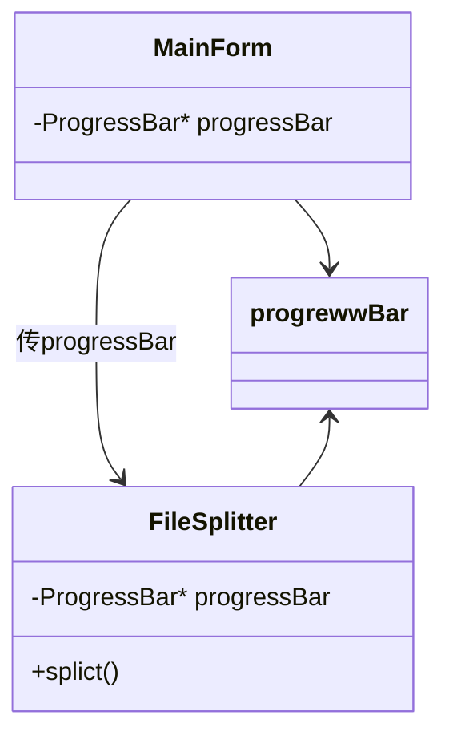
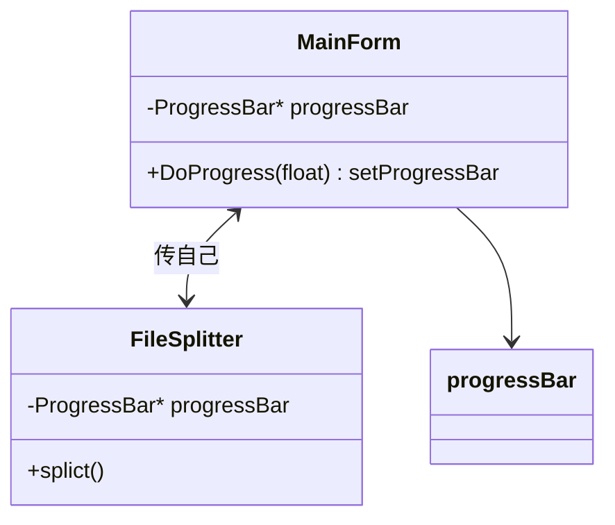
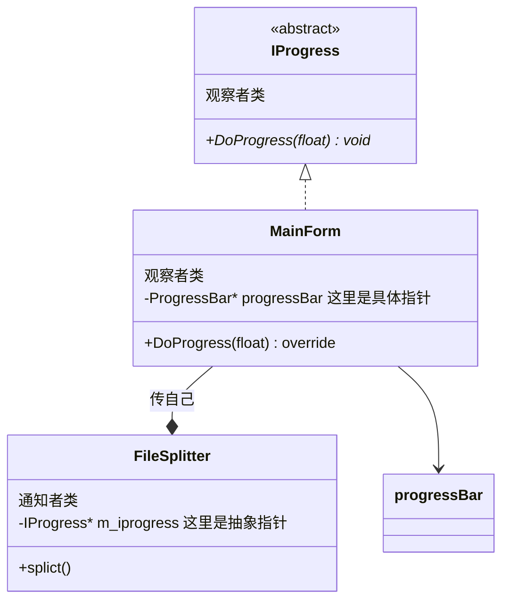
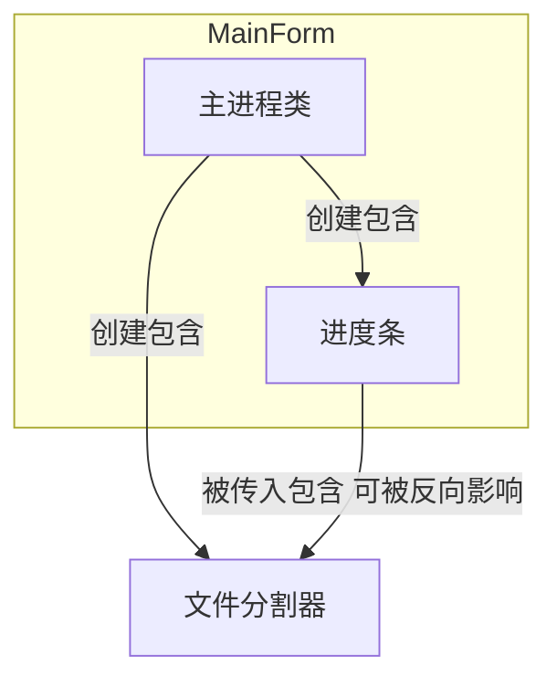
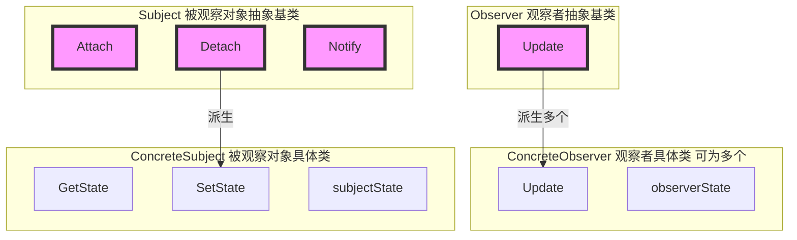

# 观察者模式 Observer

极简一句话：报社包含一个订阅读者表（这个表里的人必须继承读者或有取书的方法）

## 所属分类——“组件协作” 模式

[省略]

## 动机（Motivation）

### 简概

- 在软件构建过程中，我们需要为某些对象建立一种 “通知依赖关系” ——一个对象（目标对象）的状态发生改变，所有的依赖对象（观察者对象）都将得到通知。如果这样的依赖关系过于紧密，将使软件不能很好地抵御变化
- 使用面向对象技术，可以将这种依赖关系弱化，并形成一种稳定的依赖关系。从而实现软件体系结构的松耦合

### 核心：1 让通知者可以通知多个观察者，2 观察关系可动态绑定

消息通知时，通知者和被通知者两个对象解耦、可以动态绑定

不用这个设计模式也能实现消息通知，子父对象粗暴地互相包含对方指针，然后顺着指针一层层找到要通知的对象并调用其方法即可

但这种方法高度耦合，而且做不到一点 —— 能够动态地组合消息通知关系

——

什么时候不用？仅A类和B类两者之间有通知关系的需求

什么时候用？被通知类，有可能被各种东西进行通知

### 代码体现

文件分割器 + 进度条/命令行显示进度的实现

考虑时间轴：后续加入增加进度条的功能，再后续可能又要要求这个进度条显示百分比，再后续又有可能要在命令行而不是在GUI中显示

#### 举例 - 写法1（高耦合普通写法）

该写法中，库类与界面类耦合了，库类依赖了实现细节m_progressBar、违背了`依赖倒置原则（DIP）`
（这里的ProgressBar属于运行实现细节，他编译时依赖于FileSplitter）

文件分割器类

```c++
/** 传入包含
 */
class Filesplitter		// 文件分割器（把大文件分割成多个小文件方便拷贝）
{
	string m_filePath;
    int m_fileNumber;
    ProgressBar* m_progressBar;									// 【新增】声明进度条，是个通知控件
public:
	FileSplitter(const string& filePath, int fileNumber
        ,ProgressBar* progressBar								// 【新增】传入进度条
        )：m_filePath(filePath),
    	m_progressBar(progressBar),								// 【新增】初始化进度条
		m_fileNumber(fileNumber){// 传入文件和文件分割数量
            
    }

    void split(){
		// 1.读取大文件
        
		// 2.分批次向小文件中写入
		for (int i - 0; i < m_fileNumber; i++){
			//...
            if(m_progressBar != nullptr){						// 【新增】更新进度条
                float progressValue = m_fileNumber;
                progressValue = (i+1)/progressValue;
                m_progressBar->setValue((i+1)/m_fileNumber);
            }
		}
	}
};
```

运行代码

```c++
/** 创建包含
 */
class MainForm : public Form
{
	TextBox* txtFilePath;
	TextBox* txtFileNumber;
	ProgressBar* progressBar;									// 【新增】声明进度条
public:
	void Button1 click(){
		string filePath = txtFilePath->getText();
		int number = atoi(txtFileNumber->getText().c_str());

        FileSplitter splitter(filePath，number	// 文件分割器类
        	,progressBar										// 【新增】传入进度条
        	);

        splitter.split();						// 调用分割方法
	}
};
```

#### 举例 - 写法2（观察者写法）

单纯找基类不行

文件分割器类（含有观察者）

```c++
class IProgress{												// 【新增】通知机制的抽象基类
public:
    virtual void DoProgress(float value)=0;
    virtual ~IProgress(){}
}
    
    
class Filesplitter		// 文件分割器（把大文件分割成多个小文件方便拷贝）
{
	string m_filePath;
    int m_fileNumber;
    //ProgressBar* m_progressBar;
    IProgress* m_iprogress;										// 【新增】抽象通知机制
public:
	FileSplitter(const string& filePath, int fileNumber
        ,IProgressBar* iprogressBar								// 【新增】传入通知机制
        ): m_filePath(filePath),
    	m_progress(iprogress),									// 【新增】初始化通知机制
		m_fileNumber(fileNumber){// 传入文件和文件分割数量
            
    }

    void split(){
		// 1.读取大文件
        
		// 2.分批次向小文件中写入
		for (int i - 0; i < m_fileNumber; i++){
			//...
            float progressValue = m_fileNumber;					// 【新增】
            progressValue = (i+1)/progressValue;
            onProgress(progressValue);
		}
	}
    
protected:
    void onProgress(float value){								// 【新增】更新通知机制
        if(m_iprogress != nullptr){
        	m_iprogress->DoProgress(value);
        }
    }
};
```

运行代码

```c++
class MainForm : public Form					// 【观察者】
    , public IProgress											// 【新增】多继承一个抽象基类接口
{
	TextBox* txtFilePath;
	TextBox* txtFileNumber;
	ProgressBar* progressBar;									// 【新增】声明进度条
public:
	void Button1 click(){
		string filePath = txtFilePath->getText();
		int number = atoi(txtFileNumber->getText().c_str());

        FileSplitter splitter(filePath, number	// 文件分割器类
        	,this												// 【新增】传入通知机制（this继承了IProgress）
        	);

        splitter.split();						// 调用分割方法
	}
    virtual void DoProgress(float value) override{				// 【新增】重写抽象基类接口
        progressBar-<>setValue(value);
    }
};
```

#### 举例 - 写法3（多个观察者）

上面是观察了一个，改变一个。但实际上观察者模式可能会改变多个

文件分割器类（支持多个观察者）

```c++
class IProgress{													// 通知机制的抽象基类
public:
    virtual void DoProgress(float value)=0;
    virtual ~IProgress(){}
}
    
    
class Filesplitte
{
	string m_filePath;
    int m_fileNumber;
    List<IProgress*> m_iprogressList;							/* 【修改】变为通知机制的vector容器，支持了多个观察者
    															 * 或者用Vector等其他容器也是可以的*/
public:
	FileSplitter(const string& filePath, int fileNumber
        )：m_filePath(filePath),
		m_fileNumber(fileNumber){// 传入文件和文件分割数量
    }

    void add_IProgress(IProgress* iprogress){						// 【新增】将通知进制放入vector容器中
        //m_iprogressVector.push_back(iprogress);
        m_iprogressList.add(iprogress);
    }
    
    void remove_IProgress(IProgress* iprogress){					// 【新增】将通知进制从vector容器中删除
        //m_iprogressVector.remove(iprogress);
        m_iprogressList.remove(iprogress);
    }
    
    void split(){
		// 1.读取大文件
        
		// 2.分批次向小文件中写入
		for (int i - 0; i < m_fileNumber; i++){
			//...
            float progressValue = m_fileNumber;	
            progressValue = (i+1)/progressValue;
            onProgress(progressValue);
		}
	}
    
protected:
    void onProgress(float value){
        
        List<IProgress*>::Iterator itor=m_iprogressList.begin();	// 【修改】用迭代器遍历
        while(itor!=m_iprogressList.end())
        {
            (*itor)->DoProgress(value);// 循环调用每个Iterator的DoProgress方法（更新进度条）
            itor++;
        }
    }
};
```

运行代码

```c++
class MainForm : public Form					// 继承IProgress，所以this也是 “观察者”
    , public IProgress
{
	TextBox* txtFilePath;
	TextBox* txtFileNumber;
	ProgressBar* progressBar;									// 【新增】声明进度条
public:
	void Button1 click(){
		string filePath = txtFilePath->getText();
		int number = atoi(txtFileNumber->getText().c_str());
        
        ConsoleNotifier cn;
        FileSplitter splitter(filePath，number);	// 文件分割器类
        	
		splitter.addIprogress(this);			// 》》这里就添加了两个观察者（实现代码决定：是否订阅通知）
        splitter.addIprogress(&cn);				// 》》这里就添加了两个观察者（实现代码决定：是否订阅通知）
        
        splitter.split();						// 调用分割方法
	}
    virtual void DoProgress(float value) override{				// 【新增】重写抽象基类接口
        progressBar-<>setValue(value);
    }
};

class ConsoleNotifier : public IProgress		// 继承IProgress，该类成为了 “观察者”
{
public:
    virtual void DoProgress(float value){
        cout << "."
    }
}
```

#### 比较两种写法

- 写法一：分析存在什么问题时就要想有没有违背八大设计原则
  该写法中，库类与界面类耦合了，库类依赖了实现细节m_progressBar、违背了`依赖倒置原则（DIP）`
  （这里的ProgressBar属于运行实现细节，他编译时依赖于FileSplitter）
- 写法二/三：文件分割器类中定义IProgress（通知机制）而不是ProgressBar（进度条）
  **没有耦合界面类**，把紧耦合变成松耦合，遵循了`依赖倒置原则（DIP）`

## 设计模式

### 模式定义

> 定义对象间的一种**一对多（变化）的依赖关系**，以便当一个对象（Subject）的状态发生改变时，所有依赖于它的对象都**得到通知并自动更新**
>
> ——《设计模式》GoF

### 结构（Structure）

> #### 新

原写法



或



改进后



概括变化

> 其实就是让 通知类 中，所包含的指针，**由具体类变成抽象类**
> 如此一来 通知类，就能通知更多的观察者类
>
> 在这里被通知者是MainForm

> #### 旧

旧Mermaid



> #### 旧Mermaid（红色表示稳定，类图左观察右，又继承左）



### 结合程序

- Observer（观察者）相当于例程中的IProgress（通知机制），Update()相当于DoProgress()
- ConcreteObserver（具体观察者）相等于例程中的MainForm和ConsoleNotifier
- Subject相当于Filesplitte，里面Attach、Detach、Notify分别相当于例程的add_IProgress、remove_IProgress、onProgress
- 例程中的ConcreteSubject和Subject在例程中都是Filesplitte，例程为了方便显示合二为一了，但开发中可以分开

和Template Method一样都是非常常见的设计模式

其他语言和架构：

- Java中的Listener机制
- C#的Event模式
- Qt的single-slot机制、Model-View模式
- Vue的核心——数据驱动视图（Observer模块）

### 要点总结

- 使用面向对象的抽象，Observer模式使得我们可以独立地改变**目标与观察者**，从而使二者之间的依赖关系达致**松耦合**
- 目标发送通知时，无需指定观察者，通知（可以携带通知信息作为参数）会自动传播
- **观察者自己决定是否需要订阅通知，目标对象对此一无所知**
- Observer模式是基于事件的UI框架中非常常用的设计模式，也是MVC模式的一个重要组成部分

### 个人体会

#### 结合QT

很像是QT的信号和槽的机制，在ConcreteObserver中定义定义槽，ConcreteSubject中定义信号、并连接信号和槽来决定观察者是否订阅通知

Model-View模式应该也是Observer模式的原理

观察者模式又叫做

- 发布-订阅（Publish/Subscribe）模式
- 模型-视图（Model/View）模式
- 源-监听器（Source/Listener）模式
- 从属者（Dependents）模式

#### 一对多

说是一对多，但事实上应该是可以多对多的吧

- 被观察者是一（single）、观察者是多（slot）
- 被观察者通知观察者、观察者订阅被观察者
- 观察者主动决定去观察被观察者


