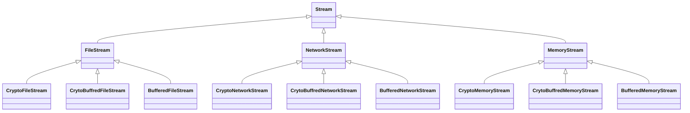
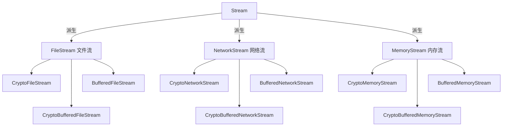
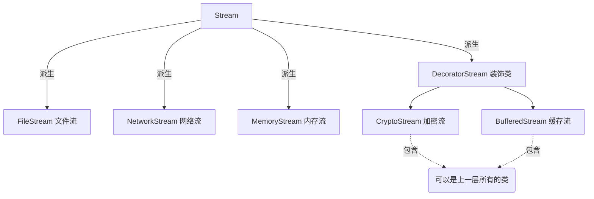
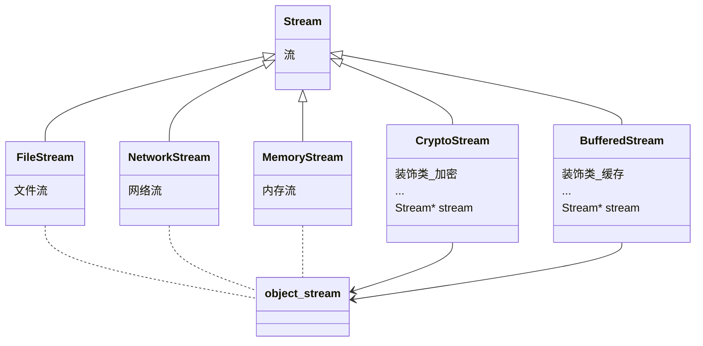
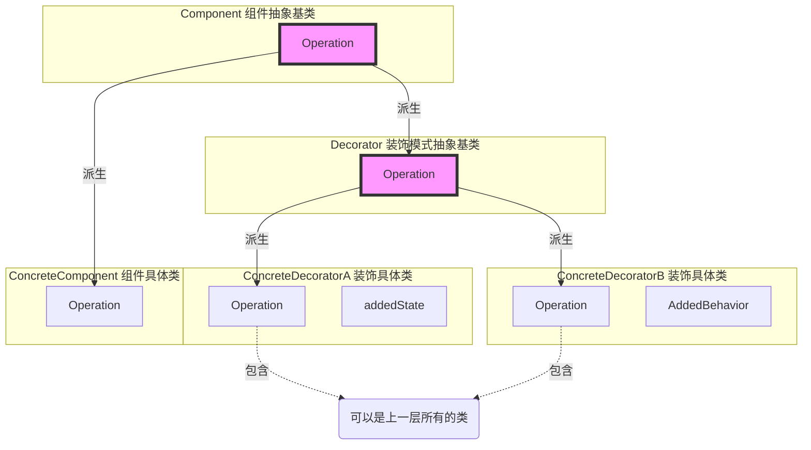
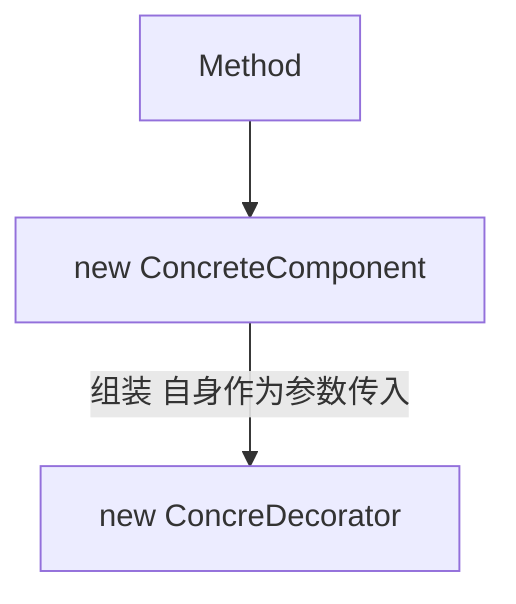

# 装饰模式 Decorator

极简一句话：

- ~~策略模式：类A包含一个多态基类B指针（例如：订单业务类A包含一个国家税收多态类B指针）~~
- 装饰模式：多态基类A包含另一多态基类B指针（例如：**业务**多态类A包含一个**业务**多态类B指针）（策略模式Super版，桥接模式同祖先版）
- ~~桥接模式：多态基类A包含另一多态基类B指针（例如：**业务**多态类A包含一个**平台**多态类B指针）（策略模式Super版，装饰模式不同祖先版）~~

## 所属分类——“单一职责” 模式

- “单一职责” 模式
  - 在软件组件的设计中，如果责任划分的不清晰，使用继承得到的结果往往是随着需求的变化，**子类急剧膨胀**，同时**充斥着重复代码**
    这时候的关键是划清责任
- 典型模式
  - 装饰模式 Decorator
  - 桥模式 Bridge

## 动机（Motivation）

### 简概

- 在某些情况下我们可能会 **“过度地使用继承来扩展对象的功能”** ，由于继承为类型引入的**静态特质**，使得这种扩展方式缺乏灵活性；
  并且随着子类的增多（扩展功能的增多），各种子类的组合（扩展功能的组合）会导致更多子类的膨胀。
- 如何使 “对象功能的扩展" 能够根据需要来动态地实现？
  同时避免 “扩展功能的增多" 带来的子类膨胀问题？
  从而使得任何 ”功能扩展变化" 所导致的影响将为最低？

### 核心：继承变组合，n*m变n+m

### 代码体现

需求：在流操作的基础上增加加密操作

#### 举例 - 写法1

原代码 - 流的读写

```c++
// 业务操作
class stream{							// 抽象基类
public:
	virtual char Read( int number)=0;
    virtual void Seek( int position)=0;
    virtual void Write( char data)=0;
    
	virtual ~Stream(){}
};

// 主体类
class FileStream: public Stream{
public:
	virtual char Read( int number){
		//读文件流
	}
	virtual void Seek(int position){
		//定位文件流
	}
	virtual void Write( char data){
		//写文件流
	}
};

class NetworkStream : public stream{
public:
	virtual char Read( int number){
		//读网络流
	}
	virtual void Seek( int position){
		//定位网络流
	}
	virtual void Write( char data){
		//写网络流
	}
};

class MemoryStream :public Stream{
public:
	virtual char Read ( int number){
		//读内存流
	}
	virtual void Seek( int position){
		//定位内存流
	}
	virtual void write( char data){
		//写内存流
	}
};
```

加密扩展

```c++
// 扩展操作（加密扩展）
class CryptoFilestream :public FileStream{
public:
	virtual char Read(int number){
		//额外的加密操作...
		Filestream::Read(number) ;		// 读文件流
	}
	virtual void Seek(int position){
		//额外的加密操作...
		Filestream::Seek(position);		// 定位文件流
        //额外的加密操作...
	}
	virtual void write(byte data){
		//额外的加密操作...
		Filestream::Write(data);		// 写文件流
        //额外的加密操作...
	}
};

class CryptoNetworkStream :public NetworkStream{
public:
	virtual char Read(int number){
		//额外的加密操作...
		NetworkStream::Read(number);	// 读网络流
	}
	virtual void Seek( int position){
		//额外的加密操作...
		NetworkStream::Seek(position);	// 定位网络流
        //额外的加密操作...
	}
	virtual void Write( byte data){
		//额外的加密操作...
		NetworkStream::Write(data);		// 写网络流
        //额外的加密操作...
	}
};

class CryptoMemoryStream :public MemoryStream{
public:
	virtual char Read(int number){
		//额外的加密操作...
		MemoryStream::Read(number);		// 读内存流
	}
	virtual void Seek(int position){
		//额外的加密操作...
		MemoryStream::Seek(position);	// 定位内存流
        //额外的加密操作...
	}
	virtual void Write(byte data){
		//额外的加密操作...
		MemoryStream::Write(data);		// 写内存流
        //额外的加密操作...
	}
};
```

缓冲扩展

```c++
class BufferedFilestream : public Filestream{
	//...
};
class BufferedNetworkStream : public NetworkStream{
	//...
};
class BufferedMemoryStream : public MemoryStream{
	//...
};
```

可能还有加密缓冲的扩展等等

运行时代码

```c++
void Process( ){			// 编译时装配
	CryptoFilestream *fs1 = new CryptoFilestream( );				// 加密文件流
    BufferedFileStream*fs2 = new BufferedFileStream( );				// 缓存文件流
	cryptoBufferedFileStream *fs3 =new CryptoBufferedFileStream( );	// 加密缓存文件流
}
```

#### 分析 - 写法1

继承树



旧



分析，存在的问题

- 写法一会导致子类方法变得非常多（这里是$3*(C_2^1+C_2^2)$），类的个数为$1+n+m*\frac{m!}{2}$
- 而且非常多的代码重复、冗余
- 而且加密和缓存扩展不是一种非常is-a的操作，应该是一种装饰，可以不继承

#### 举例 - 写法2

原代码 - 流的读写

[略]

加密扩展

```c++
// 扩展操作（加密扩展）
class CryptoStream:public Stream{
    
    Stream* stream;//...					// 【修改】放弃继承，而用组合。且不声明为子类指针，而是多态指针
        
public:
    Cryptostream(Stream* stm):stream(stm){}	// 【修改】构造器
	virtual char Read(int number){
		//额外的加密操作...
		stream->Read(number);		// 读文件流
	}
	virtual void Seek(int position){
		//额外的加密操作...
		stream->Seek(position);		// 定位文件流
        //额外的加密操作...
	}
	virtual void write(byte data){
		//额外的加密操作...
		stream->Write(data);		// 写文件流
        //额外的加密操作...
	}
};
```

缓冲扩展

```c++
class BufferedStream:public Stream{
    Stream* stream;//...					// 【修改】放弃继承，而用组合。且不声明为子类指针，而是多态指针
	//...
};
```

运行时代码

```c++
void Process( ){							// 【修改】编译时装配变为运行时装配
	CryptoFilestream *fs1 = new CryptoFilestream( );
    BufferedFileStream*fs2 = new BufferedFileStream( );
	cryptoBufferedFileStream *fs3 =new CryptoBufferedFileStream( );
    
    FileStream* s1 = new FileStream();				// 文件流
    CrypotoStream* s2 = new CrypotoStream(s1);		// 加密文件流（这里传入s1，让CrypotoStream中的Stream*指针变为FileStream*）
    BufferedStream* s3 = new BufferedStream(s1);	// 缓存文件流
    BufferedStream* s4 = new BufferedStream(s2);	// 加密缓存文件流
}
```

#### 分析 - 写法2

继承树



分析

- 遵循了设计原则——合成复用原则（优先使用对象组合而不是类继承）
- 这种写法类的个数为$1+n+1+m$，而不会去创建一大堆子类
- 通过组合装配可以实现不同的效果

重构思路

- (1) 先把继承A变为包含指针A。然后找到两组不同的地方——包含的指针类型不同
- (2) 把包含指针A变为其父类的指针ParentA，即变为多态
  - 让三个三种流的声明指针在编译时一样、在运行时不一样（多态指针）
- (3) 运行时通过组合的方式装配起来！！！妙啊
- (4) 最后再深入改善，弄个中间的装饰类来放`Stream* stream;`这段代码，让CryptoStream和BufferedStream继承这个中间类
  - 马丁福勒：如果类的多个派生类中有同样的字段，那就要在中间再弄一个中间类来放这些相同的代码

## 设计模式

### 模式定义

> 动态（组合）地给一个对象增加一些额外的职责。就增加功能而言，**Decorator模式**比生成子类（继承）更为灵活**（消除重复代码&减少子类个数）**。
>
> ——《设计模式》GoF

组合优于继承的典型体现

### 结构（Structure）

> #### 新

> 装饰类和正常派生类都继承Stream的原因：
>
> 装饰类加工完正常派生类后，依然是派生类的类型，不会改变对象的类型
>
> 这也是装饰模式和桥接模式的一大重要区别



> #### 旧

（红色表示稳定）



运行代码：进行动态组装



### 结合代码

使用装饰模式时代码的典型特征

- 典型特征1

  ```c++
  DecoratorStream: public Stream{	// 继承Stream的同时	（is-a）
  protected:
  	Stream* stream;    			// 又包含Stream	（has-a）
  }
  ```

- 典型特征2（通过外部接口可以看得出来）

  ```c++
  class CryptoStream: public DecoratorStream{			// 其父类
  public:
      CryptoStream(Stream* stm):DecoratorStream(stm){	// 和构造器参数是同一个父子类关系
          
      }
  }
  ```

### 要点总结

- 通过采用组合而非继承的手法，Decorator模式实现了在运行时动态扩展对象功能的能力，而且可以根据需要扩展多个功能
  避免了使用继承带来的 “灵活性差” 和 “多子类衍生问题”
- Decorator类在**接口上**表现为       is-a Component的**继承**关系，即**Decorator类继承了Component类**所具有的接口
  Decorator类在**实现上**又表现为has-a Component的**组合**关系，即**Decorator类又使用了另外一个Component类**
- Decorator模式的目的并非解决 “多子类衍生的多继承” 问题，
  Decorator模式应用的要点在于解决 **“主体类在多个方向上的扩展功能”**——是为 “装饰” 的含义

### 个人体会

- 主体操作和扩展操作要分开分支继承


