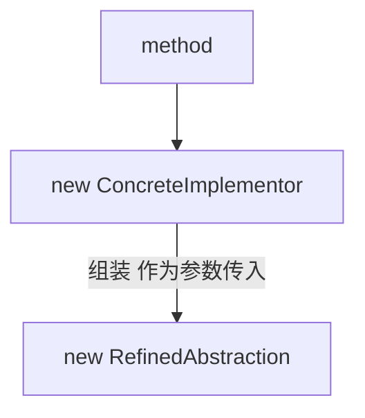
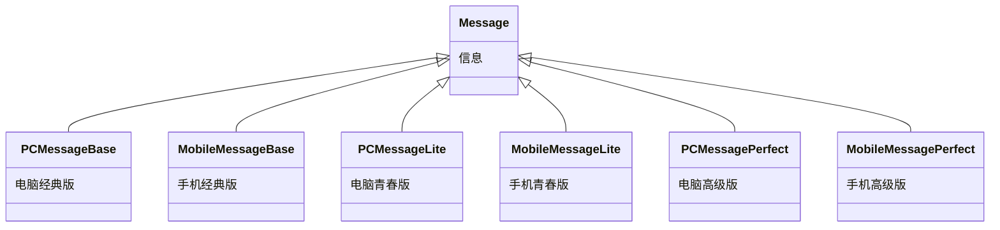
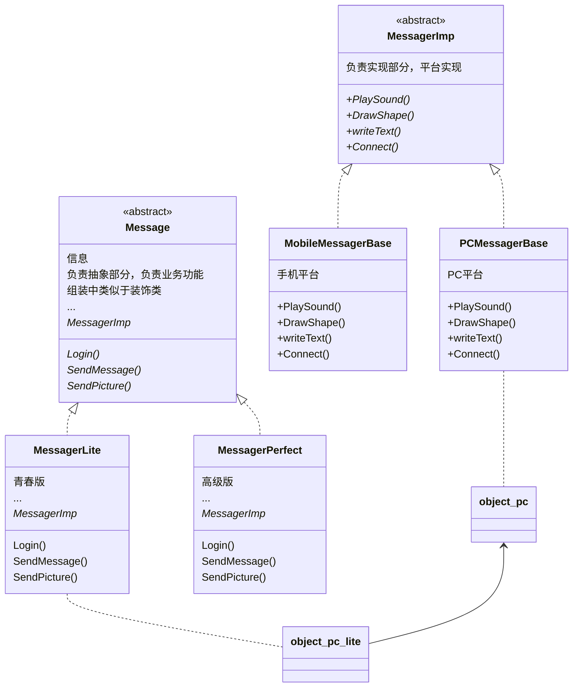
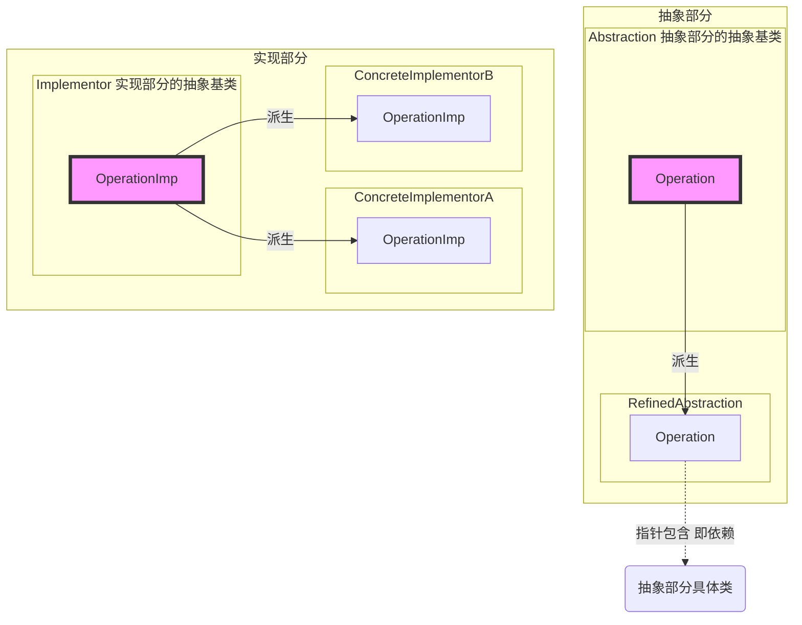

# 桥接模式 Bridge

- 极简一句话：
  - ~~策略模式：类A包含一个多态基类B指针（例如：订单业务类A包含一个国家税收多态类B指针）~~
  - ~~装饰模式：多态基类A包含另一多态基类B指针（例如：**业务**多态类A包含一个**业务**多态类B指针）（策略模式Super版，桥接模式同祖先版）~~
  - 桥接模式：多态基类A包含另一多态基类B指针（例如：**业务**多态类A包含一个**平台**多态类B指针）（策略模式Super版，装饰模式不同祖先版）

“桥接模式”，有时也翻译成 “桥模式”

## 所属分类——“单一职责” 模式

略

## 动机（Motivation）

### 简概

- 由于某些类型的固有的实现逻辑，使得它们具有两个变化的维度，乃至**多个纬度的变化**
- 如何应对这种 “多维度的变化" ？如何利用面向对象技术来使得类型可以轻松地沿着两个乃至多个方向变化，而不引入额外的复杂度？

### 核心：继承变组合，n*m变n+m

### 代码体现

通信模块，该模块可能在不同的平台（PC、Android、苹果）上有不同的体现

#### 举例 - 写法1

库类代码

```c++
class Messager{											// 信息，方法同时实现平台差异和通用功能，不符合单一职责原则
public:
	virtual void Login(string username,string password )=0;
    virtual void SendMessage(string message)=0;
	virtual void SendPicture( Image image)=0;
	
    virtual void PlaySound( )=0;
	virtual void DrawShape( )=0;
    virtual void writeText( )=0;
    virtual void Connect()=0;
    
    virtual ~Messager(){}
};

// 平台实现
class PCMessagerBase : public Messager{					// PC平台上
public:
	virtual void PlaySound(){
		//...
	}
    virtual void DrawShape(){
        //...
    }
    virtual void WriteText(){
        //...
    }
    virtual void Connect(){
        //...
    }
};

class MobileMessagerBase : public Messager{				// 手机平台上
public:
	virtual void PlaySound(){
		//...
	}
    virtual void DrawShape(){
        //...
    }
    virtual void WriteText(){
        //...
    }
    virtual void Connect(){
        //...
    }
}

// 业务抽象
class PCMessagerLite : public PCMessagerBase {			// PC平台 - 经典版
public:
	virtual void Login(string username, string password){
		PCMessagerBase::Connect();
		//...
	}
	virtual void SendMessage(string message){
		PCMessagerBase::writeText();
		//...
	}
	virtual void SendPicture(Image image){
		PCMessagerBase::DrawShape();
		//...
	}
};

class PCMessagerPerfect : public PCMessagerBase {		// PC平台 - 高级版
public:
	virtual void Login(string username, string password){
        PCMessagerBase::PlaySound();
        //***
		PCMessagerBase::Connect();
		//...
	}
	virtual void SendMessage(string message){
        PCMessagerBase::PlaySound();
        //***
		PCMessagerBase::writeText();
		//...
	}
	virtual void SendPicture(Image image){
        PCMessagerBase::PlaySound();
        //***
		PCMessagerBase::DrawShape();
		//...
	}
};

class MobileMessagerLite : public MobileMessagerBase {	// 手机平台 - 经典版
public:
	virtual void Login(string username, string password){
		MobileMessagerBase::Connect();
		//...
	}
	virtual void SendMessage(string message){
		MobileMessagerBase::writeText();
		//...
	}
	virtual void SendPicture(Image image){
		MobileMessagerBase::DrawShape();
		//...
	}
};

class MobileMessagerPerfect : public MobileMessagerBase {// 手机平台 - 高级版
	//...
};

```

实现代码装配

```c++
void Process(){//编译时装配
    Messager *m = new MobileMessagerPerfect();
}
```

#### 分析 - 写法1

分析，存在的问题

- 和装饰模式写法1的那个例程一样，都是子类数量非常多，这里的数量为$1+n+m*n$
- Message方法同时实现平台差异和通用功能，不符合单一职责原则

#### 举例 - 写法2

库类代码

```c++
class Messager{													// 信息【修改】修改仅实现通用功能而不参与平台实现
public:
	virtual void Login(string username,string password )=0;
    virtual void SendMessage(string message)=0;
	virtual void SendPicture( Image image)=0;
    
    virtual ~Messager(){}
};

class MessagerImp{												//【新增】平台实现。分离原Messager的职责
public:
    virtual void PlaySound( )=0;
	virtual void DrawShape( )=0;
    virtual void writeText( )=0;
    virtual void Connect()=0;
    
    virtual ~MessagerImp(){}
}

// 平台抽象
class PCMessagerBase : public MessagerImp{				// PC平台上，【修改】改为继承Imp类
public:
	virtual void PlaySound(){
		//...
	}
    virtual void DrawShape(){
        //...
    }
    virtual void WriteText(){
        //...
    }
    virtual void Connect(){
        //...
    }
};

class MobileMessagerBase : public MessagerImp{			// 手机平台上，【修改】改为继承Imp类
public:
	virtual void PlaySound(){
		//...
	}
    virtual void DrawShape(){
        //...
    }
    virtual void WriteText(){
        //...
    }
    virtual void Connect(){
        //...
    }
}

// 业务抽象
class MessagerLite : public Messager{					// 通用平台 - 经典版
    MessagerImp* messagerImp;										// 【修改】把*部分*继承变为包含，然后变为基类的多态指针
public:
	virtual void Login(string username, string password){
		messagerImp->Connect();
		//...
	}
	virtual void SendMessage(string message){
		messagerImp->writeText();
		//...
	}
	virtual void SendPicture(Image image){
		messagerImp->DrawShape();
		//...
	}
};

class MessagerPerfect : public Messager{					// 通用平台 - 高级版
    PCMessagerImp* messagerImp;										// 【修改】把*部分*继承变为包含，然后变为基类的多态指针
public:
	virtual void Login(string username, string password){
        messagerImp->PlaySound();
        //***
		messagerImp->Connect();
		//...
	}
	virtual void SendMessage(string message){
        messagerImp->PlaySound();
        //***
		messagerImp->writeText();
		//...
	}
	virtual void SendPicture(Image image){
        messagerImp->PlaySound();
        //***
		messagerImp->DrawShape();
		//...
	}
};
```

实现代码装配

```c++
void Process(){//动态组合装配，这里装配的是：PC平台 + 
    MessagerImp *mImp = new PCMessagerImp();	// PC平台实现
    Messager *m = new Messager(mImp);
}
```

#### 分析 - 写法2

代码结构

- 运行代码：进行动态组装




分析

- 子类数量减少，类的数量为$1+n+m$，而运行时仍然有$n*m$的功能多样性
- 将继承实现分为了平台抽象和业务抽象，这是两个不同的变化方向。代码中业务抽象的实现has-a包含平台抽象

重构思路

- (1) 先把继承A变为包含指针A。然后找到两组不同的地方——包含的指针类型不同
- (2) 把包含指针A变为其父类的指针ParentA，即变为多态
- (3) 对原基类进行职责分离
- (4) 最后再深入改善，提取派生类的共同点
  - 马丁福勒：如果类的多个派生类中有同样的字段，那就要在中间再弄一个中间类来放这些相同的代码

## 设计模式

### 模式定义

> 将抽象部分（业务功能）与实现部分（平台实现）分离，使它们都可以独立地变化
>
> ——《设计模式》GoF

个人的话：

通过聚合，既保证了平台与应用两者的独立变化，同时又保证了两者之间的包含关系。

聚合像桥梁一样将两者连接到一块，所以这种设计模式又叫做**桥接模式**

### 结构（Structure）

> #### 新

原写法



改写后



> #### 旧

（红色表示稳定）

其中Implementor与Abstraction之间的关系为桥接




### 要点总结

- Bridge模式使用 “对象间的组合关系" 解耦了抽象和实现之间固有的绑定关系，使得抽象和实现可以沿着各自的维度来变化。
  所谓抽象和实现沿着各自纬度的变化，即 “子类化” 它们
- Bridge模式有时候类似于多继承方案，但是**多继承方案往往违背单一职责原则（即一个类只有一个变化的原因）**，复用性比较差。
  Bridge模式是比多继承方案更好的解决方法。
- Bridge模式的应用一般在 “两个非常强的变化维度”，有时一个类也有多于两个的变化维度，这时可以使用Bridge的扩展模式

### 个人体会

#### 是抽象部分（Abstraction）还是实现部分（Implementor）

> 对Window子类的所有操作都是用WindowImp接口中的抽象操作实现的。
> 这就将**窗口的抽象**与**系统平台相关的实现**部分分离开来。
> 因此，我们将Window与WindowImp之间的关系称之为桥接，因为它在抽象类与它的实现之间起到了桥梁作用，使它们可以独立地变化。
>
> ——《设计模式：可复用面向对象软件的基础》

---

Q：桥接（Bridge）是用于把抽象化与实现化解耦。那应选取哪个部分为抽象部分、选取那个部分为实现部分？

A：new后是抽象的为实现部分？我怎么感觉结构反过来了？

- ~~我本来的理解是
  Abstraction中（平台）包含Implementor（应用）指针，和https://blog.csdn.net/qq_35423154/article/details/111085839差不多
  感觉上是 “抽象”：平台，以及 “实现”：软件
  **应用可以不依赖平台单独存在**~~
- 而李老讲的和《设计模式：可复用面向对象软件的基础》中的是
  Abstraction中（软件）包含Implementor（平台）指针
  但在例程中，平台实现属于具体实现部分，而业务功能属于抽象部分
  平台可以不装应用来单独存在

#### 包含还是继承

桥接模式中

- 实现部分（平台）被继承（is-a），可脱离抽象部分（应用）独立存在
- 抽象部分（应用）被包含（has-a），不可脱离实现部分（平台）独立存在

在例子装饰模式中也是同理

- 主体部分，其基类被继承，可脱离装饰部分独立存在
- 装饰部分，其基类被包含，不可脱离主体部分独立存在

#### 【对比】Decorator与Bridge（使用上区分）

参考：[【CSDN】桥接模式和装饰者模式的区别及理解](https://blog.csdn.net/qq_45570838/article/details/110430680)

感觉Bridge模式和Decorator模式非常相像

- 共同点：都属于 “单一职责” 模式，都能划清职责并解决类爆炸问题。都用到了组合
- 桥接模式：？？？（看不懂参考里说的什么意思）
- 装饰模式：？？？（看不懂参考里说的什么意思）

---

个人的感觉是

- 共同点：都属于 “单一职责” 模式，都能划清职责并解决类爆炸问题。都用到了组合
- 装饰模式
  装配的两个部分是同一个祖先
  侧重是在库类的基础上使用组合而不是继承进行**扩展**
- 桥接模式
  装配的两个部分不是同一祖先
  侧重在设计库类时将实现部分与抽象部分分离开使两者能分别独立地**变化**、使用时再将他们通过继承+组合的方式结合起来

#### 【对比】Decorator与Bridge（代码上）

从代码角度区分

使用装饰模式时代码的典型特征

- 典型特征1

  ```c++
  DecoratorStream: public Stream{	// 继承Stream的同时	（is-a）
  protected:
  	Stream* stream;    			// 又包含Stream	（has-a）
  }
  ```

- 典型特征2（通过外部接口可以看得出来）

  ```c++
  class CryptoStream: public DecoratorStream{			// 其父类
  public:
      CryptoStream(Stream* stm):DecoratorStream(stm){	// 和构造器参数是同一个父子类关系
          
      }
  }
  ```

代码区分

- 典型特征1比较
  - 装饰模式：继承主体操作部分而包含装饰部分，两部分的祖先是相同的。代码体现为继承某类的同时又包含同一个类
  - 桥接模式：继承实现部分而包含抽象部分，两部分的祖先是不相同的


