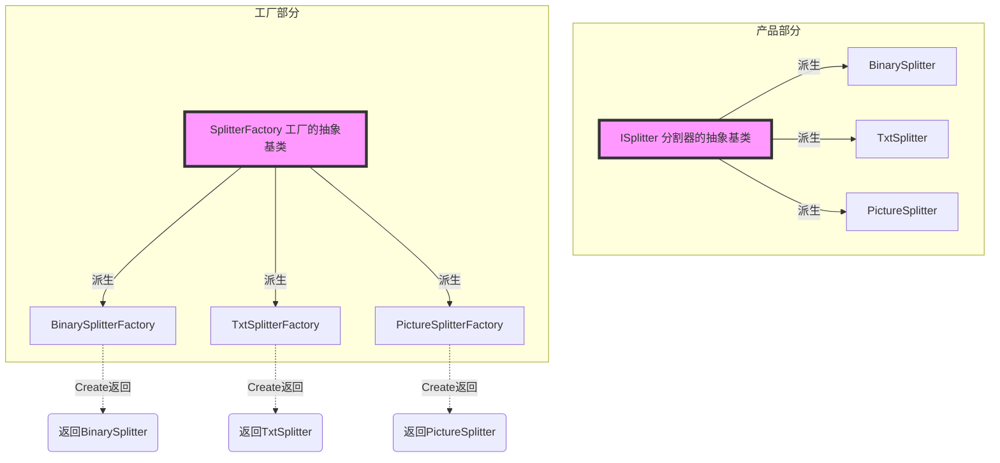
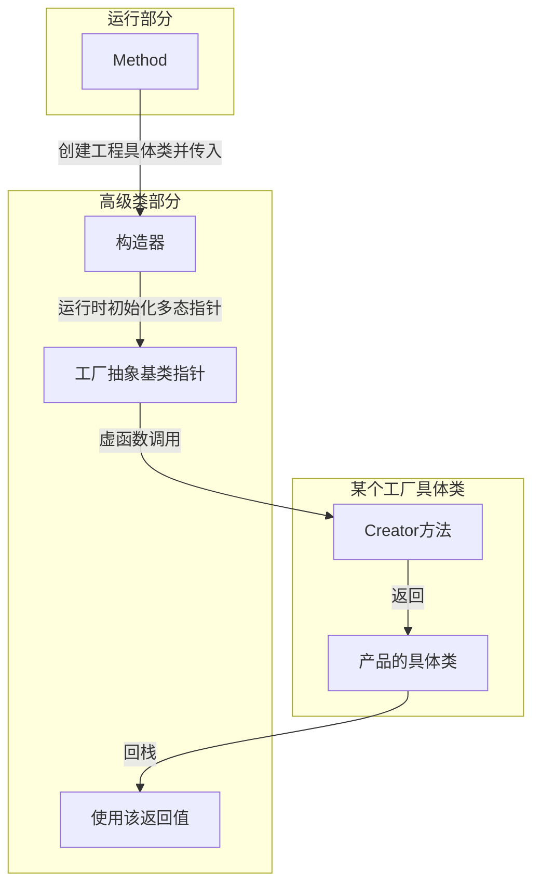
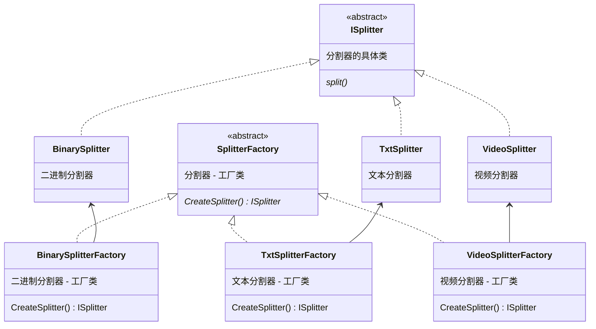
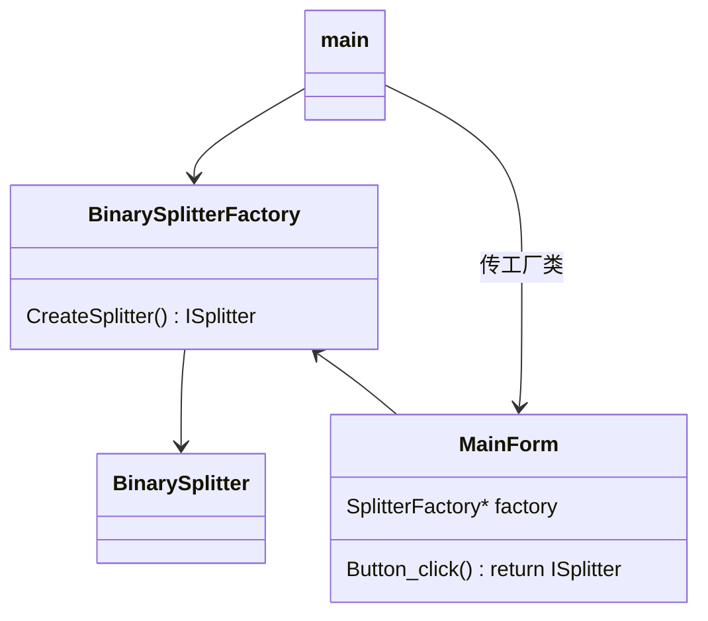
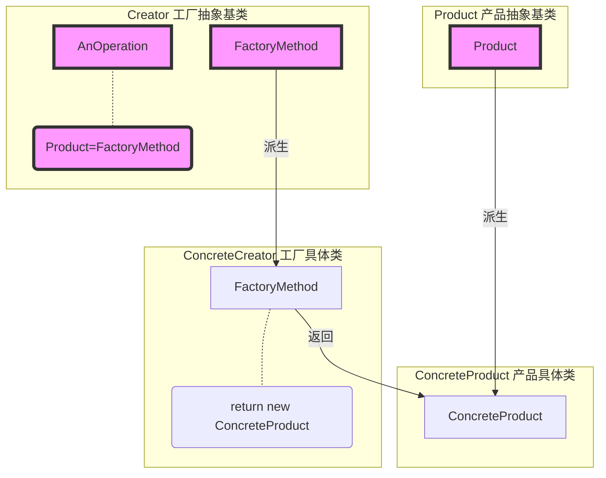

# 工厂模式 Factory Method

全程 `工厂方法模式`，有时简称 `工厂方法`，有时简称 `工厂模式`

## 所属分类——“对象创建” 模式

- “对象创建” 模式
  - 通过 “对象创建” 模式绕开new，来避免对象创建（new）过程中所导致的紧耦合（依赖具体类），从而支持对象创建的稳定。
    它是接口抽象之后的第一步工作。
- 典型模式
  - 工厂模式 Factory Method
  - 抽象工厂 Abstract Factory
  - 原型模式 Prototype
  - 构建器 Builder

## 动机（Motivation）

### 简概

- 在软件系统中，经常面临着创建对象的工作；由于需求的变化，需要创建的对象的具体类型经常变化
- 如何应对这种变化？如何绕过常规的对象创建方法（new），提供一种 “封装机制" 来避免客户程序和这种 “具体对象创建工作" 的紧耦合？

### 核心：对象的晚创建，原来的早创建对象由工厂类进行代替

### 代码体现

还是文件分割器

考虑时间线：假设现在只支持二进制分割、以后支持文本分割、图片分割等

#### 举例 - 写法1

低层的具体类代码

```c++
class FileSplitter
{
public:
	void split( ){
		//...
	}
};

class TxtSplitter{
    
};

class PictureSplitter{
    
};

class VideoSplitter{
    
};
```

高层类代码

```c++
class MainForm : public Form
{   
public:
	void Button1_click(){
		string filePath = txtFilePath->getText();
		int number = atoi(txtFileNumber->getText().c_str());
	
        FileSplitter* splitter=new FileSplitter(filePath,number);	// 【缺陷】声明成具体类
		splitter->split();
	}
};
```

#### 分析 - 写法1

声明成具体类就意味着不支持未来的变化、定死了

#### 举例 - 写法2

低层的抽象基类（分割器与工厂）【新增】

```c++
/* 分割器的抽象基类 */
class ISplitter{													// 【新增】定义抽象基类，其他类继承此类
public:
    virtual void split()=0;
    virtual ~ISplitter(){}
};

/* 【抽象基类】定义工厂类 */
class SplitterFactory{												// 【新增】工厂类的抽象基类
public:
    /*ISplitter CreateSplitter(){									// 不行，间接依赖还是会依赖了具体类
        return new ISplitter();
    }*/
    virtual ISplitter CreateSplitter()=0; // 作用返回具体类
    virtual ~SplitterFactory(){}
};
```

低层的具体类（分割器与工厂）

```C++
/* 具体分割器 */
class BinarySplitter : public ISplitter
{
public:
	void split( ){
		//...
	}
};

class TxtSplitter : public ISplitter{
    
};

class PictureSplitter : public ISplitter{
    
};

class VideoSplitter : public ISplitter{
    
};

/* 具体工厂	*/
class BinarySplitterFactory: public SplitterFactory{				// 【新增】工厂类的具体类
public:
    virtual ISplitter* CreateSplitter(){
        return new BinarySplitter();
    }
}

class TxtSplitterFactory: public SplitterFactory{
public:
    virtual ISplitter* CreateSplitter(){
        return new TxtSplitter();
    }
}

class PictureSplitterFactory: public SplitterFactory{
public:
    virtual ISplitter* CreateSplitter(){
        return new PictureSplitter();
    }
}

class VideoSplitterFactory: public SplitterFactory{
public:
    virtual ISplitter* CreateSplitter(){
        return new VideoSplitter();
    }
}
```

高层类代码

```c++
class MainForm : public Form
{
    SplitterFactory* factory;										//【新增】工厂模式抽象基类（多态指针）
public:
    MainForm(SplitterFactory* factory){								// 【修改】构造函数传入工厂模式的具体类来动态指定多态指针
        this->factory=factory;
    }
    
	void Button1_click(){
		string filePath = txtFilePath->getText();
		int number = atoi(txtFileNumber->getText().c_str());
        // FileSplitter* splitter=new FileSplitter(filePath,number);// 原写法，声明成具体类，不行
        // ISplitter* splitter=new BinarySplitter(filePath,number);	// 这种写法后面还是依赖了具体类
        // ISplitter* splitter=new ISplitter();						// 也不行
        // ISplitter splitter();									// 也不行
        ISplitter* splitter = factory->CreateSplitter();			//【修改】多态new，面向接口编程，用方法来返回对象
		splitter->split();
	}
};
```

#### 分析 - 写法2

（红色表示稳定）

代码结构



运行时



`面向接口编程`的一个显著特点是变量声明为抽象基类，写法2符合这一点，而且符合了`依赖倒置原则`——依赖抽象而不是实现细节

而且绕过了new方式以避开对具体类的依赖

==Q==：为什么运行函数不直接传入Splitter进高层模块里

## 设计模式

### 模式定义

> 定义一个用于创建对象的接口，让子类决定实例化哪一个类。
> Factory Method使得一个类的实例化延迟（目的：解耦，手段︰虚函数）到子类。
>
> ——《设计模式》GoF

### 结构（Structure）

> #### 新

原写法


修改后



使用时

> 这个例子其实比较难说明使用的意义，
>
> 只能说用BinarySplitterFactory代替BinarySplitter，使得BinarySplitter的创建由在main中延迟到了在MainForm中
>
> 使用场景有点类似于Web图片的懒加载、插件本体的慢加载等



> #### 旧

（红色表示稳定）



### 结合代码

- Product相当于例程的ISplitter，ConcreteProduct相当于例程的BinarySplitter等类
- Creator相当于例程的SplitterFactory，ConcreteCreaotr相当于例程的SplitterFactory等类

### 要点总结

- Factory Method模式用于**隔离类对象的使用者和具体类型**之间的耦合关系。面对一个经常变化的具体类型，紧耦合关系（new）会导致软件的脆弱
- Factory Method模式通过面向对象的手法，将所要创建的具体对象工作**延迟**到子类，从而实现一种**扩展**（而非更改）的策略，较好地解决了这种紧耦合关系
- Factory Method模式解决 “单个对象” 的需求变化。缺点在于要求创建方法/参数相同


