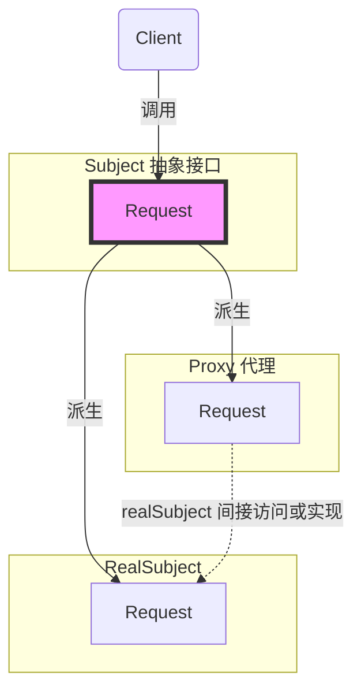

# 《C++设计模式》视频_李建忠

# 目录

[toc]

# 代理模式 Proxy

## 所属分类——“接口隔离” 模式

略

## 动机（Motivation）

### 简概

- 在面向对象系统中，有些对象由于某种原因（比如对象创建的开销很大，或者某些操作需要安全控制，或者需要进程外的访问等），直接访问会给使用者、或者系统结构带来很多麻烦。
- 如何在不失去**透明操作**对象的同时来**管理/控制**这些对象特有的复杂性？增加一层**间接层**是软件开发中常见的解决方式

### 代码体现

#### 举例 - 写法1

client.cpp

```c++
class ISubject{
public:
    virtual void process();
}

class RealSubject: public ISubject{
public:
    virtual void process(){
        //...
    }
};

class ClientApp{
    ISubject* subject;
public:
    ClientApp(){
        subject = new RealSubject();	// 假设这里是通过工厂模式等方法返回
    }
    void DoTask(){
        //...
        subject->process();
    }
}
```

#### 分析 - 写法1

有时候可能会拿不到RealSubject对象或不方便**直接**使用RealSubject对象

#### 举例 - 写法2（代理模式）

client.cpp

```c++
//不变
```

proxy.cpp【新增】

（有时这个cpp可能会通过一些框架中的工具自动生成，手动写可能会比较麻烦）

```c++
class ISubject{
public:
    virtual void process();
}

// Proxy的设计（设计有时会比较复杂，所以有时是通过一些工具来生成）
class SubjectProxy: public ISubject{	// 【修改】代理类，RealSubject替换为SubjectProxy类
public:
    virtual void process(){
        //对RealSubject的一种间接访问
    }
};

class ClientApp{
    ISubject* subject;
public:
    ClientApp(){
        subject = new RealSubject();	// 通过工厂模式等方法
    }
    void DoTask(){
        //...
        subject->process();
    }
}
```

## 设计模式

### 模式定义

> 为其他对象提供—种代理以**控制（隔离，使用接口）**对这个对象的访问。
>
> ——《设计模式》GoF

### 结构（Structure）

（红色表示稳定）



解析

这里如果不能直接访问RealSubject，可以访问代理，由代理对象这个间接层来间接访问RealSubject

代理对象和RealSubject对继承自同一个接口，使客户端在使用时有一致性

### 要点总结

- “增加一层间接层" 是软件系统中对许多复杂问题的一种常见解决方法。
  在面向对象系统中，**直接使用某些对象会带来很多问题**，**作为间接层的proxy对象**便是解决这一问题的常用手段
- 具体proxy设计模式的实现方法、实现粒度都**相差很大**，
  有些可能对单个对象做细粒度的控制，如copy-on-write技术，
  有些可能对组件模块提供抽象代理层,在架构层次对对象做proxy
- Proxy并不一定要求保持接口完整的一致性，只要能够实现间接控制，有时候损及一些透明性是可以接受的


## 多种语言中的代理模式（GPT）

代理（Proxy）是一种设计模式，用于在访问对象时引入一个替代对象，称为代理对象。
代理模式可以用于多种目的，如：

-   访问控制
-   性能优化
-   远程访问
-   等

### 使用场景

代理模式的理念是通过引入一个替代对象（代理对象）来控制对实际对象的访问。它主要用于以下场景：

1.  访问控制：当需要控制对某个对象的访问权限时，可以使用代理模式。例如，在一个文件系统中，代理可以用于控制对特定文件的读取、写入和删除权限。
2.  虚拟代理：当创建一个对象需要大量资源（如内存、计算能力）时，可以使用虚拟代理。虚拟代理可以延迟对象的创建，直到实际需要时才创建对象。例如，一个图片查看器程序可以使用虚拟代理来延迟加载高清图片，以提高初始加载速度。
3.  缓存代理：当需要缓存对象的结果以提高性能时，可以使用代理模式。例如，一个Web代理服务器可以缓存请求的网页，从而减少对原始服务器的负载。
4.  远程代理：当需要在不同的地址空间（例如，不同的计算机或进程）上访问对象时，可以使用代理模式。例如，Java RMI（远程方法调用）使用代理模式来让客户端在本地调用远程对象的方法。
5.  保护代理：当需要对一个对象添加额外的保护或验证逻辑时，可以使用代理模式。例如，在一个电子商务网站中，代理可以用于验证用户的信用卡信息，以确保交易安全。

通俗的使用场景：

1.  视频网站：在一些视频网站中，可能会有一个视频对象，但是在访问这个视频之前，需要先检查用户是否具有观看权限。在这种情况下，可以使用代理模式来实现访问控制。
2.  数据库查询：在执行数据库查询时，可以使用代理模式来缓存查询结果。当相同的查询再次执行时，代理可以直接返回缓存的结果，而不需要实际执行查询。
3.  网络请求：在发送网络请求时，可以使用代理服务器来转发请求。代理服务器可以对请求进行缓存、负载均衡和安全检查等操作。
4.  图片懒加载：在一个图库应用中，可以使用代理模式来实现图片的懒加载。代理对象可以在用户滚动到图片时，才真正地加载图片资源，从而提高应用的加载速度和性能。
5.  API限流：在访问第三方API时，可以使用代理模式来限制API的访问速率。代理对象可以通过计数和时间戳来实现限流功能，以确保不超过API的调用限制。

### 不同语言的实现

在不同的编程语言中，Proxy 的实现方式可能会有所不同，但核心概念是相同的。
以下是在 Java、C++、Qt、JavaScript 和 Python 中使用代理的一些例子：

#### Java

在 Java 中，代理模式通常通过接口和实现类来实现。一个常见的用例是创建一个远程接口（Remote Interface），代理对象负责处理远程方法调用的底层细节。例如，Java RMI（远程方法调用）就使用了代理模式。

```java
// 定义接口
public interface Service {
    void doSomething();
}

// 实现类
public class RealService implements Service {
    public void doSomething() {
        System.out.println("Do something in RealService");
    }
}

// 代理类
public class ProxyService implements Service {
    private RealService realService;

    public ProxyService(RealService realService) {
        this.realService = realService;
    }

    public void doSomething() {
        System.out.println("Before calling RealService");
        realService.doSomething();
        System.out.println("After calling RealService");
    }
}

```

#### C++

在 C++ 中，代理模式可以通过抽象基类、继承和组合来实现。一个常见的用例是通过智能指针实现引用计数。

```cpp
// 基类
class IService {
public:
    virtual void doSomething() = 0;
};

// 实现类
class RealService : public IService {
public:
    void doSomething() override {
        std::cout << "Do something in RealService" << std::endl;
    }
};

// 代理类
class ProxyService : public IService {
public:
    ProxyService(RealService* realService) : realService(realService) {}

    void doSomething() override {
        std::cout << "Before calling RealService" << std::endl;
        realService->doSomething();
        std::cout << "After calling RealService" << std::endl;
    }

private:
    RealService* realService;
};

```

#### QT

在 Qt 中，代理模式通常用于处理 Model/View 架构中的数据。QSortFilterProxyModel 类可以用作一个代理模型，用于在不改变原始数据的情况下，对数据进行排序和过滤。

```cpp
QTableView *view = new QTableView;
QStandardItemModel *model = new QStandardItemModel(5, 2);
QSortFilterProxyModel *proxyModel = new QSortFilterProxyModel;

proxyModel->setSourceModel(model);
view->setModel(proxyModel);

```

#### JavaScript

在 JavaScript 中，代理模式可以通过 Proxy 对象实现。
代理对象可以用于拦截并改变底层操作，如属性访问、函数调用等。

```javascript
const realService = {
    doSomething: function() {
        console.log("Do something in RealService");
    }
};

const handler = {
    apply: function

```

#### Vue3

Vue3 也是主要是使用 js的proxy

### get/set 方法

>   我能认为proxy模式是类似于 python 的get/set魔术方法 的一种进阶版本吗

>   虽然代理模式和 Python 的 get/set 魔术方法有一定的相似之处，但它们并不完全相同。
>   代理模式主要关注的是在访问对象时引入一个替代对象（代理对象），这个代理对象可以控制对实际对象的访问，并在需要时执行额外的操作。
>   代理模式具有更广泛的应用范围，可以用于访问控制、性能优化、远程访问等多种场景。
>
>   Python 的 get/set 魔术方法（`__getattr__`、`__setattr__` 等）主要用于自定义属性访问的行为。
>   当访问或修改一个对象的属性时，Python 会自动调用这些魔术方法。这些方法通常用于实现属性的计算、验证和访问控制等功能。
>
>   尽管这些方法可以实现类似代理模式的某些功能，但它们并不能覆盖代理模式的全部用途。
>   所以，你可以将 Python 的 get/set 魔术方法视为一种实现代理模式的方式之一，但它们并不是代理模式的进阶版本。
>   代理模式更关注于抽象层面的设计，而 Python 的 get/set 魔术方法是一种具体的实现手段。


