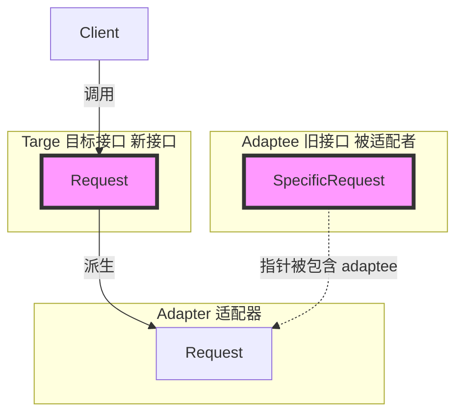

# 《C++设计模式》视频_李建忠

# 目录

[toc]

# 适配器 Adapter

## 所属分类——“接口隔离” 模式

略

## 动机（Motivation）

### 简概

- 在软件系统中，由于**应用环境的变化**，常常需要将 “一些现存的对象" 放在新的环境中应用，但是新环境要求的接口是这些现存对象所不满足的
  （老东西放到新环境中去使用）
- 如何应对这种 “迁移的变化" ？如何既能利用现有对象的良好实现，同时又能满足新的应用环境所要求的接口？

### 应用体现

举例


### 代码体现

#### 举例 - 对象适配器

（注意：需要在两者接口这件有关联、可转换才能写适配器）

```c++
// 目标接口（新接口）
class ITarget{
public:
	virtual void process()=0;
}

// 遗留接口（老接口）
class IAdaptee{
public:
	virtual void foo(int data)=0;
    virtual int bar()=0;
};

// 使用了遗留接口的遗留类
class 0ldclass: public IAdaptee{
	//...
};

// 适配器
class Adapter: public ITarget{					// 继承新接口
protected:
    IAdaptee* pAdaptee;							// 包含老接口
    
public:
    Adapter(IAdaptee* pAdaptee){
        this->pAdaptee=pAdaptee;
    }
    virtual void process() override{			// 重写新接口
        int data=pAdaptee->bar();				// 实现时可以使用旧接口的方法，一般转换过程非常复杂，这里仅用伪代码表示
        pAdaptee->foo(data);
    }
};

// 适配器的使用
int main(){
    IAdaptee* pAdaptee = new OldClass();		// 创建旧类
    
    ITarget* pTarget = new Adapter(pAdaptee);	// 构建适配器对象，这是一个符合新接口而又能访问旧类的对象
    											// 组合方式，即如果还有其他旧类还可以用多态指针
    pTarget->process();							// 调用新接口
}
```

#### 举例 - STL

STL源码中也用到了这种设计模式

```c++
class stack{
    deqeue container;
    //...
}

class queue{
    deqeue container;
    //...
}
```

#### 举例 - 类适配器

```c++
class Adapter: public ITarget, protected IAdaptee{	// 多继承，继承新接口和旧接口。不推荐用类适配器、定死了
    
}
```

## 设计模式

### 模式定义

> 将一个类的**接口转换**成客户希望的另一个接口。
> Adapter模式使得原本由于接口不兼容而不能一起工作的那些类可以一起工作。
>
> ——《设计模式》GoF

### 结构（Structure）

（红色表示稳定）



### 要点总结

- Adapter模式主要应用于 “希望复用一些现存的类，但是接口又与复用环境要求不一致的情况”，
  在遗留代码复用、类库迁移等方面非常有用。
- GoF 23定义了两种Adapter模式的实现结构：**对象适配器和类适配器**。
  但类适配器采用 “多继承" 的实现方式，一般**不推荐**使用。
  对象适配器采用 “对象组合” 的方式，更符合松耦合精神。
- Adapter模式可以实现的非常灵活，不必拘泥于Gof23中定义的两种结构。
  例如，完全可以将Adapter模式中的 “现存对象” 作为新的接口方法参数，来达到适配的目的。

# Java——适配器设计模式

有接口A，里面有很多接口方法没实现

我们写一个实现B**（适配器类）**，对所有的接口方法用空实现，并标记为Abstract

最后用C再去实现接口B，适配器需要用到哪个方法就重写哪个方法


简单来说，就是在实现类和接口之间，加入了第三者


好像和之前笔记的用法不同


