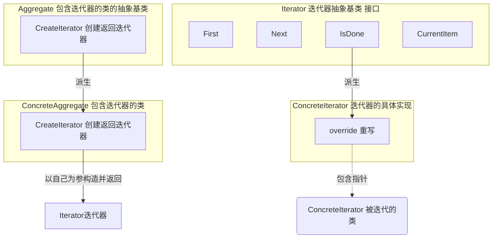

# 《C++设计模式》视频_李建忠

# 目录

[toc]

# 迭代器模式 Iterator

## 所属分类——“数据结构” 模式

略

## 动机（Motivation）

### 简概

- 在软件构建过程中，集合对象内部结构常常变化各异。（列表、链表、树等等）
  但对于这些集合对象，我们希望在**不暴露其内部结构的同时**，可以让外部客户代码透明地访问其中包含的元素；
  同时这种 “透明遍历" 也为 “同一种算法在多种集合对象上进行操作” 提供了可能。
- 使用面向对象技术将这种遍历机制抽象为 “迭代器对象” 为 “应对变化中的集合对象" 提供了一种优雅的方式

### 代码体现

#### 举例 - 迭代器模式的迭代器

==（注意：这种方式用面向对象来实现，**过时**了。现在集合类库里面都有基础方法遍历集合、比如STL）==

```c++
// 迭代器抽象基类
template<typename T>
class Iterator
{
public:
	virtual void first() = 0;			// 第一个车元素
    virtual void next() = 0;			// 下一个元素
	virtual bool isDone() const = 0;	// 是否到头
    virtual T& current() = 0;			// 游标（可能不声明、和next合并）
};

// 需要迭代器的类，返回迭代器
template<typename T>
class Mycollection{
public:
	Iterator<T> GetIterator( ){			// 返回一个迭代器
		//...
	}
};

// 迭代器的实现
template<typename T>
class CollectionIterator : public Iterator<T>
{
    MyCollection<T> mc;										// 包含，会返回迭代器
public:
	collectionIterator(const Mycollection<T> &c): mc(c){}	// 构造函数
    void first () override {
        
	}
	void next() override {
        
    }
	bool isDone() const override{
        
    }
	T& current() override{
        
    }
};

// 运行使用代码
void MyAlgorithm(){
	MyCollection<int> mc;								// 定义一个具有迭代器的对象

    Iterator<int> iter= mc.GetIterator();				// 返回这个对象中的迭代器

    for (iter.first(); !iter.isDone( ); iter.next( )){	// 遍历迭代器
		cout << iter.current( ) << endl;
	}
}
```

## 设计模式

### 模式定义

> 提供一种方法顺序访问一个聚合对象中的各个元素，而又**不暴露**（稳定）该对象的内部表示。
>
> ——《设计模式》GoF

### 结构（Structure）



### 要点总结

- 迭代抽象：访问一个聚合对象的内容而无需暴露它的内部表示
- 迭代多态：为遍历不同的集合结构提供一个统一的接口，从而支持同样的算法在不同的集合结构上进行操作
- 迭代器的健壮性考虑：遍历的同时更改迭代器所在的集合结构，会导致问题

### 个人体会

#### 【对比】迭代器模式和STL库

迭代器模式**有点过时**，因为他最初是用面向对象的方式来实现的。**（迭代器模式会过时、但迭代器思想不会过时）**

而现在泛型编程和STL库的思想和迭代器模式的思想一样，但不是用面向对象而是泛型编程的方式

但除了C++以外还有挺多语言的迭代器实现还是运行时多态

性能对比

- 迭代器模式：运行时多态

  用面向对象的方式实现，用到了**虚函数调用**、性能有损。对于迭代for循环来说这种性能损失就更大了

- STL库：编译时多态

  迭代器用模板来描述、模板虽然也是多态、但实现的是编译时多态，性能损失小

功能对比

- 迭代器模式：只能往后走
- STL库：有多种迭代器，还能往后走，更灵活
  - forward_iterator
  - reverse_iterator
  - bidirectional_iterator
  - random_access_iterator


