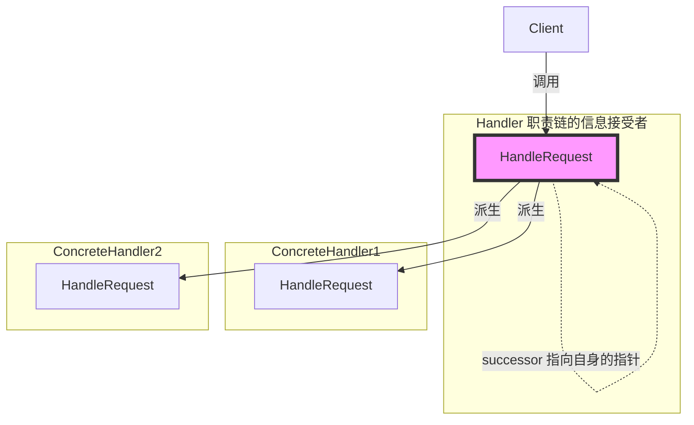

# 《C++设计模式》视频_李建忠

# 目录

[toc]

# 职责链模式 Chain of Responsibility

## 所属分类——“数据结构” 模式

略

## 动机（Motivation）

### 简概

- 在软件构建过程中，一个请求可能被多个对象处理，但是每个请求在运行时只能有一个接受者，如果显式指定，将必不可少地带来请求发送者与接受者的紧耦合
- 如何使**请求的发送者不需要指定具体的接受者**？**让请求的接受者自己在运行时决定来处理**请求，从而使两者解耦

### 代码体现

#### 举例 - 职责链模式

请求类和事件接收类

```c++
#include <iostream>
#include <string>

using namespace std;

// 枚举类型
enum class RequestType{
	REQ_HANDLER1,
    REQ_HANDLER2,
    REQ_HANDLER3
};

// 发送请求的对象
class Reqest{
	string description;
    RequestType reqType;
public:
	Reqest(const string & desc, RequestType type):description(desc), reqType(type){}
    RequestType getReqType() const { return reqType; }
	const string& getDescription() const { return description; }
};

// 事件接收者，抽象基类
class ChainHandler{
	ChainHandler *nextChain;				// 指向自身的指针，多态指针，形成多态链表
	void sendReqestToNextHandler(const Reqest & req)
    {
		if ( nextChain != nullptr)			// 如果链表的下个节点不为空，则让下个节点来处理请求
			nextChain->handle(req) ;
	}
protected:
	virtual bool canHandleRequest(const Reqest & req) = 0;	// 处理请求
    virtual void processRequest(const Reqest & req) = 0;
public:
    ChainHandler() {nextChain = nullptr;}					// 构造时，下个节点为空
    void setNextChain(ChainHandler *next){nextChain=next;}	// 设置下个节点（建立成一个链表）
    void handle(const Reqest & req)
    {
        if (canHandleRequest(req))			// 如果当前对象能处理该请求则处理，否则给下一个节点处理
        	processRequest(req);
        else
			sendReqestToNextHandler(req);
    }
};
```

事件接受者的实现

```c++
// 事件接收者，实现接口1
class Handler1 : public ChainHandler{
protected:
	bool canHandleRequest(const Reqest & req) override			// 是否能够处理该请求
    {
		return req.getReqType() == RequestType::REQ_HANDLER1;
	}
	void processRequest(const Reqest & req) override			// 处理该请求
    {
		cout << "Handler1 is handle reqest: " <<req.getDescription( ) << endl;
    }
};

// 事件接收者，实现接口2
class Handler2 : public ChainHandler{
protected:
	bool canHandleRequest(const Reqest & req) override
    {
		return req.getReqType() == RequestType::REQ_HANDLER2;
	}
	void processRequest(const Reqest & req) override
    {
		cout << "Handler1 is handle reqest: " <<req.getDescription( ) << endl;
    }
};

// 事件接收者，实现接口3
class Handler3 : public ChainHandler{
    //...
};
```

运行代码

```c++
int main(){
    // 构造事件接收者、并组装职责链
	Handler1 h1;
    Handler2 h2;
    Handler3 h3;
	h1.setNextChain(&h2);
    h2.setNextChain(&h3);

    // 构造请求对象，并将该请求传入职责链
    Reqest req("process task ... ",RequestType::REQ_HANDLER3);// 媒体类型会被事件接受者判断，自己是否能响应该请求。而实际中判断会更复杂
    h1.handle(req);
	return 0;
}
```

## 设计模式

### 模式定义

> 使多个对象都有机会处理请求，从而避免请求的发送者和接收者之间的耦合关系。
> 将这些对象连成**一条链**（链表、职责链），并**沿着这条链传递请求**，直到有一个对象处理它为止。
>
> ——《设计模式》GoF

### 结构（Structure）

（红色表示稳定）



### 要点总结

- Chain of Responsibility模式的应用场合在于 **“一个请求可能有多个接受者，但是最后真正的接受者只有一个”**，
  这时候请求发送者与接受者的耦合有可能出现 “变化脆弱" 的症状，职责链的目的就是将二者解耦，从而更好地应对变化。
- 应用了Chain of Responsibility模式后，对象的**职责分派**将更具灵活性。我们可以在**运行时动态**添加/修改请求的处理职责
- 如果请求传递到职责链的末尾仍得不到处理，应该有一个合理的缺省机制。这也是每一个接受对象的责任，而不是发出请求的对象的责任。

### 个人体会

**也有点过时**。在现在的人看来，这就是一种数据结构的表达而已，而不是模式。但在早期有些观念不是太成熟

这个模式有点像是：

- Android的事件分发机制
- QT的消息传递机制

相较于观察者，不需要多个接受者去监听多个信息发送者，解耦程度更高


