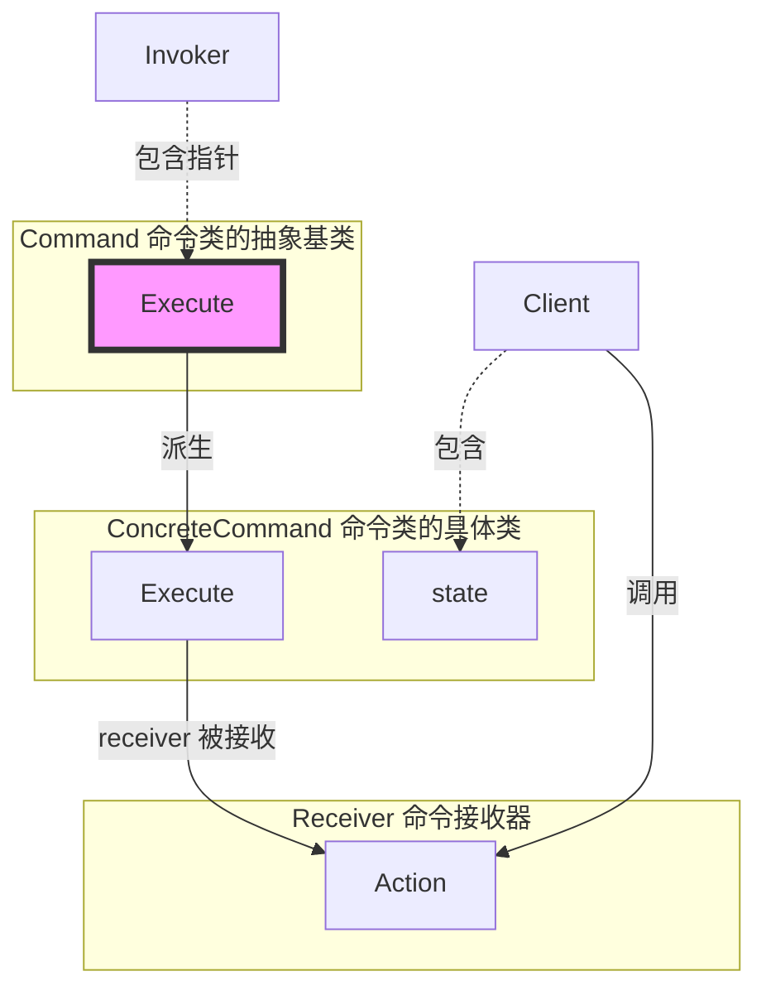

# 《C++设计模式》视频_李建忠

# 目录

[toc]

# 命令模式 Command

## 所属分类——“行为变化” 模式

- “行为变化” 模式
  - 在组件的构建过程中，组件行为的变化经常导致组件本身剧烈的变化。
    “行为变化” 模式将**组件的行为和组件本身进行解耦**，从而支持组件行为的变化，实现两者之间的松耦合。
- 典型模式
  - 命令模式 Command
  - 访问器模式 Visitor

## 动机（Motivation）

### 简概

- 在软件构建过程中，**“行为请求者” 与 “行为实现者" 通常呈现一种 “紧耦合”**。
  但在某些场合——比如需要对行为进行 “记录、撤销/重做(undo/redo)、事务” 等处理，这种无法抵御变化的紧耦合是不合适的。
- 在这种情况下，如何将 “行为请求者” 与 “行为实现者” 解耦？
  将一组行为抽象为对象，可以实现二者之间的松耦合。

### 代码体现

#### 举例 - 命令模式代码

```c++
#include <vector>
#include <string>
using namespace std;

// 命令类的抽象基类
class Command
{
public:
	virtual void execute() = 0;			// 执行
};

// 继承命令类，表示一个行为对象
class ConcreteCommand1 : public Command
{
	string arg;
public:
	ConcreteCommand1(const string & a) : arg(a) {}
    void execute() override
    {
		cout<< "#1 process..." <<arg<<endl;
	}
};

class ConcreteCommand2 : public Command
{
	string arg;
public:
	ConcreteCommand2(const string & a) : arg(a) {}
    void execute() override
    {
		cout<< "#2 process..." <<arg<<endl;
	}
};

// 命令组合，命令组合也属于命令。继承命令类抽象基类的同时又使用容器来包含这些命令
class MacroCommand : public Command
{
	vector<Command*> commands;			// 包含命令的vector容器
public:
	void addCommand(Command *c) { commands.push_back(c); }
    void execute() override
	{
		for (auto &c : commands){		// 遍历命令类
			c->execute();
		}
	}
};
```

运行函数

```c++
int main( ){
	ConcreteCommand1 command1(receiver, "Arg###");	// 命令1
    ConcreteCommand2 command2(receiver, "Arg$$$");	// 命令2
    
    MacroCommand macro;								// 命令组合。并往内添加命令1和命令2
	macro.addCommand(&command1);
    macro.addCommand(&command2);
    macro.execute();								// 遍历执行命令组合
}
```

#### 分析 - 命令模式代码

这些命令是行为，但又以对象的形式出现，这使这些命令有高的扩展、灵活性、解耦性

## 设计模式

### 模式定义

> 将一个**请求（行为）封装为一个对象**，从而使你可用不同的请求对客户进行参数化；对请求排队或记录请求日志，以及支持可撤销的操作。
>
> ——《设计模式》GoF

### 结构（Structure）

（红色表示稳定）



### 要点总结

- Command模式的根本目的在于将 “行为请求者” 与 “行为实现者” 解耦，在面向对象语言中，常见的实现手段是 “将行为抽象为对象”
- 实现Command接口的具体命令对象ConcreteCommand有时候根据需要可能会保存一些额外的状态信息。
  通过使用Composite模式，**可以将多个 “命令” 封装为一个 “复合命令”** MacroCommand
- Command模式与C++中的函数对象有些类似。但两者定义行为接口的规范有所区别：
  - Command以面向对象中的 “接口-实现" 来定义行为接口规范，更严格，但有性能损失；（运行时多态，在C++中略过时，但在其他语言有极大的应用）
  - C++函数对象以函数签名来定义行为接口规范，更灵活，性能更高（编译时绑定、编译时多态）


