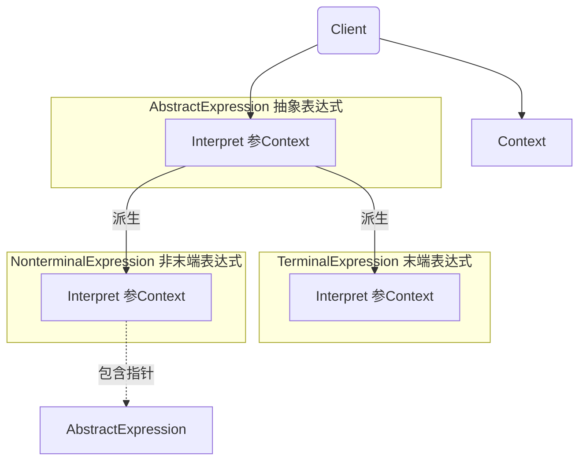

# 《C++设计模式》视频_李建忠

# 目录

[toc]

# 解析器模式 Interpreter

## 所属分类——“领域规则” 模式

- “领域规则” 模式
  - 在特定领域中，某些变化虽然频繁，但可以抽象为某种规则。
    这时候，结合特定领域，将问题抽象为语法规则，从而给出在该领域下的一般性解决方案。
- 典型模式
  - lnterpreter

## 动机（Motivation）

### 简概

- 在软件构建过程中，如果某一特定领域的问题比较复杂，类似的结构不断重复出现，如果使用普通的编程方式来实现将面临非常频繁的变化。
- 在这种情况下，将特定领域的问题表达为**某种语法规则下的句子**，然后构建一个解释器来解释这样的句子，从而达到解决问题的目的。

### 代码体现

一个解析四则运算的解析器

（其实《数据结构与算法分析》一书中也有这个例子，原理不同）

#### 举例 - 解析器模式

```c++
#include <iostream>
#include <map>
#include <stack>

using namespace std;

// 表达式
class Expression {
public:
	virtual int interpreter(map<char, int> var)=0;
    virtual ~Expression(){}
};

// 变量表达式，继承表达式（将变量本身也当做是一个表达式，相当于树的节点）
class VarExpression: public Expression {
	char key;
public:
	VarExpression( const char& key){
		this->key = key;
	}
	int interpreter(map<char, int> var) override {
		return var[key];
	}
};

// 符号表达式，继承表达式
class SymbolExpression : public Expression {
	// 运算符左右两个参数
protected:
	Expressionx left;
    Expression* right;
public:
	SymbolExpression(Expression* left,Expression* right):left(left),right(right){

    }
};

// 加法运算，继承符号表达式
class AddExpression : public SymbolExpression {
public:
	AddExpression(Expression* left,Expression* right):
		SymbolExpression(left,right){
	
    }
	int interpreter( map<char, int> var) {
		return left->interpreter(var) + right->interpreter(var);
	}
};

// 减法运算，继承符号表达式
class SubExpression : public SymbolExpression {
public:
	AddExpression(Expression* left,Expression* right):
		SymbolExpression(left,right){
	
    }
	int interpreter( map<char, int> var) {
		return left->interpreter(var) - right->interpreter(var);
	}
};

// 表达式语法分析【即解析器】
Expression* analyse(string expStr) {
	stack<Expression*> expStack;			// 栈，用来存储一个最小的表达式
	Expression* left = nullptr;				// 这里通过二叉树来模拟四则运算
    Expressionx right = nullptr;
	for(int i=0; i<expStr.size(); i++)		// 循环解析表达式
    {
		switch(expStr[i])					// 符号会变成二叉树的枝干
        {         
			case '+':
				// 加法运算
				left = expStack.top() ;
				right = new VarExpression(expStr[++i] );
				expStack. push(new AddExpression(left,right));
                break;
            case '-':
				// 减法运算
				left = expStack.top( );
				right = new VarExpression( expStr[++i] );
				expStack.push(new SubExpression(left, right));
                break;
			default:
				// 终结表达式
				expStack.push(new VarExpression(expStr[i]));
        }
    }
    Expression* expression = expStack.top();
    return expression;
}  

void release( Expression* expression){
	// 释放表达式树的节点内存...
}

int main( int argc, const char * argv[]) {
	
    string expstr = "a+b-c+d";					// 四则运算，被解析器类解析
	map<char, int> var;							// 一个map字典（基于红黑树）
	var.insert(make_pair('a',5));
    var.insert(make_pair('b',2));
    var.insert(make_pair('c',1));
    var.insert(make_pair('d',6));
    
	Expression* expression= analyse(expStr);
    
    int result=expression->interpreter(var);
    
    cout<<result<<endl;
    
    release(expression);
    
    return 0;
}
```

## 设计模式

### 模式定义

> 给定一个语言，定义它的文法的一种表示，并定义一种解释器，这个解释器使用该表示来解释语言中的句子。
>
> ——《设计模式》GoF

### 结构（Structure）

（红色表示稳定）



### 要点总结

- Interpreter模式的**应用场合**是Interpreter模式应用中的**难点**，只有满
   **“业务规则频繁变化，且类似的结构不断重复出现，并且容易抽象为语法规则的问题”** 才适合使用Interpreter模式。
- 使用Interpreter模式来表示文法规则，从而可以使用面向对象技巧来方便地 “扩展” 文法**（方便扩展）**
- Interpreter模式比较适合简单的文法表示，对于复杂的文法表示lnterperter模式会产生比较大的类层次结构，需要求助于语法分析生成器这样的标准工具

### 个人体会

解析器模式是组成一个树，组合模式也是组成树，二者也都分枝干节点和叶子节点，非常相像


