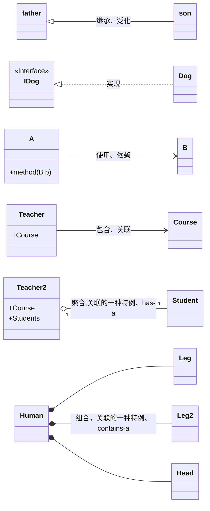

# UML

# 目录

# UML基本使用

## 画图软件

略、Typora的mermaid有类图、gizon渲染umlpattern也行（忘单词了）

## 抽象类和接口类的区别

见设计模式笔记

## 箭头关系

https://blog.csdn.net/wglla/article/details/52225571

泛化和实现

```mermaid
classDiagram

father <|-- son: 继承、泛化
IDog <|.. Dog: 实现
class IDog{
	<<Interface>>
}

direction LR
A ..> B: 使用、依赖
class A{
	+method(B b)
}
Teacher --> Course: 包含、关联
class Teacher{
	+Course
}

Teacher2 "1"o--"n" Student: 聚合,关联的一种特例、has-a
class Teacher2{
	+Course
	+Students
}
Human *-- Leg
Human *-- Leg2: 组合，关联的一种特例、contains-a
Human *-- Head
```

