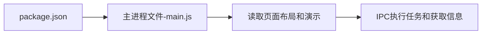

# Electron

# 目录

[TOC]

# 介绍

开源：GitHub开源框架，开发产品可商用

前置知识：html、css、JavaScript

平台：跨平台，Window、Mac、Linux

Electron结构：`Electron`=`Chromium`+`Node.js`+`Native API`

开发产品：VSCode、Atom、slack、wordpress

# 开发环境搭建

Node.js

> 去官网下`nodejs.org`

# 项目创建

## HelloWorld

终端

```shell
npm init -y # 初始化，npm install也行？
npm install electron --save-dev # 安装，必须是开发时依赖
npx electron -v # 检查版本，npx是Node5.0版本后才有
# 或./node_modules/.bin/electron -v # 这样检查版本也行
npx electron . # electron是全局安装的化则不需要加npx前缀
# 或./node_modules/.bin/electron # 打开界面
```

main.js

```js
var electron = require('electron')

var app = electron.app  // 引用app
var BrowserWindow = electron.BrowserWindow // 窗口引用

var mainWindow = null // 生命要打开的窗口

app.on('ready', ()=>{
  mainWindow = new BrowserWindow({
      width:300,
      height:300,
      webPreferences:{nodeIntegration:true} // 写了html才能引入js代码
  })
  mainWindow.loadFile('index.html') // 加载html页面
  mainWindow.on('closed',()=>{ // 监听关闭，不能忘，否则内存占用越来越多
    mainWindow = null
  })
})
```

运行窗口

```shell
npx electron .
```

# 进程结构

## 流程



## 主进程和渲染进程

main.js是主进程，像其他html导入的index.js这种是渲染进程

一个主进程可延伸出多个渲染进程

## 渲染进程访问主进程方法

需要使用`Remote`模块

### 打开子窗口

渲染进程index2.js：

```javascript
const BrowserWindow = require('electron').remote.BrowserWindow // 需要remote
window.onload = function(){
    var btn = this.document.querySelector('#button')
    btn.onclicke = ()=>{
        newWin = new BrowserWindow({
            width:500,
            height:500
        })
        newWin.loadFile('demo.html')
        mainWindow.on('closed',()=>{
        	mainWindow = null
		})
    }
}
```

# 开发时工具

## 调试

未打包时，可通过`菜单 > View > Toggle Develop Tools（CtrlShift+I）`来调试

调试界面和浏览器调试界面差不多

## 重新编译

等代码编辑后，可通过`菜单 > View > Reload（Ctrl+R）`来重新编译

而不需要退出再重新`npx electron .`

但有时会有点问题，即使第一次正常，Reload后也可能变得不正常

## 创建菜单后开发工具丢失

main.js

```javascript
// mainWindow = new BrowserWindow({...})之后
mainWindow.webContents.openDevTools // 打开窗口后直接打开调试模式
```

# 打包

有electron-packager和electron-builder两种方式实现

## electron-packager

略

## electron-builder

功能更丰富，支持平台更多，也支持制动更新。打包出的包更轻量，并可以打包出不暴露源码的setup安装程序

安装依赖

```shell
yarn add electron-builder --save-dev // 官方强烈推荐使用yarn安装依赖包，但亲测npm可以
```

package.json做配置

```json
"build": {
    "appId": "com.study.app",
    "win": {
      "target": ["nsis","zip"]
    },
    "mac": {
      "target": ["dmg","zip"]
    }
  },
  "scripts": {
    "dist": "electron-builder --win --x64"
  },
```

打包执行`npm run dist`即可

# 功能实现

## 菜单

### 菜单的创建和绑定事件

menu.js // 菜单文件，在主进程中

```javascript
const {Menu} = require('electron')
var template = [
    {
        label: '菜单1',
        submenu: [
            {
                label:'子菜单1',
                accelerator: 'ctrl+n', // 快捷键
                click:()=>{} // 事件绑定
            },
            {label:'子菜单2'}
        ]
    },
    {
        label: '菜单2'
    }
]
var m = Menu.buildFromTemplate(template) // 放入模板
Menu.setApplicationMenu(m) // 放入App
```

main.js // 主进程

```javascript
var electron = require('electron')

var app = electron.app
var BrowserWindow = electron.BrowserWindow

var mainWindow = null

app.on('ready', ()=>{
  mainWindow = new BrowserWindow({
      width:300,
      height:300
  })
  require('./main/menu.js') // 把菜单文件导入主进程......这种写法可以将菜单的js分离出去!!!!!!
  mainWindow.loadFile('index.html')
  mainWindow.on('closed',()=>{
    mainWindow = null
  })
})
```

### 右键菜单

```javascript
// window.addEventListener('click',()=>{ // 单击事件
//     alert(111)
// })
const {remote} = require('electron')
var rightTemplate = [
    {label:'复制'},
    {label:'粘贴'}
]
var m = remote.Menu.buildFromTemplate(rightTemplate) // 放入模板
window.addEventListener('contextmenu',(e)=>{ // 右击事件
    e.preventDefault() // 阻止默认事件
    m.popup({window:remote.getCurrentWindow()}) // 放入右键事件中
})
```

## Web

### 通过链接打开浏览器

使用`<a>`标签默认在窗口程序中打开

如果需要在其他浏览器打开，是要使用shell

demo.js

```javascript
var {shell} = require('electron')
var aHref = document.querySelector('#aHref')
aHref.onclick = function(e){
    e.preventDefault() // 阻止窗口打开链接的默认行为
    var href = this.getAttribute('href')
    shell.openExternal(href)
}
```

### 嵌入网页

嵌入网页用webview和browserView

main.js // 主进程

```javascript
// 加载html页面后
var BrowserView = electron.BrowserView
var view = new BrowserView()
mainWindow.setBrowserView(view)
view.serBounds({ // 设置属性
    x:0,
    y:120,
    width:1000,
    height:700
})
view.webContent.loadURL('http://baidu.com')
```

### 打开网页子窗口

```javascript
window.open('http://baidu.com')
```

后面直接接一个html好像也行

## 对话框

这里原生HTML也能做得到，这里使用的是Electron的API方法

### 选择文件对话框

选择文件对话框API：

- 异步`dialog.showOpenDialog(基本属性,回调函数)`，或可以使用`then`
- 同步`dialog.showOpenDialogSync(基本属性)`

基本属性（对象类型）参数表：

| 属性 | 类型 | 说明 |
| ------ | ---- | ---- |
|title|String(可选)|对话的标题|
|defaultPath|String(可选)|默认打开路径|
|buttonLabel|String(可选)|确定按钮的自定义标签|
|filters|List(可选)|文件选择过滤器（扩展名筛选）|
|properties||打开文件的属性：文件/文件夹、隐藏文件|

demo

```javascript
const {dialog} = require('electron').remote
var openBtn = document.getElementById('openBtn')

openBtn.onclick = function(){
    dialog.showOpenDialog({
        title: '请选择xxx文件',
        defaultPath: 'C:\\xxx.jpg',
        filters:[
            {name:'img',extensions:['jpg','png']}
        ],
        buttonLabel: '确定选择'
    }).then(result=>{
        let image = document.getElementById('images')
        image.setAttribute("src",result.filePaths[0])
    }).catch(err=>{
        console.log(err)
    })
}
```

### 保存文件对话框

保存文件对话框API：

`showSaveDialog`

同步异步、参数那些和上面差不多

```javascript
const {dialog} = require('electron').remote
const fs = require('fs') // Node.js的fs模块

var openBtn = document.getElementById('openBtn')
openBtn.onclick = function(){
    dialog.showSaveDialog({
        title: '保存文件'
    }).then(result=>{
        console.log(result)
        fs.writeFileSync(result.filePath,'lalala') // 这里有点问题，选择文件夹要加文件名
    }).catch(err=>{
        console.log(err)
    })
}
```

### 消息对话框

API：`showMessageBox()`

常用参数：

| 属性    | 类型         | 说明                                       |
| ------- | ------------ | ------------------------------------------ |
| type    | String       | 参数：none、info、error、question、warning |
| title   | String       | 弹出框的标题                               |
| message | String(必写) | message box的内容                          |
| buttons | List         | API返回值为该列表的索引的下标值            |

Demo

```javascript
dialog.showMessageBox({
    type: 'warning',
    title: '信息对话框标题',
    message: '信息对话',
    buttons: ['按钮1','按钮2'] // 会返回数组下标
})
```

## 网络监控与断网提醒

demo

```javascript
window.addEventListener('online',function(){ // 注意：刚开始连网时不会触发，需要网络断了后重新连上才会触发
    alert('网络连上了！')
})
window.addEventListener('offline',function(){
    alert('网络断了！')
})
```

## 底部信息通知

demo

```javascript
var option = {
    title: '通知标题',
    body: '通知信息'
}
new window.Notification(option.title,option)
```

## 注册全局快捷键

demo

```javascript
var globalShortcut = electron.globalShortcut
// ...写在app.on(‘ready',()=>{})里
globalShortcut.register('ctrl+e',()=>{...})
let isRegister = globalShortcut.isRegistered('ctrl+e') // 判断，以免热键冲突，返回Bool值
```

注销快捷键

```javascript
app.on('will-quit', function(){
    // 注销全局快捷键方法
    globalShortcut.unregister('ctrl+e') //单独注销
    globalShortcut.unregisterAll() // 全部注销
})
```

## 剪切板功能

demo

```javascript
const clipboard = require('electron').clipboard // 剪切板模块，可在渲染进程使用
// ...
clipboard.writeText('需要复制的文本')
```

# 数据传递

## 子窗口向父窗口传递信息

子窗口

```javascript
window.opener.postMessage('我是子窗口传递过来的信息')
```

父窗口

```javascript
window.open('./subWindow.html') // 打开子窗口
// ...
window.addEventLister('message',(msg)=>{
	let mytext = document.querySelect('#mytext')
    console.log(msg.data) // 打印“我是子窗口传递过来的信息”
})
```

# 个人总结

## 事件监听

app事件 - 开始

```javascript
app.on('ready', ()=>{})
```

窗口事件监听 - 关闭窗口事件

```javascript
mainWindow.on('closed',()=>{mainWindow = null})
```

window监听 - 右击菜单事件

```javascript
window.addEventListener('contextmenu',(e)=>{})
```

window监听 - 网络监听

```javascript
window.addEventListener('online',function(){})
window.addEventListener('offline',function(){})
```

window监听 - 信息传递

```javascript
// window.opener.postMessage('我是子窗口传递过来的信息') // 该信息由该代码发起
window.addEventLister('message',(msg)=>{})
```

## electron的子模块

```javascript
const electron = require('electron') // 主模块，方便下面的子模块引入代码的书写
const app = electron.app // App模块
const BrowserWindow = electron.BrowserWindow // 窗口模块
const BrowserWindow = electron.remote.BrowserWindow // 窗口模块(非主进程)
const Menu = electron.Menu // 菜单模块
const remote = electron.remote // 右键菜单模块
const shell = electron.shell // 脚本模块
const BrowserView = electron.BrowserView // 浏览器视图模块
const dialog = electron.remote.dialog // 对话框模块(非主进程)
const globalShortcut = electron.globalShortcut // 全局快捷键
const clipboard = electron.clipboard // 剪切板模块，可在渲染进程使用
```

### App模块

```javascript
const app = require('electron').app // app模块
// ...
app.on('ready', ()=>{...})
app.on('will-quit', ()=>{...})
```

### BrowserWindow窗口模块

```javascript
const BrowserWindow = require('electron').BrowserWindow // BrowserWindow窗口模块
// ...
mainWindow = new BrowserWindow({...}) // 窗口
mainWindow.loadFile('index.html')
mainWindow.webContents.openDevTools
```

### Menu菜单模块

```javascript
const Menu = require('electron').Menu // Menu菜单模块
//...
var m = Menu.buildFromTemplate([...]) // 放入模板，一般模板写外面
Menu.setApplicationMenu(m) // 放入App
```

### remote右键菜单模块

```javascript
const remote = require('electron').remote // remote右键菜单模块
// ...
var m = remote.Menu.buildFromTemplate([...]) // 放入模板，一般模板写外面
window.addEventListener('contextmenu',(e)=>{ // 右击事件
    e.preventDefault()
    m.popup({window:remote.getCurrentWindow()}) // 放入右键事件中
})
```

等等

略...


