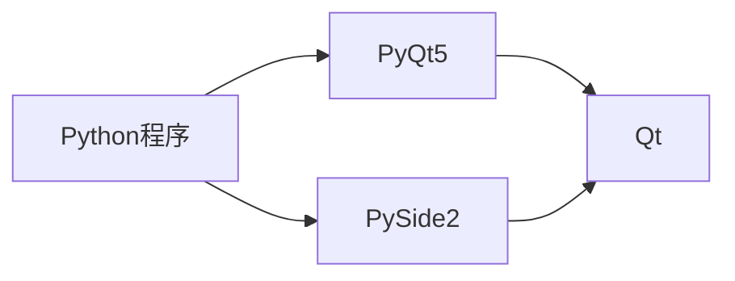

# PyQt

参考：

- [【Bilibili】Python Qt 图形界面编程 - PySide2 PyQt5 PyQt PySide](https://www.bilibili.com/video/BV1cJ411R7bP)，进度P3 end
  教程配套网站，https://www.byhy.net/tut/py/gui/qt_01/，含笔记，学习时不用记太多笔记倒是轻松点
- 文档：要么看上面那个，要么看的还是QT原版的文档

# 目录

# 入门

## 简概

### GUI程序

Python语言开发的跨平台图形界面程序

- Tkinter
    - 描述：Python官方采用的标准库
    - 优点：开源、稳定、发布程序较小
    - 缺点：控件相对较少
- wxPython
    - 描述：基于wxWidgets
    - 优点：开源、控件丰富
    - 缺点：稳定性相对差点、文档少、用户少
- PySide2、PyQt5
    - 描述：基于Qt的Python库
    - 优点：控件比较丰富、跨平台体验好、文档完善、用户多
    - 缺点：库比较大，发布出来的程序比较大

### PySide2、PyQt5 区别与选择

是两个库，PySide2官方的（亲儿子，但比较晚出来的。18年才出现），PyQt5（第三方的，但出现得比较早），两个库非常相似

一般选择PySide2，毕竟是新的也是Qt官方的，后续发展好。而且PyQt5转PySide2相对简单（需要换类名）



## 使用流程

### 软件安装（安装与配置）

```shell
pip install pyside2
# 这个库大概有100M左右，安装简单

pip install pyside2 -i https://pypi.douban.com/simple
# 或，豆瓣镜像加速
```

老师说如果程序要发布给客户使用，建议使用32位Python解释器
但不听不听，让客户换电脑去，不能惯着。我不喜欢使用32位的Python，很麻烦

### 项目创建

一个py文件即可，不用什么项目结构

### 代码

```python
# PySide2.QtWidgets，库里控件窗口的部分，大概相当于QT里的QT+=widgets
# 后面import的几个类大概相当于QT里的#include类
from PySide2.QtWidgets import QApplication, QMainWindow, QPushButton,  QPlainTextEdit

app = QApplication([])						# 相当于 QApplication a(argc, argv);	

window = QMainWindow()						# 相当于 Core core;
window.resize(500, 400)							# Core类里的操作，设置大小
window.move(300, 310)							# 设置出现在[显示器]的什么地方
window.setWindowTitle('薪资统计')				  # 标题

textEdit = QPlainTextEdit(window)				# 文本输入框。还有对象树
textEdit.setPlaceholderText("请输入薪资表")		 # 提示文本
textEdit.move(10,25)							# 相对于[父对象]的位置
textEdit.resize(300,350)

button = QPushButton('统计', window)			   # 按钮
button.move(380,80)

window.show()								# 相当于 core.show();
app.exec_()									# 相当于 return a.exec();
```

#### ==对比原版QT==

main.cpp

```c++
#include "core.h"
#include <QApplication>

int main(int argc, char *argv[])
{
    QApplication a(argc, argv);	
    Core core;
    core.show();
    return a.exec();
}
```

core.cpp

```c++
Core::Core(QWidget *parent)
    : QMainWindow(parent)
{
    resize( 700, 500 );
}
```


### 软件运行

一般用PyCharm

- Setting窗口，选择项目，加入Project Interpreter
- 右上角配置好运行的 入口.py 后，直接点运行


### 打包

未

未

未

未

未

未

未

未

未


