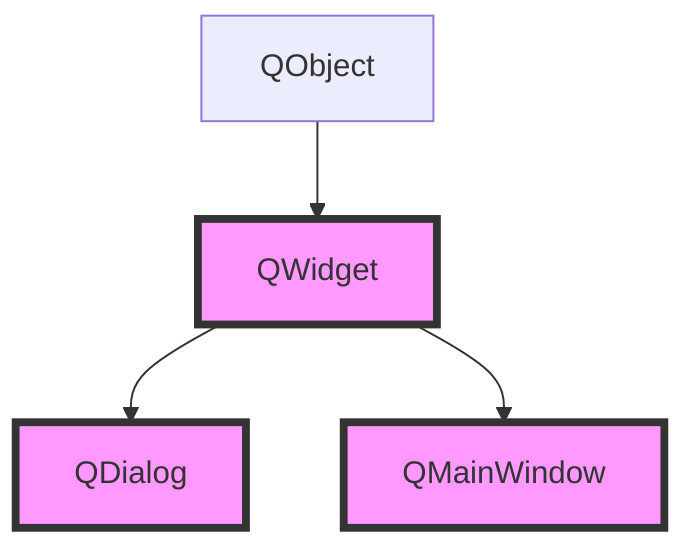
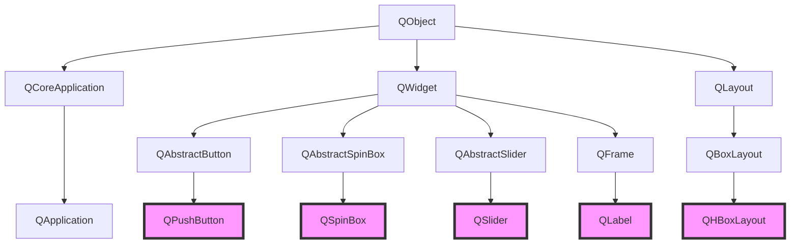

# QT

# 目录

# Qt类与类方法

==可以在Qt助手中搜索这些类以获得详细信息==

# 窗口类

## QWidget/QMainWindow/QDialog

- 头文件（一般放在要继承的类的头文件中）
    - `#include <QWidget>`、`#include <QMainWindow>`、`#include <QDialog>`
- 继承
    - 其中`QMainWindow`和`QDialog`都是`QWidget`的基类，`QWidget`的基类是`QObject` and `QPaintDevice`
    - 而创建工程时会创建一个这三者之一的派生类
- 常用方法
    - `setWindowTitle("");`，设置窗口标题
    - `resize(width, height);`，设置宽高（设置后可拖拽大小）
    - `setFixedSize(width, height);`，设置固定的宽高（设置后不可拖拽大小）
- 补充
    - 与控件类和抽象类相比，这三个窗口类一般都通过子类继承来使用

## 窗口类继承树

## 粗略继承树

粗略继承树——Q开头的都起源QObject

## 类关系一览1

**Qt类关系一览表**

（https://blog.csdn.net/qq_15174437/article/details/100987110）UML类图

## 类关系一览2

https://codeantenna.com/a/gF5TfbdDeX

### QWidget 类

- QWidget 
  - QAbstractButton 
    - QCheckBox
    - QPushButton 
      - QCommandLinkButton
    - QRadioButton
    - QToolButton
  - QAbstractSlider 
    - QDial
    - QScrollBar
    - QSlider
  - QAbstractSpinBox 
    - QDateTimeEdit 
      - QDateEdit
      - QTimeEdit
    - QDoubleSpinBox
    - QSpinBox
  - QAxWidget
  - QCalendarWidget
  - QComboBox 
    - QFontComboBox
  - QDesignerActionEditorInterface
  - QDesignerFormWindowInterface
  - QDesignerObjectInspectorInterface
  - QDesignerPropertyEditorInterface
  - QDesignerWidgetBoxInterface
  - QDesktopWidget
  - QDialog 
    - QAbstractPrintDialog 
      - QPrintDialog
    - QAxSelect
    - QColorDialog
    - QErrorMessage
    - QFileDialog, QFontDialog
    - QInputDialog
    - QMessageBox
    - QPageSetupDialog
    - QPrintPreviewDialog
    - QProgressDialog
    - QWizard
  - QDialogButtonBox
  - QDockWidget
  - QFocusFrame
  - QFrame 
    - QAbstractScrollArea 
      - QAbstractItemView 
        - QColumnView
        - QHeaderView
        - QListView 
          - QHelpIndexWidget
          - QListWidget
          - QUndoView
        - QTableView
        - QTreeView 
          - QHelpContentWidget
          - QTreeWidget
      - **QGraphicsView**
      - QMdiArea
      - QPlainTextEdit
      - QScrollArea
      - QTextEdit 
        - QTextBrowser
    - QLabel
    - QLCDNumber
    - QSplitter
    - QStackedWidget
    - QToolBox
  - QGLWidget
  - QGroupBox
  - QHelpSearchQueryWidget
  - QHelpSearchResultWidget
  - QKeySequenceEdit
  - QLineEdit
  - QMacCocoaViewContainer
  - QMacNativeWidget
  - QMainWindow
  - QMdiSubWindow
  - QMenu
  - QMenuBar
  - QOpenGLWidget
  - QPrintPreviewWidget
  - QProgressBar
  - QQuickWidget
  - QRubberBand
  - QSizeGrip
  - QSplashScreen
  - QSplitterHandle
  - QStatusBar
  - QSvgWidget
  - QTabBar
  - QTabWidget
  - QToolBar
  - QVideoWidget 
    - QCameraViewfinder
  - **QWebEngineView**
  - QWebInspector
  - QWebView
  - QWizardPage

### QGraphics 类

- QGraphicsAnchor
- QGraphicsEffect 
  - QGraphicsBlurEffect
  - QGraphicsColorizeEffect
  - QGraphicsDropShadowEffect
  - QGraphicsOpacityEffect
- QGraphicsLayoutItem 
  - QGraphicsLayout 
    - QGraphicsAnchorLayout
    - QGraphicsGridLayout
    - QGraphicsLinearLayout
  - **QGraphicsWidget** 
    - **QGraphicsProxyWidget**
    - QGraphicsWebView
- **QGraphicsItem** 
  - QAbstractGraphicsShapeItem 
    - QGraphicsEllipseItem
    - QGraphicsPathItem
    - QGraphicsPolygonItem
    - QGraphicsRectItem
    - QGraphicsSimpleTextItem
  - QGraphicsItemGroup
  - QGraphicsLineItem
  - QGraphicsObject 
    - QGraphicsSvgItem
    - QGraphicsTextItem
    - QGraphicsVideoItem
    - **QGraphicsWidget** 
      - **QGraphicsProxyWidget**
      - QGraphicsWebView
  - QGraphicsPixmapItem
- **QGraphicsScene**
- QGraphicsSceneEvent 
  - QGraphicsSceneContextMenuEvent
  - QGraphicsSceneDragDropEvent
  - QGraphicsSceneHelpEvent
  - QGraphicsSceneHoverEvent
  - QGraphicsSceneMouseEvent
  - QGraphicsSceneMoveEvent
  - QGraphicsSceneResizeEvent
  - QGraphicsSceneWheelEvent
- QGraphicsTransform 
  - QGraphicsRotation
  - QGraphicsScale

### 其他

- QAbstractItemDelegate 
  - QItemDelegate 
    - QSqlRelationalDelegate
  - QStyledItemDelegate
- QAbstractTransition 
  - QEventTransition 
    - QKeyEventTransition
    - QMouseEventTransition
  - QSignalTransition
- QAccessibleWidget
- QAction 
  - QWidgetAction
- QActionGroup
- QApplication
- QButtonGroup
- QColormap
- QCompleter
- QDataWidgetMapper
- QDirModel
- QFileIconProvider
- QFileSystemModel
- QGesture 
  - QPanGesture
  - QPinchGesture
  - QSwipeGesture
  - QTapAndHoldGesture
  - QTapGesture
- QGestureRecognizer
- QGestureEvent
- QItemEditorCreatorBase 
  - QItemEditorCreator
  - QStandardItemEditorCreator
- QItemEditorFactory
- QLayoutItem 
  - QLayout 
    - QBoxLayout 
      - QHBoxLayout
      - QVBoxLayout
    - QFormLayout
    - QGridLayout
    - QStackedLayout
  - QSpacerItem
  - QWidgetItem
- QStyle 
  - QCommonStyle 
    - QProxyStyle
- QTextEdit::ExtraSelection
- QTileRules
- QToolTip
- QTreeWidgetItem
- QTreeWidgetItemIterator
- QUndoCommand
- QUndoGroup
- QWhatsThis

