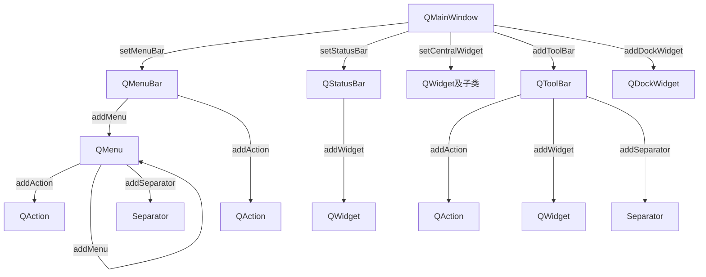

# QT

# 目录

# QMainWindow

## 简概

QMainWindow是一个为用户提供主窗口程序的类，包含：（五类）

- 一个菜单栏（menu bar）
- 多个工具栏（tool bars）
- 多个铆接部件（dock widgets）
- 一个状态栏（status bar）
- 一个中心部件（central widget）

是许多应用程序的基础

## 五部件 - 按部件

### 菜单栏 `QMenuBar`（只能有一个）

#### 使用

- 基本流程

    ```c++
    // (0) 头文件
    #include <QMenuBar>
    
    // (1) 创建菜单栏（这里在底层也是对象树，只不过不显示传入父对象）
    QMenuBar * bar = menuBar();
    QMenuBar * bar = new QMenuBar();	// 或new方式
    
    // (2) 将菜单栏放入窗口（写法不同于放入窗口，不是`setParent()`）
    setMenuBar(bar);
    
    // (3) 创建菜单，例如：
    QMenu * fileMenu = bar->addMenu("File");
    QMenu * editMenu = bar->addMenu("Edit");
    
    // (4) 创建菜单项，例如：
    QAction * newAction = fileMenu->addAction("New");
    QAction * openAction = fileMenu->addAction("Open");
    fileMenu->addSeparator();			// 添加分隔线
      
    ```

- 代码示例

    ```c++
    #include <QMenuBar>
    
    // 创建并放入
    QMenuBar * menuBar = new QMenuBar();
    setMenuBar(menuBar);
    
    // 添加项
    QMenu * menuFile = menuBar->addMenu("File");		// addMenu
    QAction * newAction = menuFile->addAction("New");	// addAction
    ```

#### 常用方法

- QMenuBar，菜单栏，set、add

    ```c++
    addAction		// 添加活动项
    addMenu			// 添加菜单项
        
    QAction *	addAction(const QString &text)
    QAction *	addAction(const QString &text, const QObject *receiver, const char *member)
    QAction *	addAction(const QString &text, const Obj *receiver, PointerToMemberFunctionOrFunctor method)
    QAction *	addAction(const QString &text, Functor functor)
    QAction *	addMenu(QMenu *menu)
    QMenu *		addMenu(const QString &title)
    QMenu *		addMenu(const QIcon &icon, const QString &title)
    ```

- QMenu，菜单项，set、add

    ```c++
    addAction		// 添加活动项
    addMenu			// 添加菜单项（嵌套菜单项）
    addSection		// 
    addSeparator	// 添加分隔线
        
    QAction *	addAction(const QString &text)
    QAction *	addAction(const QIcon &icon, const QString &text)
    QAction *	addAction(const QString &text, Functor functor, const QKeySequence &shortcut = 0)
    QAction *	addAction(const QIcon &icon, const QString &text, Functor functor, const QKeySequence &shortcut = 0)
    QAction *	addMenu(QMenu *menu)
    QMenu *		addMenu(const QString &title)
    QMenu *		addMenu(const QIcon &icon, const QString &title)
    QAction *	addSection(const QString &text)
    QAction *	addSection(const QIcon &icon, const QString &text)
    QAction *	addSeparator()
    ```

### 工具栏 `QToolBar`（可有多个）

#### 使用

- 基本流程
  
    ```c++
    // (0) 头文件
    #include <QToolbar>
    
    // (1) 创建工具栏
    QToolBar * toolBar = new QToolBar(this);
    
    // (2) 将工具栏放入窗口
    addToolBar(toolBar);
    
    // 重载版本可以初始化位置
    QToolBar(Qt::LeftToolBarArea, toolBar)	// Qt::表示这是一个媒体值（类似于枚举值？）
        
    // (3) 创建工具项，例如：
    toolBar—>addAction(newAction);			// 用QAction作参时，是共用同一个QAction）
    toolBar->addSeparator();				// 添加分隔线
    QPushButton * btn = new QPushButton("Button", this);
    toolBar->addWidget(btn);
    ```

#### 常用方法

- set、add
  
    ```c++
    addAction		// 添加活动项
    addSeparator	// 添加分隔线
    addWidget		// 添加控件
        
    QAction *	addAction(const QString &text)
    QAction *	addAction(const QIcon &icon, const QString &text)
    QAction *	addAction(const QString &text, const QObject *receiver, const char *member)
    QAction *	addAction(const QIcon &icon, const QString &text, const QObject *receiver, const char *member)
    QAction *	addAction(const QString &text, Functor functor)
    QAction *	addAction(const QString &text, const QObject *context, Functor functor)
    QAction *	addAction(const QIcon &icon, const QString &text, Functor functor)
    QAction *	addAction(const QIcon &icon, const QString &text, const QObject *context, Functor functor)
    QAction *	addSeparator()
    QAction *	addWidget(QWidget *widget)
    ```
    
- 其他

    ```c++
    // 工具栏默认可以拖拽、停靠
    toolBar->setAllowedAreas(Qt::LeftToolBarArea | Qt::RightToolBarArea);	// 限制停靠位置
    toolBar->setFloatable(false);											// 限制浮动
    toolBar->setMovable(false);												// 限制移动（无法更改位置+无法浮动）
    ```

### 状态栏 `QStatusBar`（只能有一个）

#### 使用

- 基本流程
  
    ```c++
    // (0) 头文件
    #include <QStatusBar>
    
    // (1) 创建状态栏
    QStatusBar * stBar = statusBar();
    QStatusBar * stbar = new QStatusBar(); // 或new方式
    
    // (2) 将状态栏放入窗口
    setStatusBar(stBar);
    
    // (3) 创建标签控件，例如
    QLabel * label1 = new QLabel("提示信息", this);
    stBar->addWidget(label1);				// 靠左显示
    stBar->addPermanentWidget(label2)		// 靠右显示
    ```

- 代码示例
  
    ```c++
    #include <QStatusBar>
    
    // 创建并放入
    QStatusBar * stbar = new QStatusBar();
    setStatusBar(stBar);
    
    // 添加活动项
    QLabel * label1 = new QLabel("提示信息", this); stBar->addWidget(label1)
    ```

#### 常用方法

- ```c++
    addPermanentWidget
    addWidget		// 添加控件
    
    void addPermanentWidget(QWidget *widget, int stretch = 0)
    void addWidget(QWidget *widget, int stretch = 0)
    ```

### 铆接部件 `QDockWidget`（浮靠窗口）（可有多个）

#### 使用

- 基本流程
  
    ```c++
    // (0) 头文件
    #include <QDockWidget>
    
    // (1) 创建铆接部件
    QDockWidget * dockWidget = new QDockWidget("浮动", this);
    
    // (2) 将铆接部件放入窗口
    addDockWidget(Qt::BottomDockWidgetArea, dockWidget);
    ```

#### 常用方法

- 限制停靠区域，如：`toolBar->setAllowedAreas(Qt::LeftToolBarArea | Qt::RightToolBarArea);`

### 核心部件（中心部件）（只能有一个）

#### 使用

- 基本流程
- `setCentralWidget(edit);`，设置中心部件

## 【捋一下】五部件

### 工具栏和铆接部件 区别和选用

- 模块化

    添加设计器界面类时，可以添加QDockWidget、QFrame、QGroupBox、QScrollArea、QMdiArea、QTabWidget、QToolBox、QStackedWidget、Qwizard、QWizardPage窗口部件，和Dialog、MainWindow、Widget

    其中有铆接部件但没有工具栏，即铆接部件可以作为单独的模块化编程

- 功能性

    铆接部件更复杂、可以添加各种控件，而工具栏只能添加Action

- 标题

    铆接部件有标题、有关闭，而工具栏均无

## 【捋一下】依赖、其他

### 嵌套关系

创建依赖

| 部件                     | 菜单栏   | 菜单     | 工具栏   | 状态栏     |
| ------------------------ | -------- | -------- | -------- | ---------- |
| 类名                     | QMenuBar | QMenu    | QToolBar | QStatusBar |
| `addAction`              | **支持** | **支持** | **支持** | ——         |
| `addMenu`                | **支持** | **支持** | ——       | ——         |
| `addSeparator`           | ——       | **支持** | **支持** | ——         |
| `addWidget`              | ——       | ——       | **支持** | **支持**   |
| ~~`addSection`~~         | ——       | **支持** | ——       | ——         |
| ~~`addPermanentWidget`~~ | ——       | ——       | ——       | **支持**   |

创建依赖图（从QMainWindow开始，区分`set`和`add`方法）



### 实战的一般写法

函数式编程，分离三个构建时自动调用的函数

```c++
public:
    void createActions();                        	//创建动作，构建时自动调用
    void createMenus();                           	//创建菜单，构建时自动调用
    void createToolBars();                      	//创建工具栏，构建时自动调用
```

### 命名习惯

我个人倾向于使用前者

- 设计模式的自动命名
    - menubar
        - menuFile（menuXxx）
    - actionNew（actionXxx）
    - toolBarTool（toolBarXxx）
    - statusbar
- 代码模式案例命名
    - xxxMenu
    - xxxTool
    - xxxAction

## 【捋一下】创建、关系、方法

### 创建

- QMuenBar【唯一】

    - `QMenuBar * bar = menuBar();`，函数方式
    - `QMenuBar * bar = new QMenuBar();`，new方式
    - `menuBar();`，不创建而直接调用，也是返回值方式

- QStatusBar【唯一】

    - `QStatusBar * stBar = statusBar();`，函数方式

    - `QStatusBar * stbar = new QStatusBar();`，new方式
    - `statusBar();`，不创建而直接调用，也是返回值方式

- QAction

    - `openFileAction = new QAction(QIcon("open.png"),tr("打开"),this);`，new方式（前两个参数是图标和名字）
    - `QAction * newAction = fileMenu->addAction("New");`，返回值方式

- QMenu

    - `略`，new方式
    - `QMenu * fileMenu = bar->addMenu("File");`，返回值方式

- QToolBar

    - `QToolBar * toolBar = new QToolBar(this);`，new方式
    - `QToolBar * addToolBar(const QString &title)`，返回值方式

- QDockWidget

    - `QDockWidget * dockWidget = new QDockWidget("浮动", this);`，new方式
    - 有`addDockWidget()`方法但该方法无返回值

- 其他普通控件

    - `QPushButton * btn = new QPushButton("Button", this);`，new方式

        

- 补充

    - new方式
        - 参数一般包含`(QWidget *parent = nullptr)`，默认构造父指针为空，可后期`setParent()`指定父指针
        - 像QMenuBar、QStatusBar这种会被`set`函数指定关系的，父指针为空`nullptr`
        - 像QToolBar、QDockWidget这种会被`add`函数指定关系的，父指针为被add的对象，一般是主窗口`this`
    - 返回值方式
        - 一般不需要再指定父指针，推测是将使用`add`函数的对象作为返回值对象的父指针
        - QDockWidget倒是无返回值方式
    - 不创建直接使用
        - 也是返回值方式的一种，但这种每次返回的结果都是一样的而不会创建新对象
        - 像菜单、状态栏这种唯一性的才可以这样也应该这样。为写法统一它们也支持使用new方法

### set、add方法

#### 总结

捋一下几种`set`和`add`方法

- set类（只能有一个）
    - `setMenuBar(bar);`，设置菜单栏
    - `setStatusBar(stBar);`，设置状态栏
    - `setCentralWidget(edit);`，设置中心部件
- add类（可以有多个）
    - `addMenu("File");`，增加菜单
    - `addAction("New");`，增加菜单项、工具项
    - `addWidget(btn);`，增加控件
    - `addDockWidget()`，增加铆接部件

#### set、add & QMainWindow

- 常用方法

    - ```c++
        // 可以有多个的用 add
        void addDockWidget(Qt::DockWidgetArea area, QDockWidget *dockwidget)
        void addDockWidget(Qt::DockWidgetArea area, QDockWidget *dockwidget, Qt::Orientation orientation)
        void addToolBar(Qt::ToolBarArea area, QToolBar *toolbar)
        void addToolBar(QToolBar *toolbar)
        QToolBar *addToolBar(const QString &title)
        void addToolBarBreak(Qt::ToolBarArea area = Qt::TopToolBarArea)
        
        // 只能有一个的用 set
        void setCentralWidget(QWidget *widget)			// 中心部件
        void setCorner(Qt::Corner corner, Qt::DockWidgetArea area)
        void setDockOptions(QMainWindow::DockOptions options)
        void setDocumentMode(bool enabled)
        void setIconSize(const QSize &iconSize)
        void setMenuBar(QMenuBar *menuBar)				// 菜单栏
        void setMenuWidget(QWidget *menuBar)
        void setStatusBar(QStatusBar *statusbar)		// 状态栏
        void setTabPosition(Qt::DockWidgetAreas areas, QTabWidget::TabPosition tabPosition)
        void setTabShape(QTabWidget::TabShape tabShape)
        void setToolButtonStyle(Qt::ToolButtonStyle toolButtonStyle)
        ```

#### set、add & QWidget

- 常用方法

    - ```c++
        void addAction(QAction *action)
        void addActions(QList<QAction *> actions)
        void adjustSize()
        
         
        void setAcceptDrops(bool on)
        void setAccessibleDescription(const QString &description)
        void setAccessibleName(const QString &name)
        void setAttribute(Qt::WidgetAttribute attribute, bool on = true)	// 可以设置关闭窗口自动析构
        void setAutoFillBackground(bool enabled)
        void setBackgroundRole(QPalette::ColorRole role)
        void setBaseSize(const QSize &)
        void setBaseSize(int basew, int baseh)
        void setContentsMargins(int left, int top, int right, int bottom)
        void setContentsMargins(const QMargins &margins)
        void setContextMenuPolicy(Qt::ContextMenuPolicy policy)
        void setCursor(const QCursor &)
        void setEditFocus(bool enable)
        void setFixedHeight(int h)
        void setFixedSize(const QSize &s)
        void setFixedSize(int w, int h)
        void setFixedWidth(int w)
        void setFocus(Qt::FocusReason reason)
        void setFocusPolicy(Qt::FocusPolicy policy)
        void setFocusProxy(QWidget *w)
        void setFont(const QFont &)
        void setForegroundRole(QPalette::ColorRole role)
        void setGeometry(const QRect &)
        void setGeometry(int x, int y, int w, int h)
        void setGraphicsEffect(QGraphicsEffect *effect)
        void setInputMethodHints(Qt::InputMethodHints hints)
        void setLayout(QLayout *layout)
        void setLayoutDirection(Qt::LayoutDirection direction)
        void setLocale(const QLocale &locale)
        void setMask(const QBitmap &bitmap)
        void setMask(const QRegion &region)
        void setMaximumHeight(int maxh)
        void setMaximumSize(const QSize &)
        void setMaximumSize(int maxw, int maxh)
        void setMaximumWidth(int maxw)
        void setMinimumHeight(int minh)
        void setMinimumSize(const QSize &)
        void setMinimumSize(int minw, int minh)
        void setMinimumWidth(int minw)
        void setMouseTracking(bool enable)
        void setPalette(const QPalette &)
        void setParent(QWidget *parent)
        void setParent(QWidget *parent, Qt::WindowFlags f)
        void setShortcutAutoRepeat(int id, bool enable = true)
        void setShortcutEnabled(int id, bool enable = true)
        void setSizeIncrement(const QSize &)
        void setSizeIncrement(int w, int h)
        void setSizePolicy(QSizePolicy)
        void setSizePolicy(QSizePolicy::Policy horizontal, QSizePolicy::Policy vertical)
        void setStatusTip(const QString &)
        void setStyle(QStyle *style)
        void setTabletTracking(bool enable)
        void setToolTip(const QString &)
        void setToolTipDuration(int msec)
        void setUpdatesEnabled(bool enable)
        void setWhatsThis(const QString &)
        void setWindowFilePath(const QString &filePath)
        void setWindowFlag(Qt::WindowType flag, bool on = true)
        void setWindowFlags(Qt::WindowFlags type)						// 可以隐藏窗口标题
        void setWindowIcon(const QIcon &icon)
        void setWindowModality(Qt::WindowModality windowModality)
        void setWindowOpacity(qreal level)
        void setWindowRole(const QString &role)
        void setWindowState(Qt::WindowStates windowState)
        ```

#### set、add & 设计模式

- set：可以在右下的`属性编辑器`（*Property Editor*）处快速设置属性
- add：可以在右上的`对象查看器`（*Object Inspector*）处快速添加

### 常用方法

#### Public Functions

- QAction
    - `action->setShortcut(tr("Ctrl+O"));`，设置快捷键
    - `action->setStatusTip(tr("打开一个文件"));`，设置状态栏提示

#### Public Slots 槽函数

- QWidget

    - ```c++
        bool close()	// 用法：SLOT(close())
        ```

- 不知（搜不到是谁提供的，而且好像又不是自定义的）

    - ```c++
        copy()
        cut()
        paste()
        QApplication::aboutQt()
        undo()
        redo()
        ```


