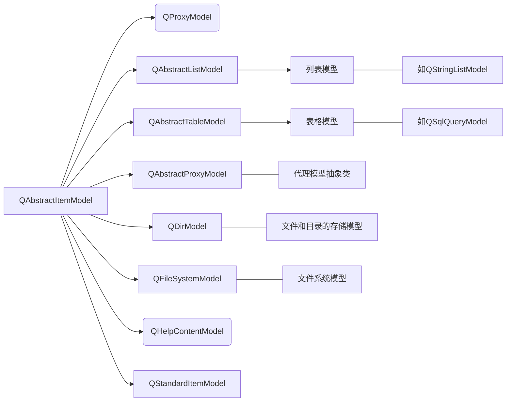
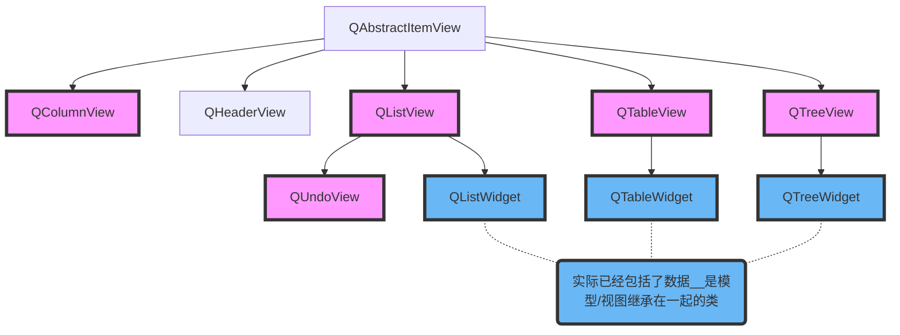
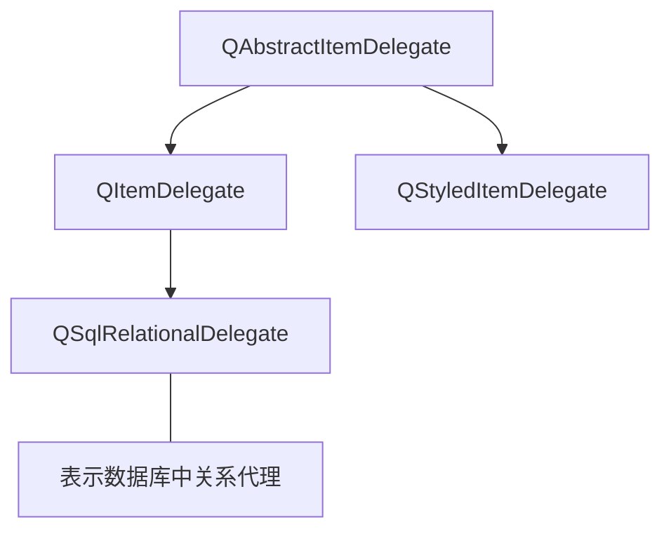

# Qt

# 目录

# Qt5模型或视图结构

（参自《Qt5开发及实例》（第4版）第8章 - P214）

## MVC设计模式 与 InterView

### MVC设计模式

- 简概：是起源于Smalltalk的一种与用户界面相关的设计模式，可以有效分离数据和用户界面（类似于Vue框架？）

- 构成：`MVC设计模式`包括三个元素

    - 表示数据的模型（*Model*）
    - 表示用户界面的视图（*View*）
    - 用户在界面上操作的控制器（*Controller*）

### 模型/视图结构

- 简概：与MVC设计模式类似，Qt引入了模型/视图结构用于完成数据与界面的分离，即`InterView框架`

- 区别

    - Qt的InterView框架把视图和控制器部件结合在一起，使得框架更加简洁
    - 同时引入了代理，通过代理，能自定义数据条目的显示和编辑方式

- 构成：`模型/视图结构`分为三个部分

    - 模型（*Model*）
    - 视图（*View*）
    - 代理（*Delegate*）

- 模型/视图结构与关系

    - 数据发生改变时，模型发出信号通知视图
      
    - 用户对界面进行操作，视图发出信号
      
    - 代理发出信号告知模型和视图编辑器目前的状态
      
        ```mermaid
        graph LR
        数据---模型--Redering 反馈-->视图
        模型--编辑---a(代理)--Rendering---视图
        ```

## 简概

### 基本概念

> #### 模型（*Model*）

InterView框架中所有模型都基于抽象基类`QAbstractItemModel`

Inherited By:
QAbstractListModel, QAbstractProxyModel, QAbstractTableModel, QConcatenateTablesProxyModel, QDirModel, QFileSystemModel, QStandardItemModel

继承树



> #### 视图（*View*）

InterView框架中所有视图都基于抽象基类`QAbstractItemView`

Inherited By：QColumnView, QHeaderView, QListView, QTableView, QTreeView



图例：红色表示`项目视图 Item Views(Model-Based)`，蓝色表示`项目控件 Item Widgets(Item-Based)`

> #### 代理（*Delegate*）

InterView框架中所有代理都基于抽象类`QAbstractItemDelegate`

Inherited By：QItemDelegate、QStyledItemDelegate



> #### 实例

QStandardItemModel、QDirModel、QStringListModel、QColumnView、QHeaderView、QListView、QTableView、QTreeView

```c++
#include "mainwindow.h"
#include <QApplication>
#include <QAbstractItemModel>
#include <QAbstractItemView>
#include <QItemSelectionModel>
#include <QDirModel>
#include <QTreeView>
#include <QListView>
#include <QTableView>
#include <QSplitter>
int main(int argc, char *argv[])
{
    QApplication a(argc, argv);
    QDirModel model;											// 新建一个QDirModel对象，还可以设置过滤器
    // QDirModel类继承自QAbstractItemModel类，为访问本地文件系统提供数据模型提供新建、删除、创建目录等一系列与文件操作相关的函数
    
    /* 新建三种不同的View对象，以便文件目录可以以三种不同的方式显示 */
    QTreeView tree;
    QListView list;
    QTableView table;

    /* 设置视图/模型 */
    tree.setModel(&model);										// 设置View对象的Model
    list.setModel(&model);
    table.setModel(&model);

    /* 设置视图的选择方式 */
    tree.setSelectionMode(QAbstractItemView::MultiSelection);	// 调用setModel(QAbstracItemView::MultiSelection)设置
    list.setSelectionModel(tree.selectionModel());				// 设置QListView对象与QTreeView对象使用相同的选择模型
    table.setSelectionModel(tree.selectionModel());				// 设置TableView对象与QTreeView对象使用相同的选择模型
    /* QTreeView对象的选择方式为多选，提供了五种选择模式。媒体值：
    - QAbstractItemView::SingleSelection
    - QAbstractItemView::ContiguousSelection
    - QAbstractItemView::ExtendedSelection
    - QAbstractItemView::MultiSelection
    - QAbstractItemView::NoSelection

    /* 信号和槽 */
    QObject::connect(&tree,SIGNAL(doubleClicked(QModelIndex)),&list,
                           SLOT(setRootIndex(QModelIndex)));
    QObject::connect(&tree,SIGNAL(doubleClicked(QModelIndex)),&table,
                           SLOT(setRootIndex(QModelIndex)));
    // 为实现双击QTreeView对象的某个目录时，QLestView对象和QTableView对象中显示此选定目录下的所有文件和目录

    /* 布局 */
    QSplitter *splitter = new QSplitter;
    splitter->addWidget(&tree);
    splitter->addWidget(&list);
    splitter->addWidget(&table);
    splitter->setWindowTitle(QObject::tr("Model/View"));
    splitter->show();

    //MainWindow w;
    //w.show();

    return a.exec();
}
```

## 模型（*Model*）

自定义模型：可以通过继承`QAbstractItemModel`或`QAbstractListModel`和`QAbstractTableModel`实现


## 视图（*View*）


## 代理（*Delegate*）


