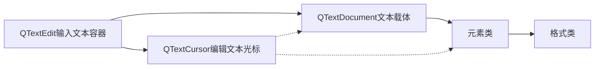

# Qt

# 目录

# 文本编辑类

## 打印类

### QPrinter 打印类

#### 配合printDialog使用

打印文本 / 打印图像，都可以用QPrintDialog和QPrinter

```c++
#include <QPrintDialog>
#include <QPrinter>

void ImgProcessor::ShowPrintText()
{
    QPrinter printer;										// 创建QPrinter对象
    QPrintDialog printDialog(&printer,this);				// 以QPrinter对象创建一个QPrintDialog对象
    if(printDialog.exec())									// 判断标准打印对话框显示后用户是否单击“打印”
    {
        QTextDocument *doc = showWidget->text->document();	// 获得QTextEdit对象文档
        doc->print(&printer);								// 打印
    }
}
```

## 文本编辑功能

### 常用类

编写包含格式设置的文本编辑程序，常用Qt类：

- QTextEdit，输入文本的容器
- QTextDocument，可编辑文本
- QTextCursor，文本光标。提供了对QTextDocument文档的修改接口，所以对QTextDocument的修改都能通过QTextCursor实现
- 元素类
    - QTextBlock
    - QTextList
    - QTextFrame
    - QTextTable
- 格式类
    - QTextCharFormat
    - QTextBlockFormat
    - QTextListFormat
    - QTextFrameFormat
    - QTextTableFormat
    - 等

文本编辑类各类之间的划分与关系



### 加粗


### 斜体


### 下划线


### 颜色


