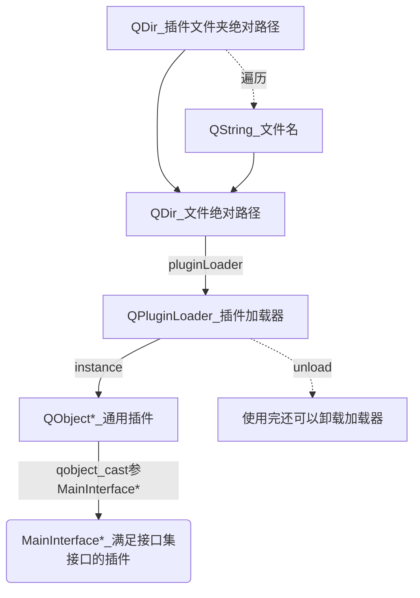

# Qt

# 目录

# .dll.so 插件文件 & 创建插件

注：插件的笔记之前因为系统崩溃而坏掉了（5k多字啊，大大的惨），所以我不得不重新写了一遍，所以内容可能会有点缺失

可另参考另一篇笔记：**Dev > Tools > 辅助文件 > 动态库和静态库**

参考

- [【Qt官网】How to Create Qt Plugins](https://doc.qt.io/qt-5/plugins-howto.html)
- [【51CTO博客】Qt高级——Qt插件开发](https://blog.51cto.com/u_9291927/2107320#h11)，介绍了多种不同种类的插件
- https://blog.csdn.net/Mr_robot_strange/article/details/108469284，**自定义到设计师界面**

## 各种插件

### TEMPLATE的LIB和插件

```properties
TEMPLATE = LIB
```

包括lib、dll

其中插件是特殊的LIB模板

共同点和区别

| C/C++文件              | LIB模板                                                      | 插件                                                         |
| ---------------------- | ------------------------------------------------------------ | ------------------------------------------------------------ |
|                        |                                                              | 本质上也是LIB模板                                            |
| 与要使用的项目一同编译 | 不一同编译，生成dll和lib文件<br />补充：dll和lib区别在与何时链接 | 不一同编译，生成dll和lib文件<br />补充：dll和lib区别在与何时链接 |
| 同项目通过头文件使用   | 其他项目通过头文件使用                                       | 其他项目通过接口类的头文件使用                               |

### SharedPlugin & QtPlugin

> #### 分类
>

Qt支持两种插件方式：高级 API 和低级 API。

高级 API 指的的为Qt软件本身定制插件；

低级 API 指的是为自己写的软件定制插件。

这篇文章主要讲的是如何编写使用一个低级 API，文章属于入门级的，只是简单使用

> #### 区别
>

- SharedPlugin
  - 库
    - QtPlugin（定义接口集），QPluginLoader（加载插件）
  - .pro
    - 指定DESTDIR，使情况INCLUDEPATH
  - 接口文件
    - `#include <QtPlugin>`
    - 需要自定义接口
  - .h
    - `#include 接口文件`并继承
    - 声明宏：`Q_OBJECT`、`Q_PLUGIN_METADATA(IID 插件的标识符)`、`Q_INTERFACES(插件名)`
    - 需要实现插件接口
    - 无`keys()`和`creator()`
  - 使用插件
    - 手动查找目录加载插件
- QtPlugin
  - 库
    - QLibrary
  - .pro
    - 指定DESTDIR，有`CONFIG += plugin`
  - 接口文件
    - 不需要自己定义
  - .h
    - `#include 接口文件`并继承
    - 声明宏：`Q_OBJECT`、`Q_PLUGIN_METADATA(IID 插件的标识符)`、`Q_INTERFACES(插件名)`
    - 需要实现插件接口
    - 有`keys()`和`creator()`
  - 使用插件
    - 配置QApplication一下即可，甚至可以不改源代码直接用命令行实现
- Qt4DesignerCustomWidget
  - 略

### Qt_Plugin & DLL

参考地址：[【CSDN】QT插件和普通动态库的差别？！](https://bbs.csdn.net/topics/390843246?page=1)

Qt 插件本身是动态库，除此之外，它定义了一组专用的接口，从动态库中导出，供 Qt 的插件管理体系发现和调用。
**（即Qt插件在动态库的基础上多了一组专用接口）**

当你选择 Qt 插件项目模板时， QtCreator 会自动为你插入专用接口相关的模板代码。 

假如你从一个白板做起，实现一个动态库，要想客户方调用，还是需要导出 N 多的函数。

而 Qt 这种，只是它约定了你需要导出什么函数、什么类、怎样查询你导出的接口，它定义了一套规范而已。

### 关于库文件后缀

Linux/Unix 系统里静态库扩展名一般是 .a，动态库扩展名一般是 .so 。Windows 系统里 VC 编译器用的静态库扩展名一般是 .lib，动态库扩展名一般是 .dll 。

 MinGW 比较特殊，是将 GNU 工具集和链接库从 Linux/Unix 系统移植到 Windows 里， 有意思的情况就出现了，MinGW  使用的静态库扩展名为 .a ，而其动态库扩展名则为 .dll， .a 仅在生成目标程序过程中使用，.dll 则是在目标程序运行时使用。

### 官网提供的插件Example

官网有很多关于插件的Example

Example中搜索Plugin后的结果

| Name                                                         | Translate                | Tag                                                          | Contain                                 |
| ------------------------------------------------------------ | ------------------------ | ------------------------------------------------------------ | --------------------------------------- |
| 【Desginer】                                                 |                          |                                                              |                                         |
| [Custom widget Plugin Example](https://doc.qt.io/qt-6/qtdesigner-customwidgetplugin-example.html)<br />[Analog Clock Example](https://doc.qt.io/qt-6/qtwidgets-widgets-analogclock-example.html)（非插件） | 自定义控件<br />模拟时钟 | custom designer plugin widget<br />analog android clock ios widgets | Designer Plugin<br />Non-Plugin Version |
| [World Time Clock Plugin Example](https://doc.qt.io/qt-6/qtdesigner-worldtimeclockplugin-example.html)<br />+ World Time Colock Builder Example | 世界时钟                 | clock designer plugin time world<br />builder clock designer time world | Designer Plugin<br />Normal             |
| Container Extension Example                                  | 容器扩展                 | container designer extension                                 |                                         |
| Task Muenu Extension Example                                 | 任务菜单                 | designer extension menu task                                 |                                         |
| 【Widget】                                                   |                          |                                                              |                                         |
| [Echo Plugin Example](https://doc.qt.io/qt-6/qtwidgets-tools-echoplugin-example.html) | 回声插件                 | echo plugin widget                                           | SharedPlugin                            |
| [Style Plugin Example](https://doc.qt.io/qt-6/qtwidgets-tools-styleplugin-example.html) | 风格插件                 | plugin style widgets                                         | QtPlugin - QStylePlugin                 |
| Plugin & PaintBasic Tools Example                            | 绘画                     | basic paint plug tools widgets                               |                                         |
| Plugin & Paint Example                                       | 绘画                     | paint plug widget                                            |                                         |
| Plugin & Paint Extra Filters Example                         | 绘画                     | extra filters paint plug widgets                             |                                         |
| 【QML/Quick】                                                |                          |                                                              |                                         |
| QML Plugin Example                                           | QML插件                  | plugin qml                                                   |                                         |
| Qt Quick Controls - Flat Style                               | 扁平化插件               | android controls flat quick style                            |                                         |


- 其他参考链接
  - [【Qt官网】如何创建Qt插件 ](https://doc.qt.io/qt-6/plugins-howto.html)（Qt6.1 > 如何创建Qt插件）
  - [【Qt官网】\<QtPlugin\>-定义插件](https://doc.qt.io/qt-6/qtplugin.html)（Qt6.1 > Qt核心 > 插件类 > \<QtPlugin\>-定义插件）
  - [【C语言中文网】Qt编程涉及的属于和名词](http://c.biancheng.net/view/3871.html)

## 【SharedPlugin】QtPlugin + QPluginLoader

参考

- [【CSDN】QT插件框架](https://blog.csdn.net/u011370855/article/details/82924752)，含demo

### 原理简概

原理

- 原理：一个应用程序插件就是实现了一个或多个`接口`（*interface*）
- 接口：由专有的纯虚函数组成的类
- 应用程序和插件之间的通信：通过接口的`虚表`（*virtual table*）来完成的

### 实战 - 项目模板

#### 创建项目模板

库创建流程

- 新建一个C库。文件 > 新建项目 > Library > C库
- 【配置选择】Type 类型
  - Shared Library，动态库（默认项）
  - Statically Linked Library，静态链接库
  - Qt Plugin，Qt插件
- 【配置选择】Qt module 模块
  - 这个无关紧要，后期可以在.pro文件里改`Qt += XXX`
  - 当前面的Type选择了Shared Library / Statically Linked Library
    - None
    - Core（默认项）
    - Gui
    - Widgets
  - 当前面的Type选择了Qt Plugin。这里选项更具体的解释见后面的表格
    - QAccessiblePlugin
    - QGenericPlugin，默认项
    - QIconEnginePlugin
    - QImageIOPlugin
    - QScriptExtensionPlugin
    - QSqlDriverPlugin
    - QStylePlugin
- 【配置选择】Qt插件名称
  - 当前面的Type选择了Shared Library / Statically Linked Library
    - 根据库名自动起名
  - 当前面的Type选择了Qt Plugin
    - 根据选择的Qt module自动起名

#### 项目模板结构

略

#### 使用流程



### 实战 - 网络demo

#### (1) 准备接口集

```c++
#ifndef MAININTERFACE_H
#define MAININTERFACE_H

#include <qstring.h>
#include <QtPlugin>                         // Qt插件类。用于使用后面的Q_DECLARE_INTERFACE()

/** 接口定义，接口集
 *
 *  构成：由纯虚函数和空析构函数组成
 *  作用：插件工程通过接口集实现接口，主工程通过接口集调用插件
 */
class MainInterface
{
public:
    virtual ~MainInterface(){}
    virtual QString name() = 0;
    virtual QString information() = 0;
    virtual QWidget *centerWidget() = 0;
};

/** 声明插件宏。依赖：#include <QtPlugin>
 *  这个宏将给定的标识符(字符串字面值)与称为ClassName的接口类相关联。标识符必须唯一
 *  这里定义标识符为常量是因为插件还会用一次Q_INTERFACES(MainInterface)，修改时方便
 */
#define MainInterface_iid "com.Interface.MainInterface"
Q_DECLARE_INTERFACE(MainInterface, MainInterface_iid)

#endif // MAININTERFACE_H

```

#### (2) 新建一个插件

创建插件时Type 类型选择Shared Library

#### (3) 编写插件代码

.h

为了方便这里直接在头文件而非cpp文件实现接口功能了

```c++
#ifndef GENERICPLUGIN_H
#define GENERICPLUGIN_H

#include <QGenericPlugin>
#include <QPushButton>                                  // 需要在【.pro】文件加载插件Qt+=widget，不然会说找不到QPushButton
#include "maininterface.h"                              // 这里需要在【.pro】文件INCLUDEPATH +=../MainWindow，不然会说找不到头文件。另一种方案就是复制多个接口集文件

class GenericPlugin : public QGenericPlugin
        ,public MainInterface                           // MainWindow中定义的接口集（抽象基类）
{
    /** 元对象系统宏*/
    Q_OBJECT
    /** 插件元数据宏
     *  这个宏被用来声明元数据，该元数据是实例化这个对象的插件的一部分。
     * 宏需要声明通过对象实现的接口的IID，并引用包含插件元数据的文件。
     * 在Qt插件的源代码中应该只出现一次这个宏。*/
    //Q_PLUGIN_METADATA(IID QGenericPluginFactoryInterface_iid FILE "RichTextEditor.json")// 自动生成的，必须写
    Q_PLUGIN_METADATA(IID MainInterface_iid)
    /** 插件宏
     *  这个宏告诉Qt这个类实现了哪些接口。这是在实现插件时使用的。*/
    Q_INTERFACES(MainInterface)                         // 声明插件的宏，必须写

public:
    explicit GenericPlugin(QObject *parent = nullptr){}
    ~GenericPlugin(){qDebug()<<"~GenericPlugin";}

    /** 下面三个都是重写纯虚函数
     * 接口的重写都是公有方法
     * 其中override是C++11的语法，表示这些都是纯虚函数的重写
     */
    virtual QString name() override {return "one";}
    virtual QString information() override {return "one_info";}
    virtual QPushButton *centerWidget() override {return new QPushButton("One");}

private:
    QObject *create(const QString &name, const QString &spec) override;
};

#endif // GENERICPLUGIN_H

```

#### (4) 插件的使用

```c++
/** 构造函数初始化调用，加载插件并返回插件个数
 * @brief MainWindow::loadPlugins 加载插件、插件放在plugins文件夹下
 * @return 返回插件的个数
 */
int MainWindow::loadPlugins()
{
    int count  = 0;
    QDir qdir = QDir();
    QDir pluginsDir = QDir(qApp->applicationDirPath());                 // 获取应用路径（指pro中DESTDIR的参）并构造QDir
    if(!pluginsDir.cd("plugins")) return -1;                            // 查看是否存在plugins目录
    foreach (QString fileName, pluginsDir.entryList(QDir::Files))       // 循环加载plugins目录中的插件，entryList返回QStingList
    {
        /* 里面返回目录中文件的【绝对路径名】，然后加载插件（加载插件需要绝对路径）*/
        QPluginLoader pluginLoader(pluginsDir.absoluteFilePath(fileName));
        /* 这个QObject就是插件，将插件实例化，这个时候会调用插件类的构造函数*/
        QObject *plugin = pluginLoader.instance();
        /* 注意的是该目录下不仅仅有dll插件还有同插件生成的其他文件，只有插件才会通过（但dll不一定通过）*/
        if(plugin)
        {
            MainInterface* centerInterface = qobject_cast<MainInterface*>(plugin);  // 把插件实例类型转换为接口一样的东西
            /* 转换不成功则返回0，可据此判断是否是符合MainInterface接口的插件 */
            if(centerInterface)
            {
                count++;
                QPushButton *btn1 = new QPushButton(centerInterface->name(),this);  // 根据接口中的name以text来new
                btn1->setGeometry((count-1)*80,0,80,35);
                connect(btn1,&QAbstractButton::clicked,this,[=](){
                    auto centerWidget = centerInterface->centerWidget();            // 返回一个QOPushButton
                    setCentralWidget(centerWidget);
                });
                // pluginLoader.unload();	// 使用完了还可以卸载插件
            }
        }
    }
    return count;
}
```

### 补充 - 插件通信

参考：https://blog.csdn.net/kenfan1647/article/details/107493294

- 首先，改一下接口，增加一个插件间通信的结构体，增加插件发送消息和接收消息的纯虚函数供插件实现
- 修改插件01如下，实现插件接口的信息接收函数，将插件接口的发送函数实现为信号
- 然后是插件02，几乎一样的代码
- 插件管理器做如下修改（PluginLoader的PluginManager）

大致原理

- (1) 插件A的sendMsgToManager信号触发管理器的槽（相当于监听信息发送请求）
- (2) 管理器的槽调用插件B的recMsgFromManager函数

## 【QtPlugin】QLibrary

参考

- [【Qt官网】How to Create Qt Plugins](https://doc.qt.io/qt-5/plugins-howto.html)
- 《C++ GUI Qt4编程》（第二版）p366
- [【个人博客】Qt5个人软件插件使用（低级API）](https://itzhai.cn/xuexijiaocheng/1115.html)，QtPlugin

### 原理简概

- #### 简概

  - `动态库`（也称为`共享库`或者`动态链接库`），是存储在磁盘上一个单独文件中的独立模块，**可以被多个应用程序访问**

- #### 两种类型

  - 程序通常会在连接的时候指明它们所需动态库

    例如：

    ```
    LIBS		+= -ldb_cxx
    INCLUDEPATH	+= /usr/local/BerkeleyDB.4.2/include
    ```

  - 另一种方式是在需要的时候动态加载这个库（插件）

    Qt提供的`QLibrary`类可以使用一种与平台无关的方式来实现这一点（即给定库名字后会在该平台的标准位置搜索这个库）。例如：

    Windows的xxx.dll，[Linux的xxx.so](http://xn--Linuxxxx-775t.so)、Mac OS X的xxx.dylib

- #### 应用

  - 利用插件可以对现存的GUI应用程序进行扩展。插件就是一个动态库

- #### 举例

  - 可以使用很多插件类型来扩展Qt，常用的有：数据库驱动程序、图像格式、风格和文本编码解码器

- #### 实现

  - 至少需要两个类
  - 插件`封装器类`：实现了插件的通用API函数
  - 一个或多个`处理器类`：实现了一种用于特殊类型插件的API
  - 通过`封装器类`才能访问这些`处理器类`

- #### 开发示例

  - 书中实现两个插件
  - QStyle，用于Bronze风格中
  - 读取Windows单色光标文件的插件

- #### 原理

  - 会自动查找各个插件，如果找到一个风格插件，它将会在它的Form->Preview子菜单中提供一个浏览该风格的子目录
  - Qt应用程序在可执行文件所在目录的plugins目录中查找插件
  - 如果希望把Qt插件配置到与此不同的目录中，那么就需要使用`QCoreApplication::addLibraryPath()`来扩展插件的搜索路径
  - 或者在启动程序之前设置`QT_PLUGIN_PATH`环境变量

### 实战 - 项目模板

#### 项目模板创建

库创建流程

- 新建一个C库。文件 > 新建项目 > Library > C库
- 【配置选择】Type 类型
  - Shared Library，动态库（默认项）
  - Statically Linked Library，静态链接库
  - Qt Plugin，Qt插件
- 【配置选择】Qt module 模块
  - 这个无关紧要，后期可以在.pro文件里改`Qt += XXX`
  - 当前面的Type选择了Shared Library / Statically Linked Library
    - None
    - Core（默认项）
    - Gui
    - Widgets
  - 当前面的Type选择了Qt Plugin。这里选项更具体的解释见后面的表格
    - QAccessiblePlugin
    - QGenericPlugin，默认项
    - QIconEnginePlugin
    - QImageIOPlugin
    - QScriptExtensionPlugin
    - QSqlDriverPlugin
    - QStylePlugin
- 【配置选择】Qt插件名称
  - 当前面的Type选择了Shared Library / Statically Linked Library
    - 根据库名自动起名
  - 当前面的Type选择了Qt Plugin
    - 根据选择的Qt module自动起名

#### Qt的插件类和处理器类补充

*仅在Linux下Qt/Embedded中可用

| 含义         | 插件类                     | 处理器基类（即create函数返回值） |
| ------------ | -------------------------- | -------------------------------- |
| 默认插件     | **QGenericPlugin**         | QObject *                        |
|              | QAccessibleBridgePlugin    | ~~QAccessibleBridge~~            |
|              | **QAccessiblePlugin**      | QAccessibleInterface *           |
|              | QDecorationPlugin*         | ~~QDecoration *~~                |
| 字体引擎插件 | QFontEnginePlugin          | ~~QAbstractFontEngine~~          |
| 图标引擎插件 | **QIconEnginePlugin**      | QIconEngine *                    |
| 图像IO插件   | **QImageIOPlugin**         | QImageIOHandler *                |
| 输入内容插件 | QInputContextPlugin        | ~~QInputContext~~                |
| Kdb引擎插件  | QKbdDriverPlugin*          | ~~QWSKeyboardHandler *~~         |
| 鼠标驱动插件 | QMouseDriverPlugin*        | ~~QWSMouseHandler *~~            |
| 图片格式插件 | QPictureFormatPlugin       | N/A（无create函数）              |
| 屏幕驱动插件 | QScreenDriverPlugin*       | ~~QSceen *~~                     |
| 脚本扩展插件 | **QScriptExtensionPlugin** | N/A（无create函数）              |
| SQL驱动插件  | **QSqlDriverPlugin**       | QSqlDriver *                     |
| 风格化插件   | **QStylePlugin**           | QStyle *                         |
| 文本编码插件 | QTextCondecPlugin          | ~~QTextCodec~~                   |

#### 项目模板结构

接口集其实就是那个create()函数

详略，翻书

#### 使用流程

插件的使用

```c++
QApplication::setStyle("Bronze");


// 或者命令行
./spreadsheet -style bronze
```

### 实战 - 书例 QStyle插件

#### 书例的不同（旧版本的不同）

书例的吐槽：很多地方和实际生成的空demo不同

比如实际demo没有keys()函数，而用来一个存储keys的json文件

这书上大多数的例程都无法正常运行，而且有时用了非本章内容的函数，让人迷惑得不得了

#### 实战

生成三个文件

- .pro，但与之前的有所不同
- .h， 提供`QStylePlugin`子类，用作该风格的封装器
- .cpp，提供`QStylePlugin`子类，用作该风格的封装器

> ##### .h

```
class BronzeStylePlugin : public QStylePlugin
{
public:
    /* 所有的插件至少要提供一个keys()函数和一个create()函数 */
    QStringList keys() const;			// keys()函数返回一个该插件可以创建的对象列表
    QStyle *create(const QString &key);	// create()函数返回一个给定键的对象，该键必须与由keys()函数返回的列表中的一个相同
}
```

> ##### .cpp

```
QStringList BronzeStylePlugin::keys() const
{
    return QStringList() << "Bronze";	// 字母键不分大小写
}

QStyle *BronzeStylePlugin::create(const QString &key)
{
    if(key.toLower()=="bronze")			// 字母键不分大小写
        return new BornzeStyle;			// 如果该键是“Bronze”，就创建一个BronzeStyle对象并返回
    return 0;
}

/* 宏，放在文件的最后
 * 第一个参数：目标库名字去除任意扩展符
 * 第二个参数：插件的类名
**/
Q_EXPORT_PLUGIN2(bronzestyleplugin, BronzeStylePlugin)	
```

> ##### .pro

插件的.pro文件与应用程序的.pro文件不同

```
TEMPLATE	= lib							# 应用程序时为`app`，而这里是`lib`
CONFIG		+=plugin						# 表示这个库不是`通用库`，而是一个`插件库`
HEADERS		= ../bronze/bronzestyle.h\
			  bronzestyleplugin.h
SOURCES		= ../bronze/bronzestyle.cpp\
			  bronzestyleplugin.cpp
RESOURCES	= ../bronze/bronze.qrc
DESTDIR		= $$[QT_INSTALL_PLUGINS]/styles	# 这个插件应当存放的目录，这里表示软件安装路径下的plugins目录的styles子目录
```

> ##### 注意项

注意：使用release模式和debug模式为Qt构建的插件是不同的，一般需要在.pro文件中指明要使用的是哪个文件

如`CONFIG += release`

> ##### 使用

```
QApplication::setStyle("Bronze");
```

或`./spreadsheet -style bronze`

### 实战 - 书例 读取Windows单色光标文件

略

## 【Qt4 Designer Custom Widget】

参考：

- [【CSDN】Qt--自定义插件并集成到Qt Designer](https://blog.csdn.net/Mr_robot_strange/article/details/108469284)
- [【CSDN】关于QT自定义控件（Custom Widget）相关知识总结](https://blog.csdn.net/lv75543255/article/details/8797574)

### 原理简概

SharedPlugin & DesignerPlugin：
从实现上来讲，DesignerPlugin是SharedPlugin的高级封装，提供了更好的封装和更多的功能，简化了用户操作

与低级api相比，Qt4 Designer Custom Widget：

- 不需要自己提供接口，插件继承Qt提供的设计师自定义控件接口：QDesignerCustomWidgetInterface

  `class CustomWidgetTestPlugin : public QObject, public QDesignerCustomWidgetInterface{}`

- 不需要使用 QPluginLoader 动态加载插件，也可以直接使用。Qt可以帮你自动加载（构建时确定文件路径，比遍历文件夹更快）

  只需要`LIBS +=`添加lib检索路径，和在根目录添加dll文件

### 实战 - 项目模板

#### 创建项目模板

- 文件 > 新建文件或项目 > 其他项目 > Qt4设计师自定义控件 > 
  - Lcation和Kits：略
  - Custom Widgets：新建一个控件类。详见文件举例：
    - 控件项目文件：customwidgettest.pri
    - 控件头文件：customwidgettest.h
    - 控件源文件：customwidgettest.cpp
    - 控件的基类：QWidget
    - 插件类名：CustomWidgetTestPlugin
    - 插件头文件：customwidgettestplugin.h
    - 插件源文件：customwidgettestplugin.cpp
  - Plugin Details：默认

#### 项目模板结构

Qt4DesignerCustomWidget

- Qt4DesignerCustomWidget.pro
- customwidgettest.pri，控件类
  - customwidgettest.h，控件类
  - customwidgettest.cpp，控件类
- customwidgettestplugin.h，控件插件类
- customwidgettestplugin.cpp，控件插件类
- icons.qrc

pro

```properties
CONFIG      += plugin debug_and_release		# 编译一个插件，同时具有调试库和发布库
TARGET      = $$qtLibraryTarget(customwidgettestplugin)
TEMPLATE    = lib							# lib模板

HEADERS     = customwidgettestplugin.h
SOURCES     = customwidgettestplugin.cpp
RESOURCES   = icons.qrc
LIBS        += -L. 							# lib检索路径为当前文件夹

greaterThan(QT_MAJOR_VERSION, 4) {
    QT += designer
} else {
    CONFIG += designer
}

# 该两句联合使用
# target.path定义描述了安装生成目标的位置
# installs分配将生成目标添加到要安装的现有资源列表中
target.path = $$[QT_INSTALL_PLUGINS]/designer
INSTALLS    += target

include(customwidgettest.pri)				# pri

```

customwidgettest.h，控件类

```c++
#ifndef CUSTOMWIDGETTEST_H
#define CUSTOMWIDGETTEST_Haw

#include <QWidget>

class CustomWidgetTest : public QWidget
{
    Q_OBJECT

public:
    CustomWidgetTest(QWidget *parent = 0);
};

#endif // CUSTOMWIDGETTEST_H

```

customwidgettest.cpp，控件类

```c++
#include "customwidgettest.h"

CustomWidgetTest::CustomWidgetTest(QWidget *parent) :
    QWidget(parent)
{
// 可以在里面嵌套控件，如下
//    QLayout *lay = new QVBoxLayout(this);
//    QPushButton *btn = new QPushButton("customwidget",this);
//    QPushButton *btn2 = new QPushButton("customwidget2",this);
//    lay->addWidget(btn);
//    lay->addWidget(btn2);
}

```

customwidgettestplugin.h，控件插件类

```c++
#ifndef CUSTOMWIDGETTESTPLUGIN_H
#define CUSTOMWIDGETTESTPLUGIN_H

#include <QDesignerCustomWidgetInterface>

class CustomWidgetTestPlugin : public QObject, 
				public QDesignerCustomWidgetInterface	// 继承，实现接口
{
    Q_OBJECT											// 启用元对象系统
    Q_INTERFACES(QDesignerCustomWidgetInterface)		// 接口
#if QT_VERSION >= 0x050000
    Q_PLUGIN_METADATA(IID "org.qt-project.Qt.QDesignerCustomWidgetInterface")
#endif // QT_VERSION >= 0x050000

public:
    CustomWidgetTestPlugin(QObject *parent = 0);		// 构造函数

    bool isContainer() const;							// 主要的纯虚接口实现
    bool isInitialized() const;
    QIcon icon() const;
    QString domXml() const;
    QString group() const;
    QString includeFile() const;
    QString name() const;
    QString toolTip() const;
    QString whatsThis() const;
    QWidget *createWidget(QWidget *parent);
    void initialize(QDesignerFormEditorInterface *core);

private:
    bool m_initialized;
};

#endif // CUSTOMWIDGETTESTPLUGIN_H

```

customwidgettestplugin.cpp，控件插件类

```c++
#include "customwidgettest.h"
#include "customwidgettestplugin.h"

#include <QtPlugin>

CustomWidgetTestPlugin::CustomWidgetTestPlugin(QObject *parent)
    : QObject(parent)
{
    m_initialized = false;
}

void CustomWidgetTestPlugin::initialize(QDesignerFormEditorInterface * /* core */)
{														// 初始化插件
    if (m_initialized)
        return;

    // Add extension registrations, etc. here

    m_initialized = true;
}

bool CustomWidgetTestPlugin::isInitialized() const		// 是否已经初始化
{
    return m_initialized;
}

QWidget *CustomWidgetTestPlugin::createWidget(QWidget *parent)
{
    return new CustomWidgetTest(parent);				// 【主要接口】返回Widget控件
}

QString CustomWidgetTestPlugin::name() const			// 插件信息 - 控件名
{
    return QLatin1String("CustomWidgetTest");
}

QString CustomWidgetTestPlugin::group() const
{
    return QLatin1String("");
}

QIcon CustomWidgetTestPlugin::icon() const				// 插件信息 - 控件图标
{
    return QIcon();
}

QString CustomWidgetTestPlugin::toolTip() const
{
    return QLatin1String("");
}

QString CustomWidgetTestPlugin::whatsThis() const		// 插件信息 - 插件接介绍
{
    return QLatin1String("");
}

bool CustomWidgetTestPlugin::isContainer() const		// 插件信息 - 是否是容器
{
    return false;
}

QString CustomWidgetTestPlugin::domXml() const			// 返回一个 UI 文件片段，
{														// Qt Designer 的小部件工厂使用它来创建自定义小部件及其适用的属性
    return QLatin1String("<widget class=\"CustomWidgetTest\" name=\"customWidgetTest\">\n</widget>\n");
//    例如：
//    return "<ui language=\"c++\">\n"
//           " <widget class=\"WorldTimeClock\" name=\"worldTimeClock\">\n"
//           "  <property name=\"geometry\">\n"
//           "   <rect>\n"
//           "    <x>0</x>\n"
//           "    <y>0</y>\n"
//           "    <width>100</width>\n"
//           "    <height>100</height>\n"
//           "   </rect>\n"
//           "  </property>\n"
//           " </widget>\n"
//           "</ui>";
}

QString CustomWidgetTestPlugin::includeFile() const		//
{
    return QLatin1String("customwidgettest.h");
}
#if QT_VERSION < 0x050000
Q_EXPORT_PLUGIN2(customwidgettestplugin, CustomWidgetTestPlugin)
#endif // QT_VERSION < 0x050000

```

#### 使用流程

- 创建项目

  - 如上

- 项目完善

  - 完善自定义控件代码，`Q_PROPERTY`定义的属性之后会出现在Qt Designer属性栏中。例下

    ```c++
    Q_OBJECT	// 在Q_OBJECT宏的下面写
    QQ_PROPERTY(QColor Color_frame_outCircle READ getColor_frame_outCicle WRITE setColor_frame_outCircle)
    ```

- 控件发布

  - 选择`Release`版本，先`qmake`，再`构建`

- 开始集成

  - 拷贝
    - Qt版本和kit版本都要与前面的构建路径相对应，MSVC需要拷贝.dll和.lib，MinGW需要拷贝.dll和.a
    - 拷贝后无需重启QT即可使用
    - 拷贝到Qt中的路径：`安装路径\QT\6.0.3\msvc2019_64\plugins\designer`
  - 可视化
    - QtCreator界面编辑器界面不显示，在QtDesigner中能显示
    - 即需要右键ui文件 > 用...打开 > 选QtDesigner而不选界面编辑器，后者是QtDesigner集成在QtCreator中的建议版本
  - ~~include简化~~
    - ~~拷贝到Qt中的路径：`安装路径\QT\6.0.3\msvc2019_64\include\DIY自定义文件夹`~~

- 开始使用

  - 集成后使用：打开相应版本的Designer，在ui文件中直接拖拽自定义控件使用即可
  - 非集成使用：则将工程复制到使用它的工程目录，include(.pri)，再一起构建

- 报错

  - ```shell
    "QFormBuilder was unable to create a widget of the class 'CustomWidgetTest'."
    "QFormBuilder was unable to create a widget of the class 'CustomWidgetTest'."
    "Empty widget item in QHBoxLayout 'horizontalLayout'."
    ```

  - 原因：可能是当前项目构建的版本和库的版本不同

### 实战 - 官网案例 World Time Clock Plugin

- 插件构建
  - 官网案例：World Time Clock Plugin Example工程
  - 案例路径：`安装路径\QT\Examples\Qt-6.0.3\designer\worldtimeclockplugin`
- 插件构建
  - 选择release
  - 构建路径：`安装路径\QT\Examples\Qt-6.0.3\designer\build- ... _MSVC2019_64bit-Release`
- 插件集成
  - 拷贝
    - Qt版本和kit版本都要与前面的构建路径相对应，MSVC需要拷贝.dll和.lib，MinGW需要拷贝.dll和.a
    - 拷贝后无需重启QT即可使用
    - 拷贝到Qt中的路径：`安装路径\QT\6.0.3\msvc2019_64\plugins\designer`
  - 可视化
    - QtCreator界面编辑器界面不显示，在QtDesigner中能显示
    - 即需要右键ui文件 > 用...打开 > 选QtDesigner而不选界面编辑器，后者是QtDesigner集成在QtCreator中的建议版本
  - ~~include简化~~
    - ~~拷贝到Qt中的路径：`安装路径\QT\6.0.3\msvc2019_64\include\DIY自定义文件夹`~~
- 插件使用
  - 官网案例：World Time Colock Builder Example工程
  - 案例路径：`安装路径\QT\Examples\Qt-6.0.3\designer\worldtimeclockbuilder`
    也就是`$$[QT_INSTALL_EXAMPLES]/designer/worldtimeclockbuilder`
  - 注意：因为前面拷贝的是release版本的插件，也没CONFIG设置debug_and_release
    所以用Debug会报错：QFormBuilder was unable to create a widget of the class 'WorldTimeClock'，需要Release才能使用

---

项目观察

与Qt4DesignerCustomWidget一样，同样是继承了`QDesignerCustomWidgetInterface`

```c++
class WorldTimeClockPlugin : public QObject,
                             public QDesignerCustomWidgetInterface
```

但是项目结构比起默认项目模板稍简洁一些，没有.pri文件，原.pri中的.h.cpp文件不变

没有

```properties
Qt += uiplugin
```

### 使用 - 飞扬青云插件

基本使用

详见

- [【QTCN】Qt自定义控件集成到全平台QtCreator效果图](http://www.qtcn.org/bbs/read-htm-tid-90117.html)
- [【Github】飞扬青云控件Github](https://github.com/feiyangqingyun/qucsdk) 或 [【Gitee】飞扬青云QUCSDK](https://gitee.com/feiyangqingyun/QUCSDK)

#### 使用说明（作者的文档说明）

> 1. 第一步：前提是qt版本、编译器类型、编译器版本、编译器位数必须完全一致。
> 2. 第二步：找到qt安装目录的库所在的bin目录，同级有个plugins文件夹，plugins文件夹下有个designer目录，将对应插件文件例如 quc_5_7_0_msvc2013_32.dll 放到此目录即可。
>    - windows系统上Qt Designer设计师动态库存放的地址一般是  C:\Qt\Qt5.15.2\5.15.2\mingw81_64\plugins\designer，Qt Creator动态库存放的地址一般是  C:\Qt\Qt5.15.2\Tools\QtCreator\bin\plugins\designer。
>    - linux系统上Qt Designer设计师动态库存放的地址一般是  /home/liu/Qt/Qt5.14.0/5.14.0/gcc_64/plugins/designer，Qt  Creator动态库存放的地址一般是  /home/liu/Qt/Qt5.14.0/Tools/QtCreator/lib/Qt/plugins/designer。
>    - mac系统上Qt Designer设计师动态库存放的地址一般是  /Users/liu/Qt/5.15.2/clang_64/plugins/designer，Qt Creator动态库存放的地址一般是  /Users/liu/Qt/Qt Creator.app/Contents/PlugIns/designer。
> 3. 第三步：双击bin目录下的designer.exe，打开提供的demo.ui，即可看到效果。或者新建个空白UI然后从左边的控件栏里面拖动过去。
> 4. 如果想集成到qtcreator中，则必须保证你下载的库版本必须和你的qtcreator所用的**qt版本+编译器+位数完全一致**才行，很可能集成安装包中的qtcreator版本是上一个qt版本编译的，这样是无法集成进去的，推荐用qt5.12.3这个集成安装包，如果你是msvc编译器那是可以顺利集成进去的。
> 5. 非官方使用图文教程 https://blog.csdn.net/u014779536/article/details/106923566

#### 踩坑补充

> QtCreator菜单帮助 >  AboutQtCreator中能查看QtCreator的Qt版本（Based on Qt 5.15.2 MSVC 2019  64bit），然后要放对应版本的dll到QtCreator的plugin/designer目录中。否则就会Designer中能检测到而QtCreatorDesigner中检测不到控件的问题
>
> 当然这只是浏览用的，构建时还是使用的构建器的版本。也就是说QtCreator版本的Designer并不会随你选择的构建器改变而改变！

### 参考 - 官网案例 CustomWidgetPlugin

好像是 World Time Clock Plugin 官网案例的无信号槽版本

项目结构

pro

```properties
#! [0]
QT          += widgets uiplugin
#! [0]

QTDIR_build {
# This is only for the Qt build. Do not use externally. We mean it.
PLUGIN_TYPE = designer
PLUGIN_CLASS_NAME = AnalogClockPlugin
load(qt_plugin)
CONFIG += install_ok
} else {
# Public example:

#! [2]
CONFIG      += plugin
TEMPLATE    = lib
#! [2]

TARGET = $$qtLibraryTarget($$TARGET)

target.path = $$[QT_INSTALL_PLUGINS]/designer
INSTALLS += target

}

#! [3]
HEADERS     = analogclock.h \
              customwidgetplugin.h
SOURCES     = analogclock.cpp \
              customwidgetplugin.cpp
OTHER_FILES += analogclock.json
#! [3]

```

analogclock.h

```c++
// Copyright (C) 2016 The Qt Company Ltd.

#ifndef ANALOGCLOCK_H
#define ANALOGCLOCK_H

#include <QWidget>
#include <QtUiPlugin/QDesignerExportWidget>

class QDESIGNER_WIDGET_EXPORT AnalogClock : public QWidget
{
    Q_OBJECT

public:
    explicit AnalogClock(QWidget *parent = nullptr);

protected:
    void paintEvent(QPaintEvent *event) override;
};

#endif

```

analogclock.cpp

```c++
// Copyright (C) 2016 The Qt Company Ltd.

#include "analogclock.h"

#include <QMouseEvent>
#include <QPainter>
#include <QTime>
#include <QTimer>

AnalogClock::AnalogClock(QWidget *parent)
    : QWidget(parent)
{
    QTimer *timer = new QTimer(this);
    connect(timer, &QTimer::timeout, this, QOverload<>::of(&QWidget::update));
    timer->start(1000);

    setWindowTitle(tr("Analog Clock"));
    resize(200, 200);
}

void AnalogClock::paintEvent(QPaintEvent *)
{
    static const QPoint hourHand[3] = {
        QPoint(7, 8),
        QPoint(-7, 8),
        QPoint(0, -40)
    };
    static const QPoint minuteHand[3] = {
        QPoint(7, 8),
        QPoint(-7, 8),
        QPoint(0, -70)
    };

    QColor hourColor(127, 0, 127);
    QColor minuteColor(0, 127, 127, 191);

    int side = qMin(width(), height());
    QTime time = QTime::currentTime();

    QPainter painter(this);
    painter.setRenderHint(QPainter::Antialiasing);
    painter.translate(width() / 2, height() / 2);
    painter.scale(side / 200.0, side / 200.0);

    painter.setPen(Qt::NoPen);
    painter.setBrush(hourColor);

    painter.save();
    painter.rotate(30.0 * ((time.hour() + time.minute() / 60.0)));
    painter.drawConvexPolygon(hourHand, 3);
    painter.restore();

    painter.setPen(hourColor);

    for (int i = 0; i < 12; ++i) {
        painter.drawLine(88, 0, 96, 0);
        painter.rotate(30.0);
    }

    painter.setPen(Qt::NoPen);
    painter.setBrush(minuteColor);

    painter.save();
    painter.rotate(6.0 * (time.minute() + time.second() / 60.0));
    painter.drawConvexPolygon(minuteHand, 3);
    painter.restore();

    painter.setPen(minuteColor);

    for (int j = 0; j < 60; ++j) {
        if ((j % 5) != 0)
            painter.drawLine(92, 0, 96, 0);
        painter.rotate(6.0);
    }
}

```

CustomWidgetPlugin.h

```c++
// Copyright (C) 2016 The Qt Company Ltd.

#ifndef CUSTOMWIDGETPLUGIN_H
#define CUSTOMWIDGETPLUGIN_H

#include <QtUiPlugin/QDesignerCustomWidgetInterface>

//! [0]
class AnalogClockPlugin : public QObject, public QDesignerCustomWidgetInterface
{
    Q_OBJECT
    Q_PLUGIN_METADATA(IID "org.qt-project.Qt.QDesignerCustomWidgetInterface")
    Q_INTERFACES(QDesignerCustomWidgetInterface)
public:
    explicit AnalogClockPlugin(QObject *parent = nullptr);

    bool isContainer() const override;
    bool isInitialized() const override;
    QIcon icon() const override;
    QString domXml() const override;
    QString group() const override;
    QString includeFile() const override;
    QString name() const override;
    QString toolTip() const override;
    QString whatsThis() const override;
    QWidget *createWidget(QWidget *parent) override;
    void initialize(QDesignerFormEditorInterface *core) override;

private:
    bool initialized = false;
};
//! [0]

#endif

```

CustomWidgetPlugin.cpp

```c++
// Copyright (C) 2016 The Qt Company Ltd.

#include "analogclock.h"
#include "customwidgetplugin.h"

#include <QtPlugin>

//! [0]
AnalogClockPlugin::AnalogClockPlugin(QObject *parent)
    : QObject(parent)
{
}
//! [0]

//! [1]
void AnalogClockPlugin::initialize(QDesignerFormEditorInterface * /* core */)
{
    if (initialized)
        return;

    initialized = true;
}
//! [1]

//! [2]
bool AnalogClockPlugin::isInitialized() const
{
    return initialized;
}
//! [2]

//! [3]
QWidget *AnalogClockPlugin::createWidget(QWidget *parent)
{
    return new AnalogClock(parent);
}
//! [3]

//! [4]
QString AnalogClockPlugin::name() const
{
    return QStringLiteral("AnalogClock");
}
//! [4]

//! [5]
QString AnalogClockPlugin::group() const
{
    return QStringLiteral("Display Widgets [Examples]");
}
//! [5]

//! [6]
QIcon AnalogClockPlugin::icon() const
{
    return QIcon();
}
//! [6]

//! [7]
QString AnalogClockPlugin::toolTip() const
{
    return QString();
}
//! [7]

//! [8]
QString AnalogClockPlugin::whatsThis() const
{
    return QString();
}
//! [8]

//! [9]
bool AnalogClockPlugin::isContainer() const
{
    return false;
}
//! [9]

//! [10]
QString AnalogClockPlugin::domXml() const
{
    return "<ui language=\"c++\">\n"
           " <widget class=\"AnalogClock\" name=\"analogClock\">\n"
//! [11]
           "  <property name=\"geometry\">\n"
           "   <rect>\n"
           "    <x>0</x>\n"
           "    <y>0</y>\n"
           "    <width>100</width>\n"
           "    <height>100</height>\n"
           "   </rect>\n"
           "  </property>\n"
//! [11]
           "  <property name=\"toolTip\" >\n"
           "   <string>The current time</string>\n"
           "  </property>\n"
           "  <property name=\"whatsThis\" >\n"
           "   <string>The analog clock widget displays the current time.</string>\n"
           "  </property>\n"
           " </widget>\n"
           "</ui>\n";
}
//! [10]

//! [12]
QString AnalogClockPlugin::includeFile() const
{
    return QStringLiteral("analogclock.h");
}
//! [12]

```

Copyright (C) 2016 The Qt Company Ltd.

```c++
/****************************************************************************
**
** 版权所有(C) 2016 The Qt Company Ltd.
** 联系:https://www.qt.io/licensing/
**
** 该文件是Qt工具包示例的一部分。
**
** $QT_BEGIN_LICENSE:BSD$
** 商用许可证使用
** 持有有效商业Qt许可证的被许可方可以在
** 依照商业许可协议提供的
** 软件，或根据本协议所载条款
** 你和Qt公司之间的书面协议。对许可条款
** 和条件见https://www.qt.io/terms-conditions。为进一步
** 信息请访问https://www.qt.io/contact-us。
**
** BSD License Usage
** 您也可以在BSD许可条款下使用此文件
** 如下:
**
** “无论是否以源代码和二进制形式重新分配和使用修改，只要符合下列条件:
** * 重新发布的源代码必须保留上述版权通知，此条件列表和以下免责声明。
** * 以二进制形式再发布必须复制上述版权通知，此条件列表和以下免责声明随附的文件和/或其他材料分布。
** * 不包括Qt公司的名称，也不包括其名称贡献者可能被用来支持或推广衍生产品未经事先书面许可而使用本软件。
**
**
** 本软件由版权所有人和贡献者提供
** “按现状”及任何明示或默示保证，包括但不包括
** 仅限于，默示的适销性和适用性保证
** 不承认特定目的。在任何情况下，版权都不应
** 所有人或贡献者须对任何直接、间接、附带、
** 特殊的、惩罚性的或间接的损害赔偿(包括但不包括
** 限于，代用品或服务的采购;损失的使用,
** 数据，或利润;或业务中断)
** 责任理论，无论是在合同、严格责任，还是侵权
** (包括因使用而以任何方式产生的疏忽或其他)
** 本软件，即使被告知有可能发生此类损坏。”
**
** $QT_END_LICENSE$
**
****************************************************************************/
```


