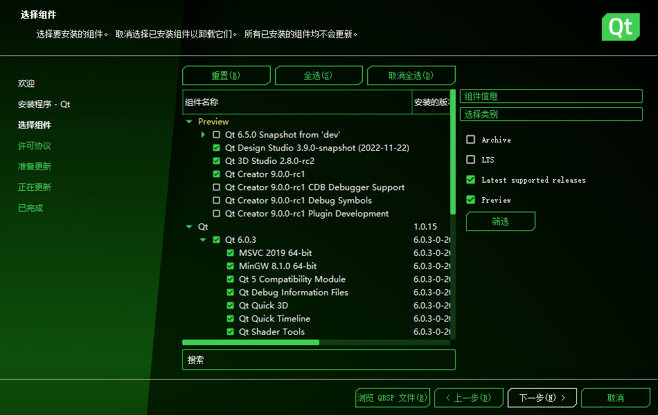

# Qt Creator 升级到9.0版本

- 更新前：4.14.0，Based on Qt 5.15.2 (MSVC 2019, 64bit)，Built on Dec 17 2020 07:57:20
- 更新后：9.0.0，Based on Qt 6.4.0 (MSVC 2019, x86_64)，Built on Nov 9 2022 13:01:49

软件路径：D:\Soft\Dev\Tools\QT\Qt

## 改变

### 界面变好看了些

### 汉化多了

包括 MaintenanceTool 也有汉化了

### MaintenanceTool 变成了 Qt Maintenance Tool

### 首选项菜单 不在 “工具” 而在编辑里

### 默认不开启QmlDesigner插件，要手动开启

