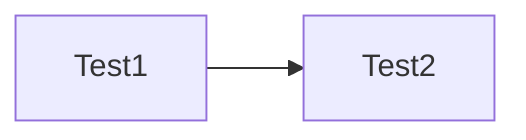
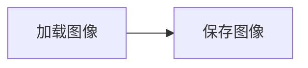

# 绘制类_Canvas2D

## 教程

## 拖拽实现

## 参考应用

### obsidian canvas

示例



源码 (test.canvas)

```json
{
	"nodes":[
		{
      "id":"596a8ae3b61f064d",
      "x":-163, "y":43, "width":250, "height":60,
      "type":"text", "text":"Test1"
    },
		{
      "id":"325ee5e327cac650",
      "x":140,"y":43,"width":250,"height":60,
      "type":"text", "text":"Test2"
    }
	],
	"edges":[
		{
      "id":"d63987b93614f9a3",
      "fromNode":"596a8ae3b61f064d",
      "fromSide":"right",
      "toNode":"325ee5e327cac650",
      "toSide":"left"
    }
	]
}
```

### ComfyUI

示例：空画布

源码 (test.json)

```json
{
  "last_node_id": 0,
  "last_link_id": 0,
  "nodes": [],
  "links": [],
  "groups": [],
  "config": {},
  "extra": {
    "ds": {
      "scale": 0.6830134553650707,
      "offset": [
        257.147659884785,
        81.33431789275437
      ]
    }
  },
  "version": 0.4
}
```

示例：



源码 (workflow.json)

```json
{
  "last_node_id": 2,
  "last_link_id": 1,
  "nodes": [
    {
      "id": 2,
      "type": "SaveImage",
      "pos": {"0": 1290,"1": 508},
      "size": {"0": 315,"1": 58},
      "flags": {}, // collapsed、pinned
      "order": 1,
      "mode": 0,
      "inputs": [
        {
          "name": "images",
          "type": "IMAGE",
          "link": 1,
          "label": "图像"
        }
      ],
      "outputs": [],
      "properties": {},
      "widgets_values": ["ComfyUI"]
    },
    {
      "id": 1,
      "type": "LoadImage",
      "pos": {"0": 822,"1": 506},
      "size": [315,314],
      "flags": {},
      "order": 0,
      "mode": 0,
      "inputs": [],
      "outputs": [
        {
          "name": "IMAGE",
          "type": "IMAGE",
          "links": [1],
          "label": "图像",
          "slot_index": 0
        },
        {
          "name": "MASK",
          "type": "MASK",
          "links": null,
          "label": "遮罩"
        }
      ],
      "properties": {"Node name for S&R": "LoadImage"},
      "widgets_values": ["example.png","image"]
    }
  ],
  "links": [
    [1,1,0,2,0,"IMAGE"]
  ],
  "groups": [],
  "config": {},
  "extra": {
    "ds": {
      "scale": 0.7513148009015777,
      "offset": [255.81665988478542,187.81431789275473]
    }
  },
  "version": 0.4
}
```


