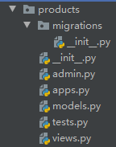
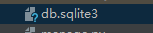

# Py-Django

# 目录

# 网站搭建部分

## 下载安装djiango

Web框架：django，本质是可重用模块的库

```shell
pip install --upgrade pip  # 升级pip可以用
```

ctrl+L  # 清理终端窗口


下载安装djiango

 PyCharm > Terminal > Local 下

```shell
pip install django  # 或 pip install Django==2.0.4。这个下载很慢，可手动
```

## 项目准备

### (1) 创建djiango项目（startproject）

虽然start也有创立的意思，但总觉得莫名奇怪

PyCharm > Terminal > Local 下

```shell
django-admin startproject PythonShop .  # 空格点是当前文件夹下创建项目，省略也行
```

> #### 项目目录结构（创建app前）

```python
项目名
	项目名
        __init__.py  # 表示该文件夹是个包
        settings.py  # Django全局设置，配置文件
        urls.py		 # 网站入口，定义看到'/'时的行为
        wsgi.py		 # web服务器网管的缩写，提供django和web之间接口
    其他子项目1		  # 可以有多个子项目
    其他子项目2		  # 可以有多个子项目
    manaage.py		 # 用来开启服务器的，这个不需要修改
```

例如：PythonShop项目的项目结构【djiango自定义项目包】


### (2) 创建djiango服务器（runserver）？？？

PyCharm > Terminal > Local 下

```shell
python manage.py startapp runserver  # 出错则把python改为python3 / py / 去掉
```


### (3) 创建djiango应用（startapp）

虽然start也有创立的意思，但总觉得莫名奇怪

PyCharm > Terminal > Local(2) 下

```python
python manage.py startapp products
# 添加web服务器 > http://127.0.0.1:8000/，浏览器第二次访问就会出错
# 值得一提的是项目和应用的区别，一个项目是许多个基本应用的集合
```

> #### 项目目录结构（创建app后）

```shell
mysite2
├── app01				# 创建的app
│   ├── __init__.py
│   ├── admin.py        # django默认提供了admin后台管理				【固定，不用动】
│   ├── apps.py         # app启动类								【固定，不用动】
│   ├── migrations      # 数据库变更记录							 【固定，不用动】
│   │   └── __init__.py
│   ├── models.py       # 对数据库操作							  【**重要**】
│   ├── tests.py        # 单元测试									【固定，不用动】
│   └── views.py        # 函数。									【**重要**】
├── manage.py			# 项目的管理，启动项目、创建app、数据管理		 【不要修改】【常用】
└── mysite				# 与项目同名的文件夹（这个不是app）目前这个项目中只有一个app
    ├── __init__.py
    ├── settings.py		# 项目配置								  【常修改】
    ├── urls.py			# URL和函数的对应关系					   【常修改】
    ├── asgi.py 		# 接收网络请求							【不要修改】
    └── wsgi.py			# 接收网络请求							【不要修改】
```

## 创建的应用包文件

products【djiango自定义应用包】



```python
__init__.py  # 表示该文件夹是个包
admin.py  # 管理后台
app.py  # 应用模块，存储该应用配置设置
models.py  # 与数据库操作相关，存入和读取数据时用
        # 这里每一个类，相当于数据库一个表
tests.py  # 编写自动化测试
views.py  # 网页显示模块
        # 主要作前后端交互
urls.py  # 【要新建】网站入口，定义看到'/'时的行为
        # 用作配置路由

'''其他 
templates文件夹  # ？views.py中的函数渲染templates中的HTML模版，得到动态内容网页，可以用缓存来提高速度。
'''
```

当设置了数据库后【网站框架2】



https://sqlitebrowser.org下载数据库工具软件