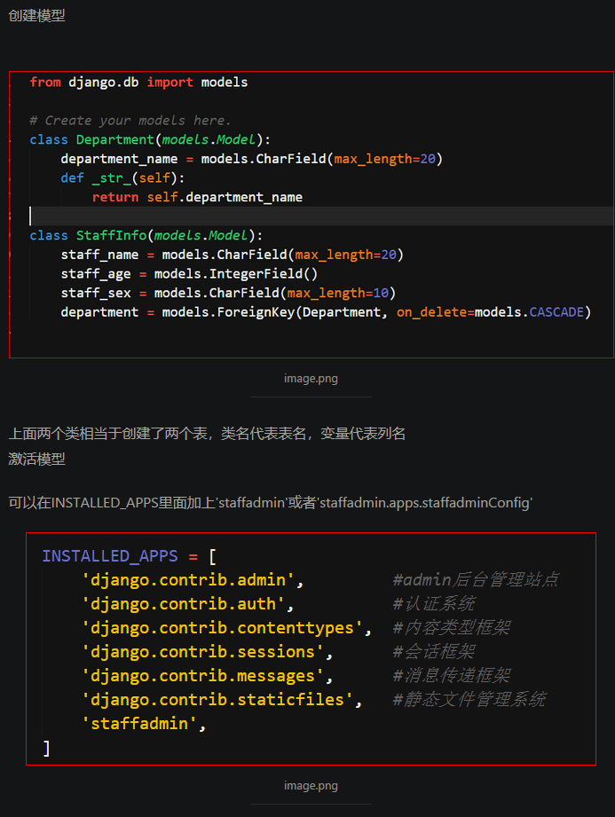
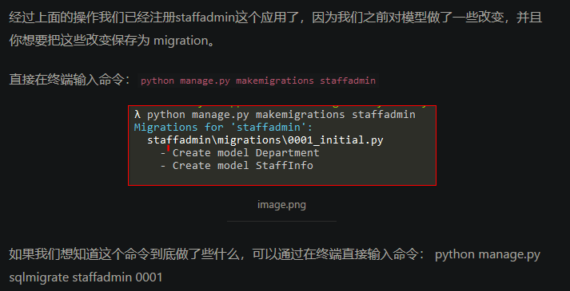

# Py-Django

# 目录

# DB-MySQL

## INSTALLED_APPS下的应用

```python
# 第33行
INSTALLED_APPS = [
    'django.contrib.admin',           # admin后台管理站点
    'django.contrib.auth',            # 认证系统
    'django.contrib.contenttypes',    # 内容类型框架
    'django.contrib.sessions',        # 会话框架
    'django.contrib.messages',        # 消息传递框架
    'django.contrib.staticfiles',     # 静态文件管理系统
    'products.apps.ProductsConfig',   # 【新增】创建模型后添加进设置变量中
                                      # 这里写成products也是可以的 
]
```

原SQLite 改 MySQL 配置


修改时区和中文设置


## 在数据库中创建表

### 在数据库中创建表

```python
python manage.py migrate
```

### 报错信息处理

#### 报错信息——未安装mysqlclient

```sehll
django.core.exceptions.ImproperlyConfigured: Error loading MySQLdb module.
Did you install mysqlclient?
```

#### pip安装PyMySQL

```shell
pip install PyMySQL
```

#### 在django项目中根目录下的__init__.py文件中添加两行代码，不行就在settings.py下添加

```shell
import pymysql  pymysql.install_as_MySQLdb()
```

## 创建模型



创建完写入Setting中

然后：



## 数据库迁移

如果修改了模型（在 models.py 文件中）． 运行 python manage.py makemigrations来为这些修改创建迁移． 运行 python manage.py migrate 来应用这些改变到数据库.