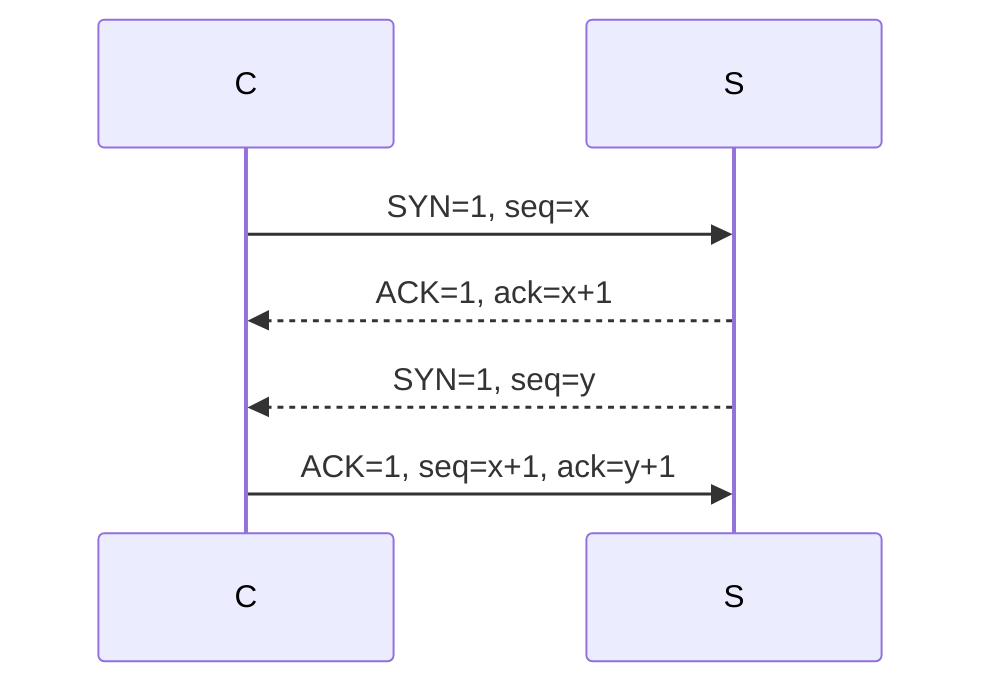
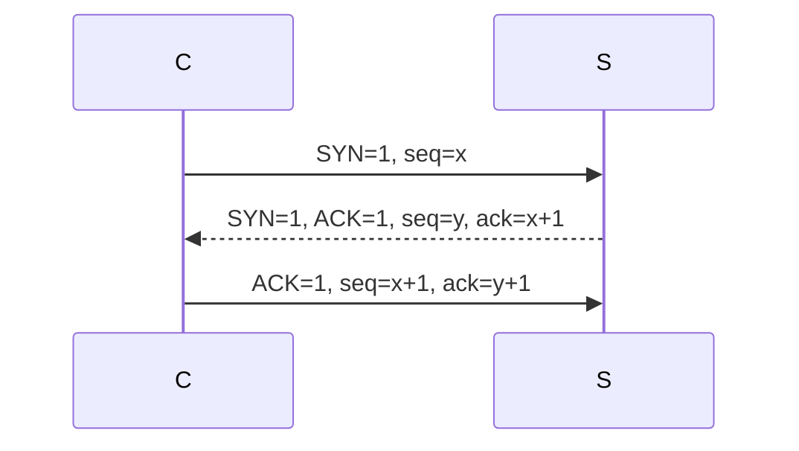
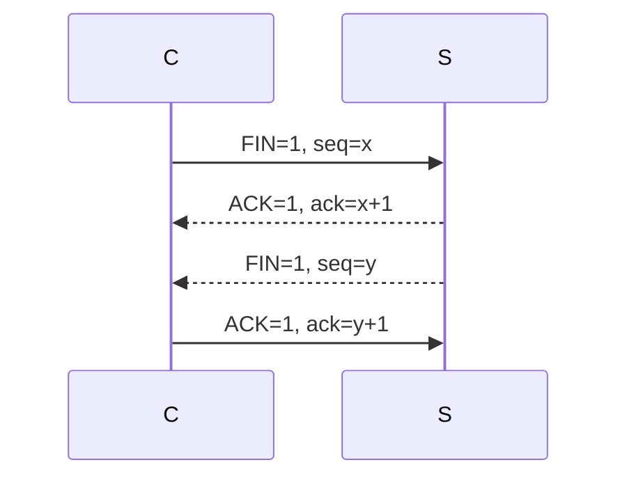

# 面试八股文

## 网络相关面试题

更详细的见 Network 相关笔记，特别是 多路服用技术 的那个笔记，写得比较详细和底层

### tcp和udp区别

- 相同点
  - L4传输层协议
- 可靠
- 传输效率
- 应用场景

|              | tcp                                                          | udp                                                          |
| ------------ | ------------------------------------------------------------ | ------------------------------------------------------------ |
| 面向连接     | 面向连接 三次握手建立连接，四次挥手断开连接，端对端连接 全双工 | 面向无连接 无需握手挥手，可任意连接 (不算，但应用层可以实现) |
| 数据传输方式 | 基于字节流 发送时可能分段和分片 (MTU、MSS的作用) 接收时需要处理黏包问题 | 基于报文 每次收发都是完整报文 _                    |
| 是否可靠     | 可靠。依靠机制： - 分段：来保证大小 - 序列号：保证排序、防止丢失和重传 - 确认应答机制：对端需要ACK确认防止丢失 - 校验和：防止篡改和误码 - 滑动窗口 (拥塞窗口)：实现流量控制，防止包丢失 - 拥塞控制 - 重传机制 | 不可靠。因为无： - 不保证：是否到达 - 不保证：顺序 - 不保证：无误码检测 - 不进行：拥堵控制 - - - |
| 效率         | 低 主要是可靠性造成性能损失，头部信息更大(20)           | 高 主要是不保证可靠，头部信息更少(8)                    |
| 应用场景     | 准确、速度要求不高                                           | 不准确、速度要求快 适合流媒体、实时要求高               |

补充：

- MTU（最大传输单元），常见的MTU大小为1500字节（以太网）
- MSS（最大段大小）

题：

- 为什么需要序列号：为了后面我们的数据包确认
- 为什么三次握手好随机序列号：防止历史连接干扰当前连接建立

### linux系统如何收发网络数据包

#### 背景

- tcp/ip
  - 应用层、传输层、网络层、网络接口层
- 网络协议栈
  - 用户态
    - 应用程序
  - 内核态
    - 系统调用
    - socket
    - L4: tcp、udp
    - L3: ip
    - L2: mac
    - 网卡驱动程序
  - 硬件
    - 网卡
- 数据包的形态
  - 应用程序：data
  - tcp：segment 片段
  - ip：packet 包
  - mac：frame 帧
  - 协议栈：sk_buf

#### 发送网络数据包流程

- tcp
  - send/write
  - (1) 系统调用，sk_buff、socket发送缓冲区。ack
  - (2) 克隆一个新的sk_buff。网卡发出后，删除
  - (3) 依次增加 tcp/udp、ip、mac帧的帧头帧尾
  - (4) 触发软中断：网卡驱动程序，把sk_buff写到DMA内存区域
  - (5) 触发网卡发送数据，如果发送成功，**内核ringBuffer** 里面的数据和sk_buff…………
  - (6) 如果收到对端ack，释放原始的sk_buff
- udp
  - sendto
  - (1) 没有发送缓冲区
  - (2) 不会发生克隆
  - (5) 清除原始的sk_buff
  - (6) 没有

#### 接收网络数据包流程

- tcp
  - recv/read
  - (1) 网卡收到数据包，DMA 与 **内核ringBuffer**
  - (2) 硬件中断，cpu屏蔽硬件中断，发起软中断
  - (3) ringbuffer，逐个取出数据帧
  - ……
  - (4) 写到socket的接收缓冲区
  - (5) 处理所有数据包后，打开硬件中断
- udp
  - recvfrom

### 水平触发和边缘触发

## 深入TCP

### tcp如何保证可靠性

1. 重传机制
   - 用处：解决数据丢失问题
   - 如何检测：用序列号和确定应答ACK检测
   - 如何重传：
     - 超时重传 (一定时间没收到就重传)
     - 快速重传 (超时之前收到三个相同的数据包确定，直接重传丢失的数据)
   - 选择重传：
     - SACK：根据TCP头选项中的SACK告诉缺了什么，可以只重传丢失的数据
     - DSACK：把重复的sack告诉发送方，解决：数据包丢失、和ack丢失 (ACK包不会重传)、网络超时
2. 滑动窗口
   - 解决：无需为数据包应答
   - 窗口：没有应答的情况下，发送方可以发送多少数据
   - 滑动：收到确认包，移动
   - 发送滑动窗口和接收滑动窗口，三次握手时就约定了，TCP头部会有一个 ”窗口大小“ 的字段
3. 流量控制
   - 解决通过接收方的处理能力来限制发送放的数据量，避免产生丢包
   - 怎么控制：先收缩窗口，再缩小缓冲区
4. 拥塞机制
   - 拥塞窗口
   - 拥塞发生

### MTU、MSS

- MTU（最大传输单元），常见的MTU大小为1500字节（以太网）
- MSS（最大段大小）

### tcp三次握手的过程

参考：其他

#### 四次握手

（不用，改良成三次握手更好）

#### 三次握手

（合并第二、三次）

##### 为什么合并更好

第二、三次握手，原则上**可以分开**也可以合并，一般合并，分开的话就是”四次握手“。只是一般完全没有分开的必要性，分开有害无利。

#### 补充

注意握手使用随机序列号：防止历史连接干扰当前连接建立

术语

- 三次握手的包类型（在wireshark中，我们可以明确看到这三种类型）

  - SYN：此时进入半连接状态

  - SYN, ACK：看作是两个报文简化合并成了一个报文

  - ACK

- 缩写翻译

  - SYN (Synchronize, 使同步)，表示想要和对方建立连接
  - ACK (Acknowledgment, 确认接收)，表示愿意与对方建立连接/断开连接
  - FIN (Finish, 结束)，表示想要和对方断开连接
  - seq (Sequence Number, 序列号)，标识 TCP 数据包中的每个字节的顺序

  - ack (Acknowledgment Number, 确认号)，用于确认已成功接收到的数据，且指定了期望收到的**下一个**序列号

- 自主思考

  - 四次握手可以合并简化，三次握手还能简化吗？不行，缺一个都会造成问题

    （下一代TCP的**QUIC**也只是将TCP握手后的一些TLS等放在了前三次来完成，虽然精简了一些建立连接的报文数量，但三次也没有缺少掉）

### tcp四次挥手的过程

参考：其他

#### 四次挥手

#### 三次挥手

##### 一般不可合并

不可合并：就是有一个常见的问题：[为什么握手是三次，挥手却要四次？](https://www.bilibili.com/video/BV1dg411d74z)，原因：

- 连接握手需要确定两个东西：C想连接而S接受连接，S也想连接而C接受连接
- 断开挥手前面的东西也需要确定：S->C的两次报文的回复时间可能不同，为了避免TCP请求超时，拆开会更好
  - 第一次挥手：
    - C不打算发东西了，也不打算继续连接。C发完后进入 FIN_WAIT_1 状态
  - 第二次挥手：
    - S进入CLOSE_WAIT状态，知道对方不发东西了
    - C进入FIN_WAIT_2状态，此时
  - 第三次挥手：
    - S进入LAST_ACK状态
    - C进入TIME_WAIT状态
  - 第四次挥手：
    - S进入CLOSE状态
    - C进入CLOSE状态 (经过一段时间后)

##### 特殊情况可合并

可合并：但是在**在特定情况下，四次挥手是可以变成三次挥手的**，具体情况可以看这篇：[TCP 四次挥手，可以变成三次吗？](https://xiaolincoding.com/network/3_tcp/tcp_three_fin.html)

在用 wireshark 工具抓包的时候，我们也会常看到 TCP 挥手过程是三次，而不是四次

### TCP的半关闭、半连接、半打开

参考：https://blog.csdn.net/code_peak/article/details/118656287

#### TCP 半关闭

半关闭通常发生在TCP断开的四次挥手中

概念：

假设在时刻8的时候，发出一个关闭请求，我们并不能立即关闭连接，因为管道中还有其他的请求和应答，这时如果程序直接从 main 结束，并不意味着同时完成了从套接字的读入，可能有请求在去往服务器的路上，或者仍然有应答在返回客户的路上。

**我们需要一种关闭 TCP 连接其中一半的方法**。也就是说，要给服务器发送一个 FIN，告诉服务器已经完成了数据发送，但仍然保持套接字打开以便读取，这将由 `shutdown` 函数完成。

##### shutdown 函数

终止网络连接的通常方法是调用 close 函数。但是 close 函数有两个限制，却可以使用 shutdown 函数来避免：

- close 把描述符的引用计数减一，仅在该计数变为0时才关闭套接字。但是使用 shutdown 中可以不管引用计数就激发 TCP 的正常连接终止序列。
- close 终止读和写两个方向的数据传送。既然 TCP 连接是全双工的，有时候我们需要告知对端我们已经完成了数据发送，即使对端仍有数据要发送给我们。

#### TCP 半连接

半连接通常发生在TCP建立连接的三次握手中

如果 A 向 B 发起链接，B 也按照正常情况响应了，但是 A **不进行三次握手**，这就是半连接。

半连接攻击：半连接，会造成 B 分配的内存资源就一直这么耗着，直到资源耗尽。（也被称为 **SYN攻击**）

#### TCP 半打开

如果**一方关闭或者异常关闭**（断电，断网），而另一方并不知情，这样的链接称之为半打开。

处于半打开的连接，如果双方不进行数据通信，是发现不了问题的，只有在通信时才真正的察觉到这个连接已经处于半打开状态。
如果双方不传输数据的话，仍处于连接状态的一方就不会检测另外一方已经出现异常

解决方法：

- 如何解决半打开问题，引入**心跳机制**就可以察觉半打开。
  如果需要发数据的话，这边收到之后 其实发现这个连接并不存在了，就会回复 RST 包告知，这个时候就需要重新建立连接了。

