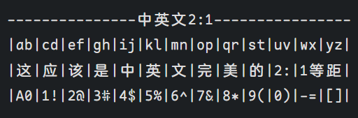

# 字体

## 字体测试软件


## 字体推荐

### 按字体风格/功能性

#### 无衬线字与衬线字

#### 艺术字与正文字

- 得意黑，之前有个很火的B站up开源的字体

#### 多字重/无极大小

多字重

- Sarasa Gothic (更纱黑体)

无极大小

- 小米兰亭Pro（旧Mi默认）
- 小米的MiSans（新Mi默认，比兰亭的字高一点点）
#### 有等宽性

> [!warning]
> 注意：调研结果来自GPT，他说 “开源” 不意味着一定开源。用前请自行调研


> [!note]
> 在下面，你会看到很多字体的名字都有 “mono”，这个标识是有什么特殊含义吗：
> 
> **mono** 是英文单词 **monospaced** 的缩写，意思是 **等宽**。**等宽字体** 即 **固定宽度字体**，是指字体中每个字符的宽度都是相同的。

##### 普通等宽字体

（仅英文，要求每个字母宽度一样）（还有一部分，可以见后面的 “编程字体”，因为编程字体基本都是等宽的）

[list]

- Courier New， 被广泛应用于*打印和显示*文本，这是一款*经典*的等宽字体
- Consolas， *微软*开发的，非常受欢迎的编程字体，因其清晰易读而在开发者中很流行。
- Monaco， *Apple*开发，常用于*macOS*系统
- Ubuntu Mono， 与*Ubuntu*字体系列相匹配，设计现代且易于阅读。
- JetBrains Mono， *JetBrains* IDEs 的默认字体之一，*是我当前惯用IDE以及Obsidian中在用的*
- Source Code， *Adobe*公司推出的
- Lucida Console， 一款简洁的等宽字体，适用于技术文档和代码展示。
- DejaVu Sans Mono， *开源*字体家族的一员，提供了多种语言的支持。
- Inconsolata， 一款*开源*的等宽字体，具有复古风格，非常适合编程使用。
- Fira Code， 特别为*程序员*设计，支持编程中的常见连字（ligatures）。
- Hack， 另一款为*程序员*设计的字体，具有良好的字形设计
##### 中文等宽字体

（汉字宽度等于两个字母宽度）

[list]

- [Sarasa Gothic (更纱黑体)](https://github.com/be5invis/Sarasa-Gothic)， 国人开发的，基于思源黑体。这款字体非常受欢迎，对中文的支持非常好，并且有多种风格和变体可供选择
- [Noto Sans (Mono) CJK (思源黑体)](https://github.com/notofonts/noto-cjk)， *Google*开发的*开源*字体，套覆盖多种亚洲语言的等宽字体，支持多种语言，包括中文、日文、韩文等。
- 霞鹜文楷， 一款开源的中文等宽字体，字形设计优美，可读性高。
- WenQuanYi Micro Hei Mono (文泉驿等宽微米黑)， 文泉驿字体家族的一员，特别设计为等宽字体，是一款免费的开源字体
- Source Han Sans， 虽然不是专门为等宽设计，但其Monospace版本可以满足需求。
- LiHei Pro， 一款专业的等宽中文字体，适合用于排版和编程。
- Droid Sans Fallback， *Google为Android系统*开发的一款包含多种亚洲语言的等宽字体。
- Maple
- [MJJHD_Mono](https://github.com/MJDILI/MJJHD_Mono)， JetBrains Mono+星汉等宽
- brew install font-ubuntu-mono-nerd-font， 英文部分是Ubuntu Mono

##### 中文等宽的两种思路

通用做中文等宽字体有两种思路：

- 英文适应中文：*英文会缩小/缩窄20%*
  以Sarasa为例 (作者自己的Insevka+中文思源黑体)：
  |字形|含义               |
  |---|-------------------|
  |CL |Classical，旧字体汉字|
  |HC |HongKong Chinese, 港澳繁体|
  |J  |Japanesee, 日本语|
  |K  |Korean, 朝鲜语/韩语|
  |SC |Simplified Chinese, 简体中文|
  |TC |Traditional Chinese, 台湾繁体中文|
- 中文适应英文：*中文会加大/加宽/字间距增加原字宽的20%*。但是这一类*很多民间改版*，只是单纯的将中文字体的两侧增加留白，而并没有做字型上的加宽调整，所以协调性有待改进。
  以MJJHD_Mono为例 (JetBrains Mono+星汉等宽)：
- 针对性地均衡两者：英文细10%，中文粗10%。暂时不知道有没有哪种字体使用这种策略，一方面就是不知道出来的效果是均衡的还是两边不讨好的。另一方面我也不知道哪种字体采取这种方式。可能没有？毕竟工作量要大一倍。
  其实有一个在字型上比较接近的，只是字体可能不太好看：
  以Maple为例 (Nerd Font+资源圆体)：

选择

- 在大量中文中混杂极少量英文，前者可能更好。
- 在编程中混杂极少量中文注释的场景，后者可能更好。
- 两者均衡的话......多试试几个字体吧，不清楚有无两全的。不然就放弃中文等宽

### 按场景

#### 打印字体

#### 论文字体

Times Roman
#### 设备字体

思源黑体、思源宋体（手机字体）
#### 编程字体

各种编程软件的默认字体。其中编程字体的一大特点就是：几本都是等宽字体

[list2c2t]

- JetBrains Mono
  - JetBrains IDEs（集成开发环境）的默认字体之一，这些 IDE 包括：
    - IntelliJ IDEA
    - PyCharm
    - WebStorm
    - PhpStorm
    - RubyMine
    - DataGrip
    - Rider
    - GoLand
    - CLion
    - AppCode
- Visual Studio Code / Visual Studio
  - 取决于操作系统
    - 在 Windows 上，默认为 Consolas。
    - 在 macOS 上，默认为 Menlo。
    - 在 Linux 上，默认为 Consolas
    - 我自己的Windows：设置 > 文本编辑器 > 字体 > `Consolas, 'Courier New', monospace`
- Sublime Text
  - Monaco (macOS), Consolas (Windows), DejaVu Sans Mono (Linux)

### 按版权

微软雅黑（版权警告）

方正系列（版权警告）

## 字体使用

CSS分别设置中英字体：

```css
/* 依据font-family的原则,假如客户终端不认识前面的字体,就自己主动切换到另外一种字体,另外一种不认识就切换到第三种,以此类推.假如都不能识别就调用默认字体 */
/* 所以我们应该需要一个不支持英文的中文字体或一个不支持中文的英文字体 */
* {
  font-family: 'Source Code Pro', '等距更纱黑体 SC';
}

/* 注意等举更纱黑体似乎不能写成英语的版本？ */
```

## 其他


