# Kali Linux 安装

https://blog.csdn.net/qq_40950957/article/details/80468030

# 目录

# 下载

## 官网下载

官网均英语，需要额外翻译

官网：https://www.kali.org

官网文档：https://www.kali.org/docs/

官网下载：https://www.kali.org/downloads/

## 虚拟机安装和配置


**Kali Linux** 是基于[Debian](https://zh.wikipedia.org/wiki/Debian)的[Linux发行版](https://zh.wikipedia.org/wiki/Linux发行版)

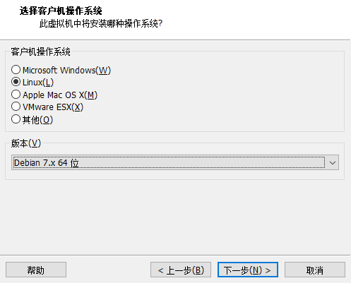

建议不要超过提示的最大推荐内存，虚拟机运行时会占用内存，可后期调

决定能使用多少内存，以及能同时开启的虚拟机数量


NAT


随意，可以后期调整


## 引导安装和配置

### 基本配置

图形安装界面


语言选择

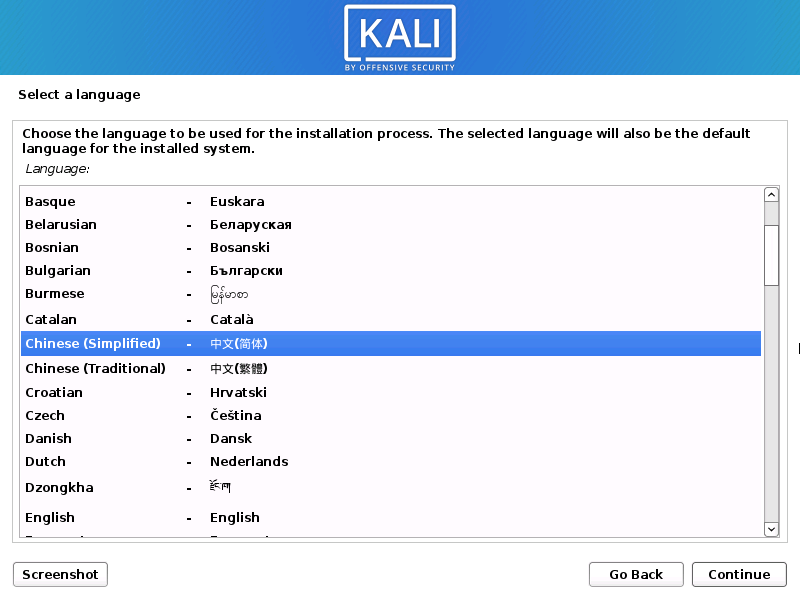

地区


键盘

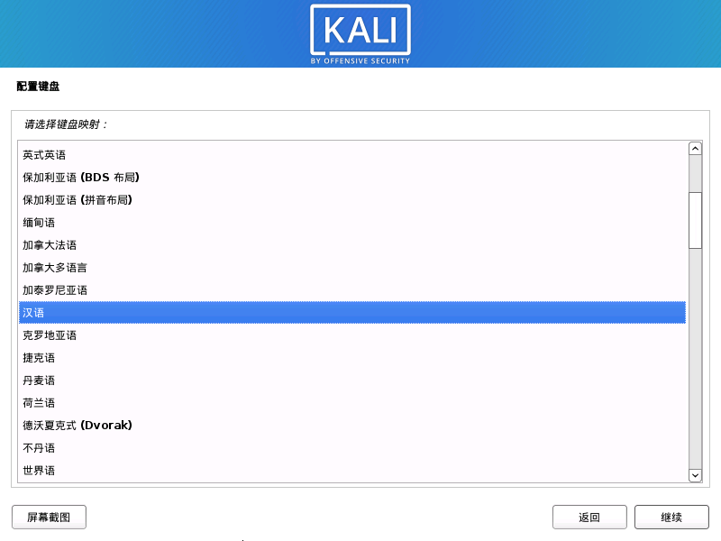

### 网络配置

网络，先跳过

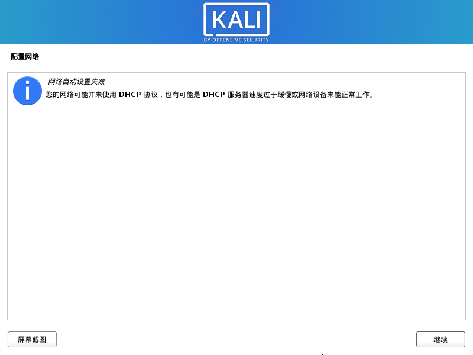

主机名


### 磁盘配置


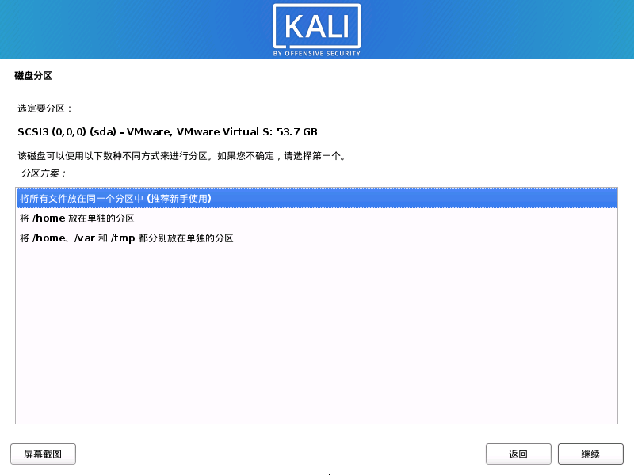

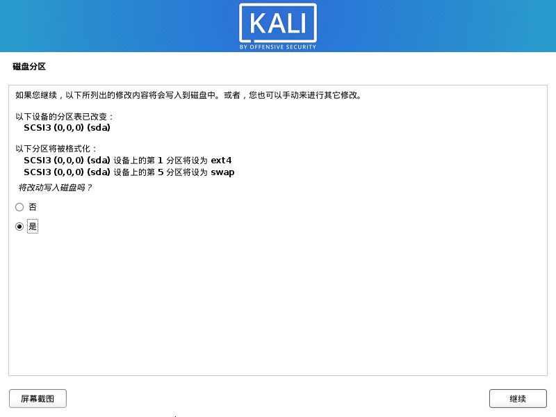


完成

# 直接下载虚拟镜像

## 下载地址

https://www.offensive-security.com/kali-linux-vm-vmware-virtualbox-image-download/

- 64位压缩包2.4G，解压后是9.64G（参考：ISO文件是4G），虚拟机文件的压缩率挺高的啊
- 32位压缩包1.9G

默认账密：kali/kali

但这种方式下载需要后期更改系统语言

# 后期修改语言

## 修改语言1

1.设置语言sudo dpkg-reconfigure locales；
（用空格选择语言）

~~2.安装语言apt-get install xfonts-intl-chinese~~
~~apt-get install ttf-wqy-microhei；~~

3.restart（重启）

还是英文的就把 en_US.UTF-8字符编码按空格取消掉，其他按步骤来就行了

## 修改语言2（换源）

如果不行，需要先换源，换成国内的源（以阿里源为例），再替换语言

但是经常忘了换源可能会导致中文字体下载失败

换源：（把原来的注释掉，并添加源）

进入配置文件：

```shell
vim /etc/apt/sources.list
```

修改：（linux复习：`i`编辑，`esc`命令模式，`:w`保存，`:q`退出，`!`强制）


```shell
deb http://mirrors.aliyun.com/kali kali-rolling main non-free contrib
deb-src http://mirrors.aliyun.com/kali kali-rolling main non-free contrib
```


保留旧名称，防止乱码（而且这些也就是小学生英语，都看得懂）


# 后期网络配置

- `ifconfig`，用于显示当前主机中状态为“激活”的网络接口信息。
- `route`，用于显示当前Linux系统中的路由信息，从route命令的显示结果可以看到当前主机所在的子网和默认网关的地址
- `netstat`
    - `netstat -r`，实现与“route"命令相同的功能，即显示Linux系统中的路由信息（路由表）。
    - `netstat -au`，显示udp传输协议的连接情况
    - `netstat -at`，显示tcp传输协议的连接状况
- `#ifconfig up`、`#ifconfig down`，网卡的启用和停用

## 虚拟机设置

桥接模式

如果出错找不到VM0，看下一步

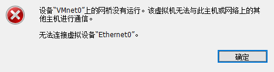

## 虚拟机软件设置

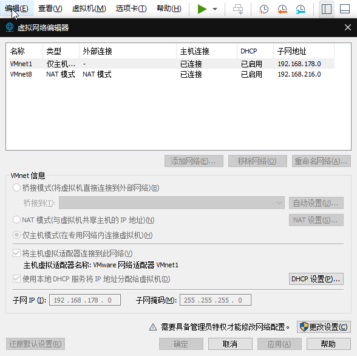

更改设置，添加`VMnet0`

## 错误处理：没有未桥接的主机网络适配器

### 桥接服务安装


如果没有选择：安装 > 服务 > VWware > 两个VMware Bridge Protocol

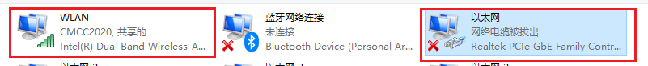

这两个都要安装

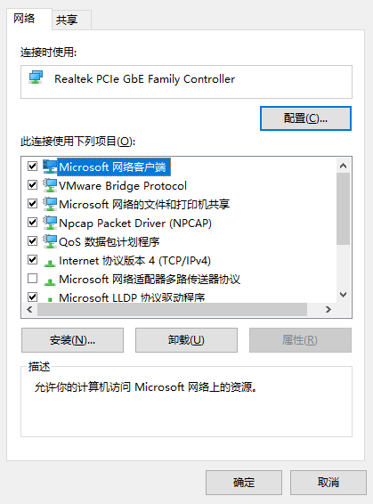

### 虚拟网络编辑器设置

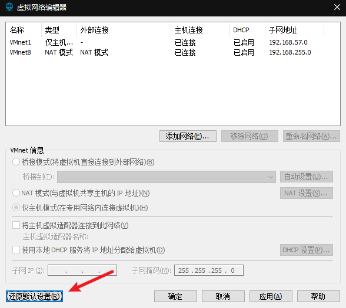


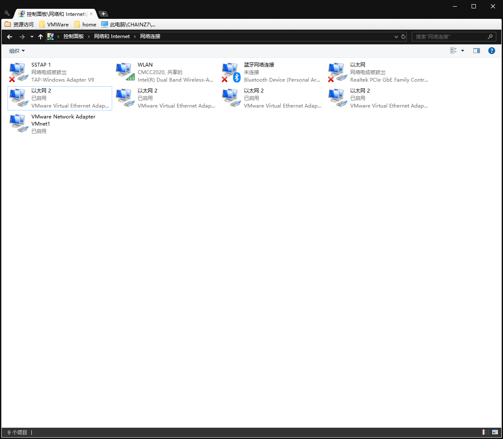

### 主要原因——卸载不干净

上面的都不管用

最后还是用`Unistall Tool`卸载干净重装，顺便换成`16.1`版本，使用桥接，才成功了


