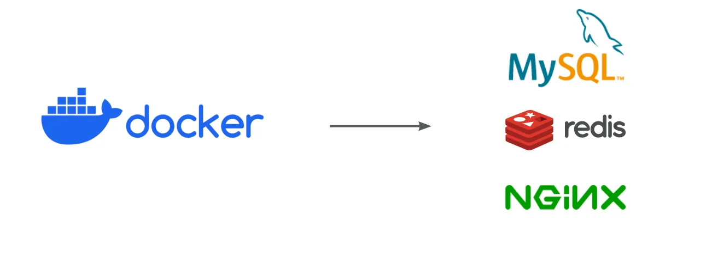

# Vagrant介绍

## 创建虚拟机只要三步

```shell
# 1. 拉取镜像，拉取Box，生成vagrantfile配置文件
vagrant init hashicorp/bionic64

# 2. 创建虚拟机
vagrant up

# 3. 连接虚拟机
vagrant ssh
```

## 虚拟机类型

### 单机 (Docker)



### 分布式


### 共有云


### 本地虚拟机


#### ISO安装

**几十分钟**


#### Vagrant

**几分钟** (比ISO方式快得多)


## 比较

### Docker VS Vagrant

有了Docker，为什么还要使用Vagrant？

这两很相似，Vagrant早于Docker，Docker很多东西也借鉴了Vargrant

#### 组件拆分


相同点：

上图中可以看出 docker和vagrant 的一些术语之间的对应关系：

| 描述     | docker中的术语          | vagrant中的术语             |
| ------ | ------------------- | ----------------------- |
|        | docker compose (组件) | vagrant                 |
|        | docker (引擎)         | vagrant hypervisor (程序) |
| 镜像     | docker image        | vagrant box             |
| 容器/虚拟机 | docker container    | vagrant virtual machine |
不同点：

Vagrant跟Docker有所不同，并不提供虚拟化的平台，它需要借助外部的hppervisor (虚拟化引擎)。比如它可以使用 VirtualBox，VMWare、Hyper-V 等虚拟化平台去创建虚拟机

#### 创建流程

(灰色字体是对应docker的部分)


相同点：

上图中可以看出 docker和vagrant 的一些术语之间的对应关系：

| 描述      | docker中的术语          | vagrant中的术语             |
| ------- | ------------------- | ----------------------- |
| 镜像仓库网站  | docker hub          | vagrant cloud           |
| 镜像创建文件  | docker-compose.yml  | Vagrantfile             |
| 镜像      | docker image        | vagrant box             |
| 创建虚拟机指令 | `docker compose up` | `vagrant up`            |
| 容器/虚拟机  | docker container    | vagrant virtual machine |
| 创建镜像指令  | `docker pull`       | `vagrant init`          |

### Dockerfile VS docker-compose.yml (GPT)

不过话说怎么感觉docker命令有点怪，我用的时候是这样的吧：

- docker-compose.yml -> dockerfile
- docker compose up -> docker run

gpt问了下，说这些是不同的：

1. **Dockerfile**： 
  - 这是一个文本文件，包含了创建 Docker 镜像所需的指令序列。每个指令构建镜像的一层
  - 作用：这些指令可以用来设置工作目录、复制文件、安装依赖包等
2. **docker-compose.yml**： 
  - 这是一个 YAML 文件，用来定义和配置应用的一个或多个服务。
  - 作用：该文件允许你用文件来配置应用的服务，并用一条命令来创建和启动完整的应用堆栈。
3. **docker compose up**： 
  - 这个命令用来启动并运行整个 Docker Compose 应用。它会根据 `docker-compose.yml` 文件中定义的服务来创建、启动并链接容器。
4. **docker run**： 
  - 这个命令用来从 Docker 镜像创建一个新的容器，并运行一个命令。它通常直接指定要使用的镜像，并可以附加一些选项来配置新容器的行为。

比较一下：

Dockerfile vs docker-compose.yml

- Dockerfile
  - **用途**：描述如何*构建一个 Docker 镜像*。
  - **内容**：一系列构建步骤，比如安装软件包、复制文件、设置环境变量等。
  - **使用场景**：当你需要从基础镜像开始，逐步定制一个最终的镜像时。
  - **示例命令**：`docker build -t my-image .`
- docker-compose.yml
  - **用途**：定义和配置*由多个容器组成的应用服务*。
  - **内容**：包含服务、网络、卷和其他组件的配置信息。
  - **使用场景**：当你的应用不仅仅是一个容器，而是需要多个相互协作的容器（如 web 服务器、数据库、缓存服务器等）。
  - **示例命令**：`docker compose up`

docker run vs docker compose up

- docker run
  - **用途**：基于一个已有的镜像*启动一个新的容器*。
  - **使用场景**：当你只需要运行一个单独的容器，且这个容器不需要与其他容器交互。
  - **示例命令**：`docker run -d --name my-container -p 8080:80 nginx`
- docker compose up
  - **用途**：根据 `docker-compose.yml` 文件中的配置*启动并连接所有服务*。
  - **使用场景**：当你的应用程序由多个服务组成，需要一起管理（启动、停止、重建等）。
  - **示例命令**：`docker compose up`

为什么你可能没有使用过 Docker Compose

如果你一直在处理相对简单的情况，比如*只有一个容器*的应用程序，或者你构建的系统不需要多个相互依赖的服务，那么你可能主要使用了 `Dockerfile` 和 `docker run` 命令来管理你的容器。对于这类情况，Docker Compose 可能不是必需的，因为你可以在没有它的帮助下完成任务。
_
然而，随着应用程序变得越来越复杂，涉及到多个服务时，手动管理每个容器和服务之间的关系就会变得非常困难。这时候，Docker Compose 就成为了一个有用的工具，因为它可以帮助你以声明式的方式定义和管理整个应用程序的架构。

## 安装 (Vagrant、VirtualBox)


