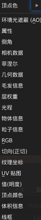
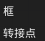

# Blender Note

## 节点

### 节点插件

要先开启节点插件：Node:Node Wrangler

然后开启新视口并改为“着色器编辑器”

### 快捷键

新建节点：Shift+A

复制节点：Shift+D

节点快速连接：Ctrl+Shift+LMB

快速创建图像纹理：Ctrl+T

备注框：F（Frame）

## 输入

顶点色

————————————————

环境光遮蔽(AO)

属性

倒角

相机数据

菲涅尔，【重点】用途：控制菲涅尔效果

几何数据

毛发信息

层权重

光程，【神奇效果】，接口类型：摄像机射线、阴影射线、漫射射线、光泽射线.......

物体信息

粒子信息

RGB

切向(正切)

纹理坐标

UV贴图

值(明度)

顶点信息

体积信息

线框，类似Vray的边材质

## 输出

材质输出，这个就一项

## 着色器

### 着色器 —— 原理化

主要材质类型：原理化BSDF、漫射BSDF、光泽BSDF、玻璃BSDF、自发光(发射)

BSDF为例：

————————————————

基础色

次表面、次表面半径、次表面颜色

金属度、粗度

高光、高光颜色

各向异性过滤、各向异性旋转

光泽、光泽染色

清漆、清漆粗糙度

IOR折射率、透射

自发光

Alpha（与下面的混合模式相配合）

————————————————

设置：

混合模式：添加（玻璃罩）

## 纹理

？

？

——————————————

砖墙纹理，用途：如其名

棋盘格纹理，用途：一般用来检查材质

环境纹理，用途：一般用于环境HDRI

渐变纹理（Max里的衰减）

IES纹理

图像纹理，重要（Ctrl+T默认项）

迷幻纹理，特殊效果

马氏分形纹理，用途：可连接凹凸可表现水滴表面

噪波纹理，特殊效果

点密度，特殊效果

天空纹理，特殊效果

沃罗诺伊纹理，特殊效果

波浪纹理，特殊效果

白噪波，特殊效果

## 颜色

亮度对比度，如名

伽马，如名

色相/饱和度，如名

反转，如名

光线衰减，如名

混合RGB，如名

RGB曲线，如名

## 矢量

凹凸

置换

映射

法向

法线贴图(要细分)

矢量曲线

矢量置换

矢量变换

## 转换器

黑体，其实是色温

钳制

颜色渐变，用途：渐变，与渐变纹理配合使用

合并HSV

合并GRB

合并XYZ

映射范围

运算

GRB->BW，RGB转灰度图

分离HSV

分离RGB，如名

分离XYZ

Shader->RGB，用途：节点变成RGB，然后给其他节点使用

矢量运算，用途：对矢量计算（相加等）

波长，用途：控制灯光颜色

## 布局

框

转接点

