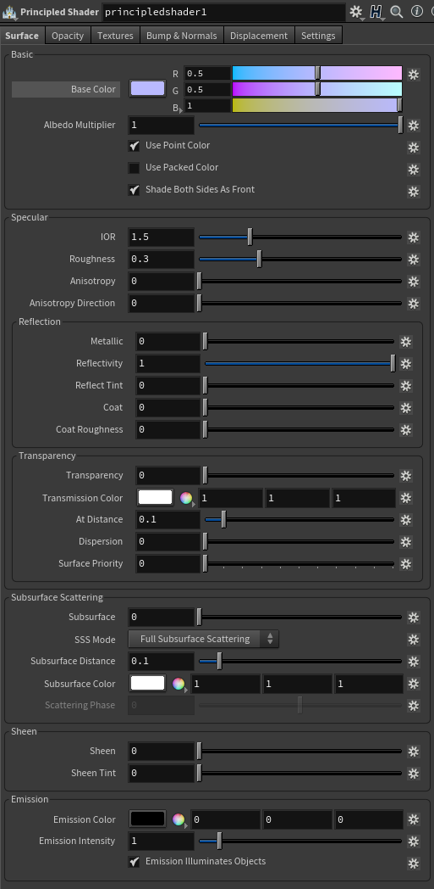
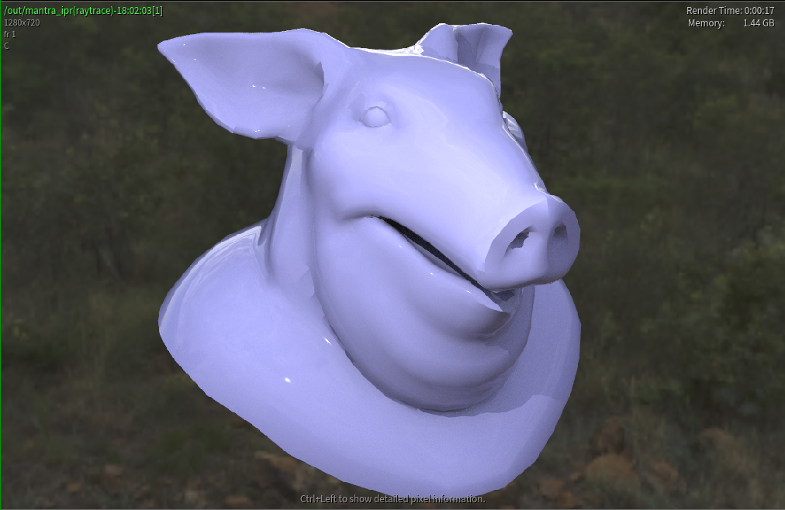
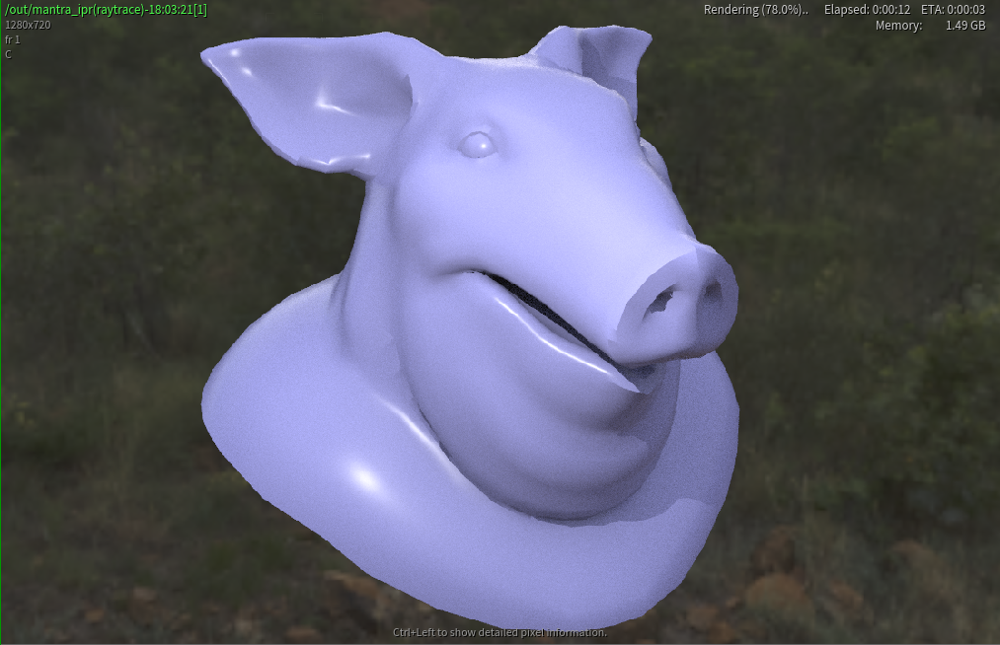

# Mantra Base

## Principled Shader

- **1. Basic 基本色**
  - Base Color 基本颜色
  - \------
  - Albedo Multiplier 反射率倍增
  -  口 Use Point Color 使用Point颜色
  -  口 Use Packed Color 使用Pack色
  -  口 Shade Both Sides As Front 双面材质
- **2. Specular 反射、高光**
  - IOR 折射率
  - Roughness 粗糙度
  - Anisotropy 各向异性
  - Anisotropy Direction 各项异性方向
- **2-1. Reflection 反射**
  - Metallic 金属度
  - Reflectivity 反射率(反射比)
  - Reflect Tint  反射色彩
  - Coat 清漆
  - Coat Roughness 清漆粗糙度
- **2-2. Transparency 折射(透明度)**
  - Transparency 透明度
  - Transmission Color 传递颜色
  - At Distance 距离？
  - Dispersion 散布？
  - Suface Priority 表面优先级？
- **3. Sub-Surface Scattering 次表面散射**
  - Subsurface 次表面
  - SSS  Mode 模式
  - Subsurface Distance 次表面距离
  - Subsurface Color 次表面颜色
  - Scattering Phase 散射相位
- **4. Sheen 光泽**
  - Sheen 光泽
  - Sheen Tint 光泽色彩
- **5. Emission 发光**
  - Emission Color 发光色
  - Emission Intensity 发光强度
  -  口 Emission Illuminate Objects 照亮物体

## 反射测试

|  |  |  |
| ------------------------------------------------------------ | ------------------------------------------------------------ | ------------------------------------------------------------ |
|                                                              |                                                              |                                                              |

