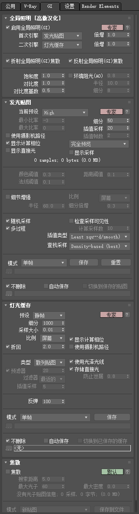
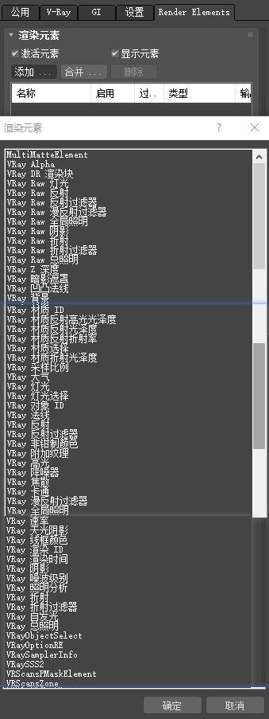

# VRay Render

## VFM渲染设置

### 公用 选项

### V-Ray 选项

**全局开关**

自适应灯光(4.2新增，旧概率灯光的优化版)

**图像采样器（抗锯齿）**

类型：渲染块/渐进式

最小着色比率：另一种调节灯光和材质细分的方法

**渐进式图像采样器（渲染块）**

最小细分：（渲染块）1~1

最大细分：（渲染块）关~24

噪波阈值：（渲染块）0.01~(0.006~0.003)        （渐进式）一晚出图可调0.001

**全局确定性蒙特卡洛**

局部细分：无~（无/勾选）

### GI 选项

**【GI】**

**全局照明**

首次引擎：发光贴图（相对于BF算法，其自适应算法能抹掉大量噪点，更快，但会留下光斑）

二次引擎：灯光缓存

环境阻光(AO)：无~(无/勾选)，细分16

**发光贴图**

当前预设：（发光贴图）非常低~高

细分：（发光贴图）30~80                       BF算法：~(64~128)

**灯光缓存**

细分：300~(1500,2000)

### 设置选项

### 渲染元素

**【渲染元素】**

降噪器（必选）

卡通

