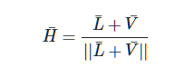

# 图形学基础 | 高级光照 Blinn-Phong

## Phong不能处理的情况

Phong模型在计算镜面光系数为：

```
float specFactor = pow(max(dot(reflectDir, viewDir), 0.0), 32); // 32为镜面高光系数

光量 = Max(点乘(反射向量、视角向量))^32  // 翻译
```

    

因此Phong模型能处理的是下面的左图中(θ≤90)的情况

而对于右图中(θ>90)的情况则镜面光成分计算为0.

## Blinn-Phong模型不再依赖于反射向量

而是采用了所谓的 **半程向量(Halfway Vector)**，即光线与视线夹角一半方向上的一个单位向量。当半程向量与法线向量越接近时，镜面光分量就越大。



