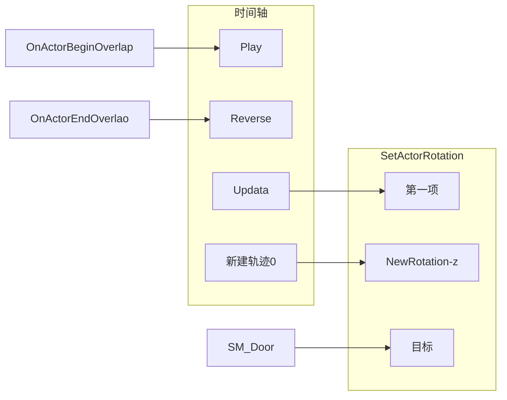
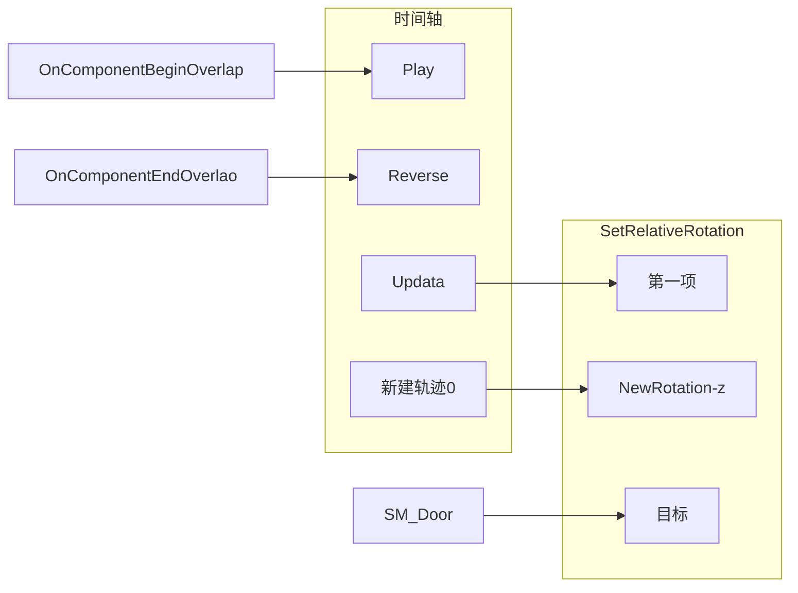
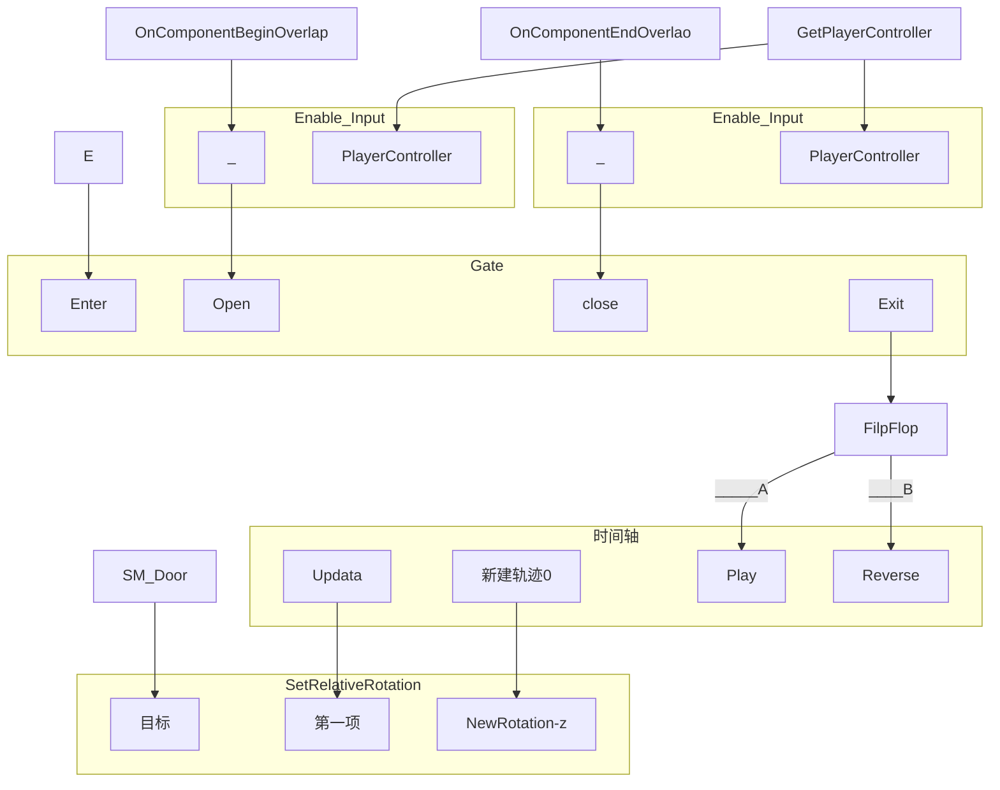
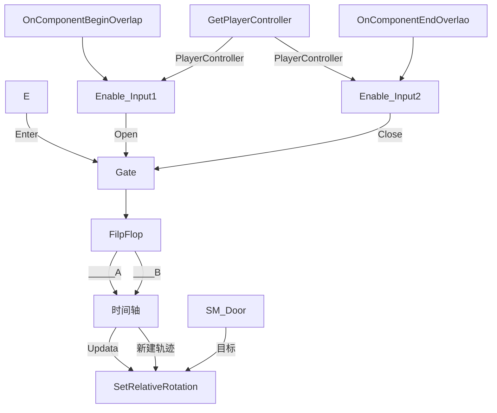

# 基本操作——蓝图篇

- 简单自动开关门脚本



- 创建蓝图Actor实现（添加Box Collistion）




区别

```
SetActorRoration  整个
SetRelativeRotation  组件（相对坐标）
SetWordRotation  组件（时间坐标）
```

- 按E开门





## 一些节点

Lerp：Alpha控制A和B的混合，相当于0-1向任意数值的映射

## 调试

蓝图上方工具栏中的“调试过滤器”
