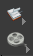

# 基本界面

## 【标题栏，菜单栏，工具栏】

略

## 【三维视图-上】

没啥用，节点工具那边有，建议删了

## 【三维视图-上上】

右侧：图钉工具、层级同步工具、显示方式(W)、显示隐藏、多视图(Ctrl+1234)

## 【三维视图-上上上】

右侧：三维最大化(Ctrl+B/Alt+')、视图操作

Space+1 透视图，2 顶/底，3 前/后，4 左/右，5 UV

Ctrl+1 单视图，2 双视图，3 三视图，4 四视图

Alt+1 三维视图，2 节点，3 属性，4 大纲，5 脚本，7 材质，8 节点

## 【三维视图-左】操作工具

对象层级(1)、元素层级(2345)、动力学层级(7)

——————

选择工具(A,Ctrl,Shift,CtrlShift)

锁定要操作的对象(~)

移动(T)

旋转(R)

缩放(E)

骨骼用

多重工具

吸附到_栅格

吸附到_Peimitives

吸附到_点

吸附到_多重(Ctrl+J)

摄像机工具(Esc)

区域渲染

物体侦测

拍频

渲染，Mantra，RenderMan

## 【三维视图-右】显示工具

栅格显示/隐藏

栅格分段细分

锁定相机视角

没有灯光显示

默认顶光显示

默认灯光显示

高质量灯光显示

有阴影灯光显示

贴图显示

过滤类型显示

过滤类型显示(拍频时)

——————————

显示顶点

显示点法线

显示点速度

显示点序号

显示面法线

显示面序号

显示线壳

显示顶点组

显示轴

显示组

显示物体名称

显示相机背景图，不是环境光

显示某些参数

模型信息显示

多视图显示同步

显示设置(D)，常调Backgroud，Guides，Geometry

## 【时间线&动力学（紧凑模式）】

左侧：第/最后一帧(Ctrl+Up/Down)，播放/回放/暂停(Up/Down)，上/下一帧(Left/Right)

中间：时间线，自动关键帧

右侧：循环模式，回放循环，音频设置，播放设置

下面：动力学相关

## 【节点操作区】

中间：略

下面：右侧：创建节点，大纲视图，列表显示。颜色(C)，形状(Z)，备注组(Shift+O)，留言板(Shift+P)，背景图(Shift+I)，封包(Shift+C)。搜索(/或Ctrl+F)，？(D)

其他：Ctrl+Num做标记 => Num跳转，P查看属性

