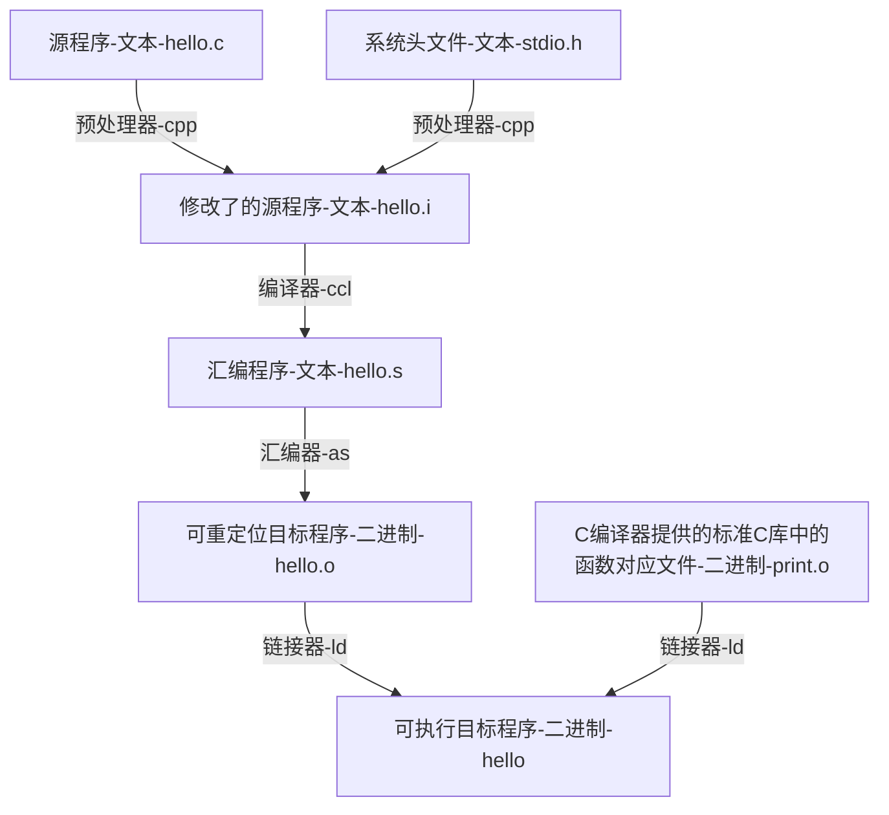
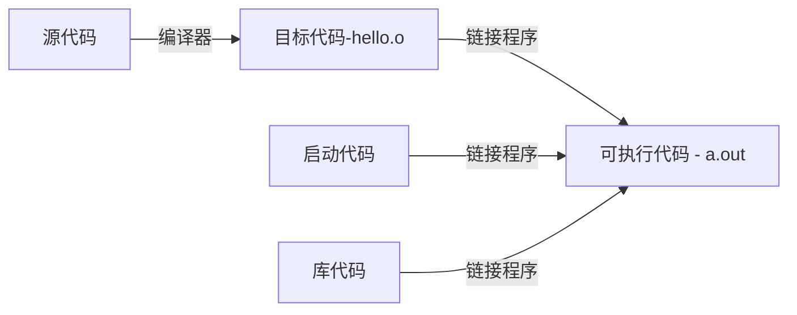

# 编译详解

## 编译原理

### 源文件创建 - 文件扩展名（与C不同）

源代码文件扩展名

|               C++实现 | 源代码文件的扩展名    |
| --------------------: | --------------------- |
|                  UNIX | C、cc、cxx、c         |
|               GUN C++ | C、cc、cxx、cpp、c++  |
|          Digital Mars | cpp、cxx              |
|           Borland C++ | cpp                   |
|                Watcom | cpp                   |
|  Microsoft Visual C++ | cpp、cxx、cc          |
| Freestyle CodeWarrior | cp、cpp、cc、cxx、c++ |

### 编译和连接原理

- C语言编程步骤

- C++编程步骤（简化版）

## 编译和连接方式

最初C++使用编译器程序到C，而不是开发直接的C++到目标代码的编译器

前者叫作cfront。后者为C++编译器，加速了编译过程

### 各平台下的编译

| 平台      | 方法                                           | 补充                                                         |
| --------- | ---------------------------------------------- | ------------------------------------------------------------ |
| UNIX      | 自带编译器CC，`CC spiffy.C`，生成`a.out`       |                                                              |
| Linux     | 自带编译器g++，`g++ spiffy.cxx`，生成`a.out`   |                                                              |
| Windows   | 下载命令行编译器，也是用g++编译器，生成`a.out` | 如`Cygwin`、`MinGW`（相当于弄了个Linux环境，均在命令提示符模式下运行） |
| Windows   | 下载IDE编译器，生成`.exe`                      | 如`VC++`、`VS`（一般进行项目的创建而非仅仅编译单个文件）     |
| Macintosh | 开发框架Xcode，Apple官网安装                   | Xcode提功力支持多种语言的IDE和两个命令行解释器（g++和clang） 还可通过Termianl进入UNIX模式 |

补充

- **生成可执行代码的过程**：先生成目标代码文件`spiffy.o`，再自动生成可执行文件`a.out`，并删除目标代码
- **可执行对象的名字**：UNIX和Linux均默认为`a.out`，再次编译会自动覆盖
- **g++补充**：有些版本可能要求连接C++库`g++ spiffy.cxx -lg++`，编译多个文件`g++ my.cxx precious.cxx`

### 补充：说下编译器gcc和g++（与C不同）

gcc和g++都可以编译C/C++，但教程上一般是gcc对C，gcc汇编，g++对C++，具体的这里不再深入

两者的用法几乎完全一致

| linux指令（`gcc`与`objdump`）    | 操作             | 生成文件                     | 文件补充                              |
| -------------------------------- | ---------------- | ---------------------------- | ------------------------------------- |
| `gcc main.c`                     | 编译+汇编+链接?  | 二进制文件`a.out`            | `sudo ./a.out`可运行该文件            |
| `gcc -Og -S main.c`              | 仅编译           | 汇编文件`main.s`             | 可以文本方式打开阅读汇编代码          |
| `gcc -Og -S -masm=intel main.c`  | 仅编译           | 汇编文件`main.s`             | 还可以生成Intel格式的代码（没区别？） |
| `gcc -Og -c main.c`              | 编译+汇编        | 二进制文件`main.o`           | `sudo ./main.o`可运行该文件           |
| `gcc -Og -o prog main.c hello.c` | 编译+汇编+链接   | 二进制文件`prog`             | `sudo ./prog`可运行该文件             |
| ——————                           | ——————           | ——————                       | ——————                                |
| `g++ main.cpp`                   | 编译+汇编+链接?  | 二进制文件`a.out`            | `sudo ./a.out`可运行该文件            |
| `g++ -S main.cpp`                | 仅编译           | 汇编文件`main.s`             | 可以文本方式打开阅读汇编代码          |
| `g++ -c main.cpp`                | 编译+汇编        | 二进制文件`main.o`           | `sudo ./main.o`可运行该文件           |
| `g++ -o [world] main.cpp`        | 编译+汇编+链接   | 二进制文件`main` (或`world`) | `sudo ./prog`可运行该文件             |
| ——————                           | ——————           | ——————                       | ——————                                |
| `objdump -d mstore.o`            | 反汇编二进制代码 | 不生成，在终端显示结果       |                                       |
| `objdump -d prog`                | 反汇编二进制代码 | 不生成，在终端显示结果       |                                       |

**表格补充：如进行链接，则必须要有一个main函数**

