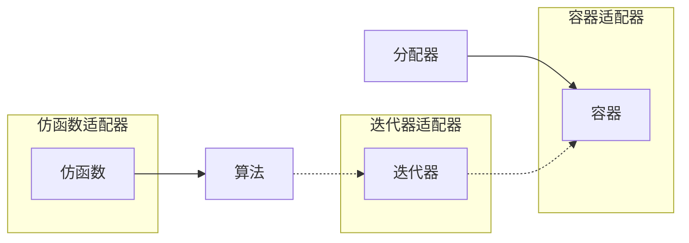

# C++

# 目录

# C++标准库

C++标准库——体系结构与内核分析（C++ Standard Library —— architecure & sources）

- 体系结构，指C++标准库主要分为6个部件
- 内核分析，指会分析 source code 源代码

参考：

- [【B站】C++标准库(STL)与泛型编程](https://www.bilibili.com/video/BV1BX4y1G7bX)，侯捷老师的课
  [【CSDN】别人的听课笔记](https://blog.csdn.net/ncepu_Chen/article/details/114947710)
  - P3~P7不太懂，测试好难
- [C++ 基准测试 - std::vector VS std::list ](https://baptiste-wicht.com/posts/2012/11/cpp-benchmark-vector-vs-list.html#)
- 书录
  - 《The C++ Standard Library》
  - 《STL源码剖析》侯捷（自己推荐自己的书2333）

## 简概

### 简概

标准库特点

- 主要使用模板做的（Generic Programming（GP、泛型编程））
- C++标准库（C++ Standard Library）包含 标准模板库（Standard Template Library）
- 头文件问题
  - C++标准库的头文件不带扩展名（.h）
  - 新式 C头文件不带扩展名，例`#include <cstdio>`
  - 旧式 C头文件带扩展名，仍可使用，例`#include <stdio.h>`
  - 新式 C头文件组件封装于std命名空间中，使用`using namespace std;` or `using std::cout;`
  - 旧式 C头文件组件不封装与std头文件中

### STL六大组件

STL六大组件，包括

- **容器** (container)
- **分配器** (allocator)
  - 容器需要一个分配器，若不写则容器内部会有一个默认分配器
  - 例`vector<int,allocator<int>> vi(ia,ia+6);`可简写为`vector<int> vi(ia);`
- **算法** (algorithm)
- **迭代器** (iterator)
- **适配器** (adapter)
- **仿函数** (functor)

结构




### 时间复杂度

- $O(1)$或$O(c)$：常数时间（constant time）
- $O(n)$：线性时间（linear time）
- $O(log_2n)$：次线性时间（sub-linear time）
- $O(n^2)$：平方时间（quadratic time）
- $O(n^3)$：立方时间（cubic time）
- $O(2^n)$：指数时间（exponential time）
- $O(n\log_2n)$：介于线性及二次方成长的中间

### 前闭后开区间

STL中的区间遵循**前闭后开**的表示方式,迭代器`begin`指向的是第一个元素的起点,`end`指向的是**最后一个元素的下一个元素**.


## 程序测试 - 容器

### 测试程序

```c++
/* 使用命名空间 */
using std::cin;
using std::cout;
using std::string;

/* 输入并获取一个目标长整数 */
long get_a_target_long()
{
	long target=0;
	cout << "target (0~" << RAND_MAX << "): ";	// 随机数？
    cin >> target;
	return target;
}

/* 输入并获取一个目标字符串 */
string get_a_target_string()
{
	long target=0;
    char buf[10];
	cout << "target (0~" << RAND_MAX << "): ";	// 随机数？
    cin >> target;
	snprintf(buf, 10, "%d", target);			// 将数值转换为字符串
    return string(buf);
}

/* 比较 - 长整数方式 */
int compareLongs(const void* a, const void* b)	// void 指针可以指向任意类型的数据
{
    return (*(long*)a - *(long*)b);				// 先转换指针类型再取指针值
}

/* 比较 - 字符串方式 */
int compareStrings(const void* a, const void* b)// void 指针可以指向任意类型的数据
{
	if(*(string*)a > *(string*)b)				// 先转换指针类型再取指针值
        return 1;
    else if(*(string*)a < *(string*)b)
        return -1;
    else
        return 0; 
}
```

### 测试 - array

~~扩充~~：不可扩充

```c++
#include <array>
#include <iostream>
#include <ctime>
#include <cstdlib> // qsort, bsearch, NULL

namespace test01
{
const long ASIZE = 500000L;											// 数组大小
void test_array() {
    cout << "\ntest_array().......... \n";

    /** 创建操作 */
	array<long, ASIZE> c;											// 定义容器

    /** 插入操作 */
	clock_t timeStart = clock();									// 取时间戳
    for (long i = 0; i < ASIZE; ++i) {								// 随机填充满容器
        c[i] = rand();
    }
    cout << "milli-seconds : " << (clock() - timeStart) << endl;	// 所用的时间计时（时间戳相减）
    cout << "array.size()= " << c.size() << endl;					// 大小
    cout << "array.front()= " << c.front() << endl;					// 第一个元素（随机数）
    cout << "array.back()= " << c.back() << endl;					// 最后个元素（随机数）
    cout << "array.data()= " << c.data() << endl;					// 起点的地址

    /** 排序 + 查找操作 */
    long target = get_a_target_long();								// 获取一个长整数
    timeStart = clock();											// 取时间戳
    qsort(c.data(), ASIZE, sizeof(long), compareLongs);				// 排序 - 长整数比较
    long *pItem = (long*)bsearch(&target, (c.data()), ASIZE, sizeof(long), compareLongs);	// 排序后二分查找 - 长整数比较
    cout << "qsort()+bsearch(), milli-seconds : " << (clock() - timeStart) << endl;    // 所用的时间（时间戳相减）
    if (pItem != NULL)
        cout << "found, " << *pItem << endl;
    else
        cout << "not found! " << endl;
}
}
```

输出

```c++
select: 1

test_array()..........
milli-seconds : 47
array.size()= 500000
array.front()= 3557
array.back()= 23084
array.data()= 0x47a20
target (0~32767): 20000
qsort()+bsearch(), milli-seconds : 187
found, 20000
```

### 测试 - vector

**扩充：底层是一段连续的内存空间，当容器满时进行扩容，将容器大小扩容为原来的两倍**

```c++
namespace test02
{
void test_vector(long& value)
{
    cout << "\ntest_vector().......... \n";

    /** 创建操作 */
	vector<string> c;												// 定义容器
    char buf[10];

    /** 插入操作 */
	clock_t timeStart = clock();									// 取时间戳
    for (long i = 0; i < ASIZE; ++i) {								// 随机填充满容器
        try{
            snprintf(buf, 10, "%d", rand()); // 按format格式化为字符串
            c.push_back(string(buf));
        }
        catch(exception& p){ // 防止内存不足
            cout << "i:" << i << " " << p.what() << endl;
            abort();
        }											
    }
    cout << "milli-seconds : " << (clock() - timeStart) << endl;	// 所用的时间计时（时间戳相减）
    cout << "array.size()= " << c.size() << endl;					// 大小
    cout << "array.front()= " << c.front() << endl;					// 第一个元素（随机数）
    cout << "array.back()= " << c.back() << endl;					// 最后个元素（随机数）
    cout << "array.data()= " << c.data() << endl;					// 起点的地址

    /** 排序 + 查找操作 */
    // 直接find方法（在此例中更快）
	string target = get_a_target_string();
    {
        timeStart = clock();
		auto pItem = find(c.begin(), c.end(), target);
        cout << "std::find(), milli-seconds : " << (clock() - timeStart) << endl;
        if (pItem != c.end())
            cout << "found, " << *pItem << endl << endl;
        else
            cout << "not found! " << endl << endl;
    }
    // 先排序后find方法
    {
        timeStart = clock();
        sort(c.begin(), c.end());	// 这里是标准库里的sort
        cout << "sort(), milli-seconds : " << (clock() - timeStart) << endl;
        timeStart = clock();
		string *pItem = (string *)::bsearch(&target, (c.data()), c.size(), sizeof(string), compareStrings);
        cout << "bsearch(), milli-seconds : " << (clock() - timeStart) << endl;
        if (pItem != NULL)
            cout << "found, " << *pItem << endl << endl;
        else
            cout << "not found! " << endl << endl;
	}
}
}
```

输出

```c++
select:2
how many elements:1000000

test_vector()..........
milli-seconds : 3063
vector.size()= 1000000
vector.front()= 4047
vector.back()= 2877
vector.data()= 0x2880020
vector.capacity()= 1048576	// 表示使用了1000000个元素后，还剩余48576个元素空间（浪费）

target (0~32767):23456
std::find(), milli-seconds : 0
found, 23456

sort(), milli-seconds : 2695
bsearch(), milli-seconds : 1
found, 23456
```

### 测试 - list

**扩充：多一个元素，非常节省内存**

```c++
#include <list>
#include <stdexcept>
#include <string>
#include <cstdlib> 		// abort()
#include <cstdio>  		// snprintf()
#include <algorithm> 	// find()
#include <iostream>
#include <ctime>

void test_list(long &value) {
    cout << "\ntest_list().......... \n";

    /** 创建操作 */
    list <string> c;
    char buf[10];

    /** 插入操作 */
	clock_t timeStart = clock();
    for (long i = 0; i < value; ++i) {
        try {
            snprintf(buf, 10, "%d", rand());
            c.push_back(string(buf));
        }
        catch (exception &p) {
            cout << "i=" << i << " " << p.what() << endl;
            abort();
        }
    }
    cout << "milli-seconds : " << (clock() - timeStart) << endl;
    cout << "list.size()= " << c.size() << endl;
    cout << "list.max_size()= " << c.max_size() << endl;    // 357913941
    cout << "list.front()= " << c.front() << endl;
    cout << "list.back()= " << c.back() << endl;

    /** 排序 + 查找操作 */
    // find方式
	string target = get_a_target_string();
	timeStart = clock();
	auto pItem = find(c.begin(), c.end(), target);
    cout << "std::find(), milli-seconds : " << (clock() - timeStart) << endl;
    if (pItem != c.end())
        cout << "found, " << *pItem << endl;
    else
        cout << "not found! " << endl;
	timeStart = clock();
    // 排序
    c.sort();	// 这里是容器里实现的sort，不是标准库里的sort。一般前者效率更高
    cout << "c.sort(), milli-seconds : " << (clock() - timeStart) << endl;
}
```

输出

```c++
how many elements:1000000

test_list()..........
milli-seconds : 3265
list.size()= 1000000
list.max_size()= 384307168202282325			???
list.front()= 31411
list.back()= 7939
target (0~32767):23456
std::find(), milli-seconds : 4
found, 23456
c.sort(), milli-seconds : 3610
```

### 测试 - forward_list

**扩充：多一个元素，非常节省内存**

```c++
#include <forward_list>
#include <stdexcept>
#include <string>
#include <cstdlib> 	// abort()
#include <cstdio>  	// snprintf()
#include <iostream>
#include <ctime>

void test_forward_list(long &value) {
    cout << "\ntest_forward_list().......... \n";

forward_list <string> c;
char buf[10];

clock_t timeStart = clock();
    for (long i = 0; i < value; ++i) {
        try {
            snprintf(buf, 10, "%d", rand());
            c.push_front(string(buf));	// 头部插入，因为后部操作要遍历整个链表
        }
        catch (exception &p) {
            cout << "i=" << i << " " << p.what() << endl;
            abort();
        }
    }
    cout << "milli-seconds : " << (clock() - timeStart) << endl;
    cout << "forward_list.max_size()= " << c.max_size() << endl;  //536870911
    cout << "forward_list.front()= " << c.front() << endl;

string target = get_a_target_string();
    timeStart = clock();
auto pItem = find(c.begin(), c.end(), target);
    cout << "std::find(), milli-seconds : " << (clock() - timeStart) << endl;

    if (pItem != c.end())
        cout << "found, " << *pItem << endl;
    else
        cout << "not found! " << endl;

    timeStart = clock();
    c.sort();
    cout << "c.sort(), milli-seconds : " << (clock() - timeStart) << endl;
}
```

输出

```c++
how many elements:1000000

test_forward_list()..........
milli-seconds : 296
forward_list.max_size()= 461168601842738790
forward_list.front()= 11513
target (0~32767):23456
std::find(), milli-seconds : 9
found, 23456
c.sort(), milli-seconds : 3706
```

### 测试 - slist

测试略

和`forward_list`基本一样。但不属于C++ STL，是旧版本就有的，使用要`#include <ext\slist>`

### 测试 - deque

**扩充：每次扩充一个buffer。**deque是分段连续，抽象是连续的，但具体实现上是分为很多段的，每段叫一个buffer（也就是说添加多个元素后，占用内存才会多上一点）

```c++
#include <deque>
#include <stdexcept>
#include <string>
#include <cstdlib> 	// abort()
#include <cstdio>  	// snprintf()
#include <iostream>
#include <ctime>

void test_deque(long &value) {
    cout << "\ntest_deque().......... \n";

deque <string> c;
char buf[10];

clock_t timeStart = clock();
    for (long i = 0; i < value; ++i) {
        try {
            snprintf(buf, 10, "%d", rand());
            c.push_back(string(buf));
        }
        catch (exception &p) {
            cout << "i=" << i << " " << p.what() << endl;
            abort();
        }
    }
    cout << "milli-seconds : " << (clock() - timeStart) << endl;
    cout << "deque.size()= " << c.size() << endl;
    cout << "deque.front()= " << c.front() << endl;
    cout << "deque.back()= " << c.back() << endl;
    cout << "deque.max_size()= " << c.max_size() << endl;    

string target = get_a_target_string();
    timeStart = clock();
auto pItem = find(c.begin(), c.end(), target);
    cout << "std::find(), milli-seconds : " << (clock() - timeStart) << endl;

    if (pItem != c.end())
        cout << "found, " << *pItem << endl;
    else
        cout << "not found! " << endl;

    timeStart = clock();
    sort(c.begin(), c.end());
    cout << "sort(), milli-seconds : " << (clock() - timeStart) << endl;
}
```

### 测试 - stack 和 queue

`stack`和`queue`底层是通过`deque`实现的,从设计模式上来说，这两种容器本质上是`deque`的适配器

但不同于deque：这两个容器的元素进出是有严格顺序的,因此`stack`和`queue`**不**支持有关迭代器的操作

| `stack`                                                   | `queue`                                                   |
| --------------------------------------------------------- | --------------------------------------------------------- |
|  |  |

demo

```c++
#include <stack>
#include <queue>
#include <stdexcept>
#include <string>
#include <cstdlib> 	// abort()
#include <cstdio>  	// snprintf()
#include <iostream>
#include <ctime>

void test_stack(long &value) {
    cout << "\ntest_stack().......... \n";

stack <string> c;
char buf[10];

clock_t timeStart = clock();
    for (long i = 0; i < value; ++i) {
        try {
            snprintf(buf, 10, "%d", rand());
            c.push(string(buf));
        }
        catch (exception &p) {
            cout << "i=" << i << " " << p.what() << endl;
            abort();
        }
    }
    cout << "milli-seconds : " << (clock() - timeStart) << endl;
    cout << "stack.size()= " << c.size() << endl;
    cout << "stack.top()= " << c.top() << endl;
    c.pop();
    cout << "stack.size()= " << c.size() << endl;
    cout << "stack.top()= " << c.top() << endl;
}

void test_queue(long &value) {
    cout << "\ntest_queue().......... \n";

queue <string> c;
char buf[10];

clock_t timeStart = clock();
    for (long i = 0; i < value; ++i) {
        try {
            snprintf(buf, 10, "%d", rand());
            c.push(string(buf));
        }
        catch (exception &p) {
            cout << "i=" << i << " " << p.what() << endl;
            abort();
        }
    }
    cout << "milli-seconds : " << (clock() - timeStart) << endl;
    cout << "queue.size()= " << c.size() << endl;
    cout << "queue.front()= " << c.front() << endl;
    cout << "queue.back()= " << c.back() << endl;
    c.pop();
    cout << "queue.size()= " << c.size() << endl;
    cout << "queue.front()= " << c.front() << endl;
    cout << "queue.back()= " << c.back() << endl;
}
```

输出

```c++
how many elements:300000

test_stack()..........
milli-seconds : 57
stack.size()= 300000
stack.top()= 17153
stack.size()= 299999
stack.top()= 31703


how many elements:300000

test_queue()..........
milli-seconds : 54
queue.size()= 300000
queue.front()= 6608
queue.back()= 29870
queue.size()= 299999
queue.front()= 7837
queue.back()= 29870
```

### 测试 - multiset 和 multimap

multiset 和 multimap，即使重复也可以添加进去

`multiset`和`multimap`底层是使用红黑树实现的

因为`multimap`支持重复的key,因此不能使用重载的`[]`运算符进行插入

```c++
#include <set>
#include <map>
#include <stdexcept>
#include <string>
#include <cstdlib> 	// abort()
#include <cstdio>  	// snprintf()
#include <iostream>
#include <ctime>

void test_multiset(long &value) {
    cout << "\ntest_multiset().......... \n";

    /** 填充 */
    multiset <string> c;
    char buf[10];
    clock_t timeStart = clock();
    for (long i = 0; i < value; ++i) {
        try {
            snprintf(buf, 10, "%d", rand());
            c.insert(string(buf));	// insert
        }
        catch (exception &p) {
            cout << "i=" << i << " " << p.what() << endl;
            abort();
        }
    }
    cout << "milli-seconds : " << (clock() - timeStart) << endl;
    cout << "multiset.size()= " << c.size() << endl;
    cout << "multiset.max_size()= " << c.max_size() << endl;   

    /** 查找 */
	string target = get_a_target_string();
    {
        timeStart = clock();
        auto pItem = find(c.begin(), c.end(), target);    	//比 multiset::find(...) 慢很多
        cout << "std::find(), milli-seconds : " << (clock() - timeStart) << endl;
        if (pItem != c.end())
            cout << "found, " << *pItem << endl;
        else
            cout << "not found! " << endl;
    }

    {
        timeStart = clock();
        auto pItem = c.find(target);        				//比 std::find(...) 快很多
        cout << "c.find(), milli-seconds : " << (clock() - timeStart) << endl;
        if (pItem != c.end())
            cout << "found, " << *pItem << endl;
        else
            cout << "not found! " << endl;
    }
}

void test_multimap(long &value) {
    cout << "\ntest_multimap().......... \n";

    multimap<long, string> c;
	char buf[10];

	clock_t timeStart = clock();
    for (long i = 0; i < value; ++i) {
        try {
            snprintf(buf, 10, "%d", rand());
            // multimap 不可使用 [] 做 insertion，map则可以
            c.insert(pair<long, string>(i, buf));
        }
        catch (exception &p) {
            cout << "i=" << i << " " << p.what() << endl;
            abort();
        }
    }
    cout << "milli-seconds : " << (clock() - timeStart) << endl;
    cout << "multimap.size()= " << c.size() << endl;
    cout << "multimap.max_size()= " << c.max_size() << endl;    //178956970

	long target = get_a_target_long();
    timeStart = clock();
    auto pItem = c.find(target);
    cout << "c.find(), milli-seconds : " << (clock() - timeStart) << endl;
    if (pItem != c.end())
        cout << "found, value=" << (*pItem).second << endl;
    else
        cout << "not found! " << endl;

    c.clear();
}
```

输出

```c++
// multiset
how many elements:1000000

test_multiset()..........
milli-seconds : 5202
multiset.size()= 1000000
multiset.max_size()= 288230376151711743
target (0~32767):23456
std::find(), milli-seconds : 75
found, 23456
c.find(), milli-seconds : 0
found, 23456

// multimap
how many elements:1000000

test_multimap()..........
milli-seconds : 1423
multimap.size()= 1000000
multimap.max_size()= 256204778801521550
target (0~32767):23456
c.find(), milli-seconds : 0
found, value=13328
```

### 测试 - set 和 map

set 和 map 的原因是，这两个不能重复，重复的话会添加不进去

代码：略

set 输出

```c++
select: 13
how many elements: 1000000
    
test_set()..........
milli-seconds: 3922
set.size()= 32768			// 因为会重复，size比elements少
set.max_size()= 214748364
target (0~32767): 23456
::find(),milli-seconds: 0
found, 23456
c.find(),milli-seconds: 0
found, 23456
```

map 输出

```c++
select: 14
how many elements: 1000000
    
test_set()..........
milli-seconds: 4890
set.size()= 1000000			// 一样，因为key不重复
set.max_size()= 178956970
target (0~32767): 23456
c.find(),milli-seconds: 0
found, 23456
```

### 测试 - unordered_multiset 和 unordered_multimap

**扩充：`unordered_multiset`和`unordered_multimap`元素数目达到篮子个数时，则容器扩容，将篮子数组扩充约一倍**

```c++
#include <unordered_set>
#include <unordered_map>
#include <stdexcept>
#include <string>
#include <cstdlib> 	// abort()
#include <cstdio>  	// snprintf()
#include <iostream>
#include <ctime>

void test_unordered_multiset(long &value) {
    cout << "\ntest_unordered_multiset().......... \n";

unordered_multiset <string> c;
char buf[10];

clock_t timeStart = clock();
    for (long i = 0; i < value; ++i) {
        try {
            snprintf(buf, 10, "%d", rand());
            c.insert(string(buf));
        }
        catch (exception &p) {
            cout << "i=" << i << " " << p.what() << endl;
            abort();
        }
    }
    cout << "milli-seconds : " << (clock() - timeStart) << endl;
    cout << "unordered_multiset.size()= " << c.size() << endl;
    cout << "unordered_multiset.max_size()= " << c.max_size() << endl;    //357913941
    cout << "unordered_multiset.bucket_count()= " << c.bucket_count() << endl;
    cout << "unordered_multiset.load_factor()= " << c.load_factor() << endl;
    cout << "unordered_multiset.max_load_factor()= " << c.max_load_factor() << endl;
    cout << "unordered_multiset.max_bucket_count()= " << c.max_bucket_count() << endl;
    for (unsigned i = 0; i < 10; ++i) {
        cout << "bucket #" << i << " has " << c.bucket_size(i) << " elements.\n";
    }

string target = get_a_target_string();
    {
        timeStart = clock();
        auto pItem = find(c.begin(), c.end(), target);    //比 unordered_multiset::find() 慢很多
        cout << "std::find(), milli-seconds : " << (clock() - timeStart) << endl;
        if (pItem != c.end())
            cout << "found, " << *pItem << endl;
        else
            cout << "not found! " << endl;
    }

    {
        timeStart = clock();
        auto pItem = c.find(target);        //比 std::find() 快很多
        cout << "c.find(), milli-seconds : " << (clock() - timeStart) << endl;
        if (pItem != c.end())
            cout << "found, " << *pItem << endl;
        else
            cout << "not found! " << endl;
    }
}

void test_unordered_multimap(long &value) {
    cout << "\ntest_unordered_multimap().......... \n";

unordered_multimap<long, string> c;
char buf[10];

clock_t timeStart = clock();
    for (long i = 0; i < value; ++i) {
        try {
            snprintf(buf, 10, "%d", rand());
            //multimap 不可使用 [] 進行 insertion
            c.insert(pair<long, string>(i, buf));
        }
        catch (exception &p) {
            cout << "i=" << i << " " << p.what() << endl;
            abort();
        }
    }
    cout << "milli-seconds : " << (clock() - timeStart) << endl;
    cout << "unordered_multimap.size()= " << c.size() << endl;
    cout << "unordered_multimap.max_size()= " << c.max_size() << endl;   

long target = get_a_target_long();
    timeStart = clock();
    auto pItem = c.find(target);
    cout << "c.find(), milli-seconds : " << (clock() - timeStart) << endl;
    if (pItem != c.end())
        cout << "found, value=" << (*pItem).second << endl;
    else
        cout << "not found! " << endl;
}
```

输出

```c++
how many elements:1000000

test_unordered_multiset()..........
milli-seconds : 1476
unordered_multiset.size()= 1000000
unordered_multiset.max_size()= 384307168202282325
unordered_multiset.bucket_count()= 1832561				// 篮子的数量
unordered_multiset.load_factor()= 0.545684				// 装载因子
unordered_multiset.max_load_factor()= 1
unordered_multiset.max_bucket_count()= 384307168202282325
bucket #0 has 0 elements.
bucket #1 has 0 elements.
bucket #2 has 0 elements.
bucket #3 has 0 elements.
bucket #4 has 0 elements.
bucket #5 has 0 elements.
bucket #6 has 0 elements.
bucket #7 has 34 elements. 
bucket #8 has 0 elements.
bucket #9 has 0 elements.
target (0~32767):23456
std::find(), milli-seconds : 104
found, 23456
c.find(), milli-seconds : 1
found, 23456


how many elements:1000000

test_unordered_multimap()..........
milli-seconds : 1051
unordered_multimap.size()= 1000000
unordered_multimap.max_size()= 384307168202282325
target (0~32767):23456
 c.find(), milli-seconds : 0
found, value=20464
```

### 测试 - unordered_set 和 unordered_map

略

## 程序测试 - 分配器 allocator

### 简概

分配器 (allocator)

- 容器需要一个分配器，若不写则容器内部会有一个默认分配器
- 例`vector<int,allocator<int>> vi(ia,ia+6);`可简写为`vector<int> vi(ia);`

容器对分配器的使用（默认都是使用`std::allocator`分配器）

```c++
template<typename _Tp, typename _Alloc=std::allocator<_Tp>>
class vector:protected _Vector_base<_Tp, _Alloc>
    
template<typename _Tp, typename _Alloc=std::allocator<_Tp>>
class list:protected _List_base<_Tp, _Alloc>
        
template<typename _Tp, typename _Alloc=std::allocator<_Tp>>
class depue:protected _Deque_base<_Tp, _Alloc>
        
template<typename _Key, typename _Compare=std::less<_Key>,
    typename _Alloc=std::allocator<_Tp>>
class set
        
template<typename _Key, typename _Compare=std::less<_Key>,
    typename _Alloc=std::allocator<_Tp>>
class map
    
template<class _Value,
	class _Hash=hash<_Value>,
	class _Pred=std::equal_to<_Value>,
	class _Alloc=std::allocator<_Value>>
class unordered_set
    
template<class _Key, class _Tp,
	class _Hash=hash<_Value>,
	class _Pred=std::equal_to<_Value>,
	class _Alloc=std::allocator<_Value>>
class unordered_map
```

STL容器默认的分配器是`std::allocator`，除此之外 gcc 额外定义了几个分配器，其头文件均在目录`ext`下


（该图演示了其中两种的分配器）

gcc额外定义的分配器均位于__gnu_cxx命名空间下.分配器一般用于构建容器,不会直接使用.因为分配器想要直接使用也不好用(使用free关键字时不需要指定回收内存的大小,而分配器的deallocate函数需要指定回收内存大小).

### 测试程序

```c++
#include <list>
#include <stdexcept>
#include <string>
#include <cstdlib>		// abort()
#include <cstdio>		// snprintf()
#include <algorithm>	// find()
#include <iostream>
#include <ctime>
#include <cstddef>
#include <memory>    //內含 std::allocator
//欲使用 std::allocator 以外的 allocator,得自行 #include <ext\...>
#ifdef __GNUC__

/* 这里是分配器的头文件（7种） */
#include <ext\array_allocator.h>
#include <ext\mt_allocator.h>
#include <ext\debug_allocator.h>	// 调试
#include <ext\pool_allocator.h>		// 内存池
#include <ext\bitmap_allocator.h>
#include <ext\malloc_allocator.h>
#include <ext\new_allocator.h>

#endif


//pass A object to function template impl()，
//而 A 本身是個 class template, 帶有 type parameter T,
//那麼有無可能在 impl() 中抓出 T, 創建一個 list<T, A<T>> object?
//以下先暫時迴避上述疑問.

void test_list_with_special_allocator() {
    #ifdef __GNUC__
        cout << "\ntest_list_with_special_allocator().......... \n";

    /** list使用不同的分配器（6种） */
    // 不能在 switch case 中宣告，只好下面這樣. 				  	// 1000000次
    list <string, allocator<string>> c1;                   	// 3140，这个是默认的分配器
    list <string, __gnu_cxx::malloc_allocator<string>> c2; 	// 3110
    list <string, __gnu_cxx::new_allocator<string>> c3;		// 3156
    list <string, __gnu_cxx::__pool_alloc<string>> c4;     	// 4922
    list <string, __gnu_cxx::__mt_alloc<string>> c5;        // 3297
    list <string, __gnu_cxx::bitmap_allocator<string>> c6; 	// 4781

    /** 交互，选择要使用的分配器（6种） */
    int choice;
    long value;
    cout << "select: "
        << " (1) std::allocator "
        << " (2) malloc_allocator "
        << " (3) new_allocator "
        << " (4) __pool_alloc "
        << " (5) __mt_alloc "
        << " (6) bitmap_allocator ";
    cin >> choice;
    if (choice != 0) {
        cout << "how many elements: ";
        cin >> value;
    }

	/** 使用对应分配器分配内容并填充list */
    char buf[10];
    clock_t timeStart = clock();
    for (long i = 0; i < value; ++i) {
        try {
            snprintf(buf, 10, "%d", i);
            switch (choice) {
                case 1 :
                    c1.push_back(string(buf));
                    break;
                case 2 :
                    c2.push_back(string(buf));
                    break;
                case 3 :
                    c3.push_back(string(buf));
                    break;
                case 4 :
                    c4.push_back(string(buf));
                    break;
                case 5 :
                    c5.push_back(string(buf));
                    break;
                case 6 :
                    c6.push_back(string(buf));
                    break;
                default:
                    break;
            }
        }
        catch (exception &p) {
            cout << "i=" << i << " " << p.what() << endl;
            abort();
        }
    }
    cout << "a lot of push_back(), milli-seconds : " << (clock() - timeStart) << endl;

    /** 这里测试6种分配器 */
    // test all allocators' allocate() & deallocate();
    // （这种分配的用法不建议，因为要记住分配器分配了多少内存的空间，建议直接用容器）
    int *p;
    allocator<int> alloc1;		// 定义分配器（int类型的默认分配器）
    p = alloc1.allocate(1);		// allocate  方法，分配1个元素（这里指一个int元素）
    alloc1.deallocate(p, 1);	// deallocate方法，交还指针和分配的空间（不建议这种用法）

    __gnu_cxx::malloc_allocator<int> alloc2;
    p = alloc2.allocate(1);
    alloc2.deallocate(p, 1);

    __gnu_cxx::new_allocator<int> alloc3;
    p = alloc3.allocate(1);
    alloc3.deallocate(p, 1);

    __gnu_cxx::__pool_alloc<int> alloc4;
    p = alloc4.allocate(2);
    alloc4.deallocate(p, 2);    //我刻意令參數為 2, 但這有何意義!! 一次要 2 個 ints?

    __gnu_cxx::__mt_alloc<int> alloc5;
    p = alloc5.allocate(1);
    alloc5.deallocate(p, 1);

    __gnu_cxx::bitmap_allocator<int> alloc6;
    p = alloc6.allocate(3);
    alloc6.deallocate(p, 3);    //我刻意令參數為 3, 但這有何意義!! 一次要 3 個 ints?
}
```
## 源码之分布（VC、GCC）

源码之前 了无秘密

标准库路径

- Visual C++
  - `...\include`
  - `...\include\cliext`
- GUN C++
  - `...\5.9.2\include\c++\bits`（stl开头的头文件）
  - `...\5.9.2\include\c++\ext`（扩充的）


