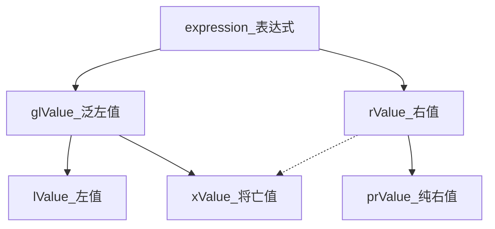

# 《现代C++语言核心特性解析》

## 新基础类型

## 内联和嵌套命名空间

## auto占位符

## decltype说明符

## 函数返回类型后置

## 右值引用（C++11 C++17 C++20）

### 左值、右值

C++98就出现了

定义与区分：

|                               | 左值                                                         | 右值                                          |
| ----------------------------- | ------------------------------------------------------------ | --------------------------------------------- |
| 指向内存                      | 指向特定内存的具有名称的值 (具名对象)<br />有一个相对稳定的内存地址 | 不指向稳定内存地址的匿名值 (不具名对象)       |
| 生命周期                      | 较长的生命周期                                               | 很短，通常是暂时性的                          |
| 判断：**不要**用等号左右判断  | int b = a;	// b左值, a左值                                | int b = a;	// b左值, a左值                 |
| 判断：可用**取地址符**&来判断 | 能取到内存地址                                               | 否则报错：Ivalue required as unary '&'operand |


反直觉案例

- 反直觉案例1:

  ```cpp
  int main() {
      int x = 1;
      x++;	// 右值，无法取地址。因为这里涉及(没有内存地址的)【复制】出来的临时对象。本质上是 tmp = x;
      ++x;	// 左值，可以取地址
      int y = get_val();
      
  }
  
  // x++ 拆解后是这样的：
  tmp = x; 	// tmp:1
  x += 1;		// x:2
  return tmp;	// tmp:1 (tmp是临时的，无法取地址，也是将亡值)
  
  // ++x 拆解后是这样的
  x += 1;		// x:3
  return x;	// x:3 (x是指向内存的，可以取地址)
  ```

- 反直觉案例2

  ```cpp
  int x = 1;
  int get_val() {
  	return x; 	// 返回后会变成右值，因为返回的是x的【复制】。当然也有可能会有RVO（返回值优化）
  }
  ```

- 反直觉案例3

  ```cpp
  void set_val(int val) {
  	x = val;	// 6是右值，但val是左值，以为val是6的【复制】
  }
  set_val(6);
  ```

- 反直觉案例4

  ```cpp
  auto p = &"hello world"; // 通常字面量都是右值，但字符串字面量除外
  
  // 为什么要这样做？从动机上理解：
  auto a = 2;				// 这里右值的2并不会独立开辟一个空间，然后a又一个空间，完全没必要
  auto s = "hello world";	// 这里右边可以开辟一个空间，然后s只要保存这个空间的地址就行了
  ```

### 值类别 (左值、将亡值、纯右值)

- C++98：前面的概念是：传统左值、传统右值。C++98就有概念，但不重要，没相关的语言特性
- C++11：引入将亡值。变得更复杂。但描述很不清晰，例如：左值的概念只有一句话：指定一个函数或一个对象
- C++17：这些才有更清晰的定义


而C++11中则将**表达式**分成三类：左值、将亡值、纯右值
（虽然我们一般的叫法是 “XX值”，但注意这里的定义是 “表达式” 而不是 “值”，即 i++、++i 这种也算的）



- 泛左值：所谓泛左值是指一个通过评估能够确定对象、位域或函数的标识的表达式。简单来说，它确定了对象或者函数的标识 (具名对象)
- 纯右值：是指一个通过评估能够用于初始化对象和位域，或者能够计算运算符操作数的值的表达式。
- 将亡值：属于泛左值的一种，它表示资源可以被重用的对象和位域，通常这是因为它们**接近其生命周期的末尾**，另外也可能是经过**右值引用的转换**产生的
- 左值：非将亡值的泛左值。有地址
- 右值：包括将亡值和纯右值。无地址


有点晕，但这里的难点是将亡值。只要搞清将亡值如何产生就行了（两种方式）：

1. 使用类型转换将泛左值转换为该类型的右值引用

   ```cpp
   static_cast<BigMemoryPoll&&>(my_pool)
   ```

2. C++17中引入，“**临时量实质化**”，指的是纯右值转换到临时对象的过程

   每当纯右值出现在一个需要泛左值的地方，“临时量实质化” 都会发生

   ```cpp
   struct X {
   	int a;
   }
   int main() {
       int b = X().a; 	// X()是纯右值，但访问a需要一个泛左值，那么会发生 “临时量实质化”，将x()转换为将亡值
       				// 需要额外注意的是，C++17之前，临时变量是纯右值，只有转换为右值引用才是将亡值
   }
   ```

#### 优化项

为什么要有将亡值这个概念？方便编译器做优化。

可以用godbolt的complier explorer来分析汇编，比较`C++14 -fno-elide-constructors`和`C++17 -fno-elide-constructors`的汇编代码就知道为什么了，后者减少了一些复制，提高了性能

#### 将左值转换为右值

```cpp
int i = 0;
int &&k = i;						// 编译失败

int i = 0;
int &&k = static_cast<int&&>(i);	// 编译成功
```

### 左值引用

- 作用 / 动机：可以免去创建临时对象的操作，引用比指针安全（指针）

#### 非常量左值引用

限制：非常量左值引用的对象必须是左值

作用 / 场景：减少拷贝，和指针差不多，但更好看和防呆一些

```c++
class X {
public:
    x() {};
    X(const X&) {}								// 复制构造函数 (左值引用减少一次拷贝，指针也可以做到但不优雅)
    X& operator = (const X&) { return *this; }	// 赋值构造函数 (左值引用减少一次拷贝，指针也可以做到但不优雅)
}

int main() {
    X x1;
    X x2(x1);
    X x3(make_x());	// make_x()出来的是临时变量，不应该是右值引用吗？
    x3 = make_x();
}
```

#### 常量左值引用 (常量左右值引用)

限制：常量左值引用的对象还你是右值，如：

```cpp
int &x1 = 7;		// 编译错误
const int &x = 11;	// 编译成功

// 其中：
const int &x = 11;	// 1
const int x = 11;	// 2
// 两种写法结果一样，但前者在语句结束后生命周期被延长
```

作用 / 场景：万能引用？

### 右值引用

限制：引用右值且只能引用右值的方法

```cpp
int i = 0:
int &j = i;		// 左值引用
int &&k = 11; 	// 右值引用
```

作用 / 场景：延长临时对象生命周期，以减少对象复制，提升程序性能

```cpp
# include <iostream>
class X {
public:
    X() { std::cout << "X ctor" << std::endl; }
    X(const X&x) { std::cout << "X copy ctor" << std::endl; ]
    ~X() { std::cout << "X dtor" << std::endl; }
    void show() { std::cout << "show x" << std::endl; }
};
X make_x() {
	X xl;	// 生命周期被延长，以减少对象复制
	return xl;
}
int main() {
	X &&x2 = make_x();	// 右值引用 (事实上这里会有编译器的RVO返回值优化。我们假设关闭了优化，不考虑优化)
    					// 没有优化原来是三次构造，make_x内部一次，返回后一次复制构造给右值，再一次赋值构造给左值 (这里减少了这一次)
    					// 其实用移动语义也可以做到这个效果
	x2.show();
}
```

gcc关闭优化：-fno-elide-constructors

#### 移动构造 (右值的性能优化空间)

我们知道了很多情况下右值都存储在临时对象中，当右值被使用之后程序会马上销毁对象并释放内存。这个过程可能会引发一个性能问题

解决：实现**移动构造器**

```cpp
// 定义
class A{
public:
    A(A&& a);
}

// 调用
1. std::move()
2. 函数返回一个对象
3. 容器操作等
```

默认情况下，编译器会为你生成一个默认的移动构造函数。
对于大多数情况而言，默认生成的移动构造函数是足够使用的。
除非你的类涉及到资源管理或者需要特殊的移动语义，你可能需要显式定义自己的移动构造函数。或者研究语言特性时加一个追踪打印

异常问题：风险：如果一个对象移动到另一个对象途中发生异常，导致两个对象都不完整，则后果语法预测。
可以使用noexcept说明符限定函数，抛出异常时程序就会终止

#### 移动构造 vs 拷贝构造

只是简单的指针替换，没有内存复制

特定情况下，移动构造代替拷贝构造，速度大大提升

#### 移动语义 (std::move)

略

### 万能引用

#### 语法：类型推导+&&

复习一下：

- 左值引用

  - 非常量：只能左值
  - 常量：可左值可右值（但有限制：常量性）

- 右值引用：只能右值

- 万能引用：可左值可右值
  （功能上，像左值常量，能即左又右，但这个更强，也没常量性限制）
  （语法上，像右值引用，像是右值+类型推导，但完全不同，只是规定写法，内部是靠引用折叠来确定的）
  （本质上，就是加了类型堆导，形式必须是 T&& 或 auto&&，**原理**是这个类型推导能够自动推导并**变成左值引用或右值引用**）

  ```cpp
  // 形式必须是 T&& 或 auto&&
  
  // 1
  void foo(int &&i) {}	// i为右值引用
  template<class T>
  void bar(T &&t) {}		// t为万能引用
  
  // 2
  int get_val() { return 5; }
  int &&x = get_val();	// x为右值引用
  auto &&y = get_val();	// y为万能引用
  ```

#### 规则：引用折叠

万能引用能如此灵活地引用对象，实际上是因为在C++11中添加了一套引用叠加推导的规则一-引用折叠。在这套规则中规定了在不同的引用类型互相作用的情况下应该如何推导出最终类型：

| 类型模板 | T实际类型 | 最终类型 |
| -------- | --------- | -------- |
| T&       | R         | R&       |
| T&       | R&        | R&       |
| T&       | R&&       | R&       |
| T&&      | R         | R&&      |
| T&&      | R&        | R&       |
| T&&      | R&&       | R&&      |

#### 用途：完美转发

万能引用最典型的用途被称为完美转发

效率低的代码：

```cpp
#include <iostream>
#include <string>
template<class T>
void show_type(T t) {
	std::cout << typeid(t).name() << std:;endl;
}
template<class T>
void normal_forwarding(T t) {	// normal_forwarding按值转发，std::string会额外发生一次临时对象复制
	show_type(t);
}
int main() {
	std::string s = "hello world";
	normal_forwarding(s);		// 左值传入
  	normal_forwarding("66");	// 右值传入
}
```

解决方法1：左值引用

```cpp
void normal_forwarding(T &t) { // 能减少对象复制，但无法应对右值传入
    // ……
}
```

解决方法2：常量左值引用

```cpp
void normal_forwarding(const T &t) { // 能减少对象复制，也能应对右值传入，但后面不能修改字符串
    // ……
}
```

解决方法3：用万能引用来完美转发

```cpp
void normal_forwarding(const T &&t) {
    show_type(static_cast<T &&>(t));
}
```

#### std::forward、std::move

显式使用static_cast类型转换进行转发并不优雅，C++使用提供了：

- std::forward，强转成万能引用（内部使用static_cast进行类型转换）
- std::move，强转成右值引用
- 区别：std::move不需要指定模板实参，模板实参靠函数调用推导。std::forward根据左值和右值情况进行转发

### 隐式移动操作（编译器做了什么，针对局部变量和右值引用）

在对旧程序代码升级新编译环境之后，我们可能会发现程序运行的效率提高了，这里的原因一定少不了新标准的编译器在某些情况下将隐式复制修改为隐式移动。虽然这些是编译器“偷偷”完成的，但是我们不能因为运行效率提高就忽略其中的缘由，所以接下来我们要弄清楚这些隐式移动是怎么发生的：

C++14 带优化

```cpp
#include <iostream>
struct X {
    X() = default;
    X(const X&) { 	// 拷贝构造，参数为常量左值引用
        std::cout << "copy ctor";
    };
    X(X&&) { 		// 移动构造，右值引用
	    std::cout << "move ctor";
    }
};
X f(X x) {
    return x;
}
int main() {
    X r = f(x{});
}

// 不优化是三次拷贝，自动优化后是三次移动
// 1. 传入f()，一次拷贝 -> 一次移动，左值的将亡值 -> 左值
// 2. f()返回，一次拷贝 -> 一次移动，左值的将亡值 -> 右值
// 3. 右值复制给左值，一次拷贝 -> 一次移动，右值的将亡值 -> 左值

X f() {
    X x;
    return x;
}
int main() {
    X r = f();
}

// 这样就是两次移动，少了一次
```

C++17（将值类别进行更详细的分类）

```cpp
X f(X x) {
    return x;
}
int main() {
    X r = f(X{});
}

// 只有一次移动！(以前是三次移动)
// 只有在发生“临时量实质化”时才移动

X f(X&& x) { // 右值引用
    return x;	// 这里改成 return std::move(x); 才会是一次移动
}
int main() {
    X r = f(X{});
}

// 这里是一次拷贝构造，到到C++20 (gcc11+) 才能把他优化成一次移动构造
```

### 总结

右值引用是C++11标准提出的一个非常重要的概念，它的出现不仅 完善了C++的语法，改善了C++在数据转移时的执行效率，同时还增强了C++模板的能力。

如果要在C++11提出的所有特性中选择一个对C++影响最深远的特性我会毫不犹豫地选择**右值引用**。

## Lambda表达式语法 (C++11~20)

### Lambda表达式语法


### 捕获列表

### 实现原理

### 无状态的Lambda表达式

### 在 STL 当中使用 Lambda 表达式

### 广义捕获

### 泛型Lambda表达式

### 常量Lambda表达式

### 捕获*this

### 模板语法

### 可构造、可赋值

## C++做了什么让成员的初始化变简单了？

## 初始化相关

### -

## 特殊成员函数

### -

## 联合类型

### 为什么联合类型背叛了C++的设计理念

## 构造函数

### C++的构造函数为什么会出现冗余的情况


